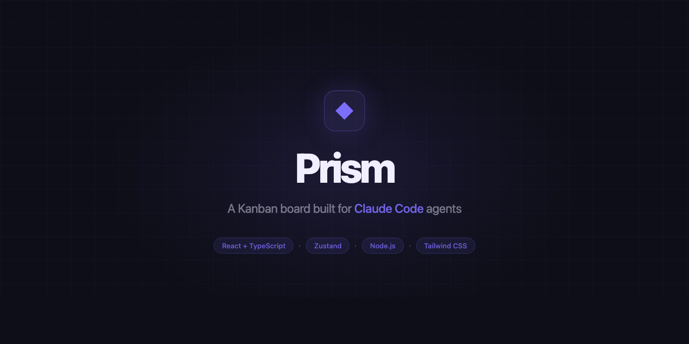
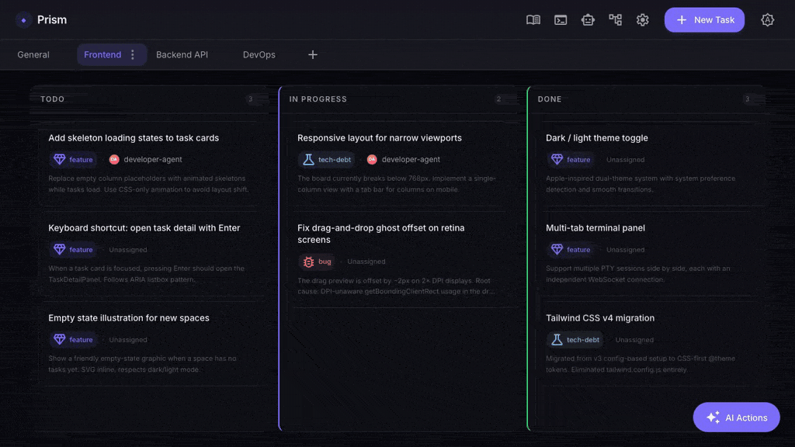

# Prism

[](https://github.com/oscarmenendezgarcia/prism/actions/workflows/ci.yml)




Prism gives your AI pipelines a place to work. Agents create tasks, move them across columns, write to an embedded terminal, and stream live logs — all from a single interface you can run locally or in Docker.



---

## What it does

Most Kanban tools are built for humans to track human work. Prism is different: it's designed as the **operating environment for AI agent pipelines**.

- **Agents manage the board** — via MCP tools, Claude Code agents create tasks, update status, and attach artifacts as they work
- **Run pipelines from any task** — one click launches a multi-stage pipeline (architect → UX → developer → QA) against a task card
- **Live log viewer** — stream stage-by-stage output in real time as each agent runs
- **Embedded terminal** — full PTY shell inside the UI, useful for monitoring agent sessions
- **Multiple spaces** — organise work across projects, each with its own board and pipeline config
- **Auto-task generation** — describe a feature in natural language; Prism generates structured task cards via Claude

---

## What Prism is not

- Not a SaaS — it runs on your machine, against your API key
- Not multi-user — single operator, single instance
- Not a replacement for Jira or Linear — it's a purpose-built tool for AI agent workflows

---

## Quick start

```bash
docker compose up -d
# → http://localhost:3000
```

No Node.js or build tools required locally. Board data persists in `./data/prism.db` (SQLite).

The board works without an API key. To enable agent pipelines, set `ANTHROPIC_API_KEY`:

```bash
ANTHROPIC_API_KEY=sk-... docker compose up -d
```

---

## Using agent pipelines with Docker

### Available CLI tools inside the container

The Docker image ships with **Claude Code** (`claude`) installed globally:

```bash
docker compose exec prism claude --version
```

This is the CLI that agent pipelines use when they run inside the container. No extra setup is needed — `ANTHROPIC_API_KEY` is forwarded from your host environment via `docker-compose.yml`.

> **Want to use `opencode` instead?**  
> `opencode` is not pre-installed, but you can add it by extending the Dockerfile:
>
> ```dockerfile
> FROM ghcr.io/oscarmenendezgarcia/prism:latest   # or use build: . locally
> RUN npm install -g opencode
> ```
>
> Rebuild with `docker compose build`. Note that Prism's prompt-generation layer has partial support for `opencode`-style invocations; behaviour may differ from the Claude Code path.

---

### Giving agents access to your project repos

Agents that write code need to read and modify files on disk. There are two approaches:

#### Option A — Mount a volume (recommended for Docker)

Add one extra volume entry per project in `docker-compose.yml`:

```yaml
services:
  prism:
    volumes:
      - ./data:/app/data                              # board state (already present)
      - /home/user/myproject:/workspace/myproject     # ← your repo
```

Inside the container the project lives at `/workspace/myproject`. When you configure a **Space** in Prism, set its *Working Directory* to that same path so pipeline agents work in the right place.

You can mount as many projects as you need:

```yaml
      - /home/user/projectA:/workspace/projectA
      - /home/user/projectB:/workspace/projectB
```

#### Option B — Run Prism locally (without Docker)

If you prefer direct host filesystem access with no volume mapping or path translation, run Prism natively:

```bash
npm install
cd frontend && npm install && npm run build && cd ..
ANTHROPIC_API_KEY=sk-... node server.js
```

Agents launched from a Space whose *Working Directory* is an absolute host path (e.g. `/Users/alice/myproject`) have full, native access to those files with no extra configuration.

---

## MCP — let Claude manage the board

Prism ships with an MCP server that exposes the full Kanban API as tools. Connect it to Claude Code or Claude Desktop and your agents can read and write the board directly.

> **Prerequisite:** `node server.js` (or `docker compose up`) must be running before starting any Claude session.

**Claude Code** — one-liner from the project root:

```bash
claude mcp add prism node ./mcp/mcp-server.js -e KANBAN_API_URL=http://localhost:3000/api/v1
```

Or add it manually to `.claude/settings.json`:

```json
{
  "mcpServers": {
    "prism": {
      "command": "node",
      "args": ["./mcp/mcp-server.js"],
      "env": { "KANBAN_API_URL": "http://localhost:3000/api/v1" }
    }
  }
}
```

**Claude Desktop** (`claude_desktop_config.json`):

```json
{
  "mcpServers": {
    "prism": {
      "command": "node",
      "args": ["/absolute/path/to/prism/mcp/mcp-server.js"],
      "env": { "KANBAN_API_URL": "http://localhost:3000/api/v1" }
    }
  }
}
```

Available tools: `kanban_list_tasks`, `kanban_create_task`, `kanban_update_task`, `kanban_move_task`, `kanban_delete_task`, `kanban_list_spaces`, `kanban_create_space`, `kanban_start_pipeline`, `kanban_get_run_status`, and more.

---

## Running locally (without Docker)

**Prerequisites:** Node.js ≥ 18 and build tools for `node-pty`:

| OS | Command |
|----|---------|
| macOS | `xcode-select --install` |
| Linux | `sudo apt install build-essential python3` |
| Windows | `npm install --global windows-build-tools` |

```bash
npm install
cd frontend && npm install && npm run build && cd ..
cd mcp && npm install && cd ..
node server.js
# → http://localhost:3000
```

**Development mode** (with HMR):

```bash
node server.js &
cd frontend && npm run dev   # → http://localhost:5173
```

---

## Parallel pipeline runs — git worktree isolation

When two pipeline runs target the **same working directory**, they could race on git operations (checkouts, commits, rebases). Prism automatically provisions an isolated git worktree for each conflicting run so they never interfere.

### How it works

- **Solo run** — the first run on a directory works directly in the main checkout. No worktree is created. Fully backward compatible.
- **Concurrent run** — any subsequent run that starts while another is still active in the same directory gets its own worktree at `.worktrees/run-<short-runId>`, branched off the current HEAD as `pipeline/run-<short-runId>`.
- **Cleanup** — worktrees are removed automatically when a run reaches a terminal state (`completed`, `failed`, `interrupted`, `aborted`). Orphaned worktrees (no matching run) are reaped on the next server startup.

### Branch naming

```
pipeline/run-<first-8-chars-of-runId>
```

The worktree lives at:

```
<space-workingDirectory>/.worktrees/run-<first-8-chars-of-runId>
```

Both paths are in `.gitignore` and are never committed to the main repo.

### Environment variables

| Variable | Default | Description |
|----------|---------|-------------|
| `PIPELINE_WORKTREE_ENABLED` | `1` | Set to `0` to disable worktree provisioning entirely |
| `PIPELINE_WORKTREE_DIR` | `.worktrees` | Subdirectory under the space working directory |
| `PIPELINE_DELETE_BRANCH_ON_FAILURE` | `0` | Set to `1` to delete the `pipeline/run-*` branch when a run fails or is aborted |

> See `agent-docs/parallel-worktrees/ADR-1.md` for the full design rationale.

---

## Environment variables

| Variable | Default | Description |
|----------|---------|-------------|
| `PORT` | `3000` | HTTP server port |
| `DATA_DIR` | `./data` | Directory where `prism.db` (SQLite) is stored |
| `ALLOWED_ORIGINS` | `http://localhost:3000,...` | Allowed WebSocket origins — set to your public URL if running behind a reverse proxy |
| `ANTHROPIC_API_KEY` | — | Required for agent pipelines and auto-task generation |

---

## Tests

```bash
npm test                        # Backend (Node.js test runner)
cd frontend && npm test         # Frontend (Vitest + React Testing Library)
```

---

## Stack

Node.js (no framework) · React 19 · TypeScript · Tailwind CSS v4 · Vite · Zustand · better-sqlite3 · node-pty

---

## License

MIT
