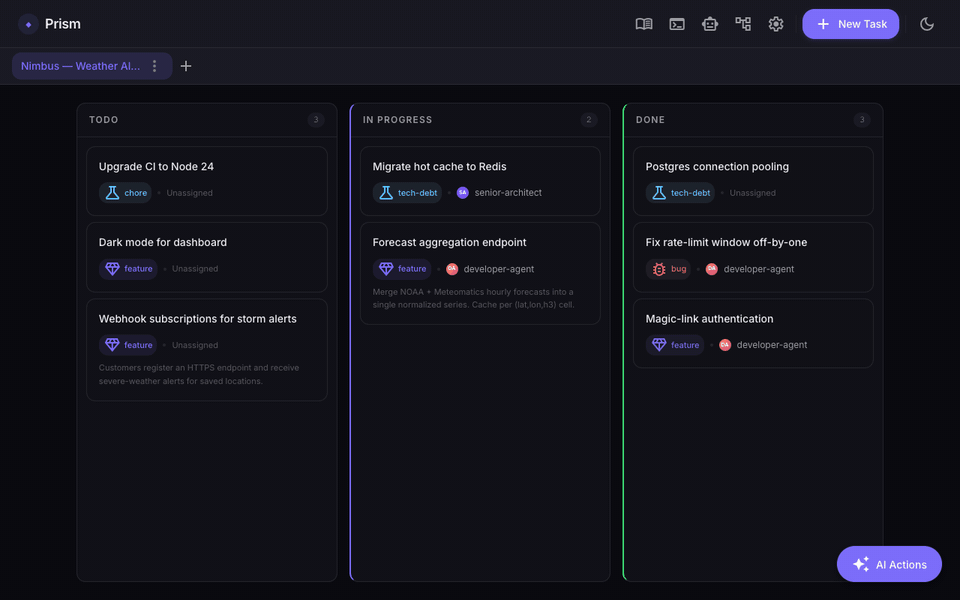

<div align="center">


### The operating environment for AI agent pipelines

Agents create tasks, move them across a Kanban board, run multi-stage pipelines,<br>
and build up a shared knowledge base — all from a single interface you run locally or in Docker.

[](https://github.com/oscarmenendezgarcia/prism/actions/workflows/ci.yml)
[](https://www.npmjs.com/package/prism-kanban)
[](https://github.com/oscarmenendezgarcia/prism/releases/latest)
[](LICENSE)
[](https://ko-fi.com/oscarmdzgarcia)

**[Getting started](#getting-started)** · **[Folio](#folio--knowledge-that-grows-with-use)** · **[Routing](#agents--routing--bring-your-own-model)** · **[CLI](#cli)** · **[MCP](#mcp--let-your-agent-cli-drive-prism)** · **[Docs](docs/)**

<br>


</div>

---

## What it does

Most Kanban tools are built for humans tracking human work. **Prism is built for agents.**

| | |
|---|---|
| **Agents manage the board** | Via MCP tools, agents create tasks, update status, and attach artifacts as they work. |
| **Pipelines from any task** | One click launches a multi-stage pipeline (architect → UX → developer → code review → QA) against a task card, with live stage-by-stage logs and automatic QA/review → developer feedback loops. |
| **Per-stage model & CLI routing** | Every agent in the pipeline can run on a different model and CLI — mix Claude with **opencode** against any OpenAI-compatible endpoint (local, self-hosted, or a third-party provider), overridable at the global, space, or task level. [See below](#agents--routing--bring-your-own-model). |
| **Folio — shared knowledge** | Agents stop starting every task from zero — [see below](#folio--knowledge-that-grows-with-use). |
| **Global search** | <kbd>⌘K</kbd> / <kbd>Ctrl K</kbd> across all spaces, powered by SQLite FTS5. |
| **Embedded terminal** | A full PTY shell inside the UI. |
| **Multiple spaces** | Organise work per project, each with its own board and pipeline config. |
| **Durable, local persistence** | All state lives in a single `prism.db` SQLite file. No external database. |

> It runs on your machine against your own API key — not a SaaS, single operator, and not a replacement for Jira or Linear.

---

## Folio — knowledge that grows with use

On every new task, agents normally start from zero: they re-discover the stack, re-read the same files, and ignore past decisions. **Folio** is a navigable, augmentable knowledge base shared between you and your agents that fixes this. The value is asymmetric over time — by the hundredth task the folio beats any static doc.



- **Folio → Chapter → Page**, stored as human-readable markdown you can browse and edit in the UI (and diff in git).
- **Co-authored** — both you and agents write pages; agent writes are tagged so you can filter and prune them.
- **Stage-aware injection** — relevant pages are pulled into each pipeline stage automatically, keyed on the task and the stage's role.
- **Write-back** — at the end of a run a single conservative step records a decision, a lesson, or a state update — only high-signal knowledge.
- **Bootstrap from repo** — on the first run in a git-backed space, the folio is seeded from the repo. Opt-in and lazy everywhere else.
- **Domain-agnostic** — neutral vocabulary works for code, on-call runbooks, research, or writing.

Agents reach Folio through its own MCP server (`folio_search`, `folio_get_page`, `folio_create_page`, …). See the [`.folio/`](.folio) directory in this repo for the format itself — it is a working Folio describing Prism.

---

## Agents & Routing — bring your own model

Prism doesn't just run pipelines on Claude. Every agent (`senior-architect`, `developer-agent`, `code-reviewer`, `qa-engineer-e2e`, …) has an independent **CLI tool + model** setting, resolved per stage in this order: task override → space override → global setting → the agent's own frontmatter default.

- **Two CLI tools today**: `claude` (Claude Code) and [**opencode**](https://opencode.ai) — a model-agnostic coding CLI that can point at any OpenAI-compatible endpoint: local inference (e.g. vLLM on your own hardware), a self-hosted proxy, or a third-party provider.
- **Configure it from the UI** — the *Agents & Routing* panel (⚙ → Agents & Routing) lists every agent with its resolved model, source (global/space/task), and CLI tool, editable inline.
- **Mix and match** — keep the highest-stakes reasoning (architecture, irreversible decisions) on a frontier model while running implementation/QA stages on a local model, or vice versa.
- **Isolated per run** — regardless of which CLI a stage runs on, it still executes inside its own git worktree ([see below](#parallel-pipeline-runs--git-worktree-isolation)), so a local model's mistakes never touch your working branch.

opencode isn't bundled in the Docker image (only Claude Code is pre-installed) — install and configure it yourself, then point Prism's routing config at your endpoint. See [opencode's docs](https://opencode.ai/docs) for provider setup.

---

## Getting started

### One-liner (recommended)

```bash
curl -fsSL https://raw.githubusercontent.com/oscarmenendezgarcia/prism/main/install.sh | sh
```

This installs Node.js ≥ 20 if needed (via [nvm](https://github.com/nvm-sh/nvm)), runs `npm install -g prism-kanban`, and runs `prism init` to create the data directory and a default `settings.json`.

<details>
<summary>Pass extra flags to <code>prism init</code></summary>

<br>

```bash
curl -fsSL https://raw.githubusercontent.com/oscarmenendezgarcia/prism/main/install.sh | sh -s -- --data-dir /custom/path
```

</details>

### Docker

```bash
docker compose up -d
# → http://localhost:3000
```

No Node.js or build tools required locally. Board data persists in `./data/prism.db`. The image ships with **Claude Code** (`claude`) pre-installed for running pipelines.

The board works without an API key. To enable agent pipelines and auto-task generation, set `ANTHROPIC_API_KEY`:

```bash
ANTHROPIC_API_KEY=sk-... docker compose up -d
```

<details>
<summary><b>Giving agents access to your repos</b> — mount each project as a volume</summary>

<br>

Agents that write code need files on disk. Mount each project as a volume in `docker-compose.yml` and point the Space's *Working Directory* at it:

```yaml
services:
  prism:
    volumes:
      - ./data:/app/data                            # board state (already present)
      - /home/user/myproject:/workspace/myproject   # ← your repo
```

Or [run Prism locally](#running-locally-without-docker) for native host filesystem access with no volume mapping.

</details>

### npm (manual)

```bash
npm install -g prism-kanban
prism init           # create data dir + settings.json
prism start          # → http://localhost:3000
```

> Full prerequisites, what `prism init` creates, and troubleshooting: [`docs/installation.md`](docs/installation.md).

---

## CLI

```bash
prism start          # start the server → http://localhost:3000
prism stop           # SIGTERM, wait up to 35 s for clean exit (--force for SIGKILL)
prism update         # update to the latest npm release
prism doctor         # verify runtime dependencies (--json for CI)
prism pipeline       # inspect pipeline runs from the terminal (see below)
prism --help         # list all commands and flags
```

**Common flags:** `--port <n>` (env `PORT`), `--data-dir <path>` (env `DATA_DIR`), `--silent`, `--no-update-check` (env `PRISM_NO_UPDATE_CHECK`).

`prism doctor` checks Node version, the `node-pty` spawn-helper bit, `better-sqlite3`, the `claude` CLI, data-dir writability, and server status. Exit `0` if all pass, `1` otherwise; `--json` emits `{ ok, checks: [...] }` for pipelines.

### `prism pipeline` — tail pipeline runs from the terminal

```bash
prism pipeline                       # list the 10 most-recent runs (--limit N to change)
prism pipeline <runId>               # alias for `<runId> logs`
prism pipeline <runId> logs          # print every stage log with headers
prism pipeline <runId> logs -f       # follow: appends new bytes, switches on stage change
prism pipeline <runId> logs --stage 2  # print only stage 2
```

`<runId>` accepts an **8-char prefix**; ambiguous prefixes exit 2 with a list of
candidates. Reads `data/runs/<runId>/` directly (works with the server stopped);
pass `--server-url http://host:port` to force the HTTP fallback. Follow mode polls
every 500 ms by default (`--poll-ms 50..10000`) and exits cleanly (code 0) when the
run reaches a terminal status. Ctrl+C exits with code 130. See
`agent-docs/cli-pipeline-logs/ADR-1.md` for the full design.

---

## MCP — let your agent CLI drive Prism

Prism ships two MCP servers:

| Server | Tools |
|--------|-------|
| `mcp/mcp-server.js` | The full Kanban API — `kanban_list_tasks`, `kanban_create_task`, `kanban_update_task`, `kanban_move_task`, `kanban_start_pipeline`, `kanban_get_run_status`, and more. |
| `mcp/folio-mcp-server.js` | Folio read/write — `folio_search`, `folio_get_page`, `folio_create_page`, `folio_update_page`, `folio_list_chapters`, … |

> **Prerequisite:** the server (`prism start` or `docker compose up`) must be running before starting any agent session.
>
> Registration is per CLI tool — an agent pipeline stage routed to opencode ([see above](#agents--routing--bring-your-own-model)) needs the `prism` MCP server registered in *opencode's own config*, separate from any Claude Code registration. Without it, that stage can't move tasks, leave comments, or attach artifacts, even though the model itself is running fine.

**Claude Code** — one-liner from the project root:

```bash
claude mcp add prism node ./mcp/mcp-server.js -e KANBAN_API_URL=http://localhost:3000/api/v1
```

<details>
<summary><b>Claude Code / Claude Desktop</b> — manual JSON config</summary>

<br>

Add to `.claude/settings.json` (or `claude_desktop_config.json`, using an absolute path):

```json
{
  "mcpServers": {
    "prism": {
      "command": "node",
      "args": ["./mcp/mcp-server.js"],
      "env": { "KANBAN_API_URL": "http://localhost:3000/api/v1" }
    }
  }
}
```

</details>

<details>
<summary><b>opencode</b> — manual JSON config (<code>opencode.jsonc</code>)</summary>

<br>

```jsonc
{
  "mcp": {
    "prism": {
      "type": "local",
      "command": ["node", "/absolute/path/to/prism/mcp/mcp-server.js"],
      "environment": { "KANBAN_API_URL": "http://localhost:3000/api/v1" },
      "enabled": true
    }
  }
}
```

opencode requires an absolute path (no relative `./` shorthand) and its own `node_modules` installed under `mcp/` — run `cd mcp && npm install` first if you haven't already.

</details>

---

## Running locally (without Docker)

**Prerequisites:** Node.js ≥ 20 and native build tools for `better-sqlite3` and `node-pty` — `xcode-select --install` (macOS), `sudo apt install build-essential python3` (Linux), or `npm install --global windows-build-tools` (Windows).

```bash
npm install
cd frontend && npm install && npm run build && cd ..
cd mcp && npm install && cd ..
node server.js                 # → http://localhost:3000
```

Development mode with Vite HMR:

```bash
node server.js &
cd frontend && npm run dev     # → http://localhost:5173
```

---

## Advanced

### Parallel pipeline runs — git worktree isolation

**Every run** gets its own isolated git worktree — not just concurrent ones. A run must never mutate your main checkout: running in-place let a solo run switch the current branch, commit to the wrong branch, or clobber in-flight work.

- Each run gets its own worktree at `.worktrees/run-<short-runId>`, branched off HEAD as `pipeline/run-<short-runId>`.
- **Fallback to in-place**: a directory that isn't a git repo (or has a detached `HEAD`) can't be isolated — those runs work directly in the working directory, same as before this existed. If another run is already active in that same non-isolatable directory, the new run is rejected instead of racing it.
- **Disable entirely** with `PIPELINE_WORKTREE_ENABLED=0` — every run then works in-place, at the race risk described above.
- **Cleanup** is automatic on terminal states (`completed`, `failed`, `interrupted`, `aborted`); orphans are reaped on the next startup.

The worktree path and branch are git-ignored and never committed.

| Variable | Default | Description |
|----------|---------|-------------|
| `PIPELINE_WORKTREE_ENABLED` | `1` | Set `0` to disable worktree provisioning |
| `PIPELINE_WORKTREE_DIR` | `.worktrees` | Subdirectory under the space working directory |
| `PIPELINE_DELETE_BRANCH_ON_FAILURE` | `0` | Set `1` to delete the branch on failure or abort |

### Environment variables

| Variable | Default | Description |
|----------|---------|-------------|
| `PORT` | `3000` | HTTP server port |
| `DATA_DIR` | *(resolved, see below)* | Directory where `prism.db` is stored |
| `ALLOWED_ORIGINS` | `http://localhost:3000,http://127.0.0.1:3000,http://localhost:5173` | Allowed WebSocket origins — set to your public URL behind a reverse proxy |
| `ANTHROPIC_API_KEY` | — | Required for any stage/agent routed to Claude (the default). Not needed for stages routed to opencode against a local or self-hosted model — [see Agents & Routing](#agents--routing--bring-your-own-model). |

`DATA_DIR` isn't a flat default — without an explicit override it's resolved in this order: **(1)** `DATA_DIR` env var if set; **(2)** `<packageRoot>/data` when running from a git checkout (has a `.git` directory — this repo, or a dev clone); **(3)** `$XDG_DATA_HOME/prism` if `XDG_DATA_HOME` is set; **(4)** `~/.local/share/prism` otherwise. A global `npm install -g prism-kanban` install lands on (3) or (4), *not* `./data` — the Docker image sets `DATA_DIR=/app/data` explicitly, which is why that path shows up there.

### Tests

```bash
npm test                        # Backend (Node.js test runner)
cd frontend && npm test         # Frontend (Vitest + React Testing Library)
```

---

<div align="center">

**Stack** — Node.js (no framework) · React 19 · TypeScript · Tailwind CSS v4 · Vite · Zustand · SQLite (better-sqlite3) · node-pty

MIT © [Oscar Menendez](https://github.com/oscarmenendezgarcia) · Support the project on [Ko-fi](https://ko-fi.com/oscarmdzgarcia)

</div>
