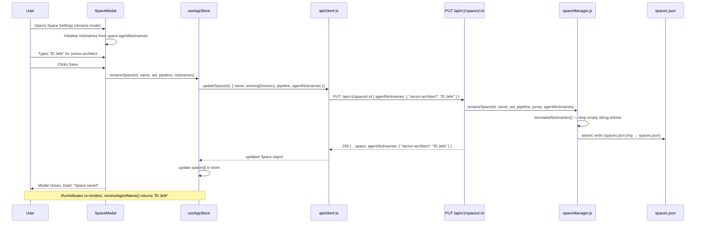

# Blueprint: Agent Nicknames

## 1. Overview

Users can assign a custom display name ("nickname") to each pipeline agent within a space.
The nickname appears wherever the agent name is displayed: RunIndicator, stage tab labels in
the pipeline log, the pipeline configuration UI (SpaceModal, TaskDetailPanel, PipelineConfirmModal).
Nicknames are optional, persist per-space in `data/spaces.json`, and fall back gracefully to
the existing static label maps when not set.

---

## 2. Data Model

### 2.1 Backend — `data/spaces.json`

The `agentNicknames` field is added as an optional property to each space object.

```jsonc
// Before (existing shape)
{
  "id": "193f336c-...",
  "name": "Prism",
  "workingDirectory": "/path/to/project",
  "pipeline": ["senior-architect", "developer-agent"],
  "createdAt": "2026-03-19T08:09:33.270Z",
  "updatedAt": "2026-03-19T08:09:33.270Z"
}

// After (new optional field)
{
  "id": "193f336c-...",
  "name": "Prism",
  "workingDirectory": "/path/to/project",
  "pipeline": ["senior-architect", "developer-agent"],
  "agentNicknames": {
    "senior-architect": "El Jefe",
    "developer-agent": "Rafa"
  },
  "createdAt": "2026-03-19T08:09:33.270Z",
  "updatedAt": "2026-04-23T00:00:00.000Z"
}
```

**Constraints:**
- `agentNicknames` is optional. Absent = no nicknames = fall back to static labels.
- Keys are agent IDs (arbitrary strings — not constrained to a fixed enum so custom agents work).
- Values are non-empty strings, max 50 characters.
- An empty string value is treated as "clear the nickname" (equivalent to deleting the key).

### 2.2 Frontend — TypeScript types (`frontend/src/types/index.ts`)

```typescript
export interface Space {
  id: string;
  name: string;
  workingDirectory?: string;
  pipeline?: string[];
  agentNicknames?: Record<string, string>; // NEW — optional nickname map
  createdAt: string;
  updatedAt: string;
}
```

---

## 3. Backend Changes

### 3.1 `src/services/spaceManager.js` — `renameSpace()`

The `renameSpace()` function already accepts `name`, `workingDirectory`, `pipeline`, and
`projectClaudeMdPath`. Add `agentNicknames` as a new optional parameter:

```
renameSpace(id, newName, workingDirectory, pipeline, projectClaudeMdPath, agentNicknames)
```

Merge rule (mirrors the existing pattern for other optional fields):
- `agentNicknames` **undefined** → leave existing value unchanged.
- `agentNicknames` **empty object** `{}` → persist `{}` (clears all nicknames).
- `agentNicknames` **non-empty object** → persist after normalising: drop entries whose value is an
  empty string (those are treated as deletions), trim remaining values.

Internal helper `normaliseNicknames(raw)`:

```
Input:  { "senior-architect": "El Jefe", "developer-agent": "" }
Output: { "senior-architect": "El Jefe" }   // empty-string entries dropped
```

Validation rules enforced before write:
- Each value must be a string after trim.
- Trimmed length must be ≤ 50 characters. Return `VALIDATION_ERROR` if violated.

The `writeManifest` atomic write (`.tmp` + `rename`) already covers atomicity — no change needed.

### 3.2 `src/routes/index.js` — `PUT /api/v1/spaces/:spaceId`

The route handler already parses `body` and calls `spaceManager.renameSpace(...)`.
Pass the new `agentNicknames` body field through:

```javascript
const agentNicknames = body && body.agentNicknames;   // may be undefined
const result = spaceManager.renameSpace(
  spaceId, name, workingDirectory, pipeline, projectClaudeMdPath, agentNicknames
);
```

No new route, no new HTTP method. The response already returns the full updated space object,
which now includes `agentNicknames`.

### 3.3 No changes to `buildStagePrompt`

Nicknames are a UI concern only. The prompt already carries the raw `agentId` used by the CLI
subagent invocation. Injecting nicknames into prompts would confuse functional identifiers with
display names.

---

## 4. Frontend Changes

### 4.1 New utility — `frontend/src/utils/agentName.ts`

Central resolver. Single function, all display sites import from here.

```typescript
/**
 * Resolve the display name for an agent in the context of a given space.
 *
 * Resolution chain (first non-empty string wins):
 *   1. space.agentNicknames[agentId]    — custom per-space nickname
 *   2. STAGE_DISPLAY[agentId]           — static built-in long label
 *   3. agents[].displayName (AgentInfo) — discovered agent metadata
 *   4. agentId                          — raw fallback
 */
export function resolveAgentName(
  agentId: string,
  space: Space | null | undefined,
  agents?: AgentInfo[],
): string;

/**
 * Resolve the SHORT label for an agent (used in StageTabBar, step nodes).
 *
 * Resolution chain:
 *   1. Nickname truncated to 6 chars (with ellipsis if longer)
 *   2. STAGE_LABELS[agentId]
 *   3. agentId.split('-')[0]
 */
export function resolveAgentShortLabel(
  agentId: string,
  space: Space | null | undefined,
): string;
```

**Why truncate nicknames in short labels?**
`StageTabBar` step nodes and `STAGE_LABELS` (e.g. "Arch", "Dev", "QA") are tightly constrained UI
slots. A nickname of "El Jefe" becomes "El Jef…" in short-label positions to preserve layout.

### 4.2 `frontend/src/stores/useAppStore.ts`

**Store state additions:**

```typescript
// Existing
renameSpace: (id, name, workingDirectory?, pipeline?) => Promise<void>;

// Updated signature — add agentNicknames
renameSpace: (id, name, workingDirectory?, pipeline?, agentNicknames?) => Promise<void>;
```

The `renameSpace` action passes `agentNicknames` to `api.updateSpace(...)`.

**Selector added:**

```typescript
/** Returns the agentNicknames map for the currently active space (may be undefined). */
useActiveSpaceNicknames: () => Record<string, string> | undefined;
```

Implemented as a derived selector from `spaces` + `activeSpaceId` — no new store slice.

### 4.3 `frontend/src/api/client.ts`

```typescript
// Existing
export function updateSpace(
  id: string,
  payload: { name: string; workingDirectory?: string; pipeline?: string[] }
): Promise<Space>;

// Updated — add agentNicknames to payload type
export function updateSpace(
  id: string,
  payload: {
    name: string;
    workingDirectory?: string;
    pipeline?: string[];
    agentNicknames?: Record<string, string>;
  }
): Promise<Space>;
```

### 4.4 `frontend/src/components/modals/SpaceModal.tsx`

A new **Agent Nicknames** collapsible section is added inside `ModalBody`, rendered only when
`mode === 'rename'` (nicknames require an existing space).

**Interaction model:**
- Section header: "Agent Nicknames (optional)" with a toggle chevron.
- When expanded, shows one row per agent currently in the space's pipeline (or the default 4-stage
  pipeline if no custom pipeline is set).
- Each row: `[Agent ID label]  [Nickname text input, placeholder="e.g. El Jefe"]`
- Validation: max 50 chars, shown inline on blur.
- "Clear all nicknames" link at the bottom resets all inputs to empty.

**Local state addition:**

```typescript
const [nicknames, setNicknames] = useState<Record<string, string>>({});
const [nicknamesOpen, setNicknamesOpen] = useState(false);
```

Initialised from `space.agentNicknames ?? {}` when modal opens in rename mode.

**Submit:**

```typescript
await renameSpace(space.id, trimmed, wd ?? '', pl ?? [], nicknames);
```

### 4.5 `frontend/src/components/agent-launcher/RunIndicator.tsx`

**Current code (lines 531-534):**

```typescript
const agentId     = stages[0];
const displayName = STAGE_DISPLAY[agentId]
  ?? agents.find((a) => a.id === agentId)?.displayName
  ?? agentId;
```

**Updated:**

```typescript
const activeSpace  = useAppStore(s => s.spaces.find(sp => sp.id === s.activeSpaceId));
const agentId      = stages[0];
const displayName  = resolveAgentName(agentId, activeSpace, agents);
```

Similarly, the `PausedBanner` `stageName` computation (line 516) and `StepNodes` stage labels
(line 350 area) must use `resolveAgentShortLabel` and `resolveAgentName`.

### 4.6 `frontend/src/components/pipeline-log/StageTabBar.tsx`

Replace the internal `getShortLabel(agentId)` calls with `resolveAgentShortLabel(agentId, activeSpace)`.
The component receives `activeSpace` as a prop (already available in the parent `PipelineLogPanel`
which reads it from the store).

### 4.7 `frontend/src/components/modals/PipelineConfirmModal.tsx`

Wherever stage agent IDs are displayed (stage list rendering), replace direct string use with
`resolveAgentName(agentId, activeSpace, agents)`.

### 4.8 `frontend/src/components/board/TaskDetailPanel.tsx`

In the pipeline stage list (line 289 area), replace `{agentId}` text with
`resolveAgentName(agentId, activeSpace, agents)`.

---

## 5. Data Flow Diagrams

### 5.1 C4 Context — Nickname storage and resolution

```mermaid
graph TD
    User([User])
    SpaceModal[SpaceModal<br/>rename mode]
    Store[useAppStore<br/>Zustand]
    API[REST API<br/>PUT /spaces/:id]
    SpaceManager[spaceManager.js]
    SpacesJson[(data/spaces.json)]
    RunIndicator[RunIndicator]
    StageTabBar[StageTabBar]
    PipelineConfirm[PipelineConfirmModal]
    TaskDetail[TaskDetailPanel]
    Resolver[agentName.ts<br/>resolveAgentName]

    User -->|edits nicknames| SpaceModal
    SpaceModal -->|renameSpace action| Store
    Store -->|PUT agentNicknames| API
    API -->|renameSpace()| SpaceManager
    SpaceManager -->|atomic write| SpacesJson

    Store -->|spaces[]| Resolver
    Resolver -->|display name| RunIndicator
    Resolver -->|short label| StageTabBar
    Resolver -->|display name| PipelineConfirm
    Resolver -->|display name| TaskDetail
```

### 5.2 Sequence — User saves a nickname



### 5.3 Nickname resolution fallback chain

```mermaid
graph LR
    Input([agentId]) --> N1{space.agentNicknames<br/>has key?}
    N1 -->|yes, non-empty| Out1([use nickname])
    N1 -->|no| N2{STAGE_DISPLAY<br/>has key?}
    N2 -->|yes| Out2([use static label])
    N2 -->|no| N3{AgentInfo[]<br/>has match?}
    N3 -->|yes| Out3([use displayName])
    N3 -->|no| Out4([use raw agentId])
```

---

## 6. API Contract

### `PUT /api/v1/spaces/:spaceId`

**Request body (updated):**

```jsonc
{
  "name": "Prism",
  "workingDirectory": "/path/to/project",    // optional
  "pipeline": ["senior-architect", "qa-engineer-e2e"],  // optional
  "agentNicknames": {                         // optional — new field
    "senior-architect": "El Jefe",
    "developer-agent": "Rafa",
    "ux-api-designer": ""                    // empty string = clear this nickname
  }
}
```

**Response (200):**

```jsonc
{
  "id": "193f336c-...",
  "name": "Prism",
  "workingDirectory": "/path/to/project",
  "pipeline": ["senior-architect", "qa-engineer-e2e"],
  "agentNicknames": {
    "senior-architect": "El Jefe",
    "developer-agent": "Rafa"
    // "ux-api-designer" was cleared — not present in response
  },
  "createdAt": "2026-03-19T08:09:33.270Z",
  "updatedAt": "2026-04-23T10:00:00.000Z"
}
```

**Error responses (no new codes — existing pattern):**

| Status | Code | Condition |
|--------|------|-----------|
| 400 | `VALIDATION_ERROR` | Nickname value exceeds 50 chars |
| 404 | `SPACE_NOT_FOUND` | No space with given ID |
| 409 | `DUPLICATE_NAME` | Renamed to an existing space name |

**Expected latency SLA:** < 50 ms p95 (synchronous JSON read/write, < 1 KB payload).

---

## 7. Observability

This feature does not introduce new infrastructure. Observability requirements are minimal:

- **Server log** (existing pattern): `[spaceManager] Renamed space <id> → "<name>"` already fires on
  every `PUT /spaces/:id`. No change needed.
- **Frontend toast**: success toast fires on successful save (uses existing `showToast`).
- **Validation error**: shown inline in the modal; no toast for client-side errors.

No new metrics or traces are required — the feature is a thin data-model extension.

---

## 8. Validation Rules Summary

| Field | Rule |
|-------|------|
| `agentNicknames` | Optional object. Keys: non-empty strings. Values: strings, trimmed length ≤ 50. Empty-string values are treated as deletions. |
| Nickname display | Falls back silently — no error if agent ID has no nickname. |
| Modal — create mode | Nicknames section is hidden. Cannot set nicknames before a space exists. |
| Modal — rename mode | Nicknames section is collapsible, default collapsed. |

---

## 9. Display Sites — Full Inventory

| Component | File | Current mechanism | Change required |
|-----------|------|-------------------|-----------------|
| RunIndicator (single agent) | `agent-launcher/RunIndicator.tsx:532` | `STAGE_DISPLAY[agentId] ?? agents.displayName ?? agentId` | Replace with `resolveAgentName()` |
| RunIndicator (paused banner) | `RunIndicator.tsx:516` | `STAGE_DISPLAY[stages[pausedIdx]]` | Replace with `resolveAgentName()` |
| RunIndicator (step nodes tooltip) | `RunIndicator.tsx:~361` | None (no label on step dots) | No change needed |
| StageTabBar | `pipeline-log/StageTabBar.tsx:150` | `getShortLabel(agentId)` | Replace with `resolveAgentShortLabel()` |
| PipelineConfirmModal stage list | `modals/PipelineConfirmModal.tsx` | Raw agentId | Replace with `resolveAgentName()` |
| TaskDetailPanel stage list | `board/TaskDetailPanel.tsx:298` | `{agentId}` | Replace with `resolveAgentName()` |
| SpaceModal pipeline selector | `modals/SpaceModal.tsx:156` | `{s}` (raw stage ID) | Replace with `resolveAgentName()` |
