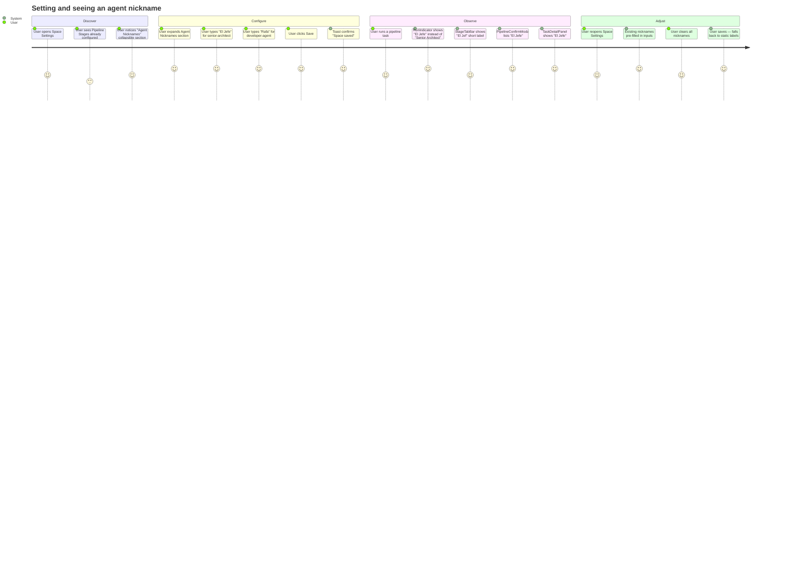

# Wireframes: Agent Nicknames

## Screen Summary

| Screen | Component | Mode | Priority |
|--------|-----------|------|----------|
| S-01 | SpaceModal — rename mode with Agent Nicknames section (collapsed) | Desktop | Must |
| S-02 | SpaceModal — rename mode with Agent Nicknames section (expanded, nickname set) | Desktop | Must |
| S-03 | RunIndicator — single-agent mode with nickname | Desktop | Must |
| S-04 | RunIndicator — multi-stage mode with nickname in step nodes | Desktop | Must |
| S-05 | StageTabBar — short nickname labels in tab bar | Desktop | Should |
| S-06 | PipelineConfirmModal — stage list with nickname | Desktop | Should |
| S-07 | TaskDetailPanel — stage list with nickname | Desktop | Should |

---

## Journey Map



### Pain Points (by impact)

| Impact | Pain Point | Mitigation |
|--------|-----------|-----------|
| High | No visual connection between the raw agent ID and the nickname — user may not know which agent is which | Show agent ID as a read-only monospace label beside the input; never hide the ID |
| Medium | Nickname section adds form length — users not interested in nicknames scroll past it | Section is collapsed by default; only one visual hit to notice it |
| Medium | Short label truncation in StageTabBar may confuse users ("El Jef…") | Truncation rule documented; full nickname shown on hover tooltip |
| Low | Clearing all nicknames is irreversible within the modal | "Clear all nicknames" only resets local state; actual deletion happens on Save |

---

## S-01: SpaceModal — Rename Mode, Nicknames Section Collapsed

### Default State

```
┌─────────────────────────────────────────────────────────────────┐
│ Space Settings                                              [×] │
├─────────────────────────────────────────────────────────────────┤
│                                                                 │
│ Space Name                                                      │
│ ┌─────────────────────────────────────────────────────────┐    │
│ │ Prism                                                   │    │
│ └─────────────────────────────────────────────────────────┘    │
│                                                                 │
│ Working Directory (optional)                                    │
│ ┌─────────────────────────────────────────────────────────┐    │
│ │ /Users/oscar/projects/prism                             │    │
│ └─────────────────────────────────────────────────────────┘    │
│ Used as the working directory when agents run tasks.           │
│                                                                 │
│ Pipeline Stages (optional — defaults to full pipeline)         │
│  ┌────────────────────────────────────────────┐ [✕]           │
│  │ senior-architect                           │               │
│  └────────────────────────────────────────────┘               │
│  ┌────────────────────────────────────────────┐ [✕]           │
│  │ ux-api-designer                            │               │
│  └────────────────────────────────────────────┘               │
│  ┌────────────────────────────────────────────┐ [✕]           │
│  │ developer-agent                            │               │
│  └────────────────────────────────────────────┘               │
│  ┌────────────────────────────────────────────┐ [✕]           │
│  │ qa-engineer-e2e                            │               │
│  └────────────────────────────────────────────┘               │
│  + Add stage  |  Reset to default                             │
│                                                                 │
│ ┌───────────────────────────────────────────────────────────┐  │
│ │ ▶ Agent Nicknames (optional)                              │  │
│ └───────────────────────────────────────────────────────────┘  │
│   Override display names for agents in this space.            │
│                                                                 │
├─────────────────────────────────────────────────────────────────┤
│                                          [Cancel]   [Save]      │
└─────────────────────────────────────────────────────────────────┘
```

**Interaction notes:**
- "▶ Agent Nicknames" row is a button — full row is clickable, chevron rotates on expand.
- Collapsed by default (`nicknamesOpen = false`).
- The helper text "Override display names..." is visible even when collapsed to explain the section purpose.
- Only shown in rename mode — invisible in create mode.

---

## S-02: SpaceModal — Rename Mode, Nicknames Section Expanded

### Default State (one nickname set)

```
┌─────────────────────────────────────────────────────────────────┐
│ Space Settings                                              [×] │
├─────────────────────────────────────────────────────────────────┤
│                                                                 │
│ Space Name                                                      │
│ ┌─────────────────────────────────────────────────────────┐    │
│ │ Prism                                                   │    │
│ └─────────────────────────────────────────────────────────┘    │
│                                                                 │
│ Working Directory (optional)                                    │
│ ┌─────────────────────────────────────────────────────────┐    │
│ │ /Users/oscar/projects/prism                             │    │
│ └─────────────────────────────────────────────────────────┘    │
│                                                                 │
│ Pipeline Stages (optional — defaults to full pipeline)         │
│   [... pipeline rows as above ...]                             │
│                                                                 │
│ ┌───────────────────────────────────────────────────────────┐  │
│ │ ▼ Agent Nicknames (optional)                              │  │  ← expanded
│ │ ─────────────────────────────────────────────────────   │  │
│ │                                                           │  │
│ │  [senior-architect]   ┌─────────────────────────────┐   │  │
│ │                       │ El Jefe                     │   │  │  ← filled, violet tint
│ │                       └─────────────────────────────┘   │  │
│ │                                                           │  │
│ │  [ux-api-designer ]   ┌─────────────────────────────┐   │  │
│ │                       │ e.g. Diseñadora              │   │  │  ← placeholder
│ │                       └─────────────────────────────┘   │  │
│ │                                                           │  │
│ │  [developer-agent ]   ┌─────────────────────────────┐   │  │
│ │                       │ e.g. Rafa                    │   │  │  ← placeholder
│ │                       └─────────────────────────────┘   │  │
│ │                                                           │  │
│ │  [qa-engineer-e2e ]   ┌─────────────────────────────┐   │  │
│ │                       │ e.g. QA Bot                  │   │  │  ← placeholder
│ │                       └─────────────────────────────┘   │  │
│ │                                                           │  │
│ │  Clear all nicknames                                      │  │
│ └───────────────────────────────────────────────────────────┘  │
│                                                                 │
├─────────────────────────────────────────────────────────────────┤
│                                          [Cancel]   [Save]      │
└─────────────────────────────────────────────────────────────────┘
```

### States

**Loading state:** Save button shows "Saving..." and is disabled. Inputs are not disabled (optimistic UX).

**Validation error state (nickname > 50 chars):**
```
│  [senior-architect]   ┌─────────────────────────────┐   │
│                       │ This nickname is way too lo… │   │  ← red border
│                       └─────────────────────────────┘   │
│                       Must not exceed 50 characters.     │  ← 12px error text, red
```

**Empty state (no pipeline agents):** Nicknames section shows a message "No pipeline stages configured — add stages above first." in text-disabled.

**After "Clear all nicknames" click:** All inputs reset to empty immediately (local state only — save still required to persist).

### Accessibility Notes
- Section toggle button: `aria-expanded="true|false"`, `aria-controls="nicknames-panel"`.
- Nickname panel: `id="nicknames-panel"`, `role="region"`, `aria-label="Agent Nicknames"`.
- Each nickname input: `aria-label="{agentId} nickname"`, `maxLength={50}`.
- Validation error: `aria-describedby` linking input to error message element.
- "Clear all nicknames": `type="button"` to prevent accidental form submission.
- Tab order: section toggle → input 1 → input 2 → input 3 → input 4 → Clear link → Cancel → Save.
- Focus returns to section toggle when collapsed via keyboard.

### Mobile-First Notes
- At 320px: agent ID chip and input stack vertically (flex-col). ID chip full width, input full width below it.
- At 480px+: agent ID chip and input are side-by-side (flex-row, chip 40%, input 60%).
- Modal at 320px: `position: fixed; inset: 0; border-radius: 0;` — full screen modal.
- "Clear all nicknames" link has `min-height: 44px` touch target via padding.

---

## S-03: RunIndicator — Single-Agent Mode with Nickname

### Default State (running)

```
┌────────────────────────────────────────────────────────────────────┐
│  ● Running                El Jefe                  02:34    [✕]   │
│    (green pulse)          (was: Senior Architect)                  │
└────────────────────────────────────────────────────────────────────┘
```

**Tooltip on hover over agent name area:** "senior-architect" (raw agent ID shown as tooltip for transparency).

**Interaction notes:**
- `displayName` is resolved via `resolveAgentName(agentId, activeSpace, agents)`.
- If nickname is "El Jefe", renders "El Jefe". If no nickname, renders static "Senior Architect".
- No UI change otherwise — this is a transparent substitution.

### States

**No nickname set:**
```
│  ● Running                Senior Architect         02:34    [✕]   │
```

**Nickname set:**
```
│  ● Running                El Jefe                  02:34    [✕]   │
```

### Accessibility Notes
- Agent name span: no extra aria needed — it is a visible text label.
- Tooltip on agent name (if implemented): `title="{agentId}"` or `aria-description`.

---

## S-04: RunIndicator — Multi-Stage Mode, Step Nodes with Nicknames

### Default State (stage 1 of 4 running)

```
┌────────────────────────────────────────────────────────────────────┐
│  ● Running                                          02:34    [✕]   │
│                                                                    │
│   [El Jefe ●]───────[UX ○]───────[Dev ○]───────[QA ○]            │
│    (active)                                                        │
└────────────────────────────────────────────────────────────────────┘
```

**Short label resolution:**
- "El Jefe" (nickname 7 chars > 6) → truncated to "El Jef…" via `resolveAgentShortLabel()`.
- "ux-api-designer" (no nickname) → "UX" via static `STAGE_LABELS`.
- "developer-agent" (no nickname) → "Dev" via static `STAGE_LABELS`.
- "qa-engineer-e2e" (no nickname) → "QA" via static `STAGE_LABELS`.

**Tooltip on hover over each step node:** Full resolved name — "El Jefe", "UX API Designer", "Developer", "QA Engineer".

### Accessibility Notes
- Each step node: `aria-label="{resolvedName} — {status}"` (e.g. "El Jefe — running").

---

## S-05: StageTabBar with Short Nickname Label

### Default State

```
┌──────────────────────────────────────────────────────────────────┐
│  [El Jef…] [UX] [Dev] [QA]                                      │
│  ─────────                                                        │  ← active underline on first tab
└──────────────────────────────────────────────────────────────────┘
```

**Tooltip on "El Jef…" tab:** Full label "El Jefe".

### Mobile (320px)
- Tabs scroll horizontally with `overflow-x: auto; scrollbar-width: none`.
- Short labels preserve space — no layout change needed.

---

## S-06: PipelineConfirmModal — Stage List with Nickname

### Default State

```
┌─────────────────────────────────────────┐
│ Run Pipeline                        [×] │
├─────────────────────────────────────────┤
│ Task: "Add dark mode toggle"            │
│                                         │
│ Pipeline stages:                        │
│   1.  El Jefe           (Stage 1/4)    │
│   2.  UX API Designer   (Stage 2/4)    │
│   3.  Developer         (Stage 3/4)    │
│   4.  QA Engineer       (Stage 4/4)    │
│                                         │
├─────────────────────────────────────────┤
│                    [Cancel]   [Run ▶]   │
└─────────────────────────────────────────┘
```

**Note:** `resolveAgentName(agentId, activeSpace, agents)` used for each stage label.

---

## S-07: TaskDetailPanel — Stage List with Nickname

### Default State

```
┌──────────────────────────────────────────────────┐
│ Pipeline                                         │
│  ┌────────────────────────────────────────────┐  │
│  │ ✓ El Jefe               completed          │  │
│  │ ● UX API Designer       running            │  │
│  │ ○ Developer             pending            │  │
│  │ ○ QA Engineer           pending            │  │
│  └────────────────────────────────────────────┘  │
└──────────────────────────────────────────────────┘
```

---

## Validation Checklist

### Usability (Nielsen Heuristics)
- [x] Visibility of system status: Save button shows "Saving..." while submitting.
- [x] User control: Cancel discards changes; "Clear all nicknames" is reversible within the session (must still Save to persist).
- [x] Consistency: Nicknames section follows the same visual language as Pipeline Stages (label + input rows).
- [x] Error prevention: `maxLength={50}` on inputs prevents oversized values before submission.
- [x] Recognition over recall: Agent ID chips always visible beside inputs — user never needs to remember IDs.
- [x] Flexibility: Section is collapsible — power users can expand it; casual users skip it.

### Accessibility WCAG 2.1 AA
- [x] Color contrast: text-primary rgba(245,245,250,0.96) on surface #111118 — ratio 15.3:1 (AAA).
- [x] Color contrast: text-secondary rgba(245,245,250,0.60) on #111118 — ratio ~9.2:1 (AAA).
- [x] Color contrast: primary #7C6DFA on #111118 — ratio 4.8:1 (AA).
- [x] Keyboard navigation: all interactive elements reachable via Tab/Shift+Tab.
- [x] Screen reader: section toggle has aria-expanded, inputs have aria-label with agent ID.
- [x] Error messages: linked via aria-describedby.
- [x] Focus visible: ring-2 ring-primary/50 on all inputs and buttons.
- [x] No information conveyed by color alone: agent IDs always shown as text labels (not only color-coded).

### Mobile-First
- [x] 320px minimum width supported: nickname row stacks to vertical layout.
- [x] Touch targets: all buttons and the section toggle header ≥ 44×44px.
- [x] Modal at 320px: full-screen (position: fixed; inset: 0).
- [x] Short labels in StageTabBar preserve layout at all viewport widths.

---

## Questions for Stakeholders

1. **Truncation threshold:** Short labels truncate nicknames at 6 characters ("El Jef…"). Is this acceptable, or should the threshold be higher (e.g. 8 chars) for better readability in StageTabBar?

2. **Section default state:** The Agent Nicknames section is collapsed by default. Should it auto-expand when the space already has saved nicknames (to surface existing data on reopen)?

3. **Agent ID chips:** The design shows raw agent IDs (e.g. "senior-architect") as read-only labels beside the inputs. Should these chips display the static human label instead ("Senior Architect") for users unfamiliar with agent IDs?

4. **Create mode:** Nicknames are hidden in create mode because the space must exist before nicknames can be set. Is this acceptable, or should users be able to set nicknames during space creation (persisted on the create call)?

5. **Nickname scope:** Nicknames are per-space. Confirm: if the same agent ("developer-agent") runs in two different spaces, its nicknames are fully independent and there is no global nickname concept.

---

## Assumptions

| ID | Assumption | Impact if Wrong |
|----|-----------|-----------------|
| A-1 | Nicknames section is never shown in create mode — user must save the space first | If wrong, add `agentNicknames` support to `POST /api/v1/spaces` and show the section in create mode |
| A-2 | Short label truncation at 6 chars is acceptable for StageTabBar layout | If wrong, adjust `resolveAgentShortLabel` truncation threshold |
| A-3 | Hover tooltip showing full nickname in StageTabBar is sufficient (no persistent overflow label) | If wrong, add overflow handling (e.g. two-line tab labels on desktop) |
| A-4 | The pipeline agents shown in the nicknames section are the space's configured `pipeline[]`, or the default 4-stage pipeline if none configured | If wrong, show all agents from the agents registry instead |
