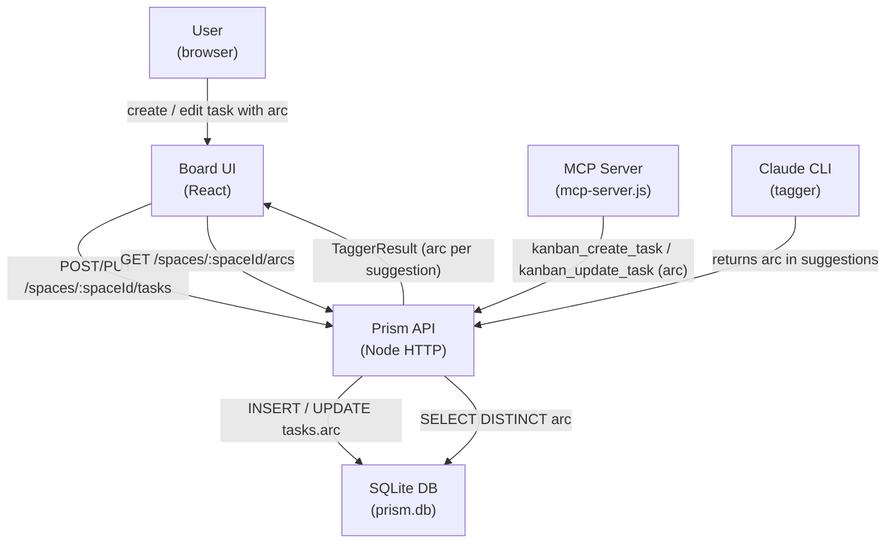
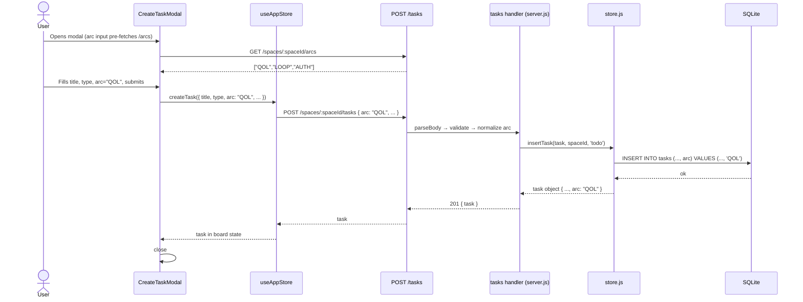
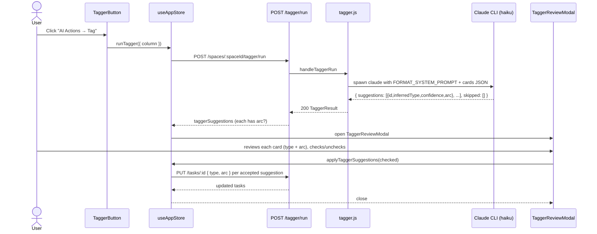
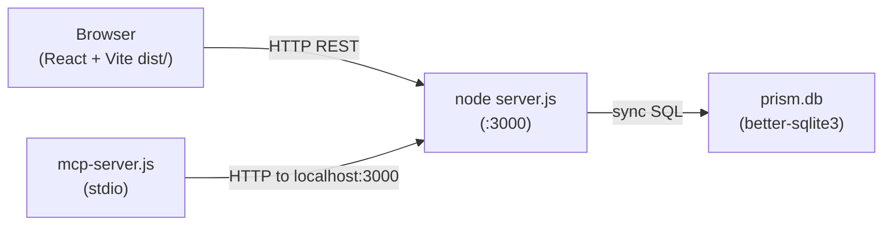

# Blueprint: `arc` Field — Narrative Task Grouping

**Feature:** QOL-5  
**ADR:** ADR-1 (Accepted)  
**Complexity:** Medium — single-domain incremental feature; additive-only; touches every stack layer but no new subsystems

---

## 1. Requirements Summary

### Functional
- FR-1: `arc` (optional string, ≤60 chars) persists on tasks in SQLite.
- FR-2: `arc` is returned in all task list/get API responses.
- FR-3: `POST /tasks` and `PUT /tasks/:id` accept and store `arc`.
- FR-4: `GET /spaces/:spaceId/arcs` returns distinct arc values for the space (autocomplete source).
- FR-5: `kanban_create_task` and `kanban_update_task` MCP tools accept `arc`.
- FR-6: TaskCard displays an arc chip when `arc` is set.
- FR-7: CreateTaskModal and TaskDetailPanel include an arc input with autocomplete (fetches FR-4).
- FR-8: Board supports **arc filter** (hide non-matching tasks) via a chip bar above the columns.
- FR-9: Board supports **arc grouping** (within each column, tasks are sub-sectioned by arc label).
- FR-10: Tagger agent proposes `arc` for each task; suggestion shown in TaggerReviewModal.

### Non-functional
- NFR-1: Migration is additive (no data loss); guarded with `PRAGMA table_info`.
- NFR-2: Arc filter + group query is O(index) — `idx_tasks_space_arc` covers it.
- NFR-3: `/arcs` endpoint response time < 50 ms at 10k tasks (simple DISTINCT scan).
- NFR-4: No breaking change to any existing API consumer or test.
- NFR-5: `arc = null` (unset) must round-trip cleanly as `undefined` in the JS object.

### Constraints
- SQLite `better-sqlite3` (synchronous). No new dependencies.
- Arc is stored as plain TEXT (not JSON-encoded) — see ADR-1 Rationale.
- Empty string is normalized to `null` at the API layer (empty string = clear arc).
- The tagger FORMAT_SYSTEM_PROMPT is the only system prompt; the USER prompt remains user-configurable.

---

## 2. Trade-offs

### 2a. Plain TEXT vs JSON-encoded storage
| | Plain TEXT | JSON-encoded |
|---|---|---|
| `SELECT DISTINCT arc` | ✅ direct | ❌ returns `"\"QOL\""` |
| SQL GROUP BY | ✅ clean | ❌ requires json_extract() |
| Null semantics | ✅ SQL NULL → JS undefined (via rowToTask check) | ✅ JSON null → JS undefined |
| Consistency with other optional cols | ⚠️ type/title precedent | ⚠️ assigned/description precedent |

**Chosen:** Plain TEXT. Arc is a categorical token (like `type`), not rich content. SQL query ergonomics win.

### 2b. `/arcs` endpoint vs client-side derivation
| | `/arcs` endpoint | Client-side from board state |
|---|---|---|
| Coverage | ✅ all columns, all tasks | ❌ only loaded tasks |
| Network call | 1 on modal open | 0 |
| Staleness | ✅ fresh from DB | ❌ stale if another tab creates tasks |

**Chosen:** `/arcs` endpoint. Small payload (array of strings), insignificant latency.

### 2c. Arc filter vs group — separate UI controls
Filter and group are orthogonal operations:
- **Filter**: sets `arcFilter` in store → Column skips tasks that don't match.
- **Group**: sets `arcGrouping` in store → Column renders arc section headers in-between tasks.
Both can be active simultaneously (filter scopes which arcs are shown in group mode).
The `ArcBar` component above the board renders filter chips + a "Group by arc" toggle button.

---

## 3. Architectural Blueprint

### 3.1 Core Components

| Component | Single Responsibility | Technology | Scaling Pattern |
|---|---|---|---|
| `tasks` table — `arc` column | Persist arc per task | SQLite TEXT | No change — indexes cover it |
| `idx_tasks_space_arc` | Fast GROUP BY / filter queries | SQLite B-tree index | Static |
| `rowToTask()` | Deserialise arc from SQL row | store.js | — |
| `insertTask` / `updateTask` stmt | Read/write arc in CRUD ops | better-sqlite3 | — |
| `GET /spaces/:spaceId/arcs` | Return distinct arc values | Node HTTP handler | O(index) query |
| `kanban_create_task` + `kanban_update_task` | Expose arc to MCP consumers | MCP SDK / zod | — |
| `Task` interface (TS) | Type contract for arc | frontend/src/types | — |
| `CreateTaskPayload` / `UpdateTaskPayload` | API payload types | frontend/src/types | — |
| `ArcChip` (sub-component in TaskCard) | Render arc label on card | React | — |
| `ArcAutocomplete` (shared input) | Combobox with `/arcs`-backed suggestions | React | — |
| `ArcBar` (board-level component) | Filter chips + group toggle | React | — |
| `useAppStore` arcs slice | `arcFilter`, `arcGrouping`, `setArcFilter`, `toggleArcGrouping` | Zustand | — |
| `Column` grouping logic | Section headers when `arcGrouping` active | React | — |
| Tagger `FORMAT_SYSTEM_PROMPT` update | Add `arc` to AI output schema | Node string | — |
| `TaggerReviewModal` arc row | Show + apply inferred arc | React | — |

### 3.2 Data Flows and Sequences

#### C4 Context — arc field integration



#### Sequence — Task creation with arc (CreateTaskModal → API → DB)



#### Sequence — Tagger arc suggestion flow



#### Deployment diagram — no new services



### 3.3 APIs and Interfaces

#### Existing endpoints — changes

**POST `/api/v1/spaces/:spaceId/tasks`**
```json
// Request body (additions only)
{
  "arc": "QOL"              // optional string ≤60 chars; omit to leave unset
}
// Response: Task object now includes "arc" field when set
```

**PUT `/api/v1/spaces/:spaceId/tasks/:taskId`**
```json
// Request body (additions only)
{
  "arc": "QOL"              // optional; empty string "" normalised to null (clears arc)
}
```

**GET `/api/v1/spaces/:spaceId/tasks`** (board response)
```json
// Each Task object now includes:
{ "arc": "QOL" }            // omitted when null
```

#### New endpoint

**GET `/api/v1/spaces/:spaceId/arcs`**
- Method: `GET`
- Auth: none (same as all other space endpoints)
- Response `200`:
  ```json
  { "arcs": ["AUTH", "LOOP", "QOL"] }
  ```
  Sorted alphabetically. Empty array when no arc values are set.
- Response `404`:
  ```json
  { "code": "SPACE_NOT_FOUND", "message": "Space not found." }
  ```
- Expected latency SLA: < 50 ms (single indexed `SELECT DISTINCT` query)
- Route regex: `/^\/api\/v1\/spaces\/([^/]+)\/arcs$/`
- **Registration order**: MUST be registered BEFORE the greedy `SPACES_TASKS_ROUTE` to avoid capture.

#### MCP tool changes

**`kanban_create_task`** — additional zod schema field:
```js
arc: z.string().max(60).optional()
  .describe('Narrative grouping label (e.g. "QOL", "AUTH"). Omit to leave unset.')
```

**`kanban_update_task`** — additional zod schema field:
```js
arc: z.string().max(60).optional()
  .describe('Set or clear the arc. Pass "" (empty string) to clear the arc.')
```

#### Tagger response schema change

`FORMAT_SYSTEM_PROMPT` extended to include `arc` in each suggestion:
```json
{
  "suggestions": [
    {
      "id": "<string>",
      "inferredType": "feature | bug | tech-debt | chore",
      "confidence": "high | medium | low",
      "arc": "<short label or null — omit if you cannot infer>",
      "description": "<only when improve_descriptions=true>"
    }
  ],
  "skipped": ["<id>"]
}
```

`TaggerSuggestion` TypeScript interface addition:
```ts
arc?: string;  // AI-proposed arc label; undefined when model couldn't infer
```

### 3.4 Observability Strategy

This feature adds no new service boundaries, so existing observability applies unchanged. Specific additions:

**Metrics (RED)**
- `arc_set_ratio` (derived): `tasks WHERE arc IS NOT NULL / total tasks` per space — track adoption. Log this in the `/arcs` endpoint response as `{ arcs, totalWithArc }` (optional future addition).

**Structured logs (minimum fields)**
- `[store] migration: added arc column to tasks` — logged on first startup after migration.
- Tagger handler: existing `event: 'tagger.run.complete'` log extended with `arcsInferred: N` count.

**Distributed traces (critical spans)**
- No new spans required; existing request-level timing via `withTiming` in MCP server covers all new paths.

**Suggested tools**: existing setup — no new tooling needed.

### 3.5 Deploy Strategy

No new services, no infrastructure change. Standard deploy process:

- **CI/CD**: unchanged pipeline — lint → test (backend + frontend) → build → deploy.
- **Release strategy**: rolling (existing approach). Migration runs on first server start after deploy; it is a non-blocking `ALTER TABLE ADD COLUMN` (O(1) in SQLite WAL mode). Zero downtime.
- **IaC**: N/A — SQLite file, no cloud infra change.
- **Rollback**: If rollback is needed, the `arc` column remains in the DB but is ignored by the old code (nullable, no default). No data loss. A forward-only migration note is added to the migration log.

---

## 4. Key Implementation Notes for Developer Agent

### Backend changes (store.js)

1. **DDL**: add `arc TEXT` to `CREATE TABLE IF NOT EXISTS tasks` (for fresh DBs) AND add the additive migration guard:
   ```js
   const cols = db.pragma('table_info(tasks)');
   if (!cols.some((c) => c.name === 'arc')) {
     db.exec('ALTER TABLE tasks ADD COLUMN arc TEXT');
     console.log('[store] migration: added arc column to tasks');
   }
   ```

2. **Index**: add to `SCHEMA_SQL`:
   ```sql
   CREATE INDEX IF NOT EXISTS idx_tasks_space_arc ON tasks(space_id, arc);
   ```

3. **`rowToTask`**: add after existing optional fields:
   ```js
   if (row.arc != null) task.arc = row.arc;  // plain TEXT, no JSON
   ```

4. **Prepared statements**: update `insertTask`, `upsertTask`, `updateTask` to include `arc`.

5. **`insertTask()`** and **`upsertTask()`**: pass `task.arc ?? null` as the `arc` parameter (no JSON.stringify).

6. **`updateTask()`**: `merged.arc ?? null` for the UPDATE SET clause.

7. **New prepared stmt** `getDistinctArcs`:
   ```sql
   SELECT DISTINCT arc FROM tasks WHERE space_id = ? AND arc IS NOT NULL ORDER BY arc ASC
   ```

### Backend changes (routes + handler)

8. **Route**: register `ARCS_ROUTE = /^\/api\/v1\/spaces\/([^/]+)\/arcs$/` BEFORE `SPACES_TASKS_ROUTE` (router ordering — see Memory).

9. **Handler** (`GET /arcs`): space existence check → `store.getDistinctArcs(spaceId)` → `{ arcs: rows.map(r => r.arc) }`.

10. **Create task handler**: read `arc` from body; normalise empty string to `null`; pass to `store.insertTask`.

11. **Update task handler**: read `arc` from body (only if `'arc' in body`); normalise empty string to `null`; include in patch.

12. **Arc validation** (both create and update): `arc` must be a string; max 60 chars; must not be an empty string (empty string = clear, so server converts to `null`). Reject non-string values with `400 VALIDATION_ERROR`.

### MCP server changes

13. Add `arc` zod field to `kanban_create_task` and `kanban_update_task` schemas.
14. Forward `arc` in the `fields` object in `kanban_update_task` handler.

### Frontend changes

15. **Types**: add `arc?: string` to `Task`, `CreateTaskPayload`, `UpdateTaskPayload`, `TaggerSuggestion`.

16. **`useAppStore`**:
    - `createTask` action: include `arc` in the POST body if set.
    - `updateTask` action: include `arc` in the PUT body if set.
    - Add state: `arcFilter: string | null` (default `null`), `arcGrouping: boolean` (default `false`).
    - Add actions: `setArcFilter(arc: string | null)`, `toggleArcGrouping()`.

17. **`api/client`**: add `getArcs(spaceId: string): Promise<{arcs: string[]}>` — `GET /spaces/:spaceId/arcs`.

18. **`TaskCard`**: add arc chip after the type badge (Zone B). Style: `text-[10px] font-mono bg-surface-elevated border border-border text-text-secondary px-1.5 rounded`.

19. **`CreateTaskModal`**: add `ArcAutocomplete` field (combobox input). Fetch `/arcs` on modal open. On submit, include `arc` in `CreateTaskPayload` if non-empty.

20. **`TaskDetailPanel`**: add arc field in the metadata section. Same `ArcAutocomplete` component. On change, call `store.updateTask(task.id, { arc })`.

21. **`ArcBar`** (new component, `frontend/src/components/board/ArcBar.tsx`):
    - Reads `arcFilter` and `arcGrouping` from store.
    - Renders a horizontal row of arc filter chips (one per distinct arc in current board tasks) + "Group" toggle button.
    - Hidden when no tasks have an arc set.
    - Position: between `ColumnTabBar` and the columns in `Board.tsx`.

22. **`Column`**: when `arcGrouping` is true, group tasks by arc. Render section header `<ArcGroupHeader arc="QOL" />` before each group. Tasks with no arc appear under an "—" section at the bottom.
    When `arcFilter` is not null, filter out tasks where `task.arc !== arcFilter`.

23. **Tagger `FORMAT_SYSTEM_PROMPT`**: add `"arc"` field to suggestion schema with rule: "Set arc to a short label if you can infer one from the title pattern (e.g. 'QOL', 'LOOP'). Omit entirely if you cannot confidently infer it."

24. **`TaggerReviewModal`**: add an arc chip/badge in each suggestion row showing `suggestion.arc` (when present). When applying suggestions, include `arc` in the update call.

### `ArcAutocomplete` component spec

- File: `frontend/src/components/shared/ArcAutocomplete.tsx`
- Props: `{ value: string; onChange: (v: string) => void; spaceId: string; placeholder?: string }`
- Behaviour:
  - On mount: fetch `GET /spaces/:spaceId/arcs` → populate dropdown list.
  - Renders a text `<input>` with a dropdown of matching suggestions (filtered by typed text).
  - Accepts free-text input (user can type a new arc not in the list).
  - Clear button (×) when value is non-empty.
  - Keyboard: ArrowDown/Up to navigate suggestions, Enter to select, Escape to close dropdown.
- Style: same `inputClass` pattern as `CreateTaskModal` existing inputs. Dropdown: `bg-surface-elevated border border-border rounded-md shadow-md z-50`.
- No external dependencies (no headless UI, no Select library).

### Arc grouping in Column

When `arcGrouping` is true, Column applies this sort before rendering:
1. Extract all distinct arc values from the column's task list (sorted alphabetically).
2. For each arc, render: `<ArcGroupHeader arc={arc} count={N} />` then the matching tasks.
3. After all arc groups, render `<ArcGroupHeader arc={null} count={N} />` (label "—") then tasks with `arc == null`.
4. Tasks within each arc group retain creation-order ordering.

`ArcGroupHeader` component (inline in Column.tsx):
```tsx
function ArcGroupHeader({ arc, count }: { arc: string | null; count: number }) {
  return (
    <div className="flex items-center gap-2 px-1 pt-2 pb-1">
      <span className="text-[10px] font-mono font-semibold text-text-secondary uppercase tracking-widest">
        {arc ?? '—'}
      </span>
      <span className="text-[10px] text-text-disabled">{count}</span>
      <div className="flex-1 h-px bg-border" />
    </div>
  );
}
```

---

## 5. Files Modified / Created

### Backend
| File | Change |
|---|---|
| `src/services/store.js` | DDL (arc col + index), additive migration, rowToTask, stmts (insert/update), `getDistinctArcs` |
| `src/routes/index.js` | New `ARCS_ROUTE` + handler dispatch |
| `src/handlers/tasks.js` (or equivalent) | Read/normalize arc in create + update handlers |
| `src/handlers/tagger.js` | Extend `FORMAT_SYSTEM_PROMPT`, include arc in `readSpaceTasks`, return arc in result |
| `mcp/mcp-server.js` | Add `arc` to create_task + update_task zod schemas and forwarding |

### Frontend
| File | Change |
|---|---|
| `frontend/src/types/index.ts` | `arc?:string` on Task, CreateTaskPayload, UpdateTaskPayload, TaggerSuggestion |
| `frontend/src/api/client.ts` | `getArcs()` function |
| `frontend/src/stores/useAppStore.ts` | createTask/updateTask include arc; arcFilter + arcGrouping state |
| `frontend/src/components/board/TaskCard.tsx` | Arc chip in Zone B |
| `frontend/src/components/board/Column.tsx` | Arc filter logic + grouping with section headers |
| `frontend/src/components/board/Board.tsx` | Render `<ArcBar>` above columns |
| `frontend/src/components/modals/CreateTaskModal.tsx` | ArcAutocomplete field |
| `frontend/src/components/board/TaskDetailPanel.tsx` | ArcAutocomplete field in metadata section |
| `frontend/src/components/modals/TaggerReviewModal.tsx` | Arc chip per suggestion row + apply arc on accept |

### New files
| File | Purpose |
|---|---|
| `frontend/src/components/shared/ArcAutocomplete.tsx` | Shared combobox with `/arcs`-backed suggestions |
| `frontend/src/components/board/ArcBar.tsx` | Filter chip bar + group toggle above board |

### Tests
| File | Change |
|---|---|
| `tests/store.test.js` | arc persistence, migration guard, getDistinctArcs |
| `tests/tasks.test.js` | create/update with arc, /arcs endpoint |
| `frontend/src/components/board/TaskCard.test.tsx` | arc chip renders when set |
| `frontend/src/components/shared/ArcAutocomplete.test.tsx` | autocomplete behaviour |
