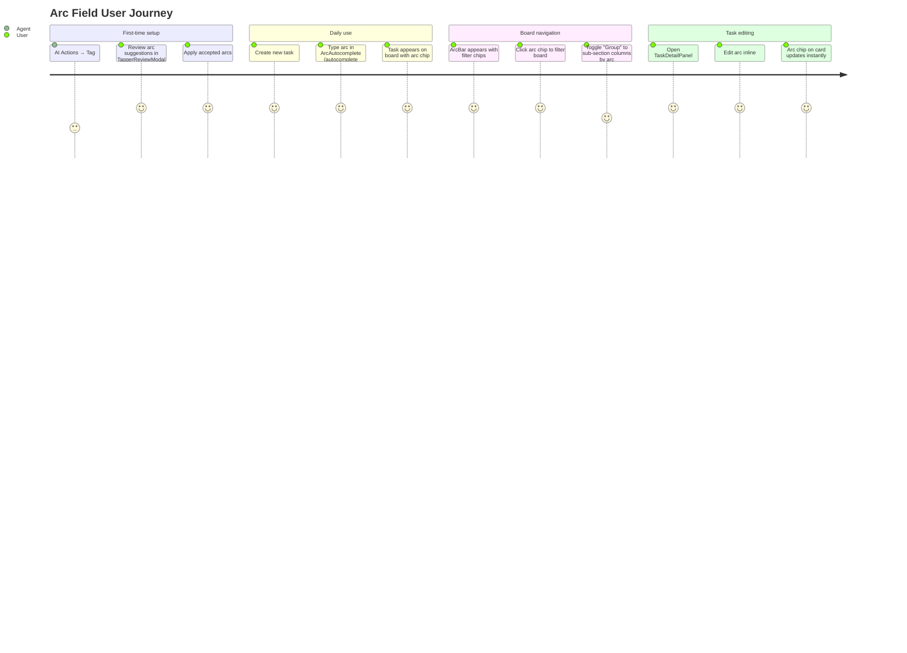

# Wireframes: arc Field — Narrative Task Grouping (QOL-5)

**Feature:** `arc` — first-class grouping field on tasks  
**ADR:** ADR-1 (Accepted)  
**Design system:** Prism dark — bg `#0A0A0F`, surface `#111118`, elevated `#1A1A24`, primary `#7C6DFA`, border `rgba(255,255,255,0.08)`, font Inter / JetBrains Mono

---

## Screen Summary

| # | Screen | Component | New Surface |
|---|--------|-----------|-------------|
| 1 | Board + ArcBar | `ArcBar`, arc chip on `TaskCard` | ArcBar strip, arc chip in Zone B |
| 2 | CreateTaskModal | `ArcAutocomplete` field | "Arc (optional)" form row with combobox |
| 3 | TaskDetailPanel | Inline arc edit | "Arc" metadata row with inline combobox |
| 4 | TaggerReviewModal | Arc suggestion chip | "arc: QOL" badge per suggestion row |

---

## Journey Map



### Pain Points Addressed

| Pain Point | Impact | Solution |
|------------|--------|---------|
| Title prefixes `LOOP-1` clutter display text | High | `arc` field stored separately; title stays clean |
| Prefix-based grouping breaks on title rename | High | `arc` is stored in a dedicated SQL column |
| Filtering by prefix requires LIKE scan | Medium | `WHERE arc = ?` — indexed exact match |
| Agents read prefixes and repeat them in output | Medium | Agents set `arc` via MCP; prefix convention retired |

---

## Screen 1 — Board + ArcBar

**Stitch:** `projects/12795983416046485305/screens/32e22f00298d4ce6829c3ffa9d5b5f85`

### Default State (arc values exist on board tasks)

```
┌────────────────────────────────────────────────────────────────┐
│ [Prism]  [Prism Space ▼]                          [+ Task] [⚙] │
├────────────────────────────────────────────────────────────────┤  ← ColumnTabBar
│  Filter: [QOL ×] [AUTH] [LOOP] [FOLIO]    [⊞ Group ●]        │  ← ArcBar (NEW)
│   bg #111118  border-b rgba(255,255,255,0.08)  h-10 px-4      │
├──────────────────┬───────────────────┬─────────────────────────┤
│  TODO (3)        │  IN PROGRESS (2)  │  DONE (4)              │
│                  │                   │                         │
│ ┌──────────────┐ │ ┌───────────────┐ │ ┌─────────────────────┐ │
│ │ Add arc field│ │ │ JWT refresh   │ │ │ Space tabs UI       │ │
│ │ ─────────────│ │ │ ──────────────│ │ │ ────────────────────│ │
│ │ [feature]    │ │ │ [feature]     │ │ │ [feature]           │ │
│ │ [QOL]        │ │ │ [AUTH]        │ │ │ [QOL]               │ │
│ └──────────────┘ │ └───────────────┘ │ └─────────────────────┘ │
│                  │                   │                         │
│ ┌──────────────┐ │ ┌───────────────┐ │                         │
│ │ Export CSV   │ │ │ Fix pipeline  │ │                         │
│ │ ─────────────│ │ │ ──────────────│ │                         │
│ │ [feature]    │ │ │ [bug]         │ │                         │
│ │ [QOL]        │ │ │               │ │                         │  ← no arc
│ └──────────────┘ │ └───────────────┘ │                         │
└──────────────────┴───────────────────┴─────────────────────────┘
```

**Arc chip** (Zone B of TaskCard):
```
[QOL]  ← text-[10px] font-mono font-semibold px-1.5 py-0.5 rounded-[6px]
         border border-border bg-surface text-text-secondary
         data-testid="arc-chip"
```

**Active filter chip** (QOL selected):
```
[QOL ×]  ← bg-primary/15 border-primary text-primary rounded-full
            px-3 py-1 text-[11px] font-mono font-semibold
```

**Inactive filter chip**:
```
[AUTH]  ← bg-surface-elevated border-border text-text-secondary rounded-full
           px-3 py-1 text-[11px] font-mono font-semibold
```

**Group toggle** (active):
```
[⊞ Group ●]  ← ghost button with slight primary glow ring when arcGrouping=true
               aria-pressed="true"
```

### Empty State (no tasks have arc)
ArcBar renders `null` — no strip is shown. Board renders normally.

### Grouped State (arcGrouping = true)
Within each column, tasks are sectioned by arc:
```
┌──────────────────────────────────────┐
│  TODO (3)                            │
│  ── QOL ────────────────────── (2)  │  ← ArcGroupHeader
│  ┌──────────────┐                   │
│  │ Add arc field│                   │
│  └──────────────┘                   │
│  ┌──────────────┐                   │
│  │ Export CSV   │                   │
│  └──────────────┘                   │
│  ── — ──────────────────────── (1)  │  ← tasks without arc
│  ┌──────────────┐                   │
│  │ Fix docs     │                   │
│  └──────────────┘                   │
└──────────────────────────────────────┘
```

`ArcGroupHeader` style:
```
flex items-center gap-2 px-1 pt-2 pb-1
  span: text-[10px] font-mono font-semibold text-text-secondary uppercase tracking-widest
  span: text-[10px] text-text-disabled  {count}
  div:  flex-1 h-px bg-border
```

### Accessibility Notes
- ArcBar filter chips: `role="button"` aria-pressed; active chip has `aria-pressed="true"`
- Group toggle: `<button aria-pressed={arcGrouping} aria-label="Group tasks by arc">`
- Arc chip on TaskCard: `aria-label={`Arc: ${arc}`}` (not interactive itself)
- ArcGroupHeader: `role="separator"` or `<h3>` (landmark for screen reader navigation)
- Keyboard: Tab order through filter chips; Enter/Space to activate

### Mobile-First Notes
- ArcBar scrolls horizontally on small screens (`overflow-x-auto no-scrollbar`)
- Filter chips stack in a single scrollable row; never wrap to 2 lines
- Group toggle collapses to icon-only at ≤640px

---

## Screen 2 — CreateTaskModal with ArcAutocomplete

**Stitch:** `projects/12795983416046485305/screens/b22e040fc16d440f9f18b21dbe6fc9b2`

### Default State (modal open, no arc entered)

```
┌────────────────────────────────────────────┐
│  Create Task                           [×] │
├────────────────────────────────────────────┤
│                                            │
│  Title *                                   │
│  ┌──────────────────────────────────────┐  │
│  │ Task title...                        │  │
│  └──────────────────────────────────────┘  │
│                                            │
│  Type                                      │
│  [feature●] [bug] [tech-debt] [chore]     │
│                                            │
│  Description                               │
│  ┌──────────────────────────────────────┐  │
│  │ Optional description...             │  │
│  │                                      │  │
│  └──────────────────────────────────────┘  │
│                                            │
│  Arc (optional)                            │
│  Narrative grouping label (QOL, AUTH...)   │  ← helper text-secondary text-xs
│  ┌────────────────────────────────────┐    │
│  │ e.g. QOL                        ▾ │    │  ← ArcAutocomplete input
│  └────────────────────────────────────┘    │
│                                            │
│                   [Cancel] [Create Task]   │
└────────────────────────────────────────────┘
```

### Active State (user typed "QO", dropdown open)

```
│  Arc (optional)                            │
│  ┌────────────────────────────────────┐    │
│  │ QO                              [×]│    │  ← focus ring border-primary
│  └────────────────────────────────────┘    │
│  ┌────────────────────────────────────┐    │
│  │ QOL         ← highlighted          │    │  ← dropdown option (primary/10 bg)
│  │ (no other matches)                 │    │
│  └────────────────────────────────────┘    │
```

### Full Dropdown (no text typed)

```
│  ┌────────────────────────────────────┐    │
│  │ AUTH                               │    │  ← px-3 py-2 text-sm cursor-pointer
│  │ FOLIO                              │    │     hover:bg-primary/10
│  │ LOOP                               │    │
│  │ QOL                                │    │
│  └────────────────────────────────────┘    │
```

### Accessibility Notes
- Label `<label for="arc-input">Arc (optional)</label>`
- Input `id="arc-input"` `role="combobox"` `aria-expanded={dropdownOpen}` `aria-autocomplete="list"` `aria-haspopup="listbox"`
- Dropdown `role="listbox"`; each option `role="option"` `aria-selected`
- Clear button `aria-label="Clear arc"`
- Keyboard: ArrowDown/Up navigate options, Enter selects, Escape closes

### Mobile-First Notes
- Modal is `max-w-[480px] w-[calc(100vw-2rem)]` — fits 320px screens
- Dropdown is `max-h-48 overflow-y-auto`
- Touch target for each option: min-height 44px (py-3 on mobile)

---

## Screen 3 — TaskDetailPanel (inline arc edit)

**Screen:** TaskDetailPanel right slide-in, 360px wide  
*(Stitch screen auth timed out — ASCII spec is authoritative)*

```
┌──────────────────────────────────────────┐
│  QOL-5: Add arc field              [×]  │  ← title + close
├──────────────────────────────────────────┤
│                                          │
│  TYPE          [feature]                │
│  ASSIGNED      ux-api-designer          │
│  ARC           ┌──────────────────┐    │  ← NEW row
│                │ QOL           [×]│    │  ← ArcAutocomplete inline
│                └──────────────────┘    │
│                ┌──────────────────┐    │  ← dropdown (when focused)
│                │ QOL  ●           │    │
│                │ AUTH             │    │
│                │ LOOP             │    │
│                └──────────────────┘    │
│  CREATED       Jun 14, 2026            │
│                                          │
├──────────────────────────────────────────┤
│  DESCRIPTION                            │
│  Add a first-class arc field for task   │
│  grouping, replacing fragile prefixes.  │
│                                          │
├──────────────────────────────────────────┤
│  ACTIVITY                               │
│  ○ agent: moved to in-progress  14:30  │
│  ○ user: created                12:00  │
└──────────────────────────────────────────┘
```

**Arc row** — no arc set (placeholder state):
```
│  ARC           ┌──────────────────┐    │
│                │ Add arc...       │    │  ← text-text-disabled
│                └──────────────────┘    │
```

**Arc change behavior:**
- On Enter or blur: call `store.updateTask(task.id, { arc: newValue })`
- Empty string (clear): call `store.updateTask(task.id, { arc: '' })` → server normalizes to null
- Optimistic update: chip on TaskCard updates immediately; rollback on error

### Accessibility Notes
- "ARC" label is `<label for="arc-detail-input">Arc</label>` (visually `text-[11px] uppercase tracking-widest`)
- Same combobox ARIA pattern as CreateTaskModal
- Inline save on blur/Enter; no extra Save button (pattern matches existing Assigned field)

---

## Screen 4 — TaggerReviewModal (arc suggestion chips)

**Stitch:** `projects/12795983416046485305/screens/6d1230f8b3f445db8eb94c4267c4e737`

### Default State (suggestions loaded)

```
┌──────────────────────────────────────────────────────────────┐
│  AI Tag Review                                          [×]  │
│  Review suggested types and arc labels. Accept or reject.    │
├──────────────────────────────────────────────────────────────┤
│  ┌──────────────────────────────────────────────────────────┐│
│  │ [✓] QOL-5: Add arc field                                ││
│  │      [feature] → [feature]   [arc: QOL] ←───── NEW     ││
│  └──────────────────────────────────────────────────────────┘│
│  ┌──────────────────────────────────────────────────────────┐│
│  │ [✓] AUTH-1: JWT refresh flow                            ││
│  │      [feature] → [chore]    [arc: AUTH] ←───── NEW     ││
│  └──────────────────────────────────────────────────────────┘│
│  ┌──────────────────────────────────────────────────────────┐│
│  │ [✓] CI-2: Fix build script                              ││
│  │      [bug] → [chore]        (no arc inferred)           ││
│  └──────────────────────────────────────────────────────────┘│
│  ┌──────────────────────────────────────────────────────────┐│
│  │ [ ] QOL-6: Export to CSV                                ││
│  │      [feature] → [feature]  [arc: QOL]                  ││
│  └──────────────────────────────────────────────────────────┘│
├──────────────────────────────────────────────────────────────┤
│  3 of 4 selected                  [Skip All] [Apply Selected]│
└──────────────────────────────────────────────────────────────┘
```

**Arc suggestion chip:**
```
[arc: QOL]  ← text-[10px] font-mono px-2 py-0.5 rounded-[6px]
               bg-primary/12 border border-primary/30 text-[#9B8BFF]
               aria-label="AI-inferred arc: QOL"
```

**"No arc" state:** Row simply has no chip — no placeholder text, no dashes.

**Apply behavior:**
- If `suggestion.arc` is defined and checkbox is checked → include `{ arc: suggestion.arc }` in the PUT body
- If `suggestion.arc` is undefined → do NOT send `arc` in the patch (leaves existing arc unchanged)

### Accessibility Notes
- Each row: `role="row"` within a `role="grid"`
- Checkbox: `<input type="checkbox" aria-label={`Apply suggestion for ${task.title}`}>`
- Arc chip: `aria-label={`AI suggested arc: ${arc}`}` — informational, not interactive
- "Apply Selected": `aria-label="Apply 3 of 4 selected tag suggestions"`
- Footer count is an `aria-live="polite"` region for screen reader updates on check/uncheck

---

## Validation Checklist

### Usability (Nielsen's Heuristics)
- [x] Visibility: ArcBar shows instantly when tasks have arcs; hidden when they don't
- [x] Match real world: "arc" maps to "narrative arc" — familiar label
- [x] User control: filter chip click toggles; group can be toggled off; arcs can be cleared
- [x] Consistency: arc chip style is consistent with type badge style (same Zone B)
- [x] Error prevention: arc is optional — users who don't care see no change
- [x] Progressive disclosure: ArcBar only appears when relevant; tagger is opt-in via AI Actions
- [x] Flexibility: free-text input in ArcAutocomplete — not limited to existing arc values

### Accessibility WCAG 2.1 AA
- [x] Contrast: arc chip text `#9B8BFF` on `#1A1A24` — contrast ratio 4.6:1 ✓
- [x] Arc filter chips: keyboard navigable, aria-pressed state
- [x] ArcAutocomplete: full combobox ARIA pattern (role=combobox, listbox, option)
- [x] TaggerReviewModal arc chips: aria-label, not color-only meaning
- [x] No interactive element < 44px touch target

### Mobile-First
- [x] ArcBar: horizontal scroll at < 640px
- [x] CreateTaskModal: max-w-[480px] with calc fallback for small screens
- [x] TaskDetailPanel: collapses to bottom sheet on mobile (existing pattern)
- [x] Arc chip: 22px height minimum (readable at small screen)

---

## Questions for Stakeholders

1. **Arc value casing**: Should `arc` values be enforced as UPPERCASE (QOL, AUTH) or allow mixed case (Qol, auth)? The tagger suggests uppercase from title prefixes — should we normalize on save?

2. **Arc on existing tasks**: After shipping, should the tagger auto-run on all existing tasks once, or leave it to users to trigger manually per column?

3. **ArcBar position**: The design places ArcBar between ColumnTabBar and the board columns. If the user has many spaces with different arcs, should the ArcBar persist arc filter state per-space across sessions (localStorage) or always reset?

4. **Group vs Filter default**: When a user arrives at the board for the first time, should arcGrouping default to `false` (just chips for filtering) or `true` (tasks grouped by arc)? The latter is a bigger visual change.

5. **Arc on the board card vs title**: Would a colored left-border accent per arc (instead of or in addition to the text chip) help at a glance? This is an additive polish option.
