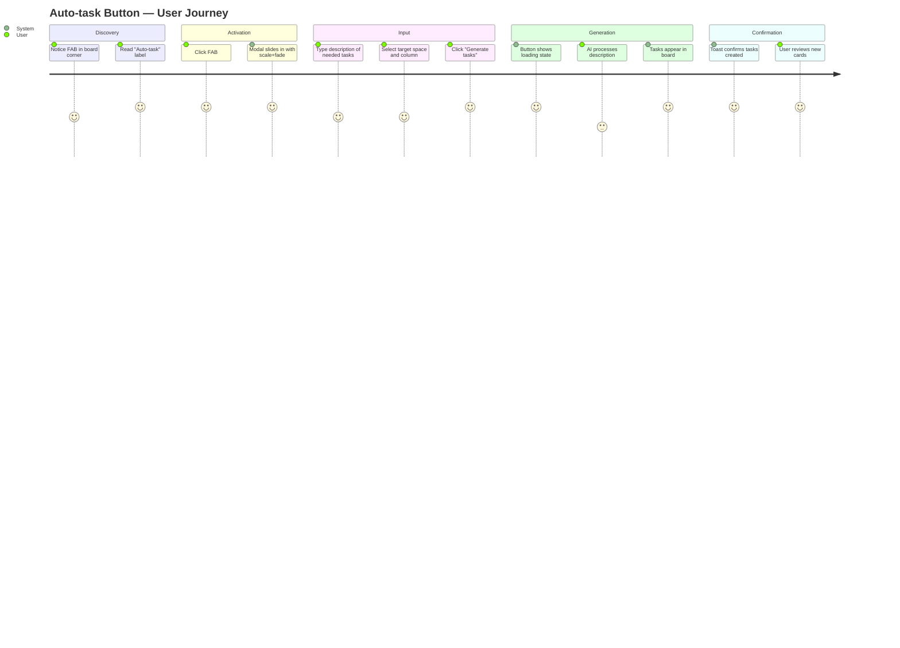

# Wireframes: Auto-task Button (FAB)

## Screen Summary

| Screen | Description |
|--------|-------------|
| FAB Resting | Board view with the FAB fixed bottom-right, gradient border animation shown as static gradient |
| FAB Hover | FAB at hover state — glow intensifies, slight scale-up |
| Modal Open | The Auto-task modal/panel that opens on FAB click |
| Modal Loading | Generating state — spinner in button, textarea disabled |
| Modal Success | Tasks generated — confirmation toast, modal closes |
| Modal Error | Generation failed — error message with retry |

---

## User Journey Map



---

## Wireframe: FAB Resting State

```
┌────────────────────────────────────────────────────────────┐
│ Prism  [Space Name]                          [Config] [●]  │  ← header 64px
├────────────────────────────────────────────────────────────┤
│  ┌──────────────┐  ┌──────────────┐  ┌──────────────┐     │
│  │   TODO (3)   │  │ IN PROGRESS  │  │   DONE (5)   │     │
│  │              │  │    (2)       │  │              │     │
│  │ ┌──────────┐ │  │ ┌──────────┐ │  │ ┌──────────┐ │     │
│  │ │ Task A   │ │  │ │ Task C   │ │  │ │ Task E   │ │     │
│  │ │ feature  │ │  │ │ research │ │  │ │ feature  │ │     │
│  │ └──────────┘ │  │ └──────────┘ │  │ └──────────┘ │     │
│  │ ┌──────────┐ │  │ ┌──────────┐ │  │ ...          │     │
│  │ │ Task B   │ │  │ │ Task D   │ │  │              │     │
│  │ │ task     │ │  │ │ task     │ │  │              │     │
│  │ └──────────┘ │  │ └──────────┘ │  │              │     │
│  │ [+ Add task] │  │              │  │              │     │
│  └──────────────┘  └──────────────┘  └──────────────┘     │
│                                                            │
│                                    ╔══════════════════╗   │  ← FAB
│                                    ║ ✨  Auto-task    ║   │     fixed
│                                    ╚══════════════════╝   │     bottom-right
└────────────────────────────────────────────────────────────┘

FAB details:
- Position: fixed, right: 24px, bottom: max(24px, env(safe-area-inset-bottom))
- Shape: pill (border-radius: 9999px)
- Height: 48px, padding: 0 20px
- Icon: Material Symbol "auto_awesome" (sparkle), 20px, color white
- Label: "Auto-task", Inter 14px medium, color #F5F5F7
- Gap between icon and label: 8px
- Background: rgba(30,30,35,0.85) with backdrop-filter blur(20px) saturate(180%)
- Border: 1.5px gradient — conic-gradient(from 0deg, #7C3AED, #2563EB, #06B6D4, #2563EB, #7C3AED)
  Implemented via: pseudo-element ::before with the gradient as background,
  padding 1.5px, border-radius 9999px, position absolute inset 0.
- Box-shadow: 0 0 20px rgba(124,58,237,0.20), 0 0 40px rgba(6,182,212,0.08)
- z-index: 40 (above cards, below modals)
- Animation: @keyframes fab-border-rotate — conic-gradient rotates 360deg over 4s linear infinite
  (respects prefers-reduced-motion: stops rotation, keeps static gradient)
```

### Accessibility Notes (Resting)
- `role="button"`, `aria-label="Auto-task: open AI task generator"`
- Focus ring: 2px solid rgba(10,132,255,0.50), offset 2px — always visible on focus
- Minimum touch target: 48x48px (meets Apple 44pt / Material 48dp)
- Icon is decorative (`aria-hidden="true"`); label text is visible — no icon-only concern
- Contrast of "Auto-task" white (#F5F5F7) on dark rgba(30,30,35,0.85): passes WCAG AA (>4.5:1)

### Mobile-First Notes (Resting)
- At 320-599px: FAB is icon-only (label hidden with `sr-only`), size 48x48px circle
- At 600px+: label reappears, pill shape
- `bottom-safe-6` utility class already defined in index.css handles iOS safe-area

---

## Wireframe: FAB Hover State

```
                                    ╔══════════════════╗
                                    ║ ✨  Auto-task    ║  ← scale(1.04)
                                    ╚══════════════════╝
                                          ↑
FAB hover changes:
- transform: scale(1.04) — spring easing (cubic-bezier(0.34, 1.56, 0.64, 1)), 200ms
- box-shadow increases: 0 0 30px rgba(124,58,237,0.35), 0 0 60px rgba(6,182,212,0.15)
- background lightens slightly: rgba(44,44,49,0.90)
- Gradient border rotation speed increases: 2s (from 4s)
- cursor: pointer
```

### Accessibility Notes (Hover)
- Hover state must NOT be the only visual feedback — focus state is also required
- Pressed state: scale(0.97), spring easing, 100ms

---

## Wireframe: Modal Open State (Default)

```
┌────────────────────────────────────────────────────────────┐
│  [board — dimmed by rgba(0,0,0,0.50) scrim]                │
│                                                            │
│          ┌──────────────────────────────────┐              │
│          │ ✨ Auto-task              [✕]    │  ← modal header
│          │──────────────────────────────────│
│          │ Describe what you need and AI    │  ← subtitle 13px secondary
│          │ will generate tasks for you.     │
│          │                                  │
│          │ ┌──────────────────────────────┐ │  ← textarea
│          │ │ e.g. Build a user auth       │ │     min-height 100px
│          │ │ system with login, register  │ │     bg rgba(255,255,255,0.06)
│          │ │ and password reset.          │ │     border rgba(255,255,255,0.08)
│          │ │                              │ │     border-radius 8px
│          │ │                              │ │     padding 12px
│          │ └──────────────────────────────┘ │
│          │                                  │
│          │ Add to:  [Space ▾]  [Todo ▾]     │  ← column/space selectors
│          │                                  │
│          │ ✨ AI-powered    [Generate tasks]│  ← footer
│          └──────────────────────────────────┘
│                                                            │
│                            ╔══════════════════╗           │
│                            ║ ✨  Auto-task    ║           │
│                            ╚══════════════════╝           │
└────────────────────────────────────────────────────────────┘

Modal details:
- Max-width: 520px, centered via fixed positioning
- Background: rgba(44,44,49,0.92), backdrop-filter blur(40px) saturate(200%) [glass-heavy]
- Border: 1px solid rgba(255,255,255,0.08)
- Border-radius: 20px
- Box-shadow: 0 24px 80px rgba(0,0,0,0.60), 0 0 0 1px rgba(255,255,255,0.08) [shadow-modal]
- Padding: 24px
- Animation: scale-in 280ms cubic-bezier(0.34, 1.56, 0.64, 1) on open
             modal-out 180ms on close (already defined in tailwind.config.js)

Header row:
- Icon: "auto_awesome" Material Symbol, 20px, color #0A84FF (primary)
- Title: "Auto-task", Inter 18px, font-weight 600, color #F5F5F7
- Gap: 10px between icon and title
- Close button: icon-only "close" Material Symbol, 20px, ghost style,
  color rgba(245,245,247,0.55), 32x32px touch target, top-right

Subtitle:
- "Describe what you need and AI will generate tasks for you."
- 13px, color rgba(245,245,247,0.55), line-height 1.5
- margin-top: 4px, margin-bottom: 16px

Textarea:
- full width, min-height 100px, resize: vertical
- placeholder color rgba(245,245,247,0.30)
- focus: border-color rgba(10,132,255,0.50), box-shadow 0 0 0 3px rgba(10,132,255,0.12)

Selectors row (margin-top 12px):
- Label: "Add to:" 12px secondary
- Space selector: pill chip, current space name, border rgba(255,255,255,0.08)
- Column selector: pill chip, "Todo" default, border rgba(255,255,255,0.08)

Footer row (margin-top 20px, flex space-between):
- Left: ✨ icon + "AI-powered by Claude" 12px rgba(245,245,247,0.40)
- Right: Button "Generate tasks" — primary, height 36px, padding 0 16px, border-radius 8px
```

### States: Modal

| State | Textarea | Button | Notes |
|-------|----------|--------|-------|
| Default | Empty with placeholder | "Generate tasks" enabled | Focus on textarea on open |
| Input | Text typed | "Generate tasks" enabled | Button stays enabled (no length min) |
| Loading | disabled, opacity 0.6 | "Generating..." + spinner, disabled | Prevents double-submit |
| Success | — | — | Modal closes, toast: "N tasks created" green, 3s |
| Error | Re-enabled | "Try again" text | Error msg below textarea: "Could not generate tasks. Please try again." |

### Accessibility Notes (Modal)
- Uses existing `<Modal>` shared component: handles portal, backdrop, Escape key, focus trap
- Initial focus: textarea on open
- Close via: Escape key, click backdrop, click X button
- `role="dialog"`, `aria-modal="true"`, `aria-labelledby="autotask-modal-title"`
- Selectors must be keyboard navigable (native `<select>` or custom with role="listbox")
- Error state uses `role="alert"` for screen reader announcement
- Loading state: `aria-busy="true"` on form, `aria-label="Generating tasks, please wait"` on button

### Mobile-First Notes (Modal)
- At 320-599px: modal is full-screen (position: fixed; inset: 0; border-radius 20px 20px 0 0)
  Swipe-down to dismiss (touch gesture)
- At 600px+: centered dialog, max-width 520px, 24px margin each side

---

## Validation Checklist

### Usability (Nielsen's Heuristics)
- [x] H1 Visibility of system status: Loading state shows spinner + "Generating..." text
- [x] H2 Match between system and world: "Auto-task" label is plain language, sparkle icon reinforces AI
- [x] H3 User control: X button, Escape key, backdrop click all dismiss modal
- [x] H4 Consistency: Reuses existing Modal component, primary Button, design tokens
- [x] H5 Error prevention: Textarea allows any text (no pre-validation to block typos)
- [x] H6 Recognition over recall: Space/Column selectors show current values
- [x] H7 Flexibility: Modal can be dismissed at any point; no forced flow
- [x] H8 Aesthetic: Dark glass, minimal decoration, gradient border is single focal point
- [x] H9 Error recovery: Error message is actionable ("Try again" button)
- [x] H10 Help: Placeholder text provides a concrete example

### Accessibility WCAG 2.1 AA
- [x] 1.4.3 Contrast: FAB label white on dark (#F5F5F7 on rgba bg) >= 4.5:1
- [x] 1.4.11 Non-text contrast: Gradient border on FAB >= 3:1 against background
- [x] 2.1.1 Keyboard: FAB focusable via Tab, activatable via Enter/Space
- [x] 2.4.7 Focus visible: 2px focus ring on FAB and all modal elements
- [x] 4.1.2 Name, Role, Value: aria-label on FAB, role="dialog" on modal
- [x] 1.4.1 Color not sole indicator: gradient border is decorative; no info conveyed by color alone
- [x] 2.3.3 Animation from interactions: gradient rotation pauses with prefers-reduced-motion

### Mobile-First
- [x] 320px: FAB collapses to icon-only 48x48px circle
- [x] 320px: Modal full-screen sheet
- [x] iOS safe-area: .bottom-safe-6 utility used for FAB bottom position
- [x] Touch target: 48x48px minimum (exceeds 44pt Apple minimum)

---

## Stitch Screens

> **Fallback notice:** Stitch `generate_screen_from_text` timed out during generation (known
> issue as of March 2026 — documented in agent MEMORY.md). ASCII wireframes above serve as the
> authoritative design reference. The `wireframes-stitch.md` file documents the fallback.
> Developer should use the ASCII wireframes and design tokens specified here to implement.

---

## Questions for Stakeholders

1. Should the FAB label "Auto-task" remain visible on desktop, or collapse to icon-only
   (like a traditional FAB) when no tasks are in the board? Affects discoverability.

2. When tasks are generated, should they always land in the "Todo" column of the current
   space, or should the user be able to select a different target column per generation?
   (Current design: user selects Space + Column in the modal.)

3. Should there be a maximum number of tasks the AI can generate per run (e.g. max 5)?
   If yes, should the user see a count estimate before confirming?

4. Should the modal persist input between openings (so the user can refine and re-generate),
   or should it reset on each open? Current design: resets on each open.

5. The "AI-powered by Claude" attribution in the footer — is this the desired wording, or
   should it reference the configured TAGGER_CLI instead? The TAGGER_CLI is configurable
   per CLAUDE.md.
