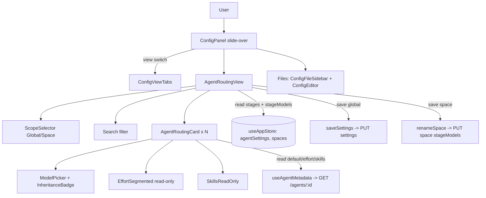

# Blueprint — Config Panel redesign → Proposal D (Phase 1, frontend-only)

> Visual spec (authoritative): `agent-docs/model-routing/config-redesign.html` →
> sections **"Propuesta D"** and **"Agent detail"**. Reproduce its layout and hierarchy.
> This blueprint maps that mockup onto the existing React/Zustand/Tailwind code with
> **no backend changes and no new endpoints**.

## 1. Scope of Phase 1
- **In:** new agent-centric "Agents & Routing" view (card per agent), Global/Space scope
  selector, model selector with inheritance badge (reusing `stageModels`), search filter,
  read-only effort + skills, a two-tab header (Agents & Routing | Files), Files tab reuses
  the existing sidebar+editor.
- **Out (Phase 2):** editable effort & skills, `GET /api/v1/skills` catalog, frontmatter
  write-back, the structured "Edit system prompt" inline editor, task scope editing in the
  Config Panel.

## 2. Core Components

| Component | Responsibility | Tech / reuse | Notes |
|-----------|----------------|--------------|-------|
| `ConfigPanel.tsx` *(modify)* | Slide-over shell; owns the **view switch** (`agents` \| `files`) + dirty guard. | existing | Replace `sidebar + (ModelRouting\|Editor)` body with view switch. |
| `ConfigViewTabs.tsx` *(new)* | Header segmented control: **Agents & Routing / Files**. | `Button`-less, Tailwind segmented (mockup `.seg`) | 2 options only. |
| `AgentRoutingView.tsx` *(new)* | The Proposal D view: header (title + **scope selector** + **search**), scrollable card list, footer (Save / Reset for current scope). Owns local dirty `stageModels` map per scope. | Zustand selectors, `localModelsToStageModelsMap` | Replaces `ModelRoutingSettings.tsx` as primary. |
| `ScopeSelector.tsx` *(new)* | Segmented `Global \| Space · {name}`; sets editing scope. | Tailwind segmented (`.seg-sm`) | Space disabled if no active space. |
| `AgentRoutingCard.tsx` *(new)* | Collapsed row (dot, name, role, mini model pill, skill count, chevron) ⇄ expanded detail. | local `open` state | One per stage agent. |
| `ModelInheritanceBadge.tsx` *(new)* | Renders `default \| global \| space \| task` source pill. | Tailwind (`.src.*`) | Reused by `TaskDetailPanel` later. |
| `ModelPicker` *(new, small)* | The model pill + preset chips + custom input + clear, inside the expanded card. | reuse preset-chip pattern from `ModelRoutingSettings` | Pure presentational + callbacks. |
| `EffortSegmented.tsx` *(new)* | Read-only segmented `low \| medium \| high` reflecting frontmatter. | Tailwind (`.seg-sm`) | `disabled` in Phase 1 + tooltip. |
| `SkillsReadOnly.tsx` *(new)* | Read-only skill chips + empty state. | Tailwind (`.skill-chip`) | No add/remove in Phase 1. |
| `useAgentMetadata` *(new hook)* | Fetch + cache parsed frontmatter (`model`, `effort`, `skills`) per agent. | `getAgent()`, `parseAgentFrontmatter` | Parallel fetch on mount; lazy fallback. |
| `parseAgentFrontmatter()` *(new util)* | Defensive YAML-frontmatter extractor → `{ model?, effort?, skills[] }`. | string parse (no yaml dep needed for this shape) | Never throws. |
| `resolveEffectiveModel()` *(extend `utils/modelRouting.ts`)* | Given `agentId`, scope, and `{ global, space }` maps → `{ model, source }`. | pure fn | Drives the badge + pill. |
| `STAGE_ROLES` *(extend `utils/agentName.ts`)* | `agentId → role subtitle` ("Architecture · ADR + blueprint", …). | static map | English to match app. |
| `ConfigFileSidebar.tsx` *(modify)* | Drop the **Agents** group + the Model Routing virtual item (moved to new view); keep Global + Project. | existing | Used only inside Files tab now. |
| `ModelRoutingSettings.tsx` | **Retired** as a panel item (logic absorbed by `AgentRoutingView`). Keep file until Phase-1 cutover lands, then delete. | — | Avoid dead code at PR end. |

**Scaling pattern:** all stateless React; data from Zustand store and a tiny per-agent
metadata cache. No server state introduced.

## 3. Data model (all already present — no schema change)

```ts
// global  : agentSettings.pipeline.stageModels?  : Record<agentId, StageModelConfig>
// space   : space.stageModels?                   : StageModelsMap (agentId → cfg | null)
// task    : task.stageModels?                    : StageModelsMap   (edited in TaskDetailPanel)
// default : agent frontmatter `model:`           : parsed from GET /agents/:id content
// effort  : agent frontmatter `effort:`          : read-only Phase 1
// skills  : agent frontmatter `skills: []`       : read-only Phase 1
// stages  : agentSettings.pipeline.stages        : ordered agentId[]
```

`StageModelConfig = { provider, model, cliTool }` (MODEL-1). The UI edits only `model`
(string); `provider`/`cliTool` stay `'claude'` via the existing
`localModelsToStageModelsMap`.

### Effective-model resolution (Phase 1, no task context)
```
resolveEffectiveModel(agentId, scope, { globalMap, spaceMap, frontmatterModel }):
  if scope == 'space':
     if spaceMap[agentId]?.model   → { model, source: 'space' }
     if globalMap[agentId]?.model  → { model, source: 'global' }   // inherited
     else                          → { model: frontmatterModel, source: 'default' }
  if scope == 'global':
     if globalMap[agentId]?.model  → { model, source: 'global' }
     else                          → { model: frontmatterModel, source: 'default' }
```
`'task'` source is produced only by `TaskDetailPanel`; the badge component accepts it.

## 4. Flows

### 4.1 C4 — Config Panel context (component level)


### 4.2 Sequence — open panel, switch scope to Space, set a model, save
```mermaid
sequenceDiagram
  participant U as User
  participant ARV as AgentRoutingView
  participant ST as useAppStore
  participant MD as useAgentMetadata
  participant API as REST

  U->>ARV: open "Agents & Routing"
  ARV->>ST: read pipeline.stages, pipeline.stageModels, activeSpace.stageModels
  ARV->>MD: ensure metadata for each stage agent
  MD->>API: GET /agents/:id (parallel, N≈5)
  API-->>MD: AgentDetail.content
  MD-->>ARV: { agentId: {model,effort,skills} } (parsed, cached)
  ARV-->>U: render cards (badge = effective source per scope)
  U->>ARV: Scope = Space · Prism
  ARV-->>U: badges recompute (space→global→default)
  U->>ARV: expand architect, pick preset "opus-4-5"
  ARV->>ARV: localStageModels[architect] = opus; dirty=true; badge=space
  U->>ARV: Save changes
  ARV->>API: renameSpace(spaceId, name, …, localModelsToStageModelsMap)
  API-->>ARV: 200 updated space
  ARV->>ST: refresh space; dirty=false
  ARV-->>U: toast "Space model routing saved"
```

### 4.3 Search filter
Client-side: a card is visible if the query (case-insensitive) matches any of
`agentId`, resolved display name, role subtitle, effective/default model string, or any
skill name. Empty query → all visible. Empty result → "No agents match '…'".

## 5. Layout spec (from the mockup — reproduce)

### 5.1 Header
```
┌ smart_toy  Agents & Routing ─────────────────────────── × ┐
│ [ Agents & Routing ]  [ Files ]                            │  ← ConfigViewTabs
│ Scope: [ Global ] [ Space · Prism ]        (segmented)     │  ← ScopeSelector
│ 🔍 Search agent, model or skill…                           │  ← search (.search)
```

### 5.2 Collapsed card (`.agent-card` / `.agent-row`)
`● dot(agent color)  ⟨name⟩ / ⟨role subtitle⟩   [mini model pill]  ⌗ N skills   ›`
- mini-pill (`.mini-pill`): mono, `bg-surface border-border`; when source≠default,
  tint with `border-primary text-primary` (mockup shows architect opus pill tinted).
- skill count (`.skillcount`): `extension` icon + integer.
- chevron: `chevron_right` collapsed → `expand_more` expanded.

### 5.3 Expanded card (`.agent-card.open` → `.agent-detail`)
```
┌ ● ux-api-designer / UX + API spec                    expand_more ┐
│  Model                         Effort                           │
│  [default] [ sonnet-4-5 ⌄ ]    [low][medium•][high] (disabled)  │
│  preset chips: opus-4-5  sonnet-4-5  haiku-4-5   + custom input  │
│  ─────────────────────────────────────────────────────────────  │
│  Skills                                                         │
│  ⟨ui-ux-pro-max⟩  ⟨…⟩    (read-only chips; empty → "No skills") │
└────────────────────────────────────────────────────────────────┘
```
- Model row reuses the `ModelRoutingSettings` preset-chip + custom-input mechanics; the
  inheritance badge sits left of the pill; a **Clear** affordance appears when an
  override exists at the current scope.
- Effort segmented is **disabled** in Phase 1 with `Tooltip`: "Editing coming in Phase 2".
- Skills chips are static (no `×` remove); the "+ Add skill" dashed pill from the mockup
  is **omitted** in Phase 1 (it implies write).

### 5.4 Footer (per current scope)
`[ Reset ]  [ Save changes ]` — Save persists the current scope's map; disabled unless
dirty. Mirrors `ModelRoutingSettings` footer; copy reflects scope ("Save · Global" /
"Save · Space").

### 5.5 Tokens (use design-system classes; mockup uses raw vars)
| Mockup var | Tailwind token |
|------------|----------------|
| `--elevated` | `bg-surface-elevated` |
| `--surface` / `--surface-variant` | `bg-surface` / `bg-surface-variant` |
| `--text` / `--text-2` / `--text-3` | `text-text-primary` / `text-text-secondary` / `text-text-secondary/60` |
| `--primary` / `--primary-container` | `text-primary bg-primary` / `bg-primary/10` |
| agent dots | `bg-agent-architect|ux|dev|reviewer|qa` |
| `--border` / `--border-subtle` | `border-border` / `border-border/50` |
| `.src.space` cyan | `text-[--color-agent-…]`? → use `text-sky-400 bg-sky-400/10` or an `info` token |

> Badge colors: `default` = `text-text-secondary bg-surface-variant`; `global` =
> `text-primary bg-primary/10`; `space` = a cyan/info tint; `task` = a distinct tint.
> UX stage finalizes exact swatches against the design system.

## 6. APIs / contracts (all existing — reused, none new)

| Use | Method · Endpoint | Reused from | Notes |
|-----|-------------------|-------------|-------|
| Stage list + global routing | `GET /api/v1/settings` → `pipeline.stages`, `pipeline.stageModels` | MODEL-1 | via `agentSettings` |
| Save global routing | `saveSettings({ pipeline: { stageModels } })` | MODEL-1 | unchanged |
| Space routing read/save | `space.stageModels` / `renameSpace(id,name,wd,pipeline,nicknames,stageModels)` | #154 | unchanged |
| Agent list | `GET /api/v1/agents` | existing | for ordering/display fallback |
| Agent default model/effort/skills | `GET /api/v1/agents/:id` → `AgentDetail.content` (frontmatter) | existing | parsed client-side |

**No new endpoints.** Phase 2 will add `GET /api/v1/skills` and frontmatter write — out
of scope here.

## 7. Observability (frontend)
- Reuse `showToast` for save success/failure (`'Global model routing saved'` /
  `'Space model routing saved'` / error).
- Console-warn (dev) on frontmatter parse failure with the agentId, so a malformed agent
  file is diagnosable without crashing the view.
- No new metrics/traces (pure client UI).

## 8. Accessibility
- View tabs + scope selector: `role="tablist"`/`radiogroup`, arrow-key navigation,
  `aria-selected`/`aria-checked`.
- Card header: `<button aria-expanded>` toggling the detail region (`aria-controls`).
- Disabled effort segmented: `aria-disabled` + tooltip text also in `title`.
- Inheritance badge: include an `aria-label` ("model source: space override").
- Color is never the only signal — badge has a text label; dots pair with the name.

## 9. Testing strategy (Vitest + RTL)
- `parseAgentFrontmatter`: valid, missing keys, malformed YAML, no frontmatter → never
  throws; correct `{model,effort,skills}`.
- `resolveEffectiveModel`: each scope × override-present/absent → correct `{model,source}`.
- `AgentRoutingCard`: collapsed renders model pill + skill count; expand shows model
  picker; effort segmented disabled; clear visible only when override at scope.
- `AgentRoutingView`: scope switch recomputes badges; search filters by
  agent/model/skill; Save calls the right path (`saveSettings` vs `renameSpace`) with the
  mapped stageModels; Reset clears local map.
- `ConfigPanel`: view switch toggles Agents&Routing ⇄ Files; dirty guard still blocks
  close/switch when the routing map is dirty.
- Target > 90% coverage on new units.

## 10. Open questions / risks (for downstream)
- **Effort/skills editing** is Phase 2 (needs frontmatter write + skills catalog). Phase
  1 must make "read-only" obvious, not broken.
- **Space-scope save uses `renameSpace`** (the existing carrier for `stageModels`). If a
  dedicated `updateSpace` exists or lands, switch to it — behavior identical.
- **Badge swatch for `space`/`task`**: pick exact tokens in the UX stage; the mockup uses
  `#55C2FF` (info/cyan) for space.
- **Role subtitles** are English (`STAGE_ROLES`), deviating from the Spanish mockup labels
  to match the rest of the app UI. (Documented as a deviation note on the task.)
