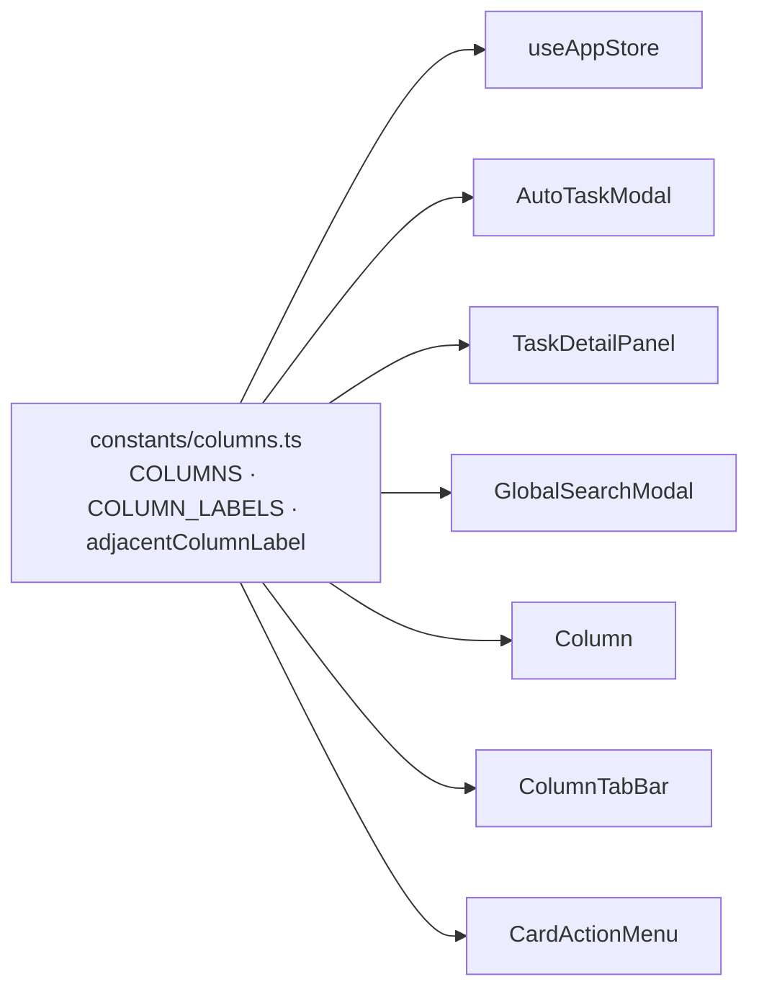

# Blueprint — Dedupe kanban column-label constants

**Feature:** `dedupe-column-labels` · **Type:** tech-debt / refactor · **Stage:** Architecture
**Scope:** frontend-only, no API change, no data-model change, no visual change.

---

## 1. Requirements Summary

### Functional
- FR-1: A single module is the authoritative source for kanban column **ids order** (`COLUMNS`) and **display labels** (`COLUMN_LABELS`).
- FR-2: All seven files listed in ADR-1 import from that module instead of re-declaring the map/array.
- FR-3: Rendered UI is byte-for-byte identical before and after (labels, order, badges, drop-downs, move-direction tooltips).

### Non-functional
- NFR-1 (Maintainability): a label rename requires editing exactly **one** file.
- NFR-2 (Type safety): `COLUMN_LABELS` is typed `Record<Column, string>` so an incomplete map is a **compile error**.
- NFR-3 (Zero behavior change): existing unit tests pass unmodified; coverage ≥ existing.
- NFR-4 (No scope creep): presentation-only maps (`accentClass`, `colIndex`, `COLUMN_COLORS`) stay in their components.

### Constraints
- Stack: React 19 + TypeScript (`strict: true`, `noUncheckedIndexedAccess` **off**) + Vite + Zustand.
- Import alias `@/` → `frontend/src/` (already used everywhere, e.g. `@/types`).
- Tests: Vitest + React Testing Library (`cd frontend && npm test`).

---

## 2. Key Trade-offs

### TO-1 — Home for the constants: `constants/columns.ts` vs `types/index.ts`
- **A. New `frontend/src/constants/columns.ts`** — clean separation of runtime values from type declarations; establishes a reusable convention. *Con:* one new file/directory.
- **B. Append to `types/index.ts`** — no new file; already imported widely. *Con:* pollutes the pure type-declaration module with runtime values.
- **Recommendation: A.** Values ≠ types; keep the types file value-free. Low cost, cleaner long-term.

### TO-2 — `CardActionMenu` directional labels: derive vs keep local
- **A. Derive** `LEFT_LABEL`/`RIGHT_LABEL` from `(COLUMNS, COLUMN_LABELS)` via a helper. Drift-proof — a rename propagates automatically. *Con:* a tiny helper function to review.
- **B. Keep the two literal maps** in `CardActionMenu`. *Con:* leaves two more hidden copies of the label strings — exactly the drift the task exists to kill.
- **Recommendation: A.** The whole point is to make drift impossible.

### TO-3 — `COLUMNS` element mutability: `readonly Column[]` vs `Column[]`
- **A. `readonly Column[]`** (`as const`-friendly) — signals immutability, prevents accidental `.push`. Works with `.indexOf`, `.map`, `.find`, index access. *Con:* a call site doing in-place mutation would break (there are none).
- **B. `Column[]`** — matches today's local declarations verbatim. *Con:* mutable shared singleton.
- **Recommendation: A** (`readonly`). All current uses are read-only (`indexOf`, indexed access, `map`, `find`). Note: with `noUncheckedIndexedAccess` **off**, `COLUMNS[idx - 1]` stays typed `Column`, so `useAppStore`'s move logic needs no cast.

---

## 3. Design

### 3.1 New module — `frontend/src/constants/columns.ts`
Single responsibility: authoritative column ids, order, and display labels.

```ts
import type { Column } from '@/types';

/**
 * Ordered kanban columns, left → right. The single source of truth for
 * column order. Iterate this for rendering; use indexOf for move logic.
 */
export const COLUMNS: readonly Column[] = ['todo', 'in-progress', 'done'] as const;

/**
 * Human-readable display label for each column. The single source of truth
 * for column labels — the one place a rename or i18n pass edits.
 * Typed Record<Column, string> so the map stays exhaustive at compile time.
 */
export const COLUMN_LABELS: Record<Column, string> = {
  'todo':        'Todo',
  'in-progress': 'In Progress',
  'done':        'Done',
};

/**
 * Label of the column adjacent to `column` in the given direction,
 * or undefined at a board edge (left of 'todo' / right of 'done').
 * Used for move-left / move-right button tooltips.
 */
export function adjacentColumnLabel(
  column: Column,
  direction: 'left' | 'right',
): string | undefined {
  const idx = COLUMNS.indexOf(column);
  const target = COLUMNS[direction === 'left' ? idx - 1 : idx + 1];
  return target ? COLUMN_LABELS[target] : undefined;
}
```

### 3.2 Per-file migration map

| # | File | Remove | Replace with |
|---|------|--------|--------------|
| 1 | `stores/useAppStore.ts` | local `COLUMNS` (l.66) + `COLUMN_LABELS` (l.68–72) | `import { COLUMNS, COLUMN_LABELS } from '@/constants/columns';` — move logic (l.807–813) unchanged |
| 2 | `components/AutoTaskModal.tsx` | local `COLUMN_LABELS` (l.41–45) + `COLUMNS` (l.47) | import both; `<option>` map (l.284) unchanged |
| 3 | `components/board/TaskDetailPanel.tsx` | local `COLUMN_LABELS` (l.72–76) + inline `columns` literal (l.83) | import both; use `COLUMNS` in `findTaskColumn` |
| 4 | `components/modals/GlobalSearchModal.tsx` | local `COLUMN_LABELS` (l.24–28) | import `COLUMN_LABELS`; index as `COLUMN_LABELS[column as Column] ?? column` (keep fallback). **Keep `COLUMN_COLORS` local** (presentation, out of scope) |
| 5 | `components/board/Column.tsx` | the three `label:` literals inside `COLUMN_META` (l.16–18) | build `COLUMN_META` from `COLUMN_LABELS` — see §3.3. **Keep `accentClass`/`colIndex`** |
| 6 | `components/board/ColumnTabBar.tsx` | literal `TABS` array (l.10–14) | `const TABS = COLUMNS.map((column) => ({ column, label: COLUMN_LABELS[column] }));` |
| 7 | `components/board/CardActionMenu.tsx` | `LEFT_LABEL` (l.16–19) + `RIGHT_LABEL` (l.22–25) | import `adjacentColumnLabel`; `adjacentColumnLabel(column, 'left')` / `(column, 'right')` at the call sites |

### 3.3 `Column.tsx` — keeping presentation local while sourcing the label
```ts
import { COLUMN_LABELS } from '@/constants/columns';
import type { Column as ColumnType } from '@/types';

// accentClass/colIndex are presentation-only and stay here; label comes from the shared map.
const COLUMN_META: Record<ColumnType, { label: string; accentClass: string; colIndex: number }> = {
  'todo':        { label: COLUMN_LABELS['todo'],        accentClass: '',                          colIndex: 0 },
  'in-progress': { label: COLUMN_LABELS['in-progress'], accentClass: 'border-l-2 border-l-primary', colIndex: 1 },
  'done':        { label: COLUMN_LABELS['done'],        accentClass: 'border-l-2 border-l-success', colIndex: 2 },
};
```

### 3.4 Out of scope (explicitly NOT changed)
- `GlobalSearchModal.COLUMN_COLORS` — badge color classes, presentation.
- `Column.tsx` `accentClass` / `colIndex` — presentation / layout.
- `CardActionMenu` `showLeft/showRight/showRunAgent` edge logic — unaffected.
- `types/index.ts` `Column` type — unchanged (remains the type source of truth).
- Backend / API / DB — nothing touched. Column ids on the wire are unchanged.

### 3.5 Data flow (unchanged at runtime)


---

## 4. Verification Strategy
- `cd frontend && npx tsc --noEmit` — must pass (exhaustiveness of `Record<Column, string>` is the key guard).
- `cd frontend && npm test` — all existing suites green, unmodified (esp. `useAppStore.*.test.ts` move-direction tests, and any `CardActionMenu` / `GlobalSearchModal` tests).
- Manual/visual (or existing component tests): board headers, mobile tab bar, ⌘K search badges, AutoTask column dropdown, card move-tooltips, TaskDetailPanel column selector all render identical labels in identical order.
- Grep gate: after the change, `grep -rn "'In Progress'" frontend/src` returns **exactly one** hit (`constants/columns.ts`). Same for the `['todo', 'in-progress', 'done']` literal ordered array (only `constants/columns.ts` and the `Column` type union should remain).

---

## 5. Observability
N/A — pure frontend constant refactor, no new runtime paths, no logging/metrics/traces surface. The "monitor" here is the type-checker (exhaustive `Record<Column, string>`) and the grep gate in §4.

---

## 6. Open Questions / Risks
- **None blocking.** The only judgment call — whether to also derive `CardActionMenu` and `ColumnTabBar` labels — is resolved in favor of deriving (TO-2), because leaving them as literals defeats the task's purpose. If the reviewer prefers a minimal 4-file change, tasks T-006/T-007 can be dropped without affecting T-001..T-005; note it as a deviation.
