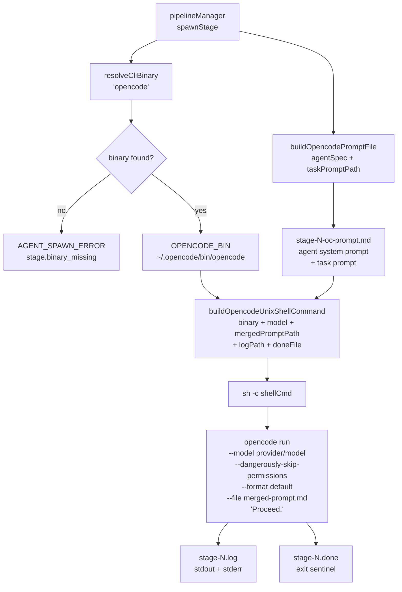
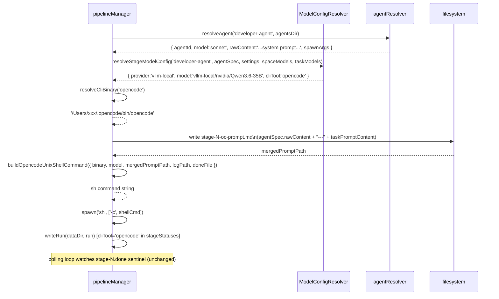

# Blueprint: opencode CLI Adapter — Per-Stage GB10 Model Routing (MODEL-2)

---

# REQUIREMENTS SUMMARY

## Functional Requirements

| # | Requirement |
|---|-------------|
| FR1 | A stage configured with `cliTool: 'opencode'` spawns using `~/.opencode/bin/opencode` instead of claude |
| FR2 | `opencode run` receives the agent system prompt + task prompt as a merged file (via `-f`) |
| FR3 | `--dangerously-skip-permissions` is passed so opencode never prompts the user interactively |
| FR4 | `--model <provider>/<model>` is passed, where `model` comes from the resolved `stageModels` config |
| FR5 | Stage output (stdout + stderr) is captured to the existing `stage-N.log` |
| FR6 | The done-sentinel (`stage-N.done`) is written on exit — same polling mechanism as claude |
| FR7 | `stageStatuses[i].cliTool` records `'opencode'` in `run.json` (already written by MODEL-1 code) |
| FR8 | `VALID_CLI_TOOLS` and `VALID_PROVIDERS` in `modelConfigResolver.js` accept `'opencode'` |
| FR9 | Config validation rejects `cliTool: 'opencode'` without a `provider/model` formatted model string |
| FR10 | claude stages are unchanged — no regression |
| FR11 | run history log viewer renders opencode output without code changes (plain text, `--format default`) |

## Non-Functional Requirements

| # | Requirement |
|---|-------------|
| NFR1 | OPENCODE_BIN resolution fails gracefully: `AGENT_SPAWN_ERROR` + `stage.binary_missing` log event, not a server crash |
| NFR2 | Merged-prompt file written to `data/runs/<runId>/stage-N-oc-prompt.md` (inspectable post-run) |
| NFR3 | No changes to MODEL-1 code paths — only additive extensions |
| NFR4 | All existing tests continue to pass |

## Constraints

| Constraint | Value / Note |
|------------|--------------|
| opencode bin | `~/.opencode/bin/opencode v1.17.10` |
| Provider config | Lives in `~/.config/opencode/opencode.jsonc` — Prism does NOT manage it |
| Model format for opencode | `<provider-id>/<model-id>` (e.g. `vllm-local/nvidia/Qwen3.6-35B-A3B-NVFP4`) |
| Prompt injection | `-f <merged-prompt-file>` + brief positional message. No stdin injection. |
| Output format | `--format default` (human-readable plain text, compatible with existing log viewer) |
| Permissions | `--dangerously-skip-permissions` required for all unattended opencode runs |
| ARG_MAX safety | Merged prompt written to file, never passed inline as shell arg |

---

# TRADE-OFFS

## 1. Prompt injection: merged file (`-f`) vs inline positional arg

**Option A — Merged-prompt file + `-f`**:
Write agent system prompt + task prompt to `stage-N-oc-prompt.md`. Invoke:
```
opencode run --file stage-N-oc-prompt.md "Proceed."
```
Pros: ARG_MAX safe (prompts can be 15 KB+). Inspectable post-run diagnostic artifact.
Consistent regardless of prompt size.
Cons: Extra disk write per opencode stage. The "Proceed." trigger message is a workaround
for opencode requiring a positional message arg.

**Option B — Shell substitution**: `opencode run "$(cat stage-N-prompt.md)"`.
Pros: Simpler code (one less file write).
Cons: macOS ARG_MAX (~256 KB total env+args). Folio-enriched prompts + git diffs can
exceed safe single-arg limits. Debugging requires reading the .md file manually.

**Recommendation: Option A.** ARG_MAX safety is non-negotiable for production-quality
pipeline orchestration.

---

## 2. Binary resolution: startup probe vs lazy (spawn-time) probe

**Option A — Startup probe** (same as CLAUDE_BIN): resolve OPENCODE_BIN once when
pipelineManager module loads. Fail fast if opencode is missing.
Pros: Consistent with existing CLAUDE_BIN pattern. Error is visible at server start.
Cons: Server refuses to start if opencode is not installed, even if no stage uses it.
This is unacceptable — opencode is optional.

**Option B — Lazy resolution**: resolve OPENCODE_BIN on first `spawnStage()` call that
needs it (or on each call). Cache the result after the first probe.
Pros: Server starts normally without opencode installed. Error surfaces only when an
opencode stage is actually requested.
Cons: Slightly more complex (needs a cached lazy resolver).

**Recommendation: Option B (lazy, cached).** opencode is optional infrastructure.
The error path (`AGENT_SPAWN_ERROR`) is already well-defined in MODEL-1.

---

## 3. Agent role mapping: merged-prompt file vs opencode `--agent` registry

**Option A — Merged-prompt file**: Prepend agent .md system prompt content to the
stage task prompt. Pass to opencode as a single context file.
Pros: One source of truth (the .md files). No parallel agent registry to maintain.
The full agent persona is visible in the merged file.
Cons: Role is mixed into the "user message" context rather than a proper system prompt.
Some models may weight system prompts differently from user context.

**Option B — opencode `--agent`**: Create opencode agent definitions mirroring claude's
.md files. Pass `--agent <opencode-agent-id>` at spawn time.
Pros: Uses opencode's native role mechanism; model sees a real system prompt.
Cons: Requires maintaining a parallel agent registry in opencode's format. Out of sync
with Prism's .md updates. User setup burden.

**Recommendation: Option A.** The Prism pipeline already builds a highly structured
prompt that includes the role context (via `## KANBAN INSTRUCTIONS`, folio blocks, etc.).
Modern instruction-tuned models follow role instructions in the user message. Option B
is available as a future opt-in if a specific model needs it.

---

# ARCHITECTURAL BLUEPRINT

## 3.1 Core Components

| Component | Responsibility | Technology | Change Type |
|-----------|---------------|------------|-------------|
| `ModelConfigResolver` | Accept `'opencode'` in VALID_CLI_TOOLS; accept open provider strings | Node.js (CJS) | **Modify** — widen allowed values |
| `OPENCODE_BIN` | Lazy-cached binary path for opencode | `pipelineManager.js` | **Add** — new module-level let |
| `resolveCliBinary(cliTool)` | Return resolved binary path for claude or opencode; throw `BinaryNotFoundError` if missing | `pipelineManager.js` | **Add** — new helper |
| `buildOpencodePromptFile(agentSpec, taskPromptPath, runDir, stageIndex)` | Write merged agent system prompt + task prompt to `stage-N-oc-prompt.md`, return path | `pipelineManager.js` | **Add** — new helper |
| `buildOpencodeUnixShellCommand(opts)` | Build sh command for opencode: EXIT-trap sentinel + `opencode run --model ... --dangerously-skip-permissions --format default --file <merged> "Proceed."` | `pipelineManager.js` | **Add** — new helper |
| `buildOpencodeWindowsShellCommand(opts)` | Same for Windows cmd.exe | `pipelineManager.js` | **Add** — new helper |
| `pipelineManager.spawnStage()` | Branch at MODEL-2 TODOs (lines 1595, 1611): `cliTool === 'opencode'` path | `pipelineManager.js` | **Modify** — the two MODEL-2 TODOs only |

**No frontend changes required.** The MODEL-1 frontend already accepts user-supplied
values for `cliTool` and `model`. The widened VALID_CLI_TOOLS list surfaces automatically
via the settings validation API. The log viewer renders plain text from `stage-N.log`
unchanged.

## 3.2 Data Flows and Sequences

### C4 Context: opencode stage spawn



### Sequence: opencode stage spawn



### Shell command anatomy (Unix)

```sh
# Variables and EXIT trap — identical to claude path
_DONE=/path/to/stage-1.done
_EXIT=1
trap '[ -e "$_DONE" ] || echo $_EXIT > "$_DONE"' EXIT

# opencode invocation — new for MODEL-2
~/.opencode/bin/opencode run \
  --model vllm-local/nvidia/Qwen3.6-35B-A3B-NVFP4 \
  --dangerously-skip-permissions \
  --format default \
  --file /path/to/stage-1-oc-prompt.md \
  'Proceed.' \
  >> /path/to/stage-1.log 2>&1

_EXIT=$?
```

### Merged-prompt file layout

```
stage-N-oc-prompt.md
─────────────────────────────────────
<agent system prompt content>
(full text from agentSpec.rawContent,
 i.e. the .md file body below frontmatter)

---

<task prompt content>
(full content of stage-N-prompt.md,
 including KANBAN block, Git context,
 Folio context, and INSTRUCTIONS)
─────────────────────────────────────
```

### Settings schema (unchanged from MODEL-1, now with opencode example)

```jsonc
// data/settings.json
{
  "pipeline": {
    "stageModels": {
      "senior-architect": {
        "provider": "claude",
        "model": "claude-opus-4-5",
        "cliTool": "claude"
      },
      "developer-agent": {
        "provider": "vllm-local",
        "model": "vllm-local/nvidia/Qwen3.6-35B-A3B-NVFP4",
        "cliTool": "opencode"
      },
      "qa-engineer-e2e": {
        "provider": "vllm-local",
        "model": "vllm-local/nvidia/Qwen3.6-35B-A3B-NVFP4",
        "cliTool": "opencode"
      }
    }
  }
}
```

## 3.3 APIs and Interfaces

### resolveCliBinary(cliTool) — new helper in pipelineManager.js

```js
/**
 * Lazily resolve the absolute binary path for a given cliTool.
 * Caches the result after the first successful resolution.
 *
 * @param {'claude'|'opencode'|'custom'} cliTool
 * @returns {string}  Absolute path to the binary.
 * @throws {Error}    If the binary cannot be found (message: 'BINARY_NOT_FOUND:<cliTool>').
 */
function resolveCliBinary(cliTool)
```

Resolution order for `'opencode'`:
1. `which opencode` (PATH lookup)
2. `~/.opencode/bin/opencode` (default install location)
3. Throw `Error('BINARY_NOT_FOUND:opencode')`

For `'claude'`: returns existing `CLAUDE_BIN` (already resolved at startup).

### buildOpencodePromptFile(agentSpec, taskPromptPath, runDir, stageIndex) — new helper

```js
/**
 * Write a merged prompt file for an opencode stage.
 * Content = agentSpec.rawContent + "\n\n---\n\n" + fs.readFileSync(taskPromptPath).
 *
 * @param {{ rawContent?: string }} agentSpec   - from agentResolver; rawContent is the .md body
 * @param {string}                  taskPromptPath  - absolute path to stage-N-prompt.md
 * @param {string}                  runDir      - absolute path to data/runs/<runId>/
 * @param {number}                  stageIndex  - stage index (for file naming)
 * @returns {string}  Absolute path to the written stage-N-oc-prompt.md
 */
function buildOpencodePromptFile(agentSpec, taskPromptPath, runDir, stageIndex)
```

Note: `agentSpec.rawContent` is the full text of the agent .md file (already loaded by
`resolveAgent()`). If absent (older agentResolver), fall back to the task prompt only.

### buildOpencodeUnixShellCommand(opts) — new helper

```js
/**
 * Build the Unix sh command string for an opencode stage.
 * Uses the same EXIT-trap sentinel pattern as buildUnixShellCommand.
 *
 * @param {{
 *   binary:          string,    // absolute path to opencode binary
 *   model:           string,    // provider/model string
 *   mergedPromptPath: string,   // absolute path to stage-N-oc-prompt.md
 *   logPath:         string,    // absolute path to stage-N.log
 *   doneFile:        string,    // absolute path to stage-N.done
 * }} opts
 * @returns {string}
 */
function buildOpencodeUnixShellCommand(opts)
```

Output:
```sh
_DONE=<doneFile>; _EXIT=1; trap '[ -e "$_DONE" ] || echo $_EXIT > "$_DONE"' EXIT; \
<binary> run --model <model> --dangerously-skip-permissions --format default \
--file <mergedPromptPath> 'Proceed.' >> <logPath> 2>&1; _EXIT=$?
```

### buildOpencodeWindowsShellCommand(opts) — new helper

Same opts as Unix variant. Uses `cmd.exe` invocation without EXIT trap (mirrors existing
`buildWindowsShellCommand` pattern):
```cmd
<binary> run --model <model> --dangerously-skip-permissions --format default --file <mergedPromptPath> "Proceed." >> <logPath> 2>&1 & set _EXIT=!ERRORLEVEL! & if not exist <doneFile> echo !_EXIT! > <doneFile> & exit /B 0
```

### validateStageModelConfig — modification to modelConfigResolver.js

Add `'opencode'` to `VALID_CLI_TOOLS`:
```js
const VALID_CLI_TOOLS = ['claude', 'opencode', 'custom'];
```

Widen `VALID_PROVIDERS` to include open-ended provider strings when `cliTool === 'opencode'`.
Strategy: keep `VALID_PROVIDERS` as a whitelist for `claude` only; for `opencode`, accept any
non-empty string (opencode providers are user-defined in `opencode.jsonc`).

New validation rule: if `cliTool === 'opencode'` and `model` is provided, the model string
MUST contain a `/` separator (enforcing `provider/model` format):
```js
if (config.cliTool === 'opencode' && 'model' in config) {
  if (!config.model.includes('/')) {
    errors.push('opencode model must be in <provider>/<model> format (e.g. vllm-local/nvidia/model-name).');
  }
}
```

### pipelineManager.spawnStage() modification

At the two MODEL-2 TODO locations, replace `CLAUDE_BIN` with:

```js
// Resolve binary for this stage's cliTool
let stageBinary;
try {
  stageBinary = resolveCliBinary(modelConfig.cliTool);
} catch (err) {
  // Binary not found — fail stage gracefully
  run.stageStatuses[stageIndex].status   = 'failed';
  run.stageStatuses[stageIndex].exitCode = -1;
  run.stageStatuses[stageIndex].finishedAt = new Date().toISOString();
  writeRun(dataDir, run);
  pipelineLog('stage.binary_missing', { runId: run.runId, stageIndex, agentId, cliTool: modelConfig.cliTool });
  return;
}

// Build shell command per cliTool
let child;
if (process.platform === 'win32') {
  const cmd = modelConfig.cliTool === 'opencode'
    ? buildOpencodeWindowsShellCommand({ binary: stageBinary, model: modelConfig.model, mergedPromptPath, logPath, doneFile })
    : buildWindowsShellCommand({ binary: stageBinary, finalArgs: effectiveArgs, promptPath: promptFilePath, logPath, doneFile });
  child = spawn('cmd.exe', ['/V:ON', '/C', cmd], { stdio: 'ignore', detached: true, env: { ...process.env } });
} else {
  const cmd = modelConfig.cliTool === 'opencode'
    ? buildOpencodeUnixShellCommand({ binary: stageBinary, model: modelConfig.model, mergedPromptPath, logPath, doneFile })
    : buildUnixShellCommand({ binary: stageBinary, finalArgs: effectiveArgs, promptPath: promptFilePath, logPath, doneFile });
  child = spawn('sh', ['-c', cmd], { stdio: 'ignore', detached: true, env: { ...process.env } });
}
```

`mergedPromptPath` is computed before the branch:
```js
const mergedPromptPath = modelConfig.cliTool === 'opencode'
  ? buildOpencodePromptFile(agentSpec, promptFilePath, runDir(dataDir, run.runId), stageIndex)
  : null;
```

## 3.4 Observability Strategy

### New structured log events

| Event | Fields |
|-------|--------|
| `stage.binary_missing` | runId, stageIndex, agentId, cliTool |
| `stage.binary_resolved` | runId, stageIndex, cliTool, binary (already in MODEL-1 blueprint; now actually emitted) |
| `stage.opencode_prompt_written` | runId, stageIndex, mergedPromptPath, bytes |

### stage-N.meta.json (unchanged schema)

The `cliTool: 'opencode'` field is already written by MODEL-1 code at line 1571.
The log viewer's `detect.js` already reads `meta.json`; no changes needed.

### Log viewer compatibility

`opencode run --format default` outputs markdown-like progress text — headers, tool
calls, and final response — to stdout. This is the same character class of output as
claude. The existing log viewer renders it as plain text. No changes required.

## 3.5 Deploy Strategy

**No infrastructure changes.** opencode is installed locally on the Mac; the pipeline
server runs on the same machine. Provider credentials live in `~/.config/opencode/opencode.jsonc`.

**Migration**: Existing settings.json files without opencode stageModels entries are
unchanged. The new `VALID_CLI_TOOLS` list only affects validation of new/updated configs.

**Release strategy**: Rolling (single-process Node.js).

**CI/CD**: Existing pipeline. The new tests in `tests/modelConfigResolver.test.js` and
`tests/pipelineManager.opencode.test.js` run as part of `npm test`. The PIPELINE_NO_SPAWN
env var guards integration-level spawn tests.

---

# ADR

See `ADR-2.md` in this directory.

---

# TASKS

See `tasks.json` in this directory.
