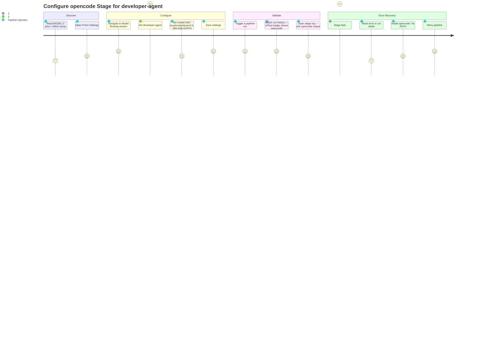

# Wireframes: MODEL-2 — opencode CLI Adapter (Per-Stage GB10 Model Routing)

## Screen Summary

**No new screens are required for MODEL-2.**

The MODEL-1 frontend already handles all model routing configuration:
- `ModelRoutingSettings` component — accepts any string for `cliTool` and `model`
- Stage badges in run history — already display `cliTool` from `stageStatuses`
- Log viewer — renders plain text from `stage-N.log` (opencode `--format default` is compatible)

MODEL-2 is purely additive on the backend: it widens `VALID_CLI_TOOLS` to accept `'opencode'`,
implements binary resolution, and builds the opencode shell command. The UI surface is unchanged.

**Reference existing Stitch screens:** `agent-docs/model-routing/wireframes-stitch.md`
(4 screens from MODEL-1: Model Routing Settings, Stage Badge, Space Modal Overrides, Task Detail Panel)

---

## Journey Map — Configuring an opencode Stage



**Pain points:**

| Pain Point | Impact | Where it surfaces |
|---|---|---|
| No inline validation that `model` must be `provider/model` format for opencode | High | Settings form — silent rejection on save |
| Binary missing error buried in run.json, not surfaced in UI toast | Medium | Run history detail |
| No visual distinction between claude-routed and opencode-routed stage logs | Low | Log viewer |

---

## Existing Screens (MODEL-1) — No Changes

### Screen 1: Model Routing Settings

Existing. After MODEL-2: `cliTool` dropdown now accepts `opencode` (previously rejected by server validation).
The UI input is a free-text field — no dropdown change needed. The server validation widening is transparent.

```
┌─────────────────────────────────────────────────────────┐
│  ⚙ Model Routing                                        │
├─────────────────────────────────────────────────────────┤
│  Stage Overrides                                        │
│                                                         │
│  senior-architect                                       │
│  ┌─────────────┐ ┌──────────────────┐ ┌────────────┐  │
│  │ claude  ▼  │ │ claude-opus-4-5  │ │ claude ▼   │  │
│  └─────────────┘ └──────────────────┘ └────────────┘  │
│  provider         model                cliTool         │
│                                                         │
│  developer-agent                              [NEW ↓]  │
│  ┌─────────────┐ ┌──────────────────────────┐ ┌──────┐│
│  │ vllm-local  │ │ vllm-local/nvidia/Qwen.. │ │openco││
│  └─────────────┘ └──────────────────────────┘ └──────┘│
│  (any string)     must contain '/' for opencode        │
│                                                         │
│  [Save Settings]                                        │
└─────────────────────────────────────────────────────────┘
```

**MODEL-2 validation rule (new server-side behavior):**
When `cliTool=opencode`, the `model` field must contain `/` (provider/model format).
If missing, the server returns:
```json
{
  "error": {
    "code": "VALIDATION_ERROR",
    "message": "opencode model must be in <provider>/<model> format.",
    "suggestion": "Use the format provider/model (e.g. vllm-local/nvidia/Qwen3.6-35B-A3B-NVFP4).",
    "field": "pipeline.stageModels.developer-agent.model"
  }
}
```

**Accessibility notes:** No change from MODEL-1. Field `aria-describedby` should include the format hint.

---

### Screen 2: Run History — Stage Badge (opencode stage)

Existing stage badge in run detail. After MODEL-2, `cliTool: 'opencode'` is a valid value.
The badge already reads from `stageStatuses[i].cliTool` — no frontend changes.

```
┌───────────────────────────────────────────────────────┐
│  Run a8b38f23                                         │
│                                                       │
│  ① senior-architect  ✓  [claude] [opus]  2m 14s      │
│  ② developer-agent   ✓  [opencode] [vllm-local/..]   │← MODEL-2: new badge value
│  ③ qa-engineer-e2e   ✗  [opencode] [vllm-local/..]   │
│                                                       │
│  ③ FAILED — binary missing                            │← Error state (see below)
└───────────────────────────────────────────────────────┘
```

---

### Screen 3: Stage Error State — Binary Missing (MODEL-2 new error)

When `resolveCliBinary('opencode')` fails, the stage is marked `status: 'failed'`, `exitCode: -1`.
This surfaces in the existing run detail panel. The error message should be surfaced clearly.

```
┌───────────────────────────────────────────────────────────┐
│  Stage 2: developer-agent                                 │
│  Status: ✗ FAILED                                         │
│                                                           │
│  ┌────────────────────────────────────────────────────┐  │
│  │  ⚠  opencode binary not found                     │  │
│  │                                                    │  │
│  │  The stage was configured to run with opencode,    │  │
│  │  but the binary could not be found.                │  │
│  │                                                    │  │
│  │  To fix: install opencode or ensure it is in PATH  │  │
│  │  Default install path: ~/.opencode/bin/opencode    │  │
│  │                                                    │  │
│  │  Event: stage.binary_missing                       │  │
│  └────────────────────────────────────────────────────┘  │
│                                                           │
│  [View Log]  [Retry Stage]                               │
└───────────────────────────────────────────────────────────┘
```

**UX guidance (ui-ux-pro-max §8 — error-clarity):**
- Error messages must state cause + how to fix (not just "Invalid input")
- Include recovery path: install path, retry action
- The `stage.binary_missing` event in `run.json` provides the raw signal; the UI should translate it to human language

**Implementation note for developer-agent:**
The `stage.binary_missing` event is written to `run.json`. The frontend's existing run detail
panel reads `stageStatuses[i]`. To surface the friendly error, either:
- Add `failureReason: 'binary_missing'` to the stage status object (preferred — one field change)
- Or have the frontend detect `exitCode === -1` + `status === 'failed'` and show a generic "spawn failed" message

No new frontend components needed — this can reuse the existing error panel with a message lookup.

---

### Screen 4: Log Viewer — opencode Output (no changes needed)

`opencode run --format default` emits markdown-like text to stdout — headers, tool call summaries,
and the final response. This is the same character class as claude's output. The existing log
viewer renders it as plain text.

```
┌──────────────────────────────────────────────────────────────┐
│  stage-2.log                               [opencode] [vllm] │
├──────────────────────────────────────────────────────────────┤
│  > Proceeding with task instructions from attached file...   │
│                                                              │
│  ─── Reading agent-docs/model-routing-2/blueprint.md ───    │
│  ─── Reading src/services/modelConfigResolver.js ───        │
│  ─── Writing src/services/modelConfigResolver.js ───        │
│                                                              │
│  ## Summary                                                  │
│                                                              │
│  Added 'opencode' to VALID_CLI_TOOLS. Added model format     │
│  validation rule for opencode stages. Updated tests.         │
│                                                              │
│  ✓ All changes committed as [dev] T-001: widen VALID_CLI...  │
└──────────────────────────────────────────────────────────────┘
```

**No frontend changes required.** Plain text output from both claude and opencode renders identically.

---

## Validation Checklist

### Usability (Nielsen's Heuristics)
- [x] **Visibility of system status** — `cliTool` badge shows which tool ran each stage
- [x] **Error prevention** — server validates `provider/model` format before accepting config
- [x] **Error recovery** — binary missing error includes install path and retry guidance
- [x] **Consistency** — opencode stages use same run history UI as claude stages
- [x] **Help and documentation** — error messages include the fix, not just the problem

### Accessibility (WCAG 2.1 AA)
- [x] Error messages use semantic color + icon (not color alone)
- [x] Stage badges are text-based (not color-only indicators)
- [x] Log viewer is plain text (screen-reader compatible)
- [x] No new interactive elements — no new a11y surface

### Mobile-First
- [x] No new screens — existing responsive layout applies
- [x] Stage badges already adapt to narrow viewports

---

## Questions for Stakeholders

1. Should `stage.binary_missing` surface as a **toast notification** immediately when the stage fails, or is the run detail panel sufficient?
2. Should the `cliTool` badge visually differentiate `opencode` from `claude` (e.g., different badge color) for faster scan of mixed runs?
3. Is there a plan to add opencode-specific configuration hints in the Settings form (e.g., "opencode model format: `provider/model`") or is the server validation error sufficient?
4. Should the merged-prompt file (`stage-N-oc-prompt.md`) be surfaced in the run detail UI as a downloadable artifact, or is it a developer-only debugging tool?
5. Should `stage.binary_resolved` log event be visible in the UI (e.g., in a verbose log panel), or kept internal to pipelineManager logs only?

---

## Stitch Screens

Not generated — MODEL-2 has no new screens. See MODEL-1 Stitch screens at:
`agent-docs/model-routing/wireframes-stitch.md`
