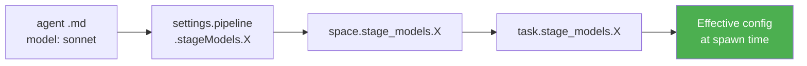

# Blueprint: Per-Stage Model and Provider Routing (MODEL-1)

---

# REQUIREMENTS SUMMARY

## Functional Requirements

| # | Requirement |
|---|-------------|
| FR1 | A stage can declare `{ provider, model, cliTool }` in `settings.pipeline.stageModels[agentId]` |
| FR2 | A space can override `stageModels[agentId]` for any of its pipeline stages |
| FR3 | A task can override `stageModels[agentId]` for any stage in its run |
| FR4 | Override resolution order: task > space > settings > agent frontmatter default |
| FR5 | pipelineManager passes the resolved model to the CLI at spawn time |
| FR6 | Each `stageStatuses[i]` in `run.json` records `{ model, provider, cliTool }` at spawn |
| FR7 | A stage can use a different `cliTool` (binary) from global settings |
| FR8 | The Settings UI exposes per-stage model selectors with model presets |
| FR9 | The Space settings UI exposes per-stage model overrides |
| FR10 | The Task details UI exposes per-stage model overrides (via task.stageModels) |

## Non-Functional Requirements

| # | Requirement |
|---|-------------|
| NFR1 | Zero breaking changes: existing settings.json, runs, and agent .md files work unchanged |
| NFR2 | If `stageModels[agentId]` is absent, behavior is identical to today (agent frontmatter model) |
| NFR3 | ModelConfigResolver is a pure function (no I/O) — fully unit-testable |
| NFR4 | Model override must not require restarting the server |
| NFR5 | Binary resolution errors (unknown cliTool, missing binary) surface as `AGENT_SPAWN_ERROR` |

## Constraints

| Constraint | Value / Note |
|------------|--------------|
| Node.js | v23.9.0 (ESM not used in backend — CommonJS) |
| Storage | SQLite via better-sqlite3 — atomic column additions via `ALTER TABLE ADD COLUMN IF NOT EXISTS` pattern |
| CLI tools | `claude` fully supported in MODEL-1; opencode/custom adapted interface but not implemented |
| Schema | `deepMergeSettings` must be extended to 3 levels for `pipeline.stageModels` |
| Backward compat | `stageModels` defaults to `{}` — NULL column on spaces/tasks reads as empty |

---

# TRADE-OFFS

## 1. Model injection: `--model` flag vs headless mode fallback

**Option A — `--model` flag in subagent mode** (`claude --agent X --model Y`): minimal change to
spawnArgs. Risk: Claude Code CLI may let the agent's frontmatter model take precedence over the
flag (undocumented behavior).

**Option B — Switch to headless mode for overridden stages** (`claude -p <prompt> --model Y`):
headless mode explicitly passes model and system prompt; override is guaranteed. Cost: headless
loses the agent's tool permissions setup that subagent mode provides automatically.

**Recommendation: Option A with documented escape-hatch to Option B.**  
Try `--model` flag first (simplest); if testing (T-002) shows the flag is ignored in subagent
mode, CliAdapter's `claude` implementation switches affected stages to headless mode. The
CliAdapter interface hides this from pipelineManager.

---

## 2. Inheritance granularity: per-agentId map vs per-run override block

**Option A — Per-agentId map** (`stageModels: { "developer-agent": { model: "X" } }`): users
configure by agent role, not by stage index. Works correctly when stages are injected mid-run
(loop injections) because the agent ID is stable.

**Option B — Per-index array** (`stageModelOverrides: [null, { model: "X" }, null, ...]`):
mirrors the `stages` array exactly but breaks when stages are injected or reordered.

**Recommendation: Option A (per-agentId map).** Stage indexes are positional and fragile;
agent IDs are semantic and stable. The resolver maps agentId → config at spawn time.

---

## 3. Settings UI: JSON file editor (existing) vs structured form

**Option A — Raw JSON editing** (existing ConfigEditor.tsx): zero new UI, model routing is just
another JSON key. Users must know the schema.

**Option B — Structured form** (new ModelRoutingSettings React component): radio-button presets,
model dropdowns, inline help. Higher implementation cost; better discoverability.

**Recommendation: Option B (structured form).** The spec explicitly requires "selector de modelo
por etapa con presets". The raw editor remains available as a fallback, but the dedicated UI
is the primary surface. JSON editing is the escape hatch for power users.

---

# ARCHITECTURAL BLUEPRINT

## 3.1 Core Components

| Component | Responsibility | Technology | Scaling |
|-----------|---------------|------------|---------|
| `ModelConfigResolver` | Pure function: collapse inheritance chain into effective `{ provider, model, cliTool }` per agentId. No I/O. | Node.js (CJS) | Stateless — O(1) per call |
| `CliAdapter` | Abstract interface + `claude` implementation: build the shell command string for a given `{ cliTool, binary, finalArgs, promptPath, logPath, doneFile }`. One class per tool. | Node.js (CJS) | Stateless — one instance per tool type |
| `pipelineManager` (modified) | At `spawnStage()`: resolve model config, obtain CliAdapter, inject `--model`, record in stageStatuses. | Existing | Unchanged |
| `settings.js` (modified) | Add `pipeline.stageModels` to `DEFAULT_SETTINGS`; extend `deepMergeSettings` to 3 levels for that path; add validation. | Existing | Unchanged |
| `store.js` (modified) | Add `stage_models TEXT` column to `spaces` and `tasks` tables (nullable JSON). Add read/write helpers. | SQLite | Unchanged |
| `ModelRoutingSettings.tsx` | React component: per-stage model selector with preset options. Reads `settings.pipeline.stageModels`, writes via `PUT /api/v1/settings`. | React 19 + Zustand | Client-side |
| Space settings overlay | Per-space `stageModels` override fields inside existing space edit modal. | React 19 | Client-side |
| Task stageModels picker | Per-task `stageModels` override (collapsible section in task detail). | React 19 | Client-side |

## 3.2 Data Flows and Sequences

### C4 Context: model resolution at stage spawn

```mermaid
graph TD
  A[pipelineManager\nspawnStage] --> B[ModelConfigResolver\nresolveStageModelConfig]
  B --> C[settings.json\npipeline.stageModels]
  B --> D[SQLite spaces.stage_models\n per-space override]
  B --> E[SQLite tasks.stage_models\n per-task override]
  B --> F[agentSpec.model\n agent .md frontmatter default]
  B --> G[Effective config\n{ provider, model, cliTool }]
  G --> H[CliAdapter\nbuildShellCommand]
  H --> I[sh -c shellCmd]
  G --> J[stageStatuses[i]\nmodel + provider + cliTool]
  J --> K[run.json]
```

### Sequence: stage spawn with model override

```mermaid
sequenceDiagram
  participant PM as pipelineManager
  participant MCR as ModelConfigResolver
  participant AR as agentResolver
  participant ST as store
  participant CA as CliAdapter(claude)
  participant SH as sh

  PM->>AR: resolveAgent(agentId, agentsDir)
  AR-->>PM: { agentId, model:"sonnet", spawnArgs }

  PM->>ST: getSpace(spaceId).stageModels
  ST-->>PM: { "developer-agent": { model:"X" } } | null

  PM->>ST: getTask(spaceId, taskId).stageModels
  ST-->>PM: null | { "developer-agent": { model:"Y" } }

  PM->>PM: readSettings(dataDir).pipeline.stageModels

  PM->>MCR: resolveStageModelConfig(agentId, agentSpec, settings, spaceModels, taskModels)
  MCR-->>PM: { provider:"claude", model:"claude-opus-4-5", cliTool:"claude" }

  PM->>PM: inject --model claude-opus-4-5 into finalArgs
  PM->>PM: write model/provider/cliTool to stageStatuses[i]

  PM->>CA: buildShellCommand({ binary:CLAUDE_BIN, finalArgs, promptPath, logPath, doneFile })
  CA-->>PM: "DONE=...; _EXIT=1; trap ... claude --agent X --model claude-opus-4-5 < prompt >> log"

  PM->>SH: spawn('sh', ['-c', shellCmd])
  PM->>PM: writeRun(dataDir, run)  [model info in stageStatuses]
```

### Settings schema (after MODEL-1)

```
settings.json
└── pipeline
    └── stageModels                    ← NEW
        ├── "senior-architect"
        │   ├── provider: "claude"
        │   ├── model:    "claude-opus-4-5"
        │   └── cliTool:  "claude"
        ├── "developer-agent"
        │   ├── provider: "claude"
        │   ├── model:    "claude-sonnet-4-5"
        │   └── cliTool:  "claude"
        └── "folio-consolidator"
            ├── provider: "ollama"
            ├── model:    "qwen2.5-coder:32b"
            └── cliTool:  "opencode"       ← resolved later (MODEL-2)
```

### Override inheritance diagram



## 3.3 APIs and Interfaces

### ModelConfigResolver (pure module)

```
// src/services/modelConfigResolver.js

/**
 * @typedef {{ provider: string, model: string, cliTool: string }} StageModelConfig
 */

/**
 * Resolve effective model config for a stage.
 *
 * @param {string} agentId                                - e.g. 'senior-architect'
 * @param {{ model: string }}  agentSpec                 - from agentResolver (frontmatter default)
 * @param {object}             settings                  - full settings object from readSettings()
 * @param {Record<string, StageModelConfig>|null} spaceModels  - space.stage_models (parsed JSON)
 * @param {Record<string, StageModelConfig>|null} taskModels   - task.stage_models (parsed JSON)
 * @returns {StageModelConfig}
 */
function resolveStageModelConfig(agentId, agentSpec, settings, spaceModels, taskModels)

/**
 * Validate a StageModelConfig object.
 * Returns { valid: boolean, errors: string[] }
 */
function validateStageModelConfig(config)

VALID_PROVIDERS = ['claude', 'openai', 'ollama', 'custom']
VALID_CLI_TOOLS = ['claude', 'opencode', 'custom']
```

### CliAdapter interface + claude implementation

```
// src/services/cliAdapter.js

/**
 * Build the Unix shell command string for spawning a stage agent.
 *
 * @param {object} opts
 * @param {string} opts.binary       - Resolved binary path (e.g. /home/user/.local/bin/claude)
 * @param {string[]} opts.finalArgs  - Spawn args including --model, --permission-mode, etc.
 * @param {string} opts.promptPath   - Absolute path to stage-N-prompt.md
 * @param {string} opts.logPath      - Absolute path to stage-N.log
 * @param {string} opts.doneFile     - Absolute path to stage-N.done sentinel
 * @returns {string}  Shell command string safe to pass to spawn('sh', ['-c', cmd])
 */
function buildUnixShellCommand(opts)

/**
 * Build the Windows cmd.exe command string for spawning a stage agent.
 * (same signature as buildUnixShellCommand)
 */
function buildWindowsShellCommand(opts)

/**
 * Resolve the binary path for a given cliTool.
 * Falls back through known install locations.
 * Returns the path string, or throws if not found and no fallback.
 *
 * @param {'claude'|'opencode'|'custom'} cliTool
 * @param {string} [customBinary]  - settings.cli.binary (used when cliTool='custom')
 * @returns {string}
 */
function resolveCliBinary(cliTool, customBinary)
```

### Settings schema additions

```
PUT /api/v1/settings
Body (partial):
{
  "pipeline": {
    "stageModels": {
      "senior-architect": {
        "provider": "claude",
        "model": "claude-opus-4-5",
        "cliTool": "claude"
      }
    }
  }
}

Validation rules:
- provider: enum [claude, openai, ollama, custom]
- model: non-empty string (not validated against provider's model list — too dynamic)
- cliTool: enum [claude, opencode, custom]
- Unknown agentId keys: accepted (future-proof for custom agents)
```

### Space API extension

```
PUT /api/v1/spaces/:spaceId
Body (partial):
{
  "stageModels": {
    "developer-agent": { "provider": "claude", "model": "claude-sonnet-4-5", "cliTool": "claude" }
  }
}

GET /api/v1/spaces/:spaceId → includes stageModels field (null if not set)
```

### Task API extension

```
PUT /api/v1/tasks/:taskId  (or PATCH via kanban_update_task MCP)
Body (partial):
{
  "stageModels": {
    "senior-architect": { "provider": "claude", "model": "claude-opus-4-5", "cliTool": "claude" }
  }
}
```

### run.json stageStatuses schema (after MODEL-1)

```json
{
  "stageStatuses": [
    {
      "index":      0,
      "agentId":    "senior-architect",
      "status":     "completed",
      "exitCode":   0,
      "startedAt":  "2026-06-23T10:00:00.000Z",
      "finishedAt": "2026-06-23T11:23:00.000Z",
      "pid":        12345,
      "model":      "claude-opus-4-5",
      "provider":   "claude",
      "cliTool":    "claude"
    }
  ]
}
```

## 3.4 Observability Strategy

### Metrics (RED)
- `pipeline_stage_model` gauge label: `{ agentId, model, provider, cliTool }` — recorded
  once per stage start in `stage-N.meta.json` (already consumed by logMetrics aggregator).
- `stage-N.meta.json` gains `model`, `provider`, `cliTool` fields alongside existing `source`.

### Structured Logs
New log events in pipelineManager:

| Event | Fields |
|-------|--------|
| `stage.model_resolved` | runId, stageIndex, agentId, model, provider, cliTool, resolvedFrom (settings\|space\|task\|frontmatter) |
| `stage.binary_resolved` | runId, stageIndex, cliTool, binary, resolvedFrom |
| `stage.model_override_error` | runId, stageIndex, cliTool, error (when binary not found) |

### Distributed Traces
- `stage-N.meta.json` already used by `logMetrics/detect.js` to identify the log source. Extend
  it with model info so the metrics UI can show "Stage 0 used claude-opus-4-5 ($X tokens)".

### Suggested tools
Prometheus counter/gauge labels on `stage.model_resolved`; Grafana dashboard per-model cost
attribution (tokens × model price); existing `GET /api/v1/runs/:runId` already surfaces
`stageStatuses` with the new model fields.

## 3.5 Deploy Strategy (CI/CD and Cloud)

**No new infrastructure** — this is a pure application-level change.

CI/CD phases (existing):
1. Lint (`npm run lint`)
2. Backend unit tests (`npm test` — covers ModelConfigResolver, CliAdapter, settings handler)
3. Frontend tests (`cd frontend && npm test` — covers ModelRoutingSettings component)
4. Build (`cd frontend && npm run build`)
5. Deploy (existing path)

**SQLite migration**: the two `ALTER TABLE ADD COLUMN` statements are safe, additive, and
idempotent (guarded with `IF NOT EXISTS` or try/catch on `duplicate column` error, matching
the existing migration pattern in `store.js`). No data migration needed — `NULL` is the correct
default for spaces/tasks with no override.

**Release strategy**: rolling deploy (single-server; no blue/green needed).

**Infrastructure as code**: N/A (single-process Node.js, no cloud infra changes).

---

# ADR

See `ADR-1.md` in this directory.

---

# TASKS

See `tasks.json` in this directory.
