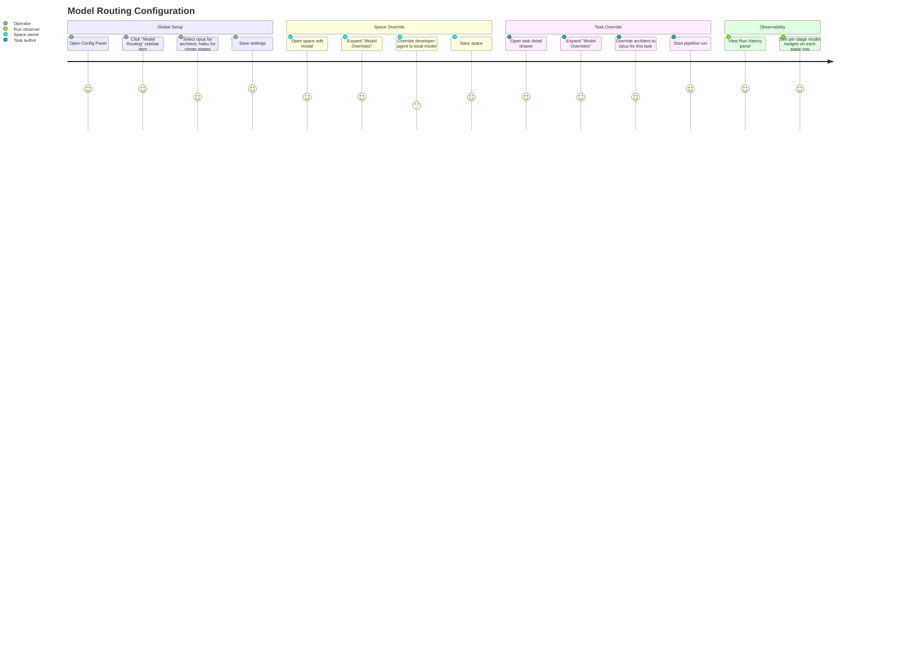

# Wireframes: MODEL-1 — Per-Stage Model Routing

## Screen Summary

| Screen | Task | Surface | Primary Actor |
|--------|------|---------|---------------|
| ModelRoutingSettings | T-006 | Config Panel → "Model Routing" sidebar item | Operator / Space owner |
| Space Model Overrides | T-007 | Space edit modal → "Model Overrides" section | Space owner |
| Task Model Override + Run Badges | T-008 | Task detail drawer + Run history panel | Task author / Run observer |

---

## User Journey Map



**Pain Points by Priority:**

| Pain Point | Impact | Addressed by |
|------------|--------|-------------|
| No way to change model without editing agent .md files | High | T-006 ModelRoutingSettings |
| Model is global — can't run cheap stages locally | High | T-001 inheritance chain |
| No record of which model ran each stage | High | T-004 stageStatuses.model |
| Override is buried — not discoverable in space or task UI | Medium | T-007 collapsible section |

---

## Screen 1: ModelRoutingSettings (T-006)

### Layout

```
┌────────────────────────────────────────────────────────────┐
│  ⚙ Configuration                                      [✕] │
├──────────────┬─────────────────────────────────────────────┤
│ GLOBAL       │  🧠 Model Routing          [GLOBAL]         │
│              │  Configure which AI model runs each stage.  │
│ › Model      │  ──────────────────────────────────────────│
│   Routing ◀  │                                             │
│ CLAUDE.md    │  ● senior-architect                         │
│ settings.json│  [opus-4-5 ▣] [sonnet-4-5] [haiku-4-5]    │
│              │  ┌─────────────────────────┐  [Clear]       │
│ AGENTS       │  │ claude-opus-4-5         │               │
│ senior-arch  │  └─────────────────────────┘               │
│ ux-api-des   │                                             │
│ developer    │  ● ux-api-designer                          │
│ code-review  │  [opus-4-5] [sonnet-4-5 ▣] [haiku-4-5]   [Clear]
│ qa-engineer  │                                             │
│              │  ● developer-agent                          │
│              │  [opus-4-5] [sonnet-4-5 ▣] [haiku-4-5]   [Clear]
│              │                                             │
│              │  ● code-reviewer                            │
│              │  [opus-4-5] [sonnet-4-5 ▣] [haiku-4-5]   [Clear]
│              │                                             │
│              │  ● qa-engineer-e2e                          │
│              │  [opus-4-5] [sonnet-4-5] [haiku-4-5 ▣]   [Clear]
│              │                                             │
│              │  ──────────────────────────────────────────│
│              │  [Save changes ▣]  [Reset to defaults]      │
│              │                                             │
│              │  ℹ Changes apply to next run only.          │
│              │    Existing runs are unaffected.            │
└──────────────┴─────────────────────────────────────────────┘
```

Legend: `▣` = active selection, `●` = agent color dot, `◀` = active sidebar item

### States

**Default:** Each stage row shows preset chips with the current model selected.
No expanded text input unless user clicks "custom...".

**Expanded row (custom model):** When no preset matches the saved model OR user clicks a preset chip to type, an input box appears below the chips showing the exact model string (e.g. `claude-opus-4-5`). Chips stay visible for quick switching.

**Loading (Save):** Save button shows spinner + disabled state. Row values are locked.

**Success (Save):** Brief toast "Model routing saved" (auto-dismiss 3s). Button reverts to normal.

**Error (Save 400):** Toast "Invalid model config — see settings.json". Row with the error gets a red border + error message below it.

**Empty (no stages configured):** Placeholder row "No pipeline stages configured. Add agents to see model options here."

### Accessibility Notes
- Each stage row is a `<fieldset>` with `<legend>` = agent name for screen-reader grouping.
- Preset chips are radio inputs (keyboard navigable with arrow keys).
- Custom input has `aria-label="Custom model for <agentId>"`.
- Clear button has `aria-label="Clear override for <agentId>"`.
- Save/Reset are standard `<button>` elements; Save has `aria-busy="true"` during loading.

### Mobile-First Notes
- Below 640px: preset chips stack vertically (2 per row). Provider dropdown collapses into a select.
- Text input becomes full-width below 640px.
- Stage rows gain 12px vertical padding for touch targets (≥44px total hit area).

---

## Screen 2: Space Edit Modal — Model Overrides (T-007)

### Layout

```
           ┌─────────────────────────────────────────┐
  backdrop │         Edit Space                 [✕]  │
           ├─────────────────────────────────────────┤
           │  Space name                              │
           │  ┌───────────────────────────────────┐  │
           │  │ Prism                             │  │
           │  └───────────────────────────────────┘  │
           │                                          │
           │  Pipeline                                │
           │  [senior-architect] [ux-api-designer]    │
           │  [developer-agent] [code-reviewer]       │
           │  [qa-engineer-e2e]                       │
           │                                          │
           │  ▼ Model Overrides          [2 overrides]│
           │  Override global settings for this space.│
           │  Inherited values shown as placeholders. │
           │  ─────────────────────────────────────  │
           │  ● senior-architect  claude  [opus-4-5]▣ [✕]│
           │  ● developer-agent   claude  [sonnet (global)]│
           │  ● qa-engineer-e2e   claude  [haiku (global)] │
           │  ─────────────────────────────────────  │
           │  [+ Add override]                        │
           │                                          │
           ├─────────────────────────────────────────┤
           │                  [Cancel]  [Save ▣]      │
           └─────────────────────────────────────────┘
```

### States

**Collapsed:** "Model Overrides" header shows `▶` chevron + "2 overrides" badge. Section body is hidden.

**Expanded (default):** `▼` chevron. Body shows compact table. Backdrop visible, modal scrollable.

**Inherited placeholder:** Model cells with no override show italic `text-secondary` placeholder text like "sonnet-4-5 (global)". No Clear (✕) button shown for unset rows.

**Override active:** Model input shows solid `text-primary` value. Clear (✕) button visible.

**`+ Add override`:** Clicking appends a new empty row with provider + model fields (agent dropdown auto-populates with unset agents first).

**Unsaved changes guard:** On modal close, if `stageModels` was mutated, shows DiscardChangesDialog (matches existing pattern in ConfigPanel).

### Accessibility Notes
- Collapsible section uses `<button aria-expanded="true/false">` + `aria-controls` pointing to the section body id.
- Override badge "2 overrides" uses `aria-label="2 model overrides active"`.
- Italic inherited values have `aria-label="<model> inherited from global settings"`.

---

## Screen 3a: Run History — Per-Stage Model Badge (T-008)

### Layout

```
┌──────────────────────────────────────┐
│ Run History                     [✕] │
├──────────────────────────────────────┤
│ ╔══════════════════════════════════╗ │
│ ║ ✓ MODEL-1 pipeline run    [4:23] ║ │
│ ║   15 min ago                  ▲  ║ │
│ ╠══════════════════════════════════╣ │
│ ║ ● Stage 1: senior-architect      ║ │
│ ║   Completed · 2:10    [opus-4-5] ║ │
│ ╠══════════════════════════════════╣ │
│ ║ ● Stage 2: ux-api-designer       ║ │
│ ║   Completed · 0:45  [sonnet-4-5] ║ │
│ ╠══════════════════════════════════╣ │
│ ║ ⟳ Stage 3: developer-agent       ║ │
│ ║   Running...        [sonnet-4-5] ║ │  ← animated spinner
│ ╠══════════════════════════════════╣ │
│ ║ ● Stage 4: code-reviewer         ║ │
│ ║   Pending           [haiku-4-5]  ║ │
│ ╚══════════════════════════════════╝ │
└──────────────────────────────────────┘
```

**Model badge:** Small `text-xs font-mono rounded-full bg-primary/15 text-primary px-2 py-0.5`.
Absent when `stageStatuses[i].model` is `undefined` (old runs — backward compat, no crash).

---

## Screen 3b: Task Detail Drawer — Model Overrides (T-008)

### Layout

```
┌──────────────────────────────────────────────┐
│ MODEL-1: Routing de modelo por etapa [feature]│
├──────────────────────────────────────────────┤
│ [Details ▣]  [Comments]  [Attachments]        │
├──────────────────────────────────────────────┤
│ ▶ Description (collapsed)                     │
│                                               │
│ Pipeline: senior-architect → ux → dev → ...  │
│                                               │
│ ▼ Model Overrides              [Task-level]   │
│   ─────────────────────────────────────────  │
│   ● senior-architect  [claude-opus-4-5 ▣]    │
│   ● developer-agent   [sonnet-4-5 (global)]  │
│              (italic text-secondary)          │
│   ─────────────────────────────────────────  │
│   [Save]  [Cancel]                            │
└──────────────────────────────────────────────┘
```

### Accessibility Notes (T-008)
- Model badge in run history row: `aria-label="Ran with model <model>"`.
- Old runs without model: badge is not rendered (no empty node, no `aria-label="undefined"`).

---

## Validation Checklist

- [x] All user journeys have clear start, middle, and end
- [x] Each screen has wireframe for default, error, and success states
- [x] Error messages are user-friendly (toast with suggestion, not raw 400)
- [x] Backward compat: old runs without `model` field show no badge (no crash)
- [x] Collapsible sections use `aria-expanded` + `aria-controls`
- [x] All inputs have visible labels / `aria-label`
- [x] Model badges use JetBrains Mono (font already loaded in index.html)
- [x] Touch targets ≥44px on mobile-first layout
- [x] Inherited values visually distinct (italic + text-secondary) vs. overrides (solid text-primary)
- [x] Save/Reset buttons follow existing `<Button variant="primary|ghost">` pattern

---

## Questions for Stakeholders

1. **Preset model list:** The current presets are hardcoded (`opus-4-5`, `sonnet-4-5`, `haiku-4-5`). Should the UI fetch available models from the CLI dynamically, or is the static preset list + free-text input sufficient for MODEL-1?

2. **Provider selector:** T-006 shows a provider dropdown (claude / openai / ollama / custom). In MODEL-1 only `claude` is wired end-to-end. Should the other providers be disabled with a "Coming in MODEL-2" tooltip, or fully hidden?

3. **Space override discoverability:** The "Model Overrides" section is placed below "Pipeline" in the space edit modal. Is this position expected, or should it appear on a separate "Advanced" tab to avoid cluttering the basic space edit flow?

4. **Badge in run history vs. full model name:** The badge shows short form (`opus-4-5`). Should hovering show the full model string (e.g., `claude-opus-4-5`) in a tooltip?

5. **MCP `kanban_update_task` for task stageModels:** Operators will likely set task-level overrides via the UI. Should we also expose this via a dedicated MCP tool `kanban_set_task_model_override`, or is passing `stageModels` inside the existing `kanban_update_task` description field sufficient?
