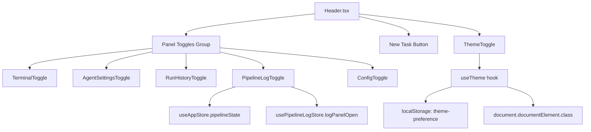

# Blueprint: Navbar Redesign — Panel Toggles con Texto + ThemeToggle Placement
## Proyecto: Prism Kanban
## Feature: navbar-redesign
## Última actualización: 2026-04-06

---

## 1. Resumen ejecutivo

El rediseño de la navbar de Prism tiene dos componentes:

1. **Panel toggles con texto** — Los 5 botones de panel (icono-solo) pasan a icono + label en dos líneas. Nuevo orden: Terminal > Settings > History > Logs > Config.
2. **ThemeToggle placement** — Decisión formalizada en ADR-1: el ThemeToggle permanece en su posición actual (extremo derecho del header, separado del grupo de panel toggles), con un ajuste menor de altura para consistencia visual.

---

## 2. Estructura del header post-rediseño

```
┌──────────────────────────────────────────────────────────────────────────────────────────────┐
│  h: 64px │ bg: rgba(44,44,49,0.80) + blur(20px) │ border-bottom: rgba(255,255,255,0.08)      │
├──────────────────────────────────────────────────────────────────────────────────────────────┤
│                                                                                              │
│  [◈ Prism]     ·· RunIndicator (centrado) ··     [Terminal|Settings|History|Logs|Config] │ [New Task] │ [☾]
│                                                        ↑ panel toggles                   ↑ separador  ↑ ThemeToggle
└──────────────────────────────────────────────────────────────────────────────────────────────┘
```

### Zonas semánticas del header

| Zona | Elementos | Alineación | Semántica |
|------|-----------|------------|-----------|
| Brand | Logo + "Prism" | izquierda | Identidad de la app |
| Run Indicator | RunIndicator (flexible) | centro (flex-1 justify-center) | Estado del pipeline activo |
| Panel Toggles | Terminal, Settings, History, Logs, Config | derecha | Abrir/cerrar paneles de trabajo |
| Divider 1 | `w-px h-6 bg-border/60` | derecha | Separador visual (toggles → acción primaria) |
| New Task | Button variant="primary" | derecha | Acción primaria del board |
| Divider 2 | `w-px h-6 bg-border/60` | derecha | Separador visual (acción primaria → preferencias) |
| ThemeToggle | ThemeToggle | extremo derecho | Preferencia de apariencia |

---

## 3. Panel Toggles — Especificación

### 3.1 Orden (Terminal primero, per brief)

```
Terminal → Settings → History → Logs → Config
```

Justificación: Terminal es el panel de mayor uso diario. Colocarlo primero reduce la distancia de Fitts para la acción más frecuente.

### 3.2 Estructura de cada toggle

```
<button h-10 min-w-[72px] px-3 flex-col items-center justify-center gap-0.5 rounded-lg>
  <span material-symbols-outlined text-[18px]>  {icono}  </span>
  <span text-[10px] font-medium leading-none>   {label}  </span>
</button>
```

| Toggle | Icono (Material Symbols) | Label | Condición de disponibilidad |
|--------|--------------------------|-------|-----------------------------|
| Terminal | `terminal` | "Terminal" | Siempre disponible |
| Settings | `settings` | "Settings" | Siempre disponible |
| History | `history` | "History" | Siempre disponible |
| Logs | `article` | "Logs" | Solo cuando `pipelineState !== null` (opacity 0.40 + aria-disabled cuando inactivo) |
| Config | `tune` | "Config" | Siempre disponible |

### 3.3 Estados visuales

| Estado | bg | border | icono + label |
|--------|-----|--------|---------------|
| Idle | `rgba(255,255,255,0.04)` | `rgba(255,255,255,0.08)` | `rgba(245,245,247,0.55)` |
| Hover | `rgba(255,255,255,0.08)` | `rgba(255,255,255,0.12)` | `rgba(245,245,247,0.80)` |
| Active (panel abierto) | `rgba(10,132,255,0.15)` | `rgba(10,132,255,0.30)` | `#0A84FF` |
| Disabled (Logs sin pipeline) | `rgba(255,255,255,0.04)` | `rgba(255,255,255,0.08)` | `rgba(245,245,247,0.55)` + `opacity-40` |

Transición: `150ms cubic-bezier(0.4, 0, 0.2, 1)` (ease-apple). Sin scale transform.

### 3.4 Logs toggle — comportamiento especial

El botón Logs mantiene su espacio en el DOM en todo momento (opacity en lugar de `display:none`) para evitar layout shift cuando el pipeline se activa.

Cuando `pipelineState === null`:
- `opacity: 0.40`
- `aria-disabled="true"`
- `tabIndex={-1}`
- `pointer-events: none`
- `aria-label="Pipeline logs (no active pipeline)"`

Cuando `pipelineState !== null`:
- Opacity 1.0 completa
- `aria-disabled="false"`, `tabIndex={0}`
- Comportamiento normal de toggle

**Badge de notificación (a decidir — ver §6):** El brief menciona que el botón Logs podría tener un badge/dot para líneas nuevas no vistas. Esto queda fuera del scope de este blueprint hasta confirmar con el usuario.

### 3.5 Responsive

| Viewport | Comportamiento |
|----------|---------------|
| `>= 900px` | Icono + label visible (diseño completo) |
| `< 900px` | Label oculto (`hidden`), toggle regresa a `w-9 h-9` (estado actual) |

---

## 4. ThemeToggle — Especificación (ADR-1 §T-6 Accepted)

### 4.1 Posición

El ThemeToggle permanece en el extremo derecho del header, después del segundo divisor visual.

```
[Panel Toggles] │ [New Task] │ [ThemeToggle]
                              ↑ divisor conservado
```

### 4.2 className final (T-6)

```tsx
className="inline-flex items-center justify-center w-10 h-10 rounded-xl text-text-secondary
           hover:bg-surface-variant hover:text-text-primary
           disabled:opacity-40 disabled:cursor-not-allowed
           transition-all duration-150 ease-apple leading-none"
```

### 4.3 Tabla de decisiones de diseño

| Pregunta | Decisión | Justificación |
|----------|----------|---------------|
| Label de texto | **Sin label** | Baja frecuencia de uso; iconos reconocibles; label crearía ambigüedad de "¿abre un panel?" |
| Idle border | **Sin border** | El divisor ya comunica separación semántica; replicar el border del grupo debilitaría esa distinción |
| Border radius | **`rounded-xl`** (12px) | Diferenciador visual intencional frente a `rounded-lg` de los panel toggles; forma "pastilla singular" |
| Ancho | **`w-10`** (40px) | Botón cuadrado 40×40px; evita asimetría 36×40px y mejora el target de Fitts respecto a `w-9` |

### 4.4 Comparativa con panel toggles

| Propiedad | Panel Toggles | ThemeToggle |
|-----------|---------------|-------------|
| Tamaño | `h-10 min-w-[72px] px-3` | `w-10 h-10` |
| Layout interno | `flex-col gap-0.5` (icono + label) | `inline-flex` (solo icono) |
| Idle background | `bg-white/[0.04]` | ninguno |
| Idle border | `border border-white/[0.08]` | ninguno |
| Hover | `hover:bg-surface-variant hover:text-text-primary` | igual |
| Active state | `bg-primary/[0.15] text-primary border-primary/30` | N/A (no tiene estado "abierto") |
| Border radius | `rounded-lg` (8px) | `rounded-xl` (12px) |
| Label | sí (10px font-medium) | no |

### 4.5 Ciclo de estados (sin cambios)

```
system (brightness_auto) → light (light_mode) → dark (dark_mode) → system
```

El `aria-label` describe la acción siguiente ("Switch to light mode", etc.). El `title` tooltip mantiene el mismo texto para consistencia con el patrón existente.

---

## 5. Flujo de datos y componentes



### 5.1 Stores afectados

| Store | Campo | Afectado por |
|-------|-------|--------------|
| `useAppStore` | `pipelineState` | PipelineLogToggle (solo lectura) |
| `usePipelineLogStore` | `logPanelOpen`, `setLogPanelOpen` | PipelineLogToggle |
| `useTheme` (hook/context) | `theme`, `setTheme` | ThemeToggle |

No se requieren cambios en stores para ninguna parte de este rediseño.

---

## 6. Preguntas abiertas (requieren decisión antes de implementar)

| ID | Pregunta | Impacto |
|----|----------|---------|
| Q-1 | ¿El botón Logs lleva badge/dot para líneas nuevas no vistas? | Si sí: añadir campo `unseenLogs` a `usePipelineLogStore` y lógica de marcado |
| Q-2 | ¿Se confirma el orden Terminal-first para los panel toggles? | Reordena el JSX en `Header.tsx` |
| Q-3 | ¿El label "Theme" podría añadirse en el futuro si se agregan más preferencias? | Requiere nueva iteración del ADR-1 |

---

## 7. Checklist de implementación

- [ ] Reordenar panel toggles en `Header.tsx`: Terminal, Settings, History, Logs, Config
- [ ] Actualizar cada toggle component para renderizar icono + label (h-10 min-w-[72px])
- [ ] PipelineLogToggle: cambiar `if (!pipelineState) return null` por opacity/aria-disabled (ver §3.4)
- [ ] ThemeToggle: cambiar `w-9 h-10` → `w-10 h-10` (botón cuadrado; ADR-1 §T-6)
- [ ] Responsive: ocultar labels con `hidden md:block` (breakpoint 900px ~ `md` en config actual)
- [ ] Verificar que el header no hace overflow horizontal en 1280px con el nuevo layout
- [ ] Tests: snapshot de cada toggle en estado idle/active/disabled
- [ ] Accesibilidad: `aria-pressed`, `aria-label`, `aria-disabled` en todos los toggles

---

## 8. Archivos a modificar

| Archivo | Cambio |
|---------|--------|
| `frontend/src/components/layout/Header.tsx` | Reordenar toggles, refactorizar PipelineLogToggle |
| `frontend/src/components/layout/ThemeToggle.tsx` | `w-9 h-10` → `w-10 h-10` (botón cuadrado; ver §4.2) |
| `frontend/src/components/terminal/TerminalToggle.tsx` | Añadir label "Terminal" |
| `frontend/src/components/agent-launcher/AgentSettingsToggle.tsx` | Añadir label "Settings" |
| `frontend/src/components/agent-run-history/RunHistoryToggle.tsx` | Añadir label "History" |
| `frontend/src/components/config/ConfigToggle.tsx` | Añadir label "Config" |
