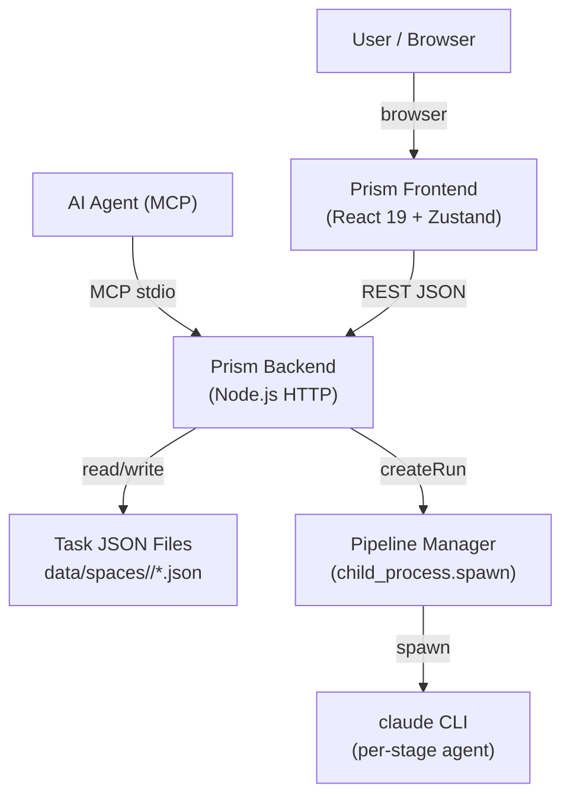
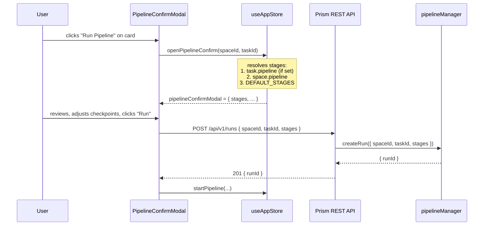
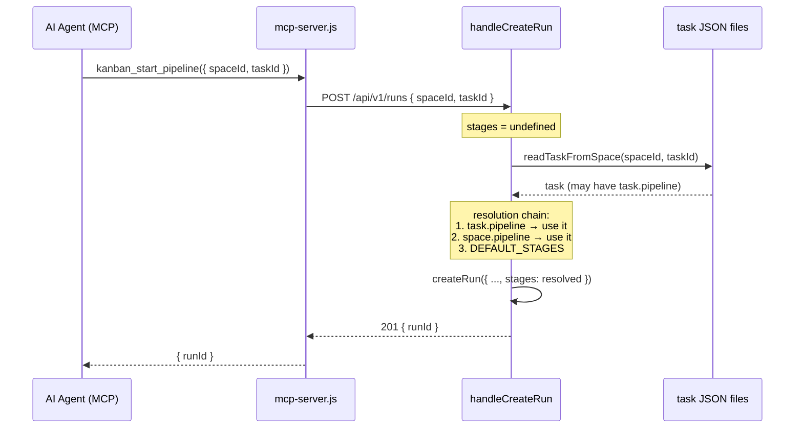
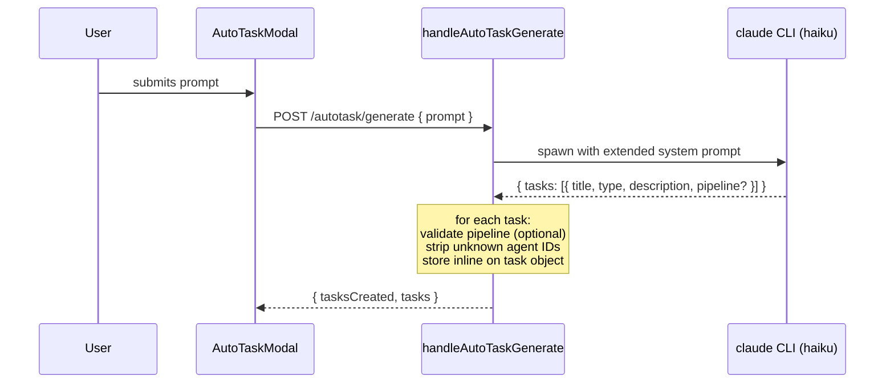

# Blueprint: Per-Card Pipeline Field

## 1. Requirements Summary

### Functional
- F1. A Kanban task may carry an optional `pipeline` field: an ordered array of agent ID strings.
- F2. When "Run Full Pipeline" is invoked on a card, the pipeline is resolved as:
  `task.pipeline` (non-empty) → `space.pipeline` (non-empty) → `DEFAULT_STAGES`.
- F3. The Pipeline Confirm Modal pre-populates its stage list from `task.pipeline` when the field is present on the card being launched.
- F4. The auto-task AI action may emit a `pipeline` array for each generated task; if present and valid, it is stored on the task.
- F5. `PUT /spaces/:spaceId/tasks/:taskId` accepts `pipeline` as an updatable field (empty array = clear the field).
- F6. `POST /spaces/:spaceId/tasks` accepts `pipeline` as an optional create-time field.
- F7. The `kanban_update_task` MCP tool exposes `pipeline` as an optional parameter.
- F8. Task detail UI allows the user to view and edit the `pipeline` field inline.

### Non-Functional
- NF1. **Backward compatibility**: all existing tasks without `pipeline` behave exactly as before.
- NF2. **Validation consistency**: the `pipeline` field is validated identically in create, update, and auto-task paths via a shared helper.
- NF3. **No new endpoints or MCP tools**: changes are additive within existing API surface.
- NF4. **Storage impact**: negligible — a typical pipeline array is < 300 bytes per task.

### Constraints
- Stack is Node.js + native HTTP + vanilla JSON file persistence. No ORM, no migration scripts.
- Frontend is React 19 + TypeScript + Tailwind CSS v4 + Zustand. Must follow design tokens from `tailwind.config.js`.
- MCP server (`mcp/mcp-server.js`) uses ESM + `@modelcontextprotocol/sdk`. Schema changes use Zod.

---

## 2. Key Trade-offs

### Trade-off 1: Inline string array vs. rich object on the card

**Option A — `pipeline: string[]`**
- Pros: identical type to `space.pipeline`; all existing validation and UI code reusable; minimal storage footprint; no new abstractions.
- Cons: cannot encode checkpoints or orchestrator-mode preference per card.

**Option B — `pipeline: { stages: string[], checkpoints?: number[], useOrchestratorMode?: boolean }`**
- Pros: captures full run intent per card.
- Cons: checkpoints and orchestrator mode are ephemeral UI choices that users change before each run; freezing them into the card creates a false sense of permanence and complicates UI (two sources of truth for the same toggles).

**Recommendation: Option A.** Checkpoints and orchestrator mode remain Modal-local state. The card's `pipeline` field is purely about which agents to run, not how to run them.

---

### Trade-off 2: Resolution in frontend vs. backend

**Option A — Resolve in `handleCreateRun` (backend)**
- Frontend sends `{ spaceId, taskId }` with no `stages`.
- Backend reads the task, extracts `task.pipeline`, and feeds it into the existing chain.
- Pros: single source of truth; MCP callers benefit automatically; no change to any API caller.
- Cons: slightly more I/O per run creation (one extra task read — already done for TASK_NOT_FOUND check, so cost is zero in practice).

**Option B — Resolve in `openPipelineConfirm` (frontend)**
- Frontend reads `task.pipeline` from the store and pre-fills the modal; sends the final `stages` array explicitly.
- Pros: the modal already does this for `space.pipeline`; trivial one-line change.
- Cons: MCP callers that skip the modal (`kanban_start_pipeline` with no `stages`) would NOT benefit from `task.pipeline`.

**Recommendation: Both.** The backend must resolve `task.pipeline` (Option A) so MCP callers benefit. The frontend also pre-populates the modal (Option B) for the UI experience. The two are complementary and non-conflicting.

---

### Trade-off 3: Auto-task pipeline output — mandatory vs. optional

**Option A — Optional (AI emits `pipeline` only when relevant)**
- System prompt instructs the AI to include `pipeline` when the task scope clearly maps to a subset of agents.
- Unknown/missing field is silently ignored — task is still created.
- Pros: graceful degradation; existing prompts continue to work; no regression risk.
- Cons: AI may under-produce pipeline fields when they would be helpful.

**Option B — Mandatory (AI always emits `pipeline`)**
- System prompt requires a `pipeline` field on every task.
- Pros: consistent output; no partial adoption.
- Cons: for generic tasks the AI will default to the full 4-stage pipeline, adding no value while wasting tokens and increasing response size.

**Recommendation: Option A.** The field is optional in the schema; strip-and-continue on unknown agent IDs.

---

## 3. Architectural Design

### 3.1 Core Components

| Component | Responsibility | Technology | Change type |
|---|---|---|---|
| `src/handlers/tasks.js` — `validateCreatePayload` | Accept and validate `pipeline` at task creation | Node.js | Extend |
| `src/handlers/tasks.js` — `handleUpdateTask` | Accept `pipeline` as updatable field; empty array clears it | Node.js | Extend |
| `src/handlers/tasks.js` — shared `validatePipelineField(v)` | Single validation helper for `pipeline` used by create, update, auto-task | Node.js | New helper |
| `src/handlers/pipeline.js` — `handleCreateRun` | Read `task.pipeline` between task lookup and space fallback | Node.js | Extend |
| `src/handlers/autoTask.js` — `handleAutoTaskGenerate` | Strip + validate `pipeline` from AI output; store on task | Node.js | Extend |
| `src/prompts/autotask-system.txt` | Extend schema to include optional `pipeline` array | Text | Extend |
| `mcp/mcp-server.js` — `kanban_update_task` | Expose `pipeline` as optional `z.array(z.string())` parameter | ESM / Zod | Extend |
| `mcp/kanban-client.js` — `updateTask` | Forward `pipeline` field in request body | ESM | Extend |
| `frontend/src/types/index.ts` — `Task` | Add `pipeline?: string[]` | TypeScript | Extend |
| `frontend/src/stores/useAppStore.ts` — `openPipelineConfirm` | Prefer `task.pipeline` over `space.pipeline` in stage resolution | TypeScript | Extend |
| `frontend/src/components/board/TaskDetailPanel.tsx` | Add editable `pipeline` field row | React / Tailwind | Extend |
| `frontend/src/api/client.ts` | No change needed — `updateTask` already sends arbitrary payload | — | No change |

### 3.2 Data Flows and Sequences

#### Data model — Task object (augmented)

```json
{
  "id": "uuid",
  "title": "string",
  "type": "feature | bug | tech-debt | chore",
  "description": "string (optional)",
  "assigned": "string (optional)",
  "pipeline": ["senior-architect", "developer-agent"],
  "attachments": [],
  "createdAt": "ISO-8601",
  "updatedAt": "ISO-8601"
}
```

`pipeline` is omitted from the JSON when absent (not stored as `null` or `[]`).

---

#### C4 Context — system overview



---

#### Sequence — Run Pipeline from card (happy path)



Note: the `stages` array sent to the backend is always the final user-confirmed value from the modal. The backend still applies the resolution chain when `stages` is omitted (MCP path).

---

#### Sequence — MCP agent calls `kanban_start_pipeline` (no explicit stages)



---

#### Sequence — Auto-task generates tasks with pipeline



---

### 3.3 APIs and Interfaces

#### `POST /api/v1/spaces/:spaceId/tasks` — extended

Added optional field:

```json
{
  "title": "string (required)",
  "type": "feature | bug | tech-debt | chore (required)",
  "description": "string (optional, ≤1000 chars)",
  "assigned": "string (optional, ≤50 chars)",
  "pipeline": ["string", "..."]
}
```

Validation rules for `pipeline`:
- Must be an array when present.
- Each element must be a non-empty string, ≤ 50 chars.
- Maximum 20 elements.
- Agent IDs are NOT validated against the filesystem at create time (agents directory may change). Validation happens at run launch.
- Empty array is treated as absent (field not stored).

Response: same as today. `pipeline` is included in the returned task object if set.

Latency SLA: unchanged (< 50 ms p95).

---

#### `PUT /api/v1/spaces/:spaceId/tasks/:taskId` — extended

`pipeline` added to `UPDATABLE_FIELDS`:
- Present + non-empty array → replaces the field.
- Present + empty array → clears the field (deletes the key from the task object).
- Absent → field unchanged.

Same validation rules as POST.

Latency SLA: unchanged (< 50 ms p95).

---

#### `POST /api/v1/runs` — backend resolution change (no schema change)

Existing schema: `{ spaceId, taskId, stages? }` — unchanged.

New resolution logic in `handleCreateRun`:

```
resolvedStages = stages (explicit)
  ?? task.pipeline (non-empty, read from task JSON)
  ?? space.pipeline (non-empty)
  ?? DEFAULT_STAGES (pipelineManager constant)
```

The task is already read for the `TASK_NOT_FOUND` / `TASK_NOT_IN_TODO` checks. The `pipeline` field is read from that same object — no additional file I/O.

---

#### Auto-task system prompt — extended schema

`src/prompts/autotask-system.txt` new rule added:

> 5. Optionally include `pipeline` — an array of agent ID strings — when the task scope clearly maps to a non-default agent sequence. Known agents: `senior-architect`, `ux-api-designer`, `developer-agent`, `code-reviewer`, `qa-engineer-e2e`. Omit when uncertain. Use an empty or absent field to inherit the space default.

Extended response schema:

```json
{
  "tasks": [
    {
      "title": "string",
      "type": "feature|bug|tech-debt|chore",
      "description": "string",
      "pipeline": ["agent-id", "..."]
    }
  ]
}
```

---

#### MCP `kanban_update_task` — extended Zod schema

```typescript
pipeline: z.array(z.string()).optional()
  .describe(
    'Ordered agent IDs for this task\'s pipeline. ' +
    'Overrides the space-level default when "Run Pipeline" is invoked. ' +
    'Pass an empty array to clear the field and revert to the space default.'
  )
```

The `kanban-client.js` `updateTask` function forwards `pipeline` in the request body
when it is defined (same pattern as all other optional fields).

---

#### `frontend/src/types/index.ts` — Task interface extended

```typescript
export interface Task {
  id: string;
  title: string;
  type: TaskType;
  description?: string;
  assigned?: string;
  pipeline?: string[];   // NEW: per-card pipeline override
  attachments?: Attachment[];
  createdAt: string;
  updatedAt: string;
}
```

---

### 3.4 Frontend — TaskDetailPanel extension

The pipeline field is surfaced in `TaskDetailPanel.tsx` as a new read/edit section, placed
after the `assigned` field and before the `description` field.

**Collapsed state (pipeline not set):** A single row reading "Pipeline: (space default)" in
`text-text-secondary`. A small "Configure" ghost button opens the edit mode.

**Collapsed state (pipeline set):** A single row showing the stage chain as a compact pill
list, e.g., `developer-agent → qa-engineer-e2e`, in `text-text-primary`. A "Clear" icon
button (`close`, variant `ghost`) and an "Edit" ghost button are inline.

**Edit mode:** A drag-free list of checkboxes for known agents (loaded from
`availableAgents` in the store), pre-checked to match the current `pipeline` value.
Order is determined by the user's checked order (a simple ordered selection pattern using
a sortable list or up/down arrows identical to those in `PipelineConfirmModal`). Save is
triggered by a "Save" primary button; Cancel restores the previous value. Auto-save on
blur is NOT used (pipeline changes are high-stakes — require explicit confirmation).

On save, the component calls `store.updateTask(taskId, { pipeline })`.

**Design system tokens used:** `bg-surface-elevated`, `border-border`, `text-text-primary`,
`text-text-secondary`, `text-primary`. Buttons use existing `<Button variant="ghost">` and
`<Button variant="primary">`.

---

### 3.5 Observability Strategy

**Metrics (RED):**
- `pipeline_field_set_total` — counter incremented each time a task is created or updated with a non-empty `pipeline` field. Emitted as a structured JSON line to stderr.
- `autotask_pipeline_field_included_total` — counter incremented per task generated by auto-task that includes a `pipeline` field.

**Structured logs (minimum fields):**
All existing pipeline log lines already include `{ event, runId, spaceId, taskId, ts }`.
New events:
- `{ event: "task.pipeline_field_set", spaceId, taskId, stages, source: "api|autotask" }`
- `{ event: "run.pipeline_resolved", runId, resolvedFrom: "task|space|default", stages }`

**Distributed traces:** Not applicable (single-process). The `resolvedFrom` field in
`run.pipeline_resolved` serves as the tracing equivalent, pinpointing which level of the
resolution chain was used.

**Tools:** stderr structured JSON (existing pattern). No new infrastructure required.

---

### 3.6 Deploy Strategy

This feature is a purely additive server-side change. No schema migrations, no data
transformations.

**CI/CD pipeline:** follows existing pattern (lint → test → build frontend → deploy).

**Release strategy:** rolling (single-instance Node.js server). No blue/green or canary
needed — the change is backward compatible at the JSON file level. Old task files without
`pipeline` are read cleanly; new files with `pipeline` are forward-compatible.

**Infrastructure as code:** not applicable (local / self-hosted Node.js server).

---

## 4. Shared Validation Helper

To satisfy NF2 (validation consistency), a `validatePipelineField(value)` function is
extracted and co-located in `src/handlers/tasks.js`:

```
validatePipelineField(value):
  if value === undefined → { valid: true, data: undefined }
  if !Array.isArray(value) → { valid: false, error: 'pipeline must be an array' }
  if value.length > 20 → { valid: false, error: 'pipeline must not exceed 20 stages' }
  for each element:
    if typeof element !== 'string' or element.trim().length === 0:
      → { valid: false, error: 'pipeline[i] must be a non-empty string' }
    if element.trim().length > 50:
      → { valid: false, error: 'pipeline[i] must not exceed 50 characters' }
  if value.length === 0 → { valid: true, data: undefined }   // empty = clear
  → { valid: true, data: value.map(s => s.trim()) }
```

This function is imported by `handleAutoTaskGenerate` and the auto-task confirm handler.

---

## 5. File Change Map

| File | Change |
|---|---|
| `src/handlers/tasks.js` | Add `validatePipelineField`; extend `validateCreatePayload` and `handleUpdateTask` to call it; store field on task; strip from responses when absent |
| `src/handlers/pipeline.js` — `handleCreateRun` | Read `task.pipeline` from the task object after the TASK_NOT_FOUND guard; insert it into the resolution chain |
| `src/handlers/autoTask.js` — `handleAutoTaskGenerate` | Call `validatePipelineField` on each AI-returned task; store field if valid and non-empty; strip unknown agent IDs (soft validation) |
| `src/prompts/autotask-system.txt` | Add rule 5 and `pipeline?` to the response schema |
| `mcp/mcp-server.js` | Add `pipeline: z.array(z.string()).optional()` to `kanban_update_task` schema; forward in handler |
| `mcp/kanban-client.js` | Forward `pipeline` in `updateTask` body when defined |
| `frontend/src/types/index.ts` | Add `pipeline?: string[]` to `Task` interface |
| `frontend/src/stores/useAppStore.ts` — `openPipelineConfirm` | Prefer `detailTask?.pipeline ?? task.pipeline` before `space.pipeline` in stage resolution |
| `frontend/src/components/board/TaskDetailPanel.tsx` | Add pipeline field section (collapsed/edit modes) |
