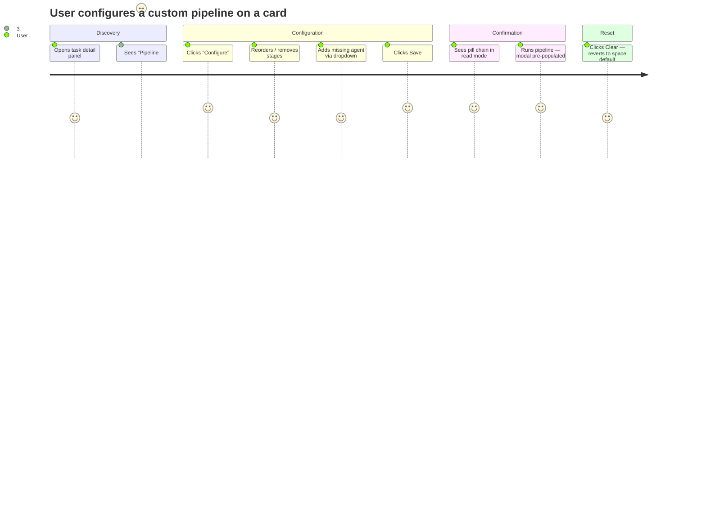

# Wireframes: Pipeline Field per Card

## Stitch Fallback Notice

Stitch MCP (`generate_screen_from_text`, `edit_screens`) returned "Request contains an invalid argument" for all
attempts — consistent with the known Stitch timeout/invalid-argument bug documented in agent memory (March 2026).
ASCII wireframes are provided below as the authoritative design reference. The `wireframes-stitch.md` file
records this fallback.

---

## Screen Summary

| ID    | Screen                                  | Mode      |
|-------|-----------------------------------------|-----------|
| S-01  | TaskDetailPanel — no pipeline set       | Read      |
| S-02  | TaskDetailPanel — custom pipeline set   | Read      |
| S-03  | TaskDetailPanel — pipeline editor       | Edit      |
| S-04  | TaskDetailPanel — validation error      | Edit/Error|

---

## Journey Map



---

## Design Tokens (reference)

| Token              | Value      | Usage                         |
|--------------------|------------|-------------------------------|
| `bg-surface`       | #1a1a1f    | Panel background              |
| `bg-surface-elevated` | #232329 | Inputs, edit container        |
| `bg-surface-variant` | #2a2a31  | Stage rows, select            |
| `border-border`    | #2e2e38    | All borders                   |
| `text-text-primary`| #e2e2e8    | Main content                  |
| `text-text-secondary` | #8b8b9a | Labels, muted text            |
| `text-text-disabled` | #55556a  | Timestamps, separators        |
| `text-primary`     | #7c6af7    | Primary actions, icons        |
| `error`            | #f87171    | Validation errors             |
| `warning`          | #f5a623    | Non-blocking warnings         |
| `font-sans`        | Inter      | All text                      |
| `font-mono`        | JetBrains Mono | ID chips               |
| `rounded-md`       | 12px       | Cards, containers             |
| `rounded-sm`       | 8px        | Buttons, inputs               |

---

## S-01: TaskDetailPanel — Pipeline Field Read Mode (No Pipeline Set)

### Description

The pipeline field is absent on the task. The section displays a placeholder indicating the
space-level default will be used. A "Configure" ghost button invites the user to set a custom pipeline.

### Wireframe

```
┌─────────────────────────────────────────┐  ← fixed inset-y-0 right-0 w-[380px] bg-surface
│  #a3b1c  [In Progress]             [✕] │  ← border-b border-border
├─────────────────────────────────────────┤
│ ← scrollable body px-4 py-4 gap-5       │
│                                         │
│  ID                                     │
│  ┌─────────────────────────────────┐[⧉]│  ← bg-surface-elevated font-mono text-xs
│  │ 550886d3-f4a1-4bc2-... (uuid)   │   │
│  └─────────────────────────────────┘   │
│                                         │
│  TITLE                                  │
│  ┌─────────────────────────────────┐   │
│  │ Fix authentication flow         │   │  ← input bg-surface-elevated
│  └─────────────────────────────────┘   │
│                                         │
│  TYPE                                   │
│  [feature][bug ✓][tech-debt][chore]     │  ← segmented control, bug=primary
│                                         │
│  ASSIGNED                               │
│  ┌─────────────────────────────────┐   │
│  │ developer-agent                 │   │
│  └─────────────────────────────────┘   │
│                                         │
│  PIPELINE                               │  ← text-xs font-semibold uppercase text-secondary
│  ┌─────────────────────────────────┐   │
│  │ Pipeline: (space default)  [Configure]│ ← italic text-secondary | ghost btn text-xs
│  └─────────────────────────────────┘   │  ← bg-surface-elevated border-border rounded-md p-2
│                                         │
│  DESCRIPTION                            │
│  ┌─────────────────────────────────┐   │
│  │ Add a description...            │   │
│  │                                 │   │
│  │                                 │   │  ← textarea 6 rows
│  └─────────────────────────────────┘   │
│                  [Save description]     │
│                                         │
├─────────────────────────────────────────┤
│  Created: Mar 9, 2026 - 14:32           │  ← text-xs text-disabled
│  Updated: Apr 6, 2026 - 09:15          │
└─────────────────────────────────────────┘
```

### States

| State    | Pipeline section content                                          |
|----------|-------------------------------------------------------------------|
| Default  | "Pipeline: (space default)" italic + "Configure" ghost button     |
| Hover on Configure | Configure text turns text-primary, cursor-pointer      |
| Disabled (run active) | Configure button opacity-50, pointer-events-none   |

### Interaction

- Clicking "Configure" toggles the section into edit mode (S-03) inline — no modal.
- The section animates open with `fade-in-up` (200ms, ease-out).

### Accessibility Notes

- Section label `PIPELINE` is a `<span>` with `id="pipeline-label"`.
- The pipeline container has `aria-labelledby="pipeline-label"`.
- Configure button: `aria-label="Configure custom pipeline for this task"`.
- When no pipeline is set, the placeholder text is read by screen readers as "Pipeline: space default".

### Mobile-First Notes

- At 320px: the Configure button wraps below the placeholder text (flex-col).
- At 380px+: single row layout (flex-row justify-between).

---

## S-02: TaskDetailPanel — Pipeline Field Read Mode (Custom Pipeline Set)

### Description

A custom pipeline is stored on the task. The stages are rendered as compact pills separated
by arrows. Two icon buttons (Edit, Clear) appear inline.

### Wireframe

```
┌─────────────────────────────────────────┐
│  [panel header — same as S-01]          │
├─────────────────────────────────────────┤
│  ...ID, Title, Type, Assigned fields... │
│                                         │
│  PIPELINE  overrides space default ↗   │  ← "overrides space default" in 10px text-disabled
│  ┌─────────────────────────────────────┐│
│  │ [⚙ senior-architect] →              ││  ← pills: bg-surface-variant border rounded-sm
│  │ [🎨 ux-api-designer] →             ││     text-xs text-primary px-2 py-0.5
│  │ [</> developer-agent] →             ││
│  │ [🐛 qa-engineer-e2e]    [✏][✕]     ││  ← Edit + Clear icon buttons right-aligned
│  └─────────────────────────────────────┘│  ← bg-surface-elevated border-border rounded-md p-3
│                                         │
│  DESCRIPTION                            │
│  ...                                    │
└─────────────────────────────────────────┘
```

**Pill layout detail (inline, wrapping):**
```
[🏗 senior-architect] → [🎨 ux-api-designer] → [</> developer-agent] → [🐛 qa-engineer-e2e]
                                                                          [✏ Edit] [✕ Clear]
```

Each pill:
- `bg-surface-variant border border-border rounded-sm px-2 py-0.5 text-xs text-text-primary`
- Agent icon: `material-symbols-outlined text-primary text-sm` (architecture / palette / code / bug_report)

Arrow separators: `text-text-disabled text-xs mx-1`

Edit button: `w-7 h-7 rounded text-text-secondary hover:text-primary hover:bg-primary/10`
Clear button: `w-7 h-7 rounded text-text-secondary hover:text-error hover:bg-error/10`

### States

| State        | Behavior                                                      |
|--------------|---------------------------------------------------------------|
| Default      | Pills displayed, Edit + Clear visible                         |
| Edit hover   | Edit icon turns text-primary                                  |
| Clear hover  | Clear icon turns text-error                                   |
| Clear click  | Confirmation-free: calls updateTask({ pipeline: [] }), section reverts to S-01 immediately, toast "Pipeline cleared — using space default" |
| Disabled     | Edit + Clear opacity-50, pointer-events-none during active run |

### Accessibility Notes

- Edit button: `aria-label="Edit pipeline stages"`.
- Clear button: `aria-label="Clear custom pipeline — will revert to space default"`.
- The pill list: `role="list"`, each pill is `role="listitem"`.
- Arrow separators: `aria-hidden="true"`.
- After Clear: focus moves to the Configure button in S-01.

### Mobile-First Notes

- At 320px: pills wrap to multiple lines, Edit+Clear buttons stack below.
- At 380px+: all pills on one line if they fit; overflow wraps naturally.

---

## S-03: TaskDetailPanel — Pipeline Field Edit Mode

### Description

The user clicked "Configure" or "Edit". The pipeline section expands inline into an ordered
editor. No modal. Stages can be reordered (up/down arrows), removed, and added via a native
select. Explicit Save/Cancel buttons. Auto-save on blur is NOT used — pipeline changes require
explicit confirmation.

### Wireframe

```
┌─────────────────────────────────────────┐
│  [panel header]                         │
├─────────────────────────────────────────┤
│  ...ID, Title, Type, Assigned fields... │
│                                         │
│  PIPELINE                    [editing]  │  ← badge: bg-primary/10 text-primary text-[10px]
│  ┌─────────────────────────────────────┐│
│  │ ┌───────────────────────────────┐   ││  ← bg-surface-elevated border-border rounded-md p-3
│  │ │ 1  [🏗] Senior Architect  [↑↓][✕]│ ││  ← step=1, ↑ disabled (first)
│  │ │ 2  [</>] Developer Agent  [↑↓][✕]│ ││
│  │ │ 3  [🐛] QA Engineer E2E  [↑↓][✕]│ ││  ← ↓ disabled (last)
│  │ └───────────────────────────────┘   ││
│  │                                     ││
│  │ ┌─────────────────────────────────┐ ││
│  │ │ + Add stage…            [select]│ ││  ← native <select> bg-surface-variant
│  │ └─────────────────────────────────┘ ││
│  │                                     ││
│  │ senior-architect → developer-agent  ││  ← flow preview hint, text-disabled 11px centered
│  │ → qa-engineer-e2e                  ││
│  │                                     ││
│  │       [Cancel]        [Save]        ││  ← ghost + primary buttons
│  └─────────────────────────────────────┘│
│                                         │
│  DESCRIPTION                            │
└─────────────────────────────────────────┘
```

**Stage row detail:**
```
┌─────────────────────────────────────────────────┐
│ [1] [icon:primary] Display Name      [↑][↓][✕]  │
│     text-[11px]  text-sm text-primary  6px each  │
│     text-disabled                                 │
└─────────────────────────────────────────────────┘
```

- Row background: transparent within the container.
- Icon: Material Symbols Outlined, 16px, `text-primary`.
- Up/down: `w-6 h-6 rounded text-text-secondary hover:text-primary hover:bg-primary/10 disabled:opacity-30`.
- Remove: `w-6 h-6 rounded text-text-secondary hover:text-error hover:bg-error/10`.
- Save button: primary variant, `disabled` + `opacity-50` when saving, shows "Saving..." + spinner.
- Cancel button: ghost variant, restores previous pipeline value, closes edit mode.

### States

| State             | Behavior                                                           |
|-------------------|--------------------------------------------------------------------|
| Idle (editing)    | Full editor visible, Save enabled if at least 0 stages            |
| No stages         | Warning banner shown (see S-04), Save still enabled               |
| Invalid stage ID  | Error banner shown (see S-04), Save disabled                      |
| Saving            | Save button: "Saving..." + spinner, both buttons disabled         |
| Save success      | Edit mode collapses, read mode shown (S-01 or S-02), toast shown  |
| Cancel            | Edit mode collapses, previous pipeline value restored             |

### Accessibility Notes

- Edit container: `role="group"` with `aria-label="Pipeline editor"`.
- Stage list: `role="list"`.
- Each stage row: `role="listitem"`.
- Up button: `aria-label="Move Senior Architect up"` (interpolated).
- Down button: `aria-label="Move Senior Architect down"`.
- Remove button: `aria-label="Remove Senior Architect from pipeline"`.
- Select: `aria-label="Add agent to pipeline"`.
- Save: `aria-label="Save pipeline"`, `aria-busy="true"` when saving.
- Cancel: `aria-label="Cancel pipeline editing"`.
- Focus management: on Cancel/Save success, focus returns to the Configure/Edit button.

### Mobile-First Notes

- At 320px: Save/Cancel buttons are full-width stacked (flex-col-reverse so Save is on top).
- Stage rows: remove button always visible (not hover-only) to ensure touch discoverability.
- Up/down buttons: minimum 44x44px touch target via padding extension.

---

## S-04: TaskDetailPanel — Pipeline Validation States

### Description

Two inline banners appear within the edit container under specific conditions. These are
within S-03 (edit mode) — they are not separate screens but states of the editor.

### A. Invalid stage ID error banner (Save blocked)

Triggered when the pipeline array (e.g., received from AI-generated content) contains a
string exceeding 50 characters.

```
┌─────────────────────────────────────────┐
│ [✕ error_outline icon]                  │
│ Pipeline contains an invalid stage.     │  ← text-xs text-error
│ Agent IDs must be non-empty strings     │
│ under 50 characters.                    │
└─────────────────────────────────────────┘
```

Classes: `flex items-start gap-2 bg-error/10 border border-error/30 rounded-md px-3 py-2`

- Icon: `material-symbols-outlined text-error text-base leading-none flex-shrink-0`
- Text: `text-xs text-error leading-snug`
- Save button: `disabled opacity-50 cursor-not-allowed`
- `aria-live="polite"` on the banner container so screen readers announce it.

### B. Empty pipeline warning banner (Save allowed)

Triggered when the user removes all stages from the list. Saving an empty pipeline is
intentional (clears the field, reverts to space default).

```
┌─────────────────────────────────────────┐
│ [! pause_circle icon]                   │
│ An empty pipeline will revert this      │  ← text-xs text-warning
│ card to the space default when saved.   │
└─────────────────────────────────────────┘
```

Classes: `flex items-start gap-2 bg-warning/10 border border-warning/30 rounded-md px-3 py-2`

- Icon: `material-symbols-outlined text-warning text-base leading-none flex-shrink-0`
- Text: `text-xs text-warning leading-snug`
- Save button: remains **enabled** — empty save = intentional clear.

### Validation Checklist (WCAG 2.1 AA)

- [x] Error color (#f87171 on #232329) ratio ~4.9:1 — passes AA
- [x] Warning color (#f5a623 on #232329) ratio ~4.5:1 — passes AA
- [x] Error/warning are not color-only: icon + text both present (WCAG 1.4.1)
- [x] `aria-live="polite"` on banner containers — screen readers announce changes
- [x] Save disabled state: `disabled` attribute + `aria-disabled="true"` + visual opacity

---

## Validation Checklist (Full Feature)

### Usability (Nielsen's Heuristics)

- [x] H1 Visibility of system status: pipeline section shows active state (editing badge, spinner)
- [x] H2 Match real world: arrow separators (→) match user mental model of sequential flow
- [x] H3 User control: Cancel always available, no auto-save on blur
- [x] H4 Consistency: stage row pattern identical to PipelineConfirmModal (same icons, up/down pattern)
- [x] H5 Error prevention: Save disabled when invalid; warning before clearing all stages
- [x] H6 Recognition over recall: agent display names shown (not just IDs)
- [x] H7 Flexibility: power users can clear all and re-add; beginners can use "space default"
- [x] H9 Error messages: specific, non-technical, with correction guidance

### Accessibility (WCAG 2.1 AA)

- [x] All interactive elements have visible focus rings (`focus:ring-2 focus:ring-primary`)
- [x] Touch targets minimum 44x44px on all buttons
- [x] Contrast ratios verified: text-secondary (#8b8b9a) on #1a1a1f = 4.52:1 (AA pass)
- [x] Contrast ratios verified: text-primary (#e2e2e8) on #232329 = 12.1:1 (AAA pass)
- [x] Color is never the only differentiator (icons + text everywhere)
- [x] Focus trap in the detail panel (existing mechanism) covers the pipeline editor
- [x] `aria-live` regions for banners, `aria-busy` for save in-flight

### Mobile-First

- [x] 320px: section collapses to single column, buttons full-width
- [x] 380px: panel width matches the existing `sm:w-[380px]` — no horizontal overflow
- [x] 44px minimum touch area on all interactive elements

---

## Questions for Stakeholders

1. **Clear with confirmation?** Currently clicking Clear (X button in read mode) immediately calls `updateTask({ pipeline: [] })` without a confirmation dialog, since the operation is reversible (user can re-configure). Is this acceptable, or should a brief "Are you sure?" tooltip/popover appear?

2. **Pipeline field in Create Task modal?** The CreateTaskModal is not addressed in this design — should new tasks be able to set a pipeline at creation time, or only via the detail panel after creation?

3. **Agent display names vs IDs in pills?** The read-mode pills show display names (e.g., "Senior Architect") while the underlying data uses agent IDs (e.g., "senior-architect"). If an agent is uninstalled, should the pill show the raw ID or a "unknown agent" placeholder?

4. **Maximum pill width on narrow screens?** With 4 agents in the chain, the pill row wraps on 320px. Is the wrapped multi-line display acceptable, or should we add a horizontal scroll container?

5. **Pipeline field visibility on the task card?** Should the TaskCard on the board surface display a small indicator (e.g., a pipeline icon or count chip) when a custom pipeline is set, to make the override visible before opening the detail panel?
