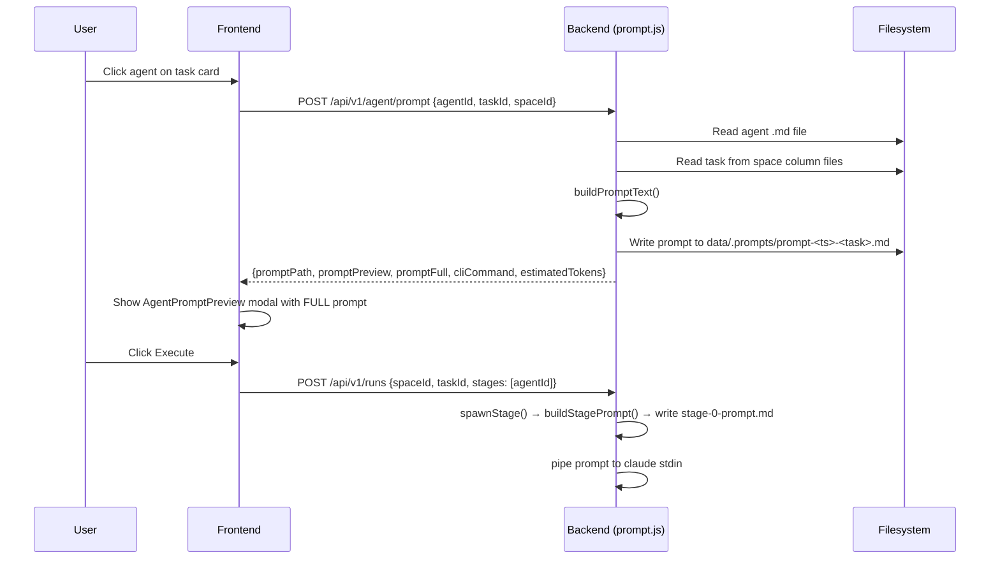
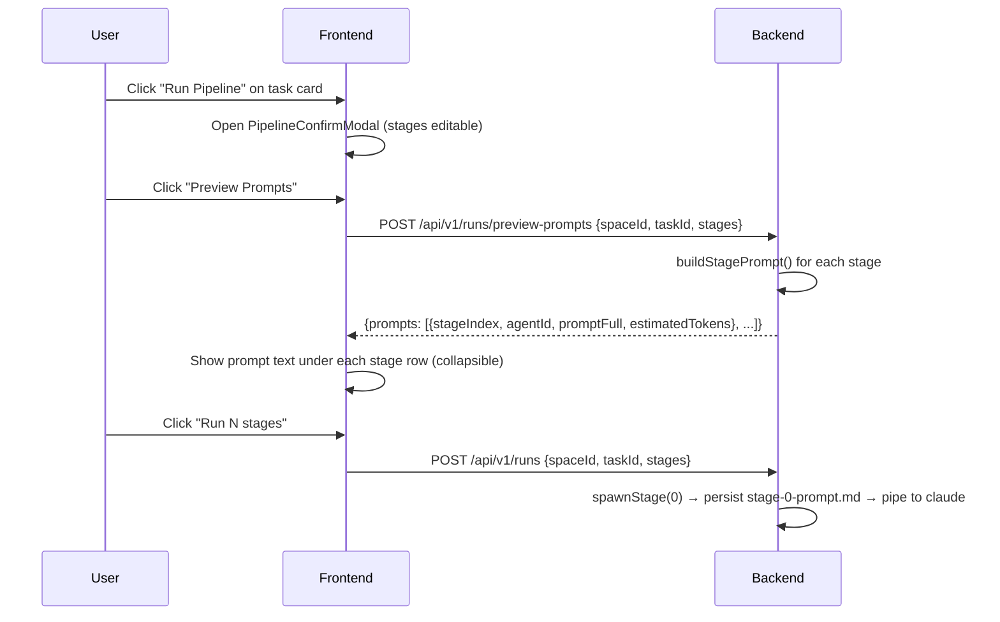
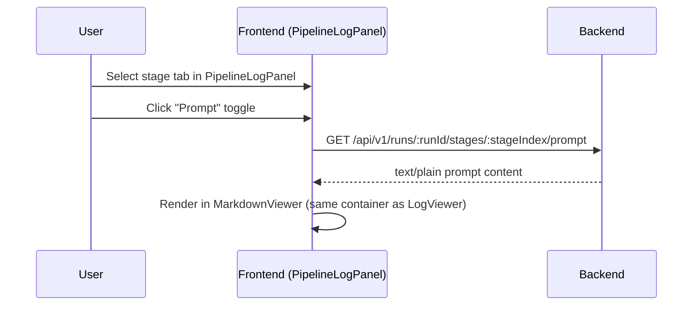

# Blueprint: Prompt Improvements

## 1. Requirements Summary

### Functional Requirements
- FR-1: Show the full prompt text (not truncated) when launching a single agent.
- FR-2: Persist the prompt sent by the backend pipeline runner (`spawnStage`) to disk.
- FR-3: Expose persisted stage prompts via a REST endpoint.
- FR-4: Allow users to preview prompts for all pipeline stages before starting a run.
- FR-5: Show the prompt for each stage in the PipelineLogPanel (alongside logs).

### Non-Functional Requirements
- NFR-1: Prompt files must not exceed 512 KB per stage (already enforced by body limit).
- NFR-2: Pre-generating prompts for a 5-stage pipeline must complete in <100ms.
- NFR-3: No new npm dependencies required.

### Constraints
- Backend is a single Node.js process with native HTTP (no framework).
- Frontend uses React 19 + Zustand + Tailwind CSS.
- Existing prompt generation lives in two separate code paths that must both be addressed.

---

## 2. Core Components

### 2.1 Backend: `src/handlers/prompt.js` (modified)

**Responsibility:** Return full prompt text in addition to the existing truncated preview.

**Changes:**
- Add `promptFull` field to the response of `POST /api/v1/agent/prompt`.
- Keep `promptPreview` (first 500 chars) for backward compatibility with any consumer that depends on it.
- Response shape becomes:
  ```json
  {
    "promptPath": "/abs/path/to/prompt-file.md",
    "promptPreview": "first 500 chars...",
    "promptFull": "complete prompt text...",
    "cliCommand": "claude \"$(cat /path)\" --enable-auto-mode",
    "estimatedTokens": 1234
  }
  ```

### 2.2 Backend: `src/pipelineManager.js` (modified)

**Responsibility:** Persist the prompt to disk before piping it to the child process.

**Changes in `spawnStage()`:**
- After building `taskPrompt`, write it to `data/runs/<runId>/stage-<N>-prompt.md` using the same atomic write pattern (`.tmp` + rename).
- This happens before `child.stdin.write(taskPrompt)`, so the file is available even if the child crashes immediately.

**New path helper:**
```js
function stagePromptPath(dataDir, runId, stageIndex) {
  return path.join(runDir(dataDir, runId), `stage-${stageIndex}-prompt.md`);
}
```

### 2.3 Backend: `src/handlers/pipeline.js` (modified)

**Responsibility:** Serve persisted stage prompts and pipeline prompt previews.

**New route: `GET /api/v1/runs/:runId/stages/:stageIndex/prompt`**
- Reads `data/runs/<runId>/stage-<N>-prompt.md`.
- Returns `200` with `Content-Type: text/plain; charset=utf-8`.
- Returns `404` if the prompt file does not exist yet (stage has not started).
- Pattern: `PIPELINE_RUNS_PROMPT_ROUTE = /^\/api\/v1\/runs\/([^/]+)\/stages\/(\d+)\/prompt$/`

**New route: `POST /api/v1/runs/preview-prompts`**
- Body: `{ spaceId, taskId, stages: string[] }`
- For each stage, resolves the agent file, reads the task, and calls a shared prompt-builder to generate the prompt text that `spawnStage` would produce.
- Returns an array of prompt previews:
  ```json
  {
    "prompts": [
      {
        "stageIndex": 0,
        "agentId": "senior-architect",
        "promptFull": "...",
        "estimatedTokens": 1234
      }
    ]
  }
  ```
- Does NOT start a run or create any files. Pure read-only preview.
- This requires extracting the prompt-building logic from `spawnStage()` into a reusable function.

### 2.4 Backend: Shared prompt builder (new internal function)

**Responsibility:** Single source of truth for building the prompt that `spawnStage` sends to agents.

**Location:** New exported function in `src/pipelineManager.js`:
```js
function buildStagePrompt(dataDir, spaceId, taskId, stageIndex, agentId, stages) {
  // Reads task from space, appends artifact list, git context, compile gate.
  // Returns { promptText: string, estimatedTokens: number }
}
```

This function is called by:
1. `spawnStage()` — for actual execution (replaces inline prompt building).
2. `handlePreviewPrompts()` — for the preview endpoint.

### 2.5 Frontend: `PromptGenerationResponse` type (modified)

**Changes in `frontend/src/types/index.ts`:**
```typescript
export interface PromptGenerationResponse {
  promptPath: string;
  promptPreview: string;   // kept for backward compat
  promptFull: string;      // NEW: complete prompt text
  cliCommand: string;
  estimatedTokens: number;
}
```

### 2.6 Frontend: `PreparedRun` type (modified)

Add `promptFull` field alongside existing `promptPreview`:
```typescript
export interface PreparedRun {
  taskId: string;
  agentId: string;
  spaceId: string;
  promptPath: string;
  cliCommand: string;
  promptPreview: string;
  promptFull: string;       // NEW
  estimatedTokens: number;
}
```

### 2.7 Frontend: `AgentPromptPreview.tsx` (modified)

**Changes:**
- Replace the 500-char preview display with the full prompt text in the MarkdownViewer.
- Add a "Show full prompt" / "Show preview" toggle for users who want to see the condensed version (default to full).
- The existing edit mode continues to work but now edits the full text.
- Add a collapse/expand button for very long prompts.

### 2.8 Frontend: `PipelineLogPanel.tsx` (modified)

**Changes:**
- Add a "Prompt" / "Log" toggle (or tab pair) per stage in the panel.
- When "Prompt" is selected, fetch `GET /api/v1/runs/:runId/stages/:stageIndex/prompt` and display it in a read-only MarkdownViewer.
- Reuse the existing `LogViewer` component wrapper for consistent styling.

### 2.9 Frontend: `PipelineConfirmModal.tsx` (modified)

**Changes:**
- Add a "Preview Prompts" button that calls `POST /api/v1/runs/preview-prompts`.
- When clicked, expands a collapsible section below each stage row showing the prompt text.
- Add a loading state (spinner) while prompts are being generated.
- Prompts are fetched once per modal open, not on every render.

### 2.10 Frontend: API client (`frontend/src/api/client.ts`)

**New functions:**
```typescript
export const getStagePrompt = (runId: string, stageIndex: number): Promise<string> =>
  // Returns raw text, not JSON
  fetch(`/api/v1/runs/${runId}/stages/${stageIndex}/prompt`).then(r => r.text());

export const previewPipelinePrompts = (
  spaceId: string, taskId: string, stages: string[]
): Promise<PipelinePromptPreview> =>
  apiFetch<PipelinePromptPreview>('/runs/preview-prompts', {
    method: 'POST',
    body: JSON.stringify({ spaceId, taskId, stages }),
  });
```

---

## 3. Data Flows

### 3.1 Single Agent Launch (improved flow)



### 3.2 Pipeline Launch with Prompt Preview



### 3.3 Post-Run Prompt Inspection



---

## 4. API Contracts

### 4.1 `POST /api/v1/agent/prompt` (modified response)

**Response (201):**
```json
{
  "promptPath": "/abs/path/data/.prompts/prompt-1234-abcd.md",
  "promptPreview": "## TASK CONTEXT\nTitle: ...",
  "promptFull": "## TASK CONTEXT\nTitle: Feature X\nType: task\n...\n## AGENT INSTRUCTIONS\n...",
  "cliCommand": "claude \"$(cat /abs/path)\" --enable-auto-mode",
  "estimatedTokens": 2450
}
```

### 4.2 `GET /api/v1/runs/:runId/stages/:stageIndex/prompt` (new)

**Response (200):** `Content-Type: text/plain; charset=utf-8`
```
## TASK CONTEXT
Title: Feature X
...
```

**Response (404):**
```json
{
  "error": { "code": "PROMPT_NOT_AVAILABLE", "message": "Prompt for stage 0 of run 'abc' is not yet available." }
}
```

### 4.3 `POST /api/v1/runs/preview-prompts` (new)

**Request:**
```json
{
  "spaceId": "uuid",
  "taskId": "uuid",
  "stages": ["senior-architect", "ux-api-designer", "developer-agent"]
}
```

**Response (200):**
```json
{
  "prompts": [
    {
      "stageIndex": 0,
      "agentId": "senior-architect",
      "promptFull": "## TASK CONTEXT\n...",
      "estimatedTokens": 2100
    },
    {
      "stageIndex": 1,
      "agentId": "ux-api-designer",
      "promptFull": "## TASK CONTEXT\n...",
      "estimatedTokens": 1800
    }
  ]
}
```

**Error (404):** Task not found or space not found.
**Error (422):** Agent file not found for one of the stages.

---

## 5. Observability Strategy

### Metrics
- `prompt.generated` — counter per agent ID (already logged in prompt.js, extend to pipeline path).
- `prompt.preview_requested` — counter for the preview-prompts endpoint.
- `prompt.size_bytes` — histogram of prompt file sizes.

### Structured Logs
- Existing `agent_prompt_generated` event in prompt.js — add `promptSizeBytes` field.
- New `stage_prompt_persisted` event in pipelineManager.js when writing `stage-N-prompt.md`.
- New `pipeline_prompts_previewed` event for the preview endpoint.

### Traces
- Not applicable — this is a single-process Node.js server. Structured logs with `runId` and `stageIndex` fields provide full traceability.

---

## 6. Deploy Strategy

Not applicable — Prism is a local dev tool run via `node server.js`. Changes are deployed by pulling the latest code and restarting the server. No CI/CD pipeline, no cloud deployment.

---

## 7. File Changes Summary

| File | Change Type | Description |
|------|------------|-------------|
| `src/pipelineManager.js` | Modified | Extract `buildStagePrompt()`, persist prompt file in `spawnStage()`, export new helper |
| `src/handlers/pipeline.js` | Modified | Add `handleGetStagePrompt` and `handlePreviewPrompts` route handlers |
| `src/handlers/prompt.js` | Modified | Add `promptFull` to response |
| `server.js` | Modified | Wire new routes to the router |
| `frontend/src/types/index.ts` | Modified | Add `promptFull` to types, add `PipelinePromptPreview` type |
| `frontend/src/api/client.ts` | Modified | Add `getStagePrompt()` and `previewPipelinePrompts()` |
| `frontend/src/stores/useAppStore.ts` | Modified | Store `promptFull` in `preparedRun` |
| `frontend/src/components/agent-launcher/AgentPromptPreview.tsx` | Modified | Show full prompt, add toggle |
| `frontend/src/components/pipeline-log/PipelineLogPanel.tsx` | Modified | Add Prompt/Log toggle per stage |
| `frontend/src/components/modals/PipelineConfirmModal.tsx` | Modified | Add "Preview Prompts" button and collapsible sections |
