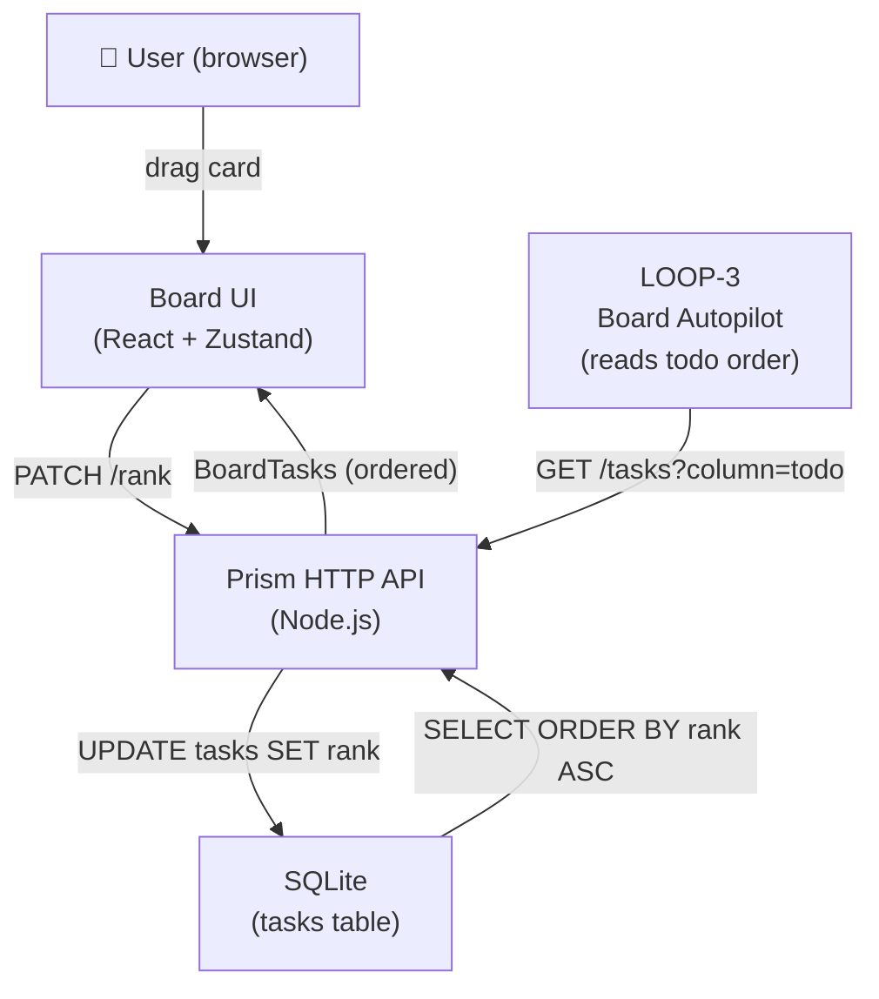
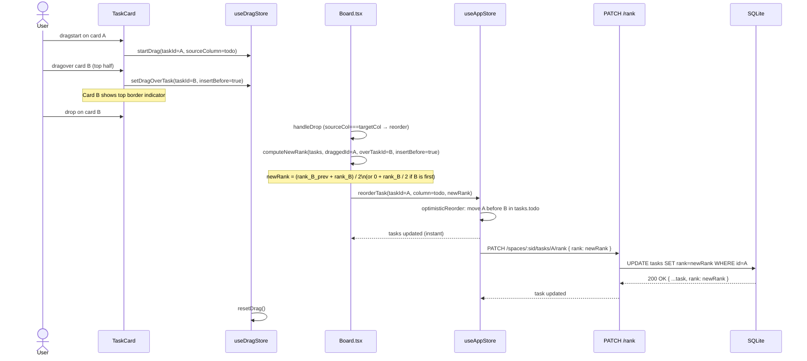
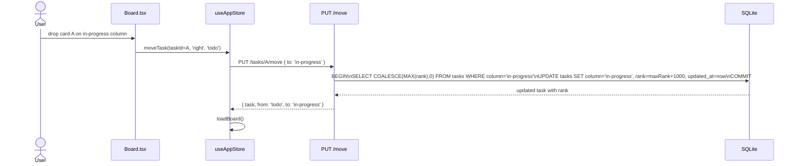

# Blueprint: QOL-1 — Manual Task Ordering (rank + drag-to-reorder)

## 1. Requirements Summary

### Functional
- F1: Tasks in each column are ordered by `rank` (float), ascending. Ties fall back to `created_at ASC`.
- F2: A user can drag a task card to a new position within the same column; the new order persists after page reload.
- F3: A drag handle icon (Material Symbol `drag_indicator`) is visible on TaskCard hover.
- F4: A drop indicator (highlighted top or bottom border on the target card) shows where the card will land.
- F5: Dragging a task to a different column assigns it rank at the tail of the destination (existing behavior preserved, rank now also assigned).
- F6: The `PUT /spaces/:spaceId/tasks/:taskId` endpoint is NOT changed to accept rank (dedicated PATCH endpoint only).
- F7: Newly created tasks get rank = `MAX(todo_ranks for space) + 1000.0` (appended to bottom of todo).
- F8: LOOP-3 / MCP `kanban_list_tasks({ column: 'todo' })` returns tasks ordered by rank.

### Non-Functional
- NF1: O(1) re-renders per drag event (maintain existing useDragStore pattern).
- NF2: Single write per reorder (fractional ranking — no cascade).
- NF3: Rank degradation guard: when gap < 0.001, client rebalances the column and sends batch PATCH calls.
- NF4: No FTS trigger on rank-only updates (dedicated prepared statement, no `updateTask` path).
- NF5: Backward compatibility: existing tasks get correctly seeded ranks from migration.

### Constraints
- Stack: Node.js native HTTP, SQLite (better-sqlite3), React 19 + Zustand, Tailwind CSS v4.
- No new npm dependencies.
- HTML5 DnD only (no `@dnd-kit`).
- PATCH endpoint must be registered BEFORE the generic single-task `PUT` route in tasks.js to avoid regex collision.

---

## 2. Trade-offs

### Trade-off 1: Fractional float ranks vs. integer position

| | Float midpoint | Integer position |
|---|---|---|
| Writes per reorder | 1 (just the moved task) | O(N) (all tasks after insertion point) |
| DB query | `ORDER BY rank ASC` (native) | `ORDER BY rank ASC` (native) |
| Precision limit | ~1000 halvings per gap | None |
| Migration complexity | Seed initial ranks once | Same |

**Choice: Float midpoint.** Boards have <100 tasks per column in practice; precision degrades only after extreme pathological reordering.

### Trade-off 2: Optimistic reorder vs. wait-for-server

| | Optimistic | Wait-for-server |
|---|---|---|
| UX | Instant visual feedback | ~100-300ms lag after drop |
| Complexity | Requires rollback on error | Simple |
| Error handling | Toast + revert | Toast + board stays |

**Choice: Optimistic.** Reorder is a common gesture; lag is jarring. Rollback is straightforward (store the pre-reorder snapshot, restore on catch).

### Trade-off 3: Drop indicator — border on target card vs. separator element

| | Border on target card | Separate separator `<div>` |
|---|---|---|
| DOM overhead | Zero extra nodes | N+1 divs per column |
| CSS | `border-t-2 border-primary` (Tailwind) | More complex |
| UX clarity | Clear (line at card boundary) | Clearest (floating line) |

**Choice: Border on target card.** Simpler, sufficient UX for this context.

---

## 3. Architectural Design

### 3.1 Core Components

| Component | Responsibility | File | Change |
|---|---|---|---|
| `tasks` table | Stores rank per task | `src/services/store.js` | Add `rank REAL` column via migration |
| `store.reorderTask()` | Atomic rank update (no FTS trigger) | `src/services/store.js` | New method |
| `store.moveTask()` | Cross-column move + tail rank assignment | `src/services/store.js` | Extend to assign rank |
| `store.insertTask()` | Assigns rank = MAX(todo) + 1000 on create | `src/services/store.js` | Extend |
| `store.getTasksByColumn()` | Returns tasks ordered by rank | `src/services/store.js` | Change ORDER BY |
| `tasks.js` handler | Route PATCH /rank | `src/handlers/tasks.js` | Add route + handler |
| `useDragStore` | Card-level drag-over tracking | `frontend/src/stores/useDragStore.ts` | Add `dragOverTaskId`, `insertBefore` |
| `useAppStore` | `reorderTask` action + optimistic update | `frontend/src/stores/useAppStore.ts` | Add action |
| `api/client.ts` | `reorderTask(spaceId, taskId, rank)` | `frontend/src/api/client.ts` | Add function |
| `Task` type | `rank?: number` | `frontend/src/types/index.ts` | Add field |
| `Board.tsx` | Same-column drop → reorder | `frontend/src/components/board/Board.tsx` | Extend handleDrop |
| `Column.tsx` | Pass card-level drag handlers | `frontend/src/components/board/Column.tsx` | Add props + forward |
| `TaskCard.tsx` | Drag handle + drop indicator | `frontend/src/components/board/TaskCard.tsx` | Add handle, onDragOver |

---

### 3.2 Data Flows and Sequences

#### System Context (C4)



#### Sequence: In-column drag-to-reorder



#### Sequence: Cross-column drop (existing behavior + rank tail assignment)



#### Sequence: Rank rebalance (client-side, rare)

```mermaid
sequenceDiagram
    participant Board as Board.tsx
    participant AppStore as useAppStore
    participant API as PATCH /rank

    Board->>Board: computeNewRank() → gap < 0.001
    Board->>Board: rebalanceTasks(tasks.todo)\n→ assign [1000, 2000, 3000, ...]
    loop for each task in column
        Board->>AppStore: reorderTask(taskId, column, newRank)
        AppStore->>API: PATCH /rank { rank: newRank }
    end
    Note over Board: All ranks now spaced by 1000; no UX disruption
```

---

### 3.3 APIs and Interfaces

#### New endpoint: `PATCH /spaces/:spaceId/tasks/:taskId/rank`

| Field | Value |
|---|---|
| Method | PATCH |
| Path | `/api/v1/spaces/:spaceId/tasks/:taskId/rank` |
| Auth | None (existing pattern) |
| Latency SLA | p95 < 30ms |

**Request body**:
```json
{
  "rank": 1500.0
}
```

**Validation**:
- `rank` is required.
- Must be a finite number (`isFinite(rank)` and `typeof rank === 'number'`).
- Range: no explicit limit (floats between 0 and Number.MAX_SAFE_INTEGER are valid).

**Response 200**:
```json
{
  "id": "uuid",
  "title": "Task title",
  "type": "feature",
  "rank": 1500.0,
  "createdAt": "...",
  "updatedAt": "..."
}
```

**Error responses**:
- `400 VALIDATION_ERROR` — `rank` missing or not a finite number.
- `404 TASK_NOT_FOUND` — task not in this space.
- `500 INTERNAL_ERROR` — DB write failed.

#### Modified: `PUT /spaces/:spaceId/tasks/:taskId/move`

No change to the request body `{ to: column }`. The server now internally assigns `rank = MAX(rank in destination) + 1000.0` before returning.

**Response** now includes `rank` in the task object:
```json
{
  "task": { "id": "...", "rank": 5000.0, ... },
  "from": "todo",
  "to": "in-progress"
}
```

#### Modified: `GET /spaces/:spaceId/tasks`

No change to request. Response tasks within each column are now ordered by `rank ASC, created_at ASC`.

#### Modified: `POST /spaces/:spaceId/tasks`

No change to request. Server assigns `rank = MAX(rank in todo for space) + 1000.0` on create. `rank` is included in the response.

#### Internal store contracts

```js
// New method
store.reorderTask(spaceId: string, taskId: string, rank: number): Task | null

// Modified method signature (rank now stored and returned)
store.moveTask(spaceId: string, taskId: string, toColumn: string): Task | null
// → Internally: MAX rank lookup + UPDATE column+rank in one transaction

// Modified
store.insertTask(task: object, spaceId: string, column: string): void
// → Assigns rank = MAX(rank in column) + 1000 if task.rank not provided

// Modified  
store.getTasksByColumn(spaceId: string, column: string): Task[]
// → ORDER BY rank ASC, created_at ASC
```

---

### 3.4 Observability Strategy

#### Metrics (RED)
- **Request rate** on `PATCH /rank`: count per minute (existing HTTP logging).
- **Rebalance events**: `console.warn('[rank] rebalance triggered', { spaceId, column, count })` client-side before batch send.
- **Rank degradation guard triggers**: logged with final gap value.

#### Structured Logs
Every `PATCH /rank` call emits to stderr (same pattern as pipeline events):
```json
{ "event": "task.rank_updated", "spaceId": "...", "taskId": "...", "rank": 1500.0, "durationMs": 2 }
```

`store.moveTask` emits:
```json
{ "event": "task.moved_with_rank", "spaceId": "...", "taskId": "...", "from": "todo", "to": "in-progress", "rank": 5000.0 }
```

#### Distributed Traces
Not applicable (single-process, synchronous SQLite). Console logs are the trace.

---

### 3.5 Deploy Strategy

This feature is purely additive (new column + new route). Deploy strategy:

- **Migration**: idempotent `PRAGMA table_info` guard on `rank` column addition. Safe for rolling restarts.
- **No breaking changes**: `rank` field is optional in all existing endpoints (GET includes it in response, PUT/POST unchanged).
- **Branch**: `feature/qol-1-rank-drag-reorder` → PR → merge to `main`.
- **Release**: rolling (single instance, no blue/green needed at this scale).

---

## 4. Detailed Component Specs

### 4.1 Backend: `src/services/store.js`

#### Migration block (add after `folio_backend` migration)

```js
// Additive migration: rank column (QOL-1 — manual task ordering).
{
  const cols = db.pragma('table_info(tasks)');
  if (!cols.some((c) => c.name === 'rank')) {
    db.exec('ALTER TABLE tasks ADD COLUMN rank REAL DEFAULT 0');
    
    // Seed initial ranks from created_at order within each space+column group.
    const groups = db.prepare(
      "SELECT DISTINCT space_id, column FROM tasks"
    ).all();
    const getIds = db.prepare(
      "SELECT id FROM tasks WHERE space_id = ? AND column = ? ORDER BY created_at ASC"
    );
    const setRank = db.prepare("UPDATE tasks SET rank = ? WHERE id = ?");
    
    db.transaction(() => {
      for (const { space_id, column } of groups) {
        const ids = getIds.all(space_id, column);
        ids.forEach((row, i) => setRank.run((i + 1) * 1000.0, row.id));
      }
    })();
    
    console.log('[store] migration: added rank column, seeded from created_at order');
  }
}
```

#### New prepared statement

```js
reorderTask: db.prepare(
  'UPDATE tasks SET rank = ?, updated_at = ? WHERE space_id = ? AND id = ?'
),
maxRankInColumn: db.prepare(
  "SELECT COALESCE(MAX(rank), 0) AS max_rank FROM tasks WHERE space_id = ? AND column = ?"
),
```

#### Modified prepared statement: `getTasksByColumn`

```js
getTasksByColumn: db.prepare(
  'SELECT * FROM tasks WHERE space_id = ? AND column = ? ORDER BY rank ASC, created_at ASC'
),
```

#### Modified `rowToTask`

```js
function rowToTask(row) {
  if (!row) return null;
  const task = {
    id:        row.id,
    title:     row.title,
    type:      row.type,
    rank:      row.rank ?? 0,  // NEW
    createdAt: row.created_at,
    updatedAt: row.updated_at,
  };
  // ... rest unchanged
}
```

#### New `reorderTask` method

```js
function reorderTask(spaceId, taskId, rank) {
  const now = new Date().toISOString();
  const info = stmts.reorderTask.run(rank, now, spaceId, taskId);
  if (info.changes === 0) return null;
  return getTask(spaceId, taskId);
}
```

#### Modified `moveTask` method

```js
function moveTask(spaceId, taskId, toColumn) {
  const move = db.transaction(() => {
    const { max_rank } = stmts.maxRankInColumn.get(spaceId, toColumn);
    const tailRank = max_rank + 1000.0;
    const now = new Date().toISOString();
    // New statement: UPDATE tasks SET column=?, rank=?, updated_at=? WHERE ...
    const info = stmts.moveTaskWithRank.run(toColumn, tailRank, now, spaceId, taskId);
    if (info.changes === 0) return null;
    return getTask(spaceId, taskId);
  });
  return move();
}
```

Also add `moveTaskWithRank` prepared statement:
```js
moveTaskWithRank: db.prepare(
  'UPDATE tasks SET column = ?, rank = ?, updated_at = ? WHERE space_id = ? AND id = ?'
),
```

#### Modified `insertTask`

Before calling `stmts.insertTask.run(...)`, compute rank if not provided:
```js
function insertTask(task, spaceId, column) {
  const effectiveRank = task.rank ?? (() => {
    const { max_rank } = stmts.maxRankInColumn.get(spaceId, column);
    return max_rank + 1000.0;
  })();
  // insertTask statement now includes rank
  withFtsRecovery(() => stmts.insertTask.run(
    task.id, spaceId, column, task.title, task.type,
    ..., // existing fields
    effectiveRank,   // NEW
    task.createdAt, task.updatedAt,
  ));
}
```

The `insertTask` SQL statement must include `rank`:
```sql
INSERT INTO tasks
  (id, space_id, column, title, type, description, assigned, pipeline, attachments, comments, rank, created_at, updated_at)
VALUES
  (?, ?, ?, ?, ?, ?, ?, ?, ?, ?, ?, ?, ?)
```

⚠️ **Note**: `rank` must also be added to the `upsertTask` statement (used by migration). For migration rows, `rank` can default to 0 and be reseeded by the migration block.

---

### 4.2 Backend: `src/handlers/tasks.js`

#### New route constant
```js
const TASK_RANK_ROUTE = /^\/tasks\/([^/]+)\/rank$/;
```

#### New handler
```js
async function handleRankTask(req, res, taskId) {
  let body;
  try {
    body = await parseBody(req);
  } catch (err) {
    return err.message === 'PAYLOAD_TOO_LARGE'
      ? sendError(res, 413, 'PAYLOAD_TOO_LARGE', 'Request body exceeds 512 KB limit')
      : sendError(res, 400, 'INVALID_JSON', 'Request body must be valid JSON');
  }

  if (!body || typeof body !== 'object') {
    return sendError(res, 400, 'VALIDATION_ERROR', 'Request body must be a JSON object');
  }

  const { rank } = body;
  if (rank === undefined || rank === null) {
    return sendError(res, 400, 'VALIDATION_ERROR', 'rank is required');
  }
  if (typeof rank !== 'number' || !isFinite(rank)) {
    return sendError(res, 400, 'VALIDATION_ERROR', 'rank must be a finite number');
  }

  try {
    const updatedTask = store.reorderTask(spaceId, taskId, rank);
    if (!updatedTask) {
      return sendError(res, 404, 'TASK_NOT_FOUND', `Task with id '${taskId}' not found`);
    }
    sendJSON(res, 200, stripAttachmentContent(updatedTask));
  } catch (err) {
    console.error(`PATCH tasks/${taskId}/rank error:`, err);
    sendError(res, 500, 'INTERNAL_ERROR', 'Failed to update task rank');
  }
}
```

#### Router registration (BEFORE singleMatch)

```js
// ⚠️ Must come before TASK_SINGLE_ROUTE regex match
const rankMatch = TASK_RANK_ROUTE.exec(taskPath);
if (method === 'PATCH' && rankMatch) {
  return handleRankTask(req, res, rankMatch[1]);
}
```

---

### 4.3 Frontend: `frontend/src/types/index.ts`

```ts
export interface Task {
  id: string;
  title: string;
  type: TaskType;
  rank?: number;           // NEW — positional order within column
  description?: string;
  // ... rest unchanged
}
```

---

### 4.4 Frontend: `frontend/src/api/client.ts`

```ts
/** Update the positional rank of a task within its column. */
export const reorderTask = (
  spaceId: string,
  taskId: string,
  rank: number,
): Promise<Task> =>
  apiFetch<Task>(`/spaces/${spaceId}/tasks/${taskId}/rank`, {
    method: 'PATCH',
    body: JSON.stringify({ rank }),
  });
```

---

### 4.5 Frontend: `frontend/src/stores/useDragStore.ts`

Extended shape:

```ts
interface DragState {
  draggedTaskId:    string | null;
  dragOverColumn:   Column | null;
  dragSourceColumn: Column | null;
  // NEW:
  dragOverTaskId:   string | null;   // card currently under cursor within a column
  insertBefore:     boolean;         // true = insert above dragOverTaskId

  startDrag:        (taskId: string, sourceColumn: Column) => void;
  setDragOver:      (column: Column | null) => void;
  setDragOverTask:  (taskId: string | null, insertBefore: boolean) => void; // NEW
  resetDrag:        () => void;
}
```

New action:
```ts
setDragOverTask: (taskId, insertBefore) =>
  set({ dragOverTaskId: taskId, insertBefore }),
```

`resetDrag` clears all new fields:
```ts
resetDrag: () =>
  set({ draggedTaskId: null, dragOverColumn: null, dragSourceColumn: null,
        dragOverTaskId: null, insertBefore: true }),
```

---

### 4.6 Frontend: `frontend/src/stores/useAppStore.ts`

#### New action `reorderTask`

```ts
reorderTask: async (taskId: string, column: Column, newRank: number) => {
  const { activeSpaceId, tasks, showToast } = get();
  
  // Snapshot for rollback
  const prevTasks = { ...tasks, [column]: [...tasks[column]] };
  
  // Optimistic update: move task in array and re-sort by rank
  const updated = tasks[column].map((t) =>
    t.id === taskId ? { ...t, rank: newRank } : t
  );
  updated.sort((a, b) => (a.rank ?? 0) - (b.rank ?? 0) || 
                          a.createdAt.localeCompare(b.createdAt));
  set({ tasks: { ...tasks, [column]: updated } });
  
  try {
    await api.reorderTask(activeSpaceId, taskId, newRank);
  } catch (err) {
    // Rollback on failure
    set({ tasks: prevTasks });
    showToast((err as Error).message, 'error');
  }
},
```

Add `reorderTask` to the store interface definition at the top of the file.

---

### 4.7 Frontend: `frontend/src/components/board/Board.tsx`

#### Rank computation utility (local function in Board.tsx)

```ts
/**
 * Compute new rank for draggedId when dropped relative to overTaskId.
 * Returns { newRank, needsRebalance, rebalancedTasks? }.
 */
function computeDropRank(
  tasks: Task[],           // current ordered column tasks
  draggedId: string,
  overTaskId: string | null,
  insertBefore: boolean,
): { newRank: number; needsRebalance: boolean; rebalancedTasks?: Task[] } {
  // Remove dragged task from the array for computation
  const withoutDragged = tasks.filter((t) => t.id !== draggedId);
  
  let prevRank = 0;
  let nextRank = Infinity;
  
  if (overTaskId === null) {
    // Dropped on empty space → append to tail
    prevRank = withoutDragged.at(-1)?.rank ?? 0;
    nextRank = Infinity;
  } else {
    const overIdx = withoutDragged.findIndex((t) => t.id === overTaskId);
    if (insertBefore) {
      prevRank = overIdx > 0 ? (withoutDragged[overIdx - 1]?.rank ?? 0) : 0;
      nextRank = withoutDragged[overIdx]?.rank ?? Infinity;
    } else {
      prevRank = withoutDragged[overIdx]?.rank ?? 0;
      nextRank = overIdx + 1 < withoutDragged.length
        ? (withoutDragged[overIdx + 1]?.rank ?? Infinity)
        : Infinity;
    }
  }
  
  const newRank = nextRank === Infinity
    ? prevRank + 1000.0
    : (prevRank + nextRank) / 2;
  
  const gap = nextRank === Infinity ? Infinity : nextRank - prevRank;
  
  if (gap < 0.001) {
    // Rebalance: reassign ranks [1000, 2000, ...]
    // Compute where the dragged task lands in the reordered array
    // ... (insert at correct position, then assign sequential ranks)
    const reinserted = [...withoutDragged];
    const insertAt = overTaskId === null
      ? reinserted.length
      : insertBefore
        ? reinserted.findIndex((t) => t.id === overTaskId)
        : reinserted.findIndex((t) => t.id === overTaskId) + 1;
    
    const dragged = tasks.find((t) => t.id === draggedId)!;
    reinserted.splice(insertAt < 0 ? reinserted.length : insertAt, 0, dragged);
    
    const rebalancedTasks = reinserted.map((t, i) => ({
      ...t,
      rank: (i + 1) * 1000.0,
    }));
    const draggedNewRank = rebalancedTasks.find((t) => t.id === draggedId)!.rank;
    return { newRank: draggedNewRank, needsRebalance: true, rebalancedTasks };
  }
  
  return { newRank, needsRebalance: false };
}
```

#### Modified `handleDrop`

```ts
const handleDrop = useCallback((e: React.DragEvent, targetColumn: ColumnType) => {
  e.preventDefault();
  e.stopPropagation();

  const taskId = e.dataTransfer.getData('text/plain');
  const { dragSourceColumn, dragOverTaskId, insertBefore } = useDragStore.getState();

  if (!taskId || !dragSourceColumn) {
    useDragStore.getState().resetDrag();
    return;
  }

  useDragStore.getState().resetDrag();

  if (dragSourceColumn === targetColumn) {
    // Same column → reorder
    const columnTasks = get().tasks[targetColumn] ?? [];  // read from store
    const { newRank, needsRebalance, rebalancedTasks } = computeDropRank(
      columnTasks, taskId, dragOverTaskId, insertBefore
    );
    
    if (needsRebalance && rebalancedTasks) {
      // Batch rebalance: send all new ranks
      console.warn('[rank] rebalance triggered', { column: targetColumn });
      for (const t of rebalancedTasks) {
        reorderTask(t.id, targetColumn, t.rank);
      }
    } else {
      reorderTask(taskId, targetColumn, newRank);
    }
    return;
  }

  // Cross-column → existing moveTask logic
  const direction = COLUMNS.indexOf(targetColumn) > COLUMNS.indexOf(dragSourceColumn)
    ? 'right' : 'left';
  moveTask(taskId, direction, dragSourceColumn);
}, [moveTask, reorderTask]);
```

Note: `reorderTask` and `get` must be read from `useAppStore` via `useCallback` deps or `useAppStore.getState()`.

#### Modified `handleDragOver` in Board

The existing column-level `handleDragOver` sets `dragOverColumn`. We now also need to track `dragOverTaskId`. However, card-level `onDragOver` handlers (in TaskCard) will call `useDragStore.getState().setDragOverTask(...)` directly — no change needed in Board's `handleDragOver`.

---

### 4.8 Frontend: `frontend/src/components/board/Column.tsx`

Add new props for card-level drag handlers:

```ts
interface ColumnProps {
  column: ColumnType;
  tasks: Task[];
  onDragStart?: (e: React.DragEvent, taskId: string, sourceColumn: ColumnType) => void;
  onDragOver?: (e: React.DragEvent, targetColumn: ColumnType) => void;
  onDragLeave?: (e: React.DragEvent, targetColumn: ColumnType) => void;
  onDragEnd?: () => void;
  onDrop?: (e: React.DragEvent, targetColumn: ColumnType) => void;
  // NEW:
  onDragOverTask?: (taskId: string, insertBefore: boolean) => void;
}
```

Pass `onDragOverTask` to each `TaskCard`:

```tsx
<TaskCard
  key={task.id}
  task={task}
  column={column}
  onDragStart={onDragStart}
  onDragEnd={onDragEnd}
  onDragOverTask={onDragOverTask}   // NEW
  staggerDelayMs={staggerMs}
/>
```

---

### 4.9 Frontend: `frontend/src/components/board/TaskCard.tsx`

#### New prop

```ts
interface TaskCardProps {
  task: Task;
  column: Column;
  onDragStart?: (e: React.DragEvent, taskId: string, sourceColumn: Column) => void;
  onDragEnd?: () => void;
  onDragOverTask?: (taskId: string, insertBefore: boolean) => void;  // NEW
  staggerDelayMs?: number;
}
```

#### New selector from useDragStore

```ts
const isDragOverThis = useDragStore((s) => s.dragOverTaskId === task.id);
const insertBeforeThis = useDragStore((s) => s.insertBefore);
```

#### onDragOver handler

```ts
const handleDragOver = (e: React.DragEvent) => {
  e.preventDefault();
  e.stopPropagation();
  if (!useDragStore.getState().draggedTaskId) return;
  if (useDragStore.getState().draggedTaskId === task.id) return; // can't drop on self
  
  const rect = e.currentTarget.getBoundingClientRect();
  const relY = e.clientY - rect.top;
  const insertBefore = relY < rect.height / 2;
  
  onDragOverTask?.(task.id, insertBefore);
};
```

#### Drag handle icon (visible on hover)

Add to the top-left of the card, before the title:

```tsx
{/* Drag handle — hover only, left edge */}
<div
  className="absolute left-2 top-1/2 -translate-y-1/2 opacity-0 group-hover:opacity-100 transition-opacity duration-fast text-text-disabled cursor-grab active:cursor-grabbing"
  aria-hidden="true"
>
  <span className="material-symbols-outlined text-base leading-none">drag_indicator</span>
</div>
```

The card `article` already has `group` class, so `group-hover:opacity-100` works.
Add `pl-6` to the card padding to make room for the handle: change `p-4` to `p-4 pl-6`.

#### Drop indicator border

Add conditional border classes to the `article` element:

```tsx
isDragOverThis && insertBeforeThis  ? 'border-t-2 border-t-primary ring-0' : '',
isDragOverThis && !insertBeforeThis ? 'border-b-2 border-b-primary ring-0' : '',
```

These are added to the existing className array.

---

### 4.10 Board.tsx: pass `onDragOverTask` down

```tsx
const handleDragOverTask = useCallback((taskId: string, insertBefore: boolean) => {
  useDragStore.getState().setDragOverTask(taskId, insertBefore);
}, []);
```

Pass to `<Column ... onDragOverTask={handleDragOverTask} />`.

---

## 5. File Change Summary

| File | Change type | Summary |
|---|---|---|
| `src/services/store.js` | Modify | Migration block, rank in DDL, new reorderTask method, updated moveTask/insertTask/getTasksByColumn |
| `src/handlers/tasks.js` | Modify | TASK_RANK_ROUTE, handleRankTask, register PATCH /rank route |
| `frontend/src/types/index.ts` | Modify | Add `rank?: number` to Task |
| `frontend/src/api/client.ts` | Modify | Add `reorderTask` function |
| `frontend/src/stores/useDragStore.ts` | Modify | Add dragOverTaskId, insertBefore, setDragOverTask |
| `frontend/src/stores/useAppStore.ts` | Modify | Add reorderTask action + interface |
| `frontend/src/components/board/Board.tsx` | Modify | computeDropRank, handleDrop same-column, handleDragOverTask, pass to Column |
| `frontend/src/components/board/Column.tsx` | Modify | onDragOverTask prop, pass to TaskCard |
| `frontend/src/components/board/TaskCard.tsx` | Modify | onDragOverTask prop, handleDragOver, drag handle icon, drop indicator borders |

**No new files required.** All changes are additive or backward-compatible modifications.

---

## 6. Testing Surface

### Backend unit tests (new file: `rank.test.js`)
- `store.reorderTask` updates rank, returns updated task.
- `store.moveTask` assigns `MAX(destination_rank) + 1000` to moved task.
- `store.insertTask` assigns `MAX(todo_rank) + 1000` on create.
- `store.getTasksByColumn` returns tasks ordered by rank ASC.
- Migration seeds correct ranks from `created_at` order on fresh rank=0 rows.
- `PATCH /rank` returns 400 when rank is missing or non-finite.
- `PATCH /rank` returns 404 when task not found.
- `PATCH /rank` returns 200 with updated task.

### Frontend unit tests (in `useAppStore` test suite)
- `reorderTask` optimistically reorders the column array.
- `reorderTask` reverts on API error.
- `computeDropRank` returns correct midpoint.
- `computeDropRank` triggers rebalance when gap < 0.001.

### E2E tests (Playwright)
- Drag card A before card B in the todo column → order persists after reload.
- Drag card A to bottom of todo → rank > all others.
- Drag card from todo to in-progress → task appears at bottom of in-progress.
- Drop indicator border appears on correct card (top/bottom half).
- Drag handle icon appears on hover.
- `GET /tasks` returns todo tasks in rank order.
