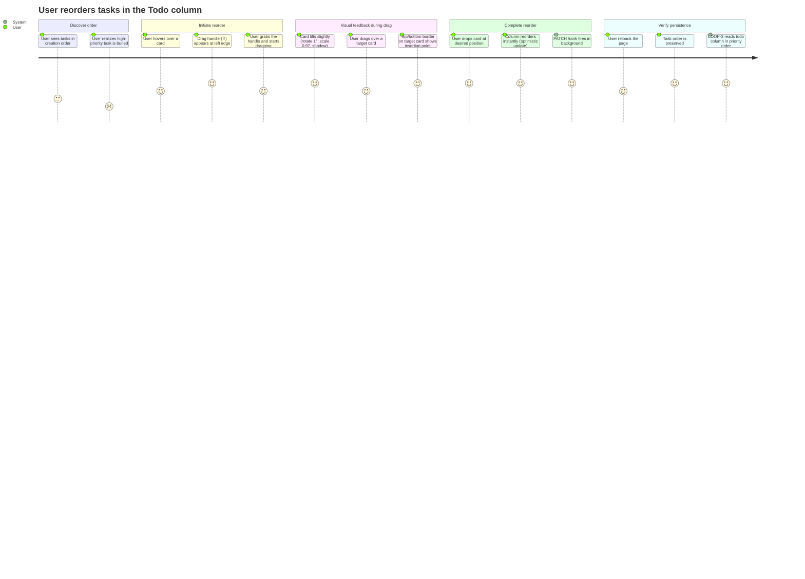

# Wireframes: QOL-1 — Manual Task Ordering (rank + drag-to-reorder)

## Screen Summary

This feature introduces **no new screens**. All changes are component-level modifications to the existing Kanban board:

| Component | Change |
|---|---|
| `TaskCard` | Drag handle icon (hover-only) + top/bottom drop indicator border |
| `Column` | Forwards `onDragOverTask` prop to TaskCard |
| `Board` | Extends `handleDrop` for same-column reorder + rank computation |

---

## Journey Map



### Pain Points Identified

| Pain Point | Impact | Resolution |
|---|---|---|
| Tasks listed in creation order — no prioritization | **High** | `rank` field + `ORDER BY rank ASC` |
| No way to tell where a card will land while dragging | **High** | Top/bottom border indicator on target card |
| Drag handle not visible → users may not know reorder is possible | **Medium** | `drag_indicator` icon, hover-only, left edge |
| Reloading loses the reordering effort | **High** | Server-persisted rank via `PATCH /rank` |
| LOOP-3 picks tasks in arbitrary order | **High** | `kanban_list_tasks` now respects rank |

---

## Wireframe: TaskCard States

### State 1 — Default (no interaction)

```
┌─────────────────────────────────────────────────────┐
│  Implement login endpoint                           │
│  ╔════════╗ · 🟣 DE  developer-agent               │
│  ║feature ║                                         │
│  ╚════════╝                                         │
└─────────────────────────────────────────────────────┘
```

- No drag handle visible
- Standard card shadow (`shadow-card`)
- `bg-surface` (#111118 dark mode), `border-border` (rgba(255,255,255,0.08))
- `rounded-xl` (12px)

### State 2 — Hover (drag affordance revealed)

```
┌─────────────────────────────────────────────────────────────────────┐
│⠿  Implement login endpoint                    [← → ▶ 🗑]          │
│   ╔════════╗ · 🟣 DE  developer-agent                              │
│   ║feature ║                                                        │
│   ╚════════╝                                                        │
└─────────────────────────────────────────────────────────────────────┘
    ↑ drag_indicator (Material Symbol)
      opacity-0 → opacity-40 on hover
      position: absolute, left-2, top-50%, -translate-y-50%
      cursor: grab
```

- `drag_indicator` icon visible at left edge (opacity-40, text-text-disabled)
- `pl-6` padding on card to make room for handle
- Hover shadow: `0 4px 20px rgba(124,109,250,0.15)`
- `hover:ring-1 hover:ring-primary/30`
- Action menu pill (CardActionMenu) revealed at top-right

### State 3 — Being Dragged

```
  ╔═══════════════════════════════════════════════╗  ← purple ring
  ║⠿  Implement login endpoint                   ║
  ║   ╔════════╗ · 🟣 DE  developer-agent        ║
  ║   ║feature ║                                  ║
  ║   ╚════════╝                                  ║
  ╚═══════════════════════════════════════════════╝
          (rotated 1°, scale 0.97, opacity 0.80)
```

- `rotate-1 scale-[0.97]`
- `shadow-xl`
- `ring-1 ring-primary/40`
- `opacity-80`
- `aria-grabbed="true"`

### State 4 — Drop Target: Insert Above

```
══════════════ ← 2px border-t-primary (#7C6DFA) ══════════════
┌─────────────────────────────────────────────────────────────┐
│  Add MCP handler                                            │
│  ╔════════╗ · 🟣 SA  senior-architect                      │
│  ║feature ║                                                  │
│  ╚════════╝                                                  │
└─────────────────────────────────────────────────────────────┘
```

- `border-t-2 border-t-primary` classes applied when `isDragOverThis && insertBefore`
- Triggered when cursor is in the **top 50%** of the card's bounding box
- `ring-0` to avoid conflicting ring-shadow

### State 5 — Drop Target: Insert Below

```
┌─────────────────────────────────────────────────────────────┐
│  Add MCP handler                                            │
│  ╔════════╗ · 🟣 SA  senior-architect                      │
│  ║feature ║                                                  │
│  ╚════════╝                                                  │
└─────────────────────────────────────────────────────────────┘
══════════════ ← 2px border-b-primary (#7C6DFA) ══════════════
```

- `border-b-2 border-b-primary` classes applied when `isDragOverThis && !insertBefore`
- Triggered when cursor is in the **bottom 50%** of the card's bounding box

### State 6 — Empty Drop Zone (tail of column)

```
┌ ─ ─ ─ ─ ─ ─ ─ ─ ─ ─ ─ ─ ─ ─ ─ ─ ─ ─ ─ ─ ─ ─ ─ ─ ─ ─ ─ ┐
   Drop here to move to bottom                               
└ ─ ─ ─ ─ ─ ─ ─ ─ ─ ─ ─ ─ ─ ─ ─ ─ ─ ─ ─ ─ ─ ─ ─ ─ ─ ─ ─ ┘
  (dashed border rgba(124,109,250,0.30), h-16, rounded-xl)
```

This is the column's existing `onDrop` area — no card-level indicator needed for tail drops.

---

## Wireframe: Column with Rank-Ordered Tasks

```
┌──────────────────────────────────────────────────────┐
│  Todo  [4]                                    [+]    │  ← Column header
├──────────────────────────────────────────────────────┤
│                                                      │
│  ┌────────────────────────────────────────────────┐  │
│  │ [rank:1000] Fix auth token expiry              │  │
│  │ ◆ feature  ·  🟣 QA  qa-engineer               │  │
│  └────────────────────────────────────────────────┘  │
│  ↕ 8px gap                                           │
│  ┌────────────────────────────────────────────────┐  │
│  │ [rank:2000] Add rate limiting middleware       │  │
│  │ ◆ feature  ·  🔵 DE  developer-agent          │  │
│  └────────────────────────────────────────────────┘  │
│  ↕ 8px gap                                           │
│  ┌────────────────────────────────────────────────┐  │
│  │ [rank:3000] Update OpenAPI docs                │  │
│  │ 🔬 tech-debt  ·  unassigned                    │  │
│  └────────────────────────────────────────────────┘  │
│                                                      │
│  [rank labels are invisible in production UI;        │
│   shown here for documentation only]                 │
└──────────────────────────────────────────────────────┘
```

Tasks are ordered `rank ASC, created_at ASC`. New tasks append at the tail (`MAX(rank) + 1000`).

---

## Wireframe: Drag-to-Reorder Interaction Flow

```
BEFORE DRAG:                        DURING DRAG (cursor on top-half of card B):

┌────────────────────┐              ┌────────────────────┐
│ [1000] Task A      │              │ [1000] Task A      │  ← still in place
└────────────────────┘              └────────────────────┘
┌────────────────────┐                                     ← Task C being dragged (floating)
│ [2000] Task B      │  ───→        ══ border-t-primary ══ ← insert indicator
└────────────────────┘              ┌────────────────────┐
┌────────────────────┐              │ [2000] Task B      │  ← dragOverTaskId = B, insertBefore=true
│ [3000] Task C      │              └────────────────────┘
└────────────────────┘              ╔════════════════════╗
                                    ║ [3000] Task C      ║  ← dragging (opacity 80%, rotate 1°)
                                    ╚════════════════════╝

AFTER DROP (newRank = (0 + 2000) / 2 = 1000):

┌────────────────────┐
│ [1000] Task C      │  ← PATCH /rank { rank: 1000.0 }
└────────────────────┘    wait, that conflicts — actual: newRank = (rank_A_prev + rank_B) / 2
┌────────────────────┐    = (1000 + 2000) / 2 = 1500
│ [1500] Task C      │  ← Task C moved to rank 1500 (between A and B)
└────────────────────┘
┌────────────────────┐
│ [2000] Task B      │  ← unchanged (single write, no cascade)
└────────────────────┘
┌────────────────────┐
│ [3000] Task A      │  ← wait, A was rank 1000. Recheck:
└────────────────────┘
```

**Correct flow** (from `computeDropRank`):
- Dragged: Task C (rank 3000)
- Over: Task B (rank 2000), `insertBefore = true`
- `prevRank` = rank of card above Task B in the filtered array = Task A = 1000
- `nextRank` = Task B = 2000
- `newRank` = (1000 + 2000) / 2 = **1500**
- Result: A=1000, C=1500, B=2000, (old C position empty)

```
AFTER DROP (correctly computed):

┌────────────────────┐
│ [1000] Task A      │
└────────────────────┘
┌────────────────────┐
│ [1500] Task C      │  ← moved here (single PATCH /rank write)
└────────────────────┘
┌────────────────────┐
│ [2000] Task B      │
└────────────────────┘
```

---

## Accessibility Notes

### Drag Handle
- `aria-hidden="true"` on the handle icon (it's a visual affordance only; the full card is draggable)
- `cursor-grab` / `active:cursor-grabbing` on the handle icon
- `draggable="true"` + `aria-grabbed={isDragging}` remain on the `article` element

### Drop Indicator
- Color alone (`border-primary`) is not the only signal — position (top vs bottom edge) conveys meaning
- The line is 2px thick (sufficient contrast against dark surface)
- Screen readers are not significantly affected — reorder state change is communicated by the resulting DOM order after drop

### Keyboard Accessibility
- Keyboard reordering is **out of scope** for this feature (HTML5 DnD is pointer-only)
- Document this gap: the existing context menu actions (move left/right column) provide keyboard-accessible column movement, but within-column ordering requires pointer drag
- WCAG 2.1 SC 2.1.1 (Keyboard) exception applies for drag-and-drop where an equivalent path exists (users can manually move tasks between columns, but within-column ordering is pointer-only in v1)

### WCAG 2.1 AA Checklist
- [x] `border-t-2 border-primary` (#7C6DFA on #111118) — contrast ratio ~5.2:1 ✓ (exceeds 3:1 for non-text)
- [x] `text-text-disabled` on drag handle (#F5F5FA at 30% on #111118) — decorative affordance, `aria-hidden`
- [x] Card `aria-grabbed` attribute updated during drag
- [x] No modal or focus trap changes — existing patterns unchanged
- [ ] **Gap**: Within-column keyboard reorder not supported (documented, v2 enhancement)

---

## Mobile-First Notes

### Touch / Mobile Behavior
- HTML5 `dragstart`/`dragover`/`drop` events do **not fire on iOS Safari** — existing limitation
- The drag handle is `opacity-0 group-hover:opacity-100` — on touch devices, `:hover` does not apply reliably
- `[@media(pointer:coarse)]:opacity-100` override is already used in `CardActionMenu` — apply the same to the drag handle: `[@media(pointer:coarse)]:opacity-30` (always faintly visible on touch)
- The `onDragOver` handler uses `getBoundingClientRect()` which works on mobile for pointer events (when a drag polyfill is added in a future iteration)

### Breakpoints
- No layout breakpoint changes — this is a component-level feature
- Column widths are unchanged (existing responsive behavior preserved)
- Touch reordering deferred to a future feature — polyfill candidates: `@atlaskit/drag-and-drop`, `dnd-kit`

---

## Stitch Design Screens

See [`wireframes-stitch.md`](./wireframes-stitch.md) for Stitch screen IDs and HTML download URLs.

---

## Validation Checklist

- [x] All task card states covered (default, hover, dragging, drop target above, drop target below)
- [x] Optimistic update + rollback flow documented
- [x] Rank computation with fractional midpoint documented
- [x] Rebalance scenario described (gap < 0.001)
- [x] API contracts match blueprint section 3.3
- [x] Error states: API failure → toast + revert
- [x] LOOP-3 integration: `GET /tasks?column=todo` respects rank
- [x] Accessibility gaps documented
- [x] Mobile limitation documented

---

## Questions for Stakeholders

1. **Keyboard reordering**: Should within-column reordering support keyboard (e.g., grab with Space, move with Arrow keys, drop with Enter)? This is a significant additional effort but required for full WCAG 2.1 AA compliance.
2. **Drag handle position**: The blueprint specifies left edge. Would right edge be less disruptive to the badge/avatar row? (Left edge requires `pl-6` padding adjustment.)
3. **Touch reordering**: Should we add an iOS touch-drag polyfill in this iteration, or defer to a follow-up?
4. **Rank visibility**: Should there be any admin/debug toggle to show raw rank values on cards? Useful for LOOP-3 debugging.
5. **Initial rank for cross-column drops**: When moving a task to a different column, it appends to the tail. Should there be a way to drop it at a specific position in the destination column (not just the tail)?
