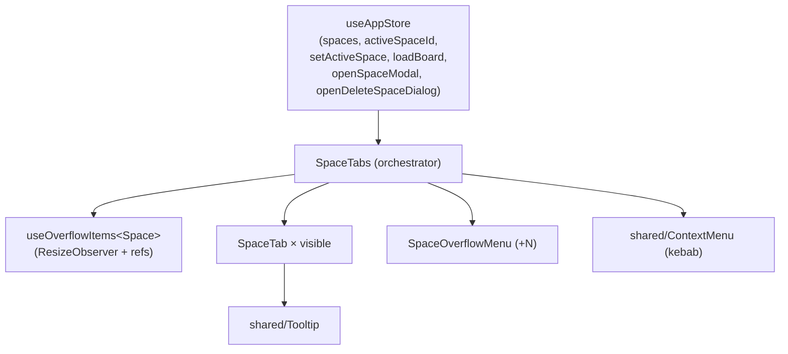

# Blueprint — Space Tabs: Overflow Handling & Visual Weight

**Feature:** `space-tabs-overflow`
**Author:** senior-architect
**Date:** 2026-06-03
**Scope:** Frontend-only (React + Tailwind). No backend, store-shape, or API change.

---

# REQUIREMENTS SUMMARY

## Problem
`SpaceTabs.tsx` renders one tab per space in a horizontal strip
(`overflow-x-auto scrollbar-none`). With 10+ spaces this breaks down:

1. **Overflow with no affordance.** The strip scrolls horizontally but the
   scrollbar is hidden (`scrollbar-none`), so the user gets no signal that
   spaces exist off-screen and no easy way to reach them.
2. **Flat visual weight.** Every tab looks the same except a subtle
   `bg-primary/10` on the active one. The active space does not stand out.
3. **Noise from long technical names.** Names like `related-tags-motive` and
   `ltr-empathyai-questions` are full-width and untruncated, making the bar
   loud and crowding out everything else.

## Functional requirements
- **FR-1** The tab area MUST NOT overflow the viewport horizontally at any
  space count or window width. No hidden horizontal scroll.
- **FR-2** The active space MUST always be reachable in one click and MUST
  always be visible (never hidden inside an overflow menu).
- **FR-3** Spaces that do not fit MUST be reachable from a single "overflow"
  control (a `+N` button opening a dropdown list).
- **FR-4** Long names MUST be truncated to a bounded width with the full name
  available on hover (tooltip) and via `title`.
- **FR-5** The active tab MUST be visually distinct from inactive tabs at a
  glance (color, weight, and an accent indicator).
- **FR-6** All existing behaviours are preserved: switch space (loads board),
  kebab → Edit / Delete, add-space button, last-space delete-guard, ARIA
  `role="tablist"`/`role="tab"`/`aria-selected`.

## Non-functional requirements
- **NFR-1 (Performance)** Overflow recomputation MUST be O(n) in tab count and
  debounced/`requestAnimationFrame`-gated on resize. Target: no measurable jank
  with 30 spaces on a 1280px-wide viewport (recompute < 4 ms).
- **NFR-2 (Accessibility)** WCAG 2.1 AA: keyboard navigable (Tab/Enter/Escape,
  arrow keys within the overflow menu), focus-visible rings, `aria-*` preserved,
  contrast ≥ 4.5:1 for the active-tab treatment in both dark and light themes.
- **NFR-3 (Design system)** Tailwind tokens only (`bg-surface-*`, `text-*`,
  `border-border`, `duration-fast`). No inline styles. Reuse shared `Tooltip`
  and the `ContextMenu`/portal-dropdown pattern.
- **NFR-4 (No regressions)** No change to `useAppStore` shape, `Space` type, or
  any API. The component contract of `<SpaceTabs />` (no props) is unchanged.

## Constraints / assumptions
- Stack: React 19 + TS + Tailwind v4 + Zustand (see `frontend/`).
- Reusable assets present: `hooks/useMediaQuery.ts`, `hooks/useDebounce.ts`,
  `components/shared/Tooltip.tsx`, `components/shared/ContextMenu.tsx`,
  `components/modals/GlobalSearchModal.tsx` and
  `components/folio/ReferenceAutocomplete.tsx` (searchable-dropdown precedents).
- **Assumption A1:** "10+" is the realistic upper bound; design verified to 30.
- **Assumption A2:** Mobile (`< sm`) keeps a horizontally scrollable strip with
  edge fade — the measurement/overflow-menu pattern targets `≥ sm`. (Documented
  as a deviation candidate; UX may unify.)

---

# TRADE-OFFS

## Trade-off 1 — Overflow model: Responsive overflow-menu vs. Picker vs. Scroll
- **Option A — Responsive tab bar + overflow dropdown (priority+ pattern).**
  Show as many tabs as fit; collapse the rest into a `+N` button that opens a
  (searchable when long) dropdown. Active tab is pinned visible.
  - Pros: keeps one-click switching for frequent spaces; never overflows;
    familiar (VS Code / browser tab-overflow); incremental — preserves the tab
    mental model and all existing affordances.
  - Cons: needs DOM measurement (ResizeObserver + per-tab width) — the most
    code of the three.
- **Option B — Single space-switcher button + dropdown/command-palette (picker).**
  Replace the strip with one prominent button showing the active space; click
  opens a searchable list of all spaces.
  - Pros: simplest code; zero measurement; constant width; active space gets
    maximum prominence; scales infinitely.
  - Cons: removes at-a-glance multi-space visibility and one-click adjacent
    switching — every switch becomes two clicks. A regression for the common
    "bounce between 2–3 active projects" flow.
- **Option C — Horizontal scroll with affordances (edge fades + scroll buttons).**
  - Pros: least logic; no measurement of individual tabs.
  - Cons: does not reduce noise (all long names still rendered); scanning 10+
    by scrolling is slow; active tab can scroll out of view. Weakly satisfies FR-1.
- **Recommendation: Option A.** It is the only option that satisfies all three
  stated goals simultaneously — no overflow (FR-1), active always visible and
  one-click (FR-2/FR-5), and reduced noise via truncation + collapsing the tail
  (FR-3/FR-4) — while preserving the tab model users already have. Option C is
  retained as the **mobile fallback** (A2). Option B's command-palette idea is
  folded in as the *search box inside the overflow dropdown*, capturing its best
  property (search) without losing one-click switching.

## Trade-off 2 — Overflow measurement: ResizeObserver+refs vs. CSS-only vs. fixed cap
- **Option A — Measure (ResizeObserver on container + per-tab widths via refs),
  compute the visible set each layout.**
  - Pros: pixel-accurate; adapts to any name length, font, zoom, and window
    width; no magic numbers.
  - Cons: requires a measurement hook and a hidden/again-render pass.
- **Option B — Fixed cap (always show first N, rest in overflow).**
  - Pros: trivial, no measurement.
  - Cons: wastes space on wide screens, still overflows on narrow ones with long
    names; N is a guess. Fails FR-1 at small widths.
- **Recommendation: Option A.** FR-1 must hold at *every* width and name length;
  only measurement guarantees that. Encapsulated in a single reusable
  `useOverflowItems` hook so the complexity is contained and unit-testable.

## Trade-off 3 — Active-tab emphasis: accent-underline + fill vs. fill-only vs. pill
- **Option A — Filled chip (`bg-primary/12`) + accent underline indicator +
  `font-medium` + full-opacity label; inactive tabs lighter
  (`text-text-secondary`, no persistent kebab).**
  - Pros: multi-channel distinction (color + weight + position) → unmistakable
    and AA-contrast-safe; the underline reads as "current section".
  - Cons: slightly more markup (indicator element).
- **Option B — Stronger fill only (current approach, darker).**
  - Pros: minimal.
  - Cons: color-only distinction is weak for low-vision users and in light theme.
- **Recommendation: Option A.** FR-5 + NFR-2 require the active state to be
  obvious and not rely on color alone; the accent indicator adds a redundant,
  position-based cue.

---

# ARCHITECTURAL BLUEPRINT

## 3.1 Core components

| Component | Responsibility (single) | Tech / pattern |
|---|---|---|
| `SpaceTabs.tsx` (refactor) | Orchestrate: read store, run overflow hook, render visible tabs + overflow button + add button + context menu. No measurement math itself. | React fn component, no new props |
| `useOverflowItems<T>` (new hook) | Pure measurement: given a container ref + ordered items + a "pinned" item id, return `{ visible, overflow }` so visible fit the container width. ResizeObserver + rAF-gated. | `frontend/src/hooks/useOverflowItems.ts` |
| `SpaceTab.tsx` (new, extracted) | Render one tab: truncated label (max-w), Tooltip with full name when truncated, kebab affordance, active styling + accent indicator. | Reuses `Tooltip` |
| `SpaceOverflowMenu.tsx` (new) | `+N` trigger + portal dropdown listing overflow spaces; filter input shown when overflow count > threshold; keyboard nav; selecting switches space. | Reuses `ContextMenu` portal/positioning pattern; filter mirrors `ReferenceAutocomplete` |

**SOLID notes**
- `useOverflowItems` is generic and store-agnostic (single reason to change:
  measurement logic) → reusable, unit-testable, depends on no Prism types.
- `SpaceTabs` depends on the hook *abstraction*, not measurement internals.
- `SpaceTab` and `SpaceOverflowMenu` each own one rendering concern.

## 3.2 Flows

### Component composition (C4 container-level)


### Overflow recompute (the critical flow)
```mermaid
sequenceDiagram
  participant U as User / Window
  participant RO as ResizeObserver
  participant H as useOverflowItems
  participant ST as SpaceTabs
  participant DOM as Tab DOM (refs)

  Note over ST,DOM: Pass 1 — measure (all items rendered offscreen-measurable)
  ST->>DOM: render all tabs, capture per-item widths via refs
  U->>RO: resize / spaces change / activeSpace change
  RO->>H: container width = W
  H->>H: greedily fit items (reserve +N + add-btn width);<br/>always include pinned (active) id
  H-->>ST: { visible[], overflow[] }
  Note over ST,DOM: Pass 2 — paint (visible tabs + "+N" + add)
  ST->>DOM: render visible tabs, overflow button if overflow.length>0
```

### Switching from the overflow menu
```mermaid
sequenceDiagram
  participant U as User
  participant OM as SpaceOverflowMenu
  participant S as useAppStore
  U->>OM: click "+N"
  OM-->>U: dropdown (filter input if list long)
  U->>OM: pick space (or type to filter, Enter)
  OM->>S: setActiveSpace(id)
  OM->>S: loadBoard()
  S-->>U: board reloads; picked space now rendered as a visible tab (pinned)
```

## 3.3 Interfaces / contracts

This feature exposes **no network API**. Internal contracts:

**`useOverflowItems` hook contract**
```ts
interface OverflowOptions {
  /** id of an item that must never be placed in overflow (the active space). */
  pinnedId?: string;
  /** px reserved on the trailing edge for the "+N" button + add button. */
  reservedTrailingPx?: number; // default ~72
  gapPx?: number;              // inter-tab gap, default 2 (gap-0.5)
}
interface OverflowResult<T> {
  containerRef: (el: HTMLElement | null) => void;
  setItemRef: (id: string) => (el: HTMLElement | null) => void;
  visible: T[];
  overflow: T[];
  /** true before the first measurement settles (render all to measure). */
  measuring: boolean;
}
function useOverflowItems<T extends { id: string }>(
  items: T[], opts?: OverflowOptions,
): OverflowResult<T>;
```

**`SpaceTab` props**
```ts
interface SpaceTabProps {
  space: Space;
  active: boolean;
  onSelect: (space: Space) => void;
  onKebab: (e: React.MouseEvent, spaceId: string) => void;
  refCb?: (el: HTMLElement | null) => void; // for measurement
}
```

**`SpaceOverflowMenu` props**
```ts
interface SpaceOverflowMenuProps {
  spaces: Space[];           // overflow set
  activeSpaceId: string;
  onSelect: (spaceId: string) => void;
  /** show a filter input when spaces.length exceeds this. Default 6. */
  filterThreshold?: number;
}
```

### Visual contract (design tokens — UX designer refines exact values)
- Active tab: `bg-primary/12 text-primary font-medium`, full-opacity label,
  **2px bottom accent** (`bg-primary`, rounded) as an absolutely-positioned
  indicator; persistent (faint) kebab at `opacity-70`.
- Inactive tab: `text-text-secondary hover:text-text-primary
  hover:bg-surface-variant`, kebab `opacity-0 group-hover:opacity-100`.
- Truncation: label `max-w-[160px] truncate` (token-tunable); `Tooltip` +
  `title` carry the full name (only when truncated).
- `+N` button: ghost icon-button styling matching the add-space button;
  shows `+N` count; active styling when its dropdown is open.
- Container: keep `border-b border-border bg-surface-elevated px-4`; **drop the
  `overflow-x-auto scrollbar-none`** on `≥ sm` (no scroll — overflow menu owns it).

## 3.4 Observability strategy
Client-only UI; no server telemetry added. Operability hooks:
- **Logs:** none in the happy path (avoid console noise). The hook may
  `console.warn` once if it cannot measure (no container) to aid debugging.
- **Test signals (the real "metrics" here):** unit tests assert visible/overflow
  partitioning at representative widths; component tests assert the active space
  is always in `visible`; E2E (Playwright) resizes the viewport and asserts no
  horizontal overflow (`scrollWidth <= clientWidth`) at 3, 12, 30 spaces.
- **`data-*` for E2E:** keep `data-space-id` on tabs; add
  `data-testid="space-overflow-btn"` and `data-overflow-count={N}` on the `+N`
  button so QA can assert counts deterministically.

## 3.5 Deploy strategy
Standard frontend flow — no infra change.
- Build: `cd frontend && npm run build` → `dist/` (served by `server.js`).
- CI gates (existing): typecheck → `cd frontend && npm test` (Vitest) →
  backend `npm test` (unaffected) → Playwright E2E (qa stage).
- Release: ships with the normal frontend build; **purely additive + a
  refactor of one component** → no migration, no feature flag required.
- Rollback: revert the feature commits; `SpaceTabs` returns to the scroll strip.

---

## Out of scope (future)
- Global Cmd+K space switcher (a `GlobalSearchModal` sibling) — the overflow
  dropdown's filter is a deliberate subset; full palette is a separate task.
- Drag-to-reorder spaces / pinning favourites.
- Server-side "recent spaces" ordering.

## Open questions / risks
- **R1 (measurement flash):** the measure→paint two-pass can flash on first
  render. *Mitigation:* render the measure pass with `visibility:hidden` via a
  Tailwind utility (not inline style) or render all then hide overflow in the
  same frame using `useLayoutEffect`; `measuring` flag gates the `+N` button.
- **R2 (active in overflow):** if the active space would land in overflow, the
  hook must force it visible (drop the last-fitting non-active tab instead).
  Covered by `pinnedId`. Unit-tested.
- **Q1 (mobile):** keep scroll-strip on `< sm` (A2) or unify on the overflow
  menu everywhere? Defer to UX. Recorded as a Kanban note.
