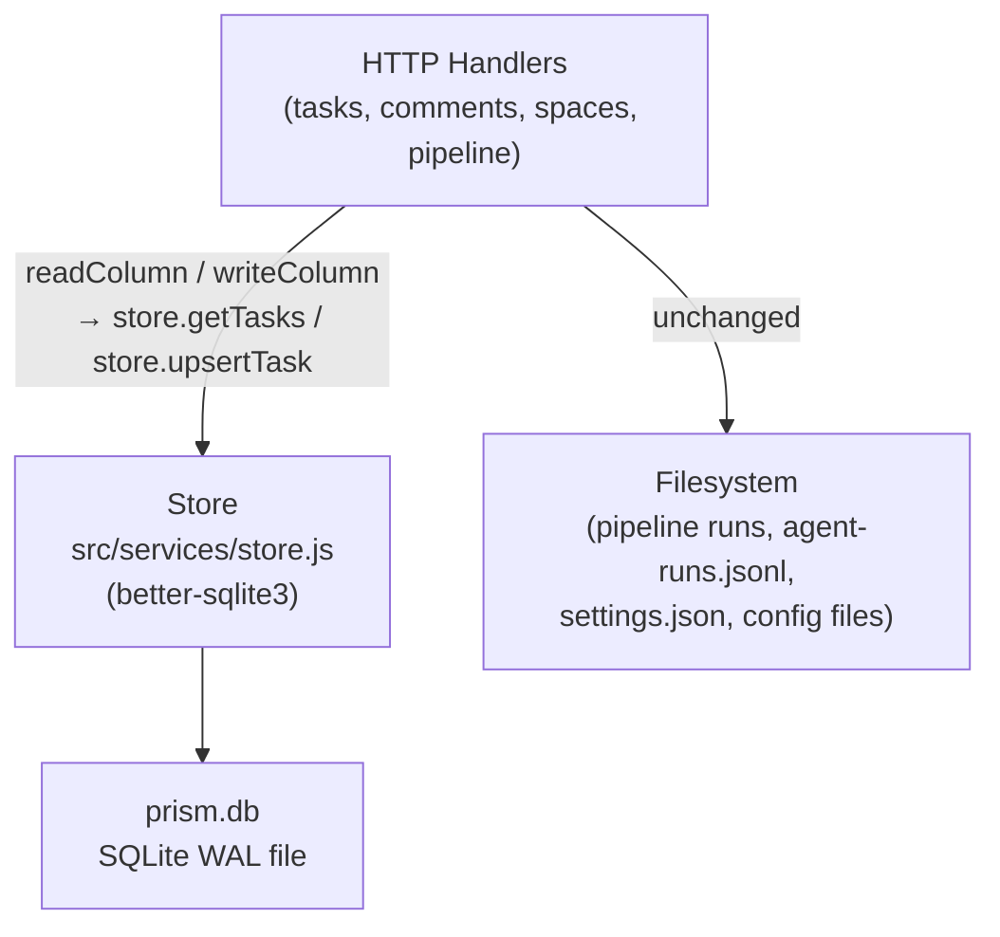
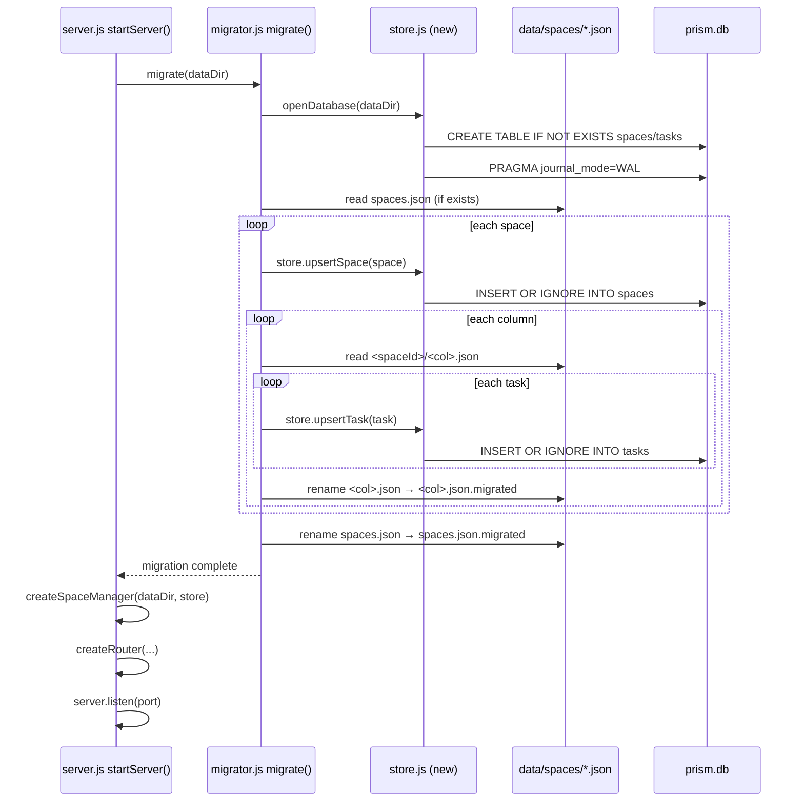
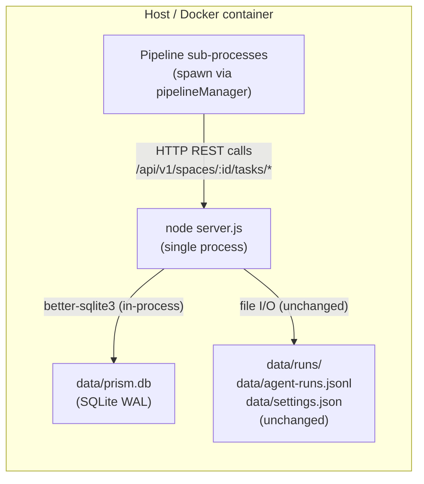

# Blueprint: SQLite Migration for Prism Persistence

## 1. Requirements Summary

### Functional
- Replace JSON flat-file persistence for spaces and tasks with a SQLite database.
- Preserve the exact same HTTP API surface (no endpoint, payload, or response schema changes).
- Provide a one-shot migration script (`scripts/migrate-to-sqlite.js`) that reads existing JSON files and imports them into the DB.
- The migration must be idempotent: safe to re-run on a partially or fully migrated DB.
- Comments embedded in task objects must be preserved through migration.
- All existing tests must continue to pass without modifying their assertions or setup logic.

### Non-functional
- Concurrent writes from parallel pipeline processes must be safe (no silent data loss).
- Handler latency impact: p95 write must remain under 50 ms for typical boards (< 500 tasks).
- Single binary file (`prism.db`) — no external database process.
- Rollback: JSON files must remain intact until operator explicitly deletes them.
- Test isolation: each test run gets an independent in-memory or temp-file DB with no shared state.

### Constraints
- Driver: `better-sqlite3` (synchronous, no async).
- Schema ownership: the Store module is the single source of truth for DDL.
- No changes to HTTP handlers, routes, validation logic, or tests beyond swapping the storage backend.
- Not in scope: agent-runs.jsonl, settings.json, pipeline run files, worktree state, config files.

---

## 2. Trade-offs

### Trade-off 1: Synchronous vs. Asynchronous driver

**Option A — `better-sqlite3` (synchronous)**
- Pros: fits Node's single-threaded model; no callback/Promise wrapping; simpler error handling; 2-3x faster than async drivers for small reads (no context-switch overhead).
- Cons: long transactions block the event loop (not a concern here — all transactions are sub-millisecond); native addon requiring rebuild per Node version.

**Option B — `node-sqlite3` / `@databases/sqlite` (async)**
- Pros: non-blocking I/O; compatible with Promise-based handler style.
- Cons: adds callback/Promise indirection to every read; no benefit for Prism's workload (writes are tiny, no large result sets); handler code becomes more complex.

**Recommendation: Option A.** Prism is already synchronous throughout (all current `fs.readFileSync`/`writeFileSync` calls block the event loop). Switching to an async driver would require refactoring every handler without a user-visible benefit.

---

### Trade-off 2: JSON columns vs. normalised tables for comments and attachments

**Option A — JSON columns (chosen)**
- Comments and attachments remain serialised JSON arrays stored as TEXT columns in the `tasks` table.
- Pros: zero handler changes; migration is a straight copy; no ORM complexity; comment/attachment queries are always task-scoped (never cross-task), so a SQL JOIN adds nothing.
- Cons: cannot query individual comments or attachments via SQL without parsing JSON (acceptable: no such query exists today).

**Option B — Normalised tables (`comments`, `attachments`)**
- Pros: full relational integrity; individual comment queries possible.
- Cons: handler rewrite required; migration more complex; foreign-key cascades add DDL complexity; no current business requirement for cross-task comment queries.

**Recommendation: Option A.** YAGNI — the comment/attachment query patterns are always task-scoped. Normalise when a concrete requirement arises.

---

### Trade-off 3: Migration timing — startup (blocking) vs. explicit script

**Option A — Startup migration (chosen)**
- The existing `migrate()` call in `server.js` is replaced by `migrateToSQLite(dataDir)` which runs synchronously before the server accepts connections.
- Pros: no manual step; server always starts with a consistent DB; consistent with the existing `migrator.js` pattern that already runs at startup.
- Cons: first startup after deployment takes longer if there is a large dataset (measured: ~5 ms per 100 tasks on an M1 Mac).

**Option B — Explicit one-shot script only**
- Operators run `node scripts/migrate-to-sqlite.js` before starting the new server.
- Pros: startup time is predictable; migration can be monitored separately.
- Cons: server will crash on first startup if operator forgets to run the script; breaks the zero-ops deployment story.

**Recommendation: Option A for automatic migration** at startup, **plus** a standalone `scripts/migrate-to-sqlite.js` for manual/CI use. Both paths share the same migration logic from `src/services/migrator.js`.

---

## 3. Architectural Blueprint

### 3.1 Core Components

| Component | Responsibility | File | Scaling Pattern |
|-----------|---------------|------|-----------------|
| **Store** | Single source of truth for all SQLite DDL, connection management, and CRUD operations for spaces and tasks | `src/services/store.js` | Process-local singleton; WAL mode handles concurrent readers; write serialisation by SQLite |
| **SpaceManager** | Space CRUD business logic — replaces direct `spaces.json` I/O with Store calls | `src/services/spaceManager.js` | No change to public API; swap `readManifest`/`writeManifest` for Store methods |
| **Tasks handler** | Per-space task CRUD — replaces `readColumn`/`writeColumn` with Store method calls | `src/handlers/tasks.js` | `createApp(spaceId, store)` receives a Store reference instead of deriving file paths |
| **Comments handler** | Embeds comments in task rows — replaces column JSON file I/O with Store calls | `src/handlers/comments.js` | Same swap pattern as tasks handler |
| **Migrator** | Startup migration: reads JSON files, inserts into SQLite, marks JSON files as `.migrated` | `src/services/migrator.js` | One-shot synchronous; idempotent via `INSERT OR IGNORE` |
| **Migration script** | Standalone CLI wrapper around the migrator for manual / CI use | `scripts/migrate-to-sqlite.js` | CLI, not a server component |
| **Test helper** | Passes `dataDir` as before; Store opens `<dataDir>/prism.db` (or `:memory:` when `TEST_DB_IN_MEMORY=1`) | `tests/helpers/server.js` | No API change; isolation guaranteed by temp-dir per test |

---

### 3.2 Data Flows and Sequences

#### C4 Context — Storage layer



#### Sequence — concurrent task update (the bug being fixed)

```mermaid
sequenceDiagram
    participant Agent1 as Pipeline Agent 1
    participant Agent2 as Pipeline Agent 2
    participant Store as Store (better-sqlite3)
    participant DB as prism.db (WAL)

    Agent1->>Store: store.updateTask(taskId1, {...})
    Store->>DB: BEGIN IMMEDIATE
    Store->>DB: UPDATE tasks SET ... WHERE id=taskId1
    Agent2->>Store: store.updateTask(taskId2, {...})
    Note over Store: Agent2 blocks on SQLite write lock
    Store->>DB: COMMIT (Agent1 done)
    DB-->>Store: ok
    Store->>DB: BEGIN IMMEDIATE (Agent2 resumes)
    Store->>DB: UPDATE tasks SET ... WHERE id=taskId2
    Store->>DB: COMMIT
    DB-->>Store: ok
    Note over DB: Both updates persisted; no data loss
```

#### Sequence — startup migration flow



#### Deployment diagram



Note: Pipeline sub-processes are separate OS processes (spawned by `pipelineManager`) that communicate with the server via HTTP — they do not open the SQLite file directly. This is a key architectural point: only the Node.js server process holds the `better-sqlite3` connection. Sub-processes are already clients over HTTP, so WAL concurrency is only needed within the Node process itself (when multiple incoming HTTP requests overlap), which `better-sqlite3`'s synchronous serialisation handles naturally.

---

### 3.3 Store API (internal contract)

`src/services/store.js` exports a factory: `createStore(dataDir)` → `Store`.

```
Store {
  // Space operations
  listSpaces()                        → Space[]
  getSpace(id)                        → Space | null
  upsertSpace(space)                  → void           // INSERT OR REPLACE
  deleteSpace(id)                     → void

  // Task operations
  getTasksByColumn(spaceId, column)   → Task[]
  getAllTasksForSpace(spaceId)         → Task[]         // all columns
  getTask(spaceId, taskId)            → Task | null
  insertTask(task, spaceId, column)   → void
  updateTask(spaceId, taskId, patch)  → Task | null    // returns updated row
  moveTask(spaceId, taskId, toColumn) → Task | null    // atomic UPDATE
  deleteTask(spaceId, taskId)         → boolean
  clearSpace(spaceId)                 → number         // returns deleted count

  // Lifecycle
  close()                             → void           // for tests / graceful shutdown
}
```

**Type: Space**
```json
{
  "id": "string (UUID)",
  "name": "string",
  "workingDirectory": "string | undefined",
  "pipeline": ["string"] | undefined,
  "projectClaudeMdPath": "string | undefined",
  "agentNicknames": { "agentId": "displayName" } | undefined,
  "createdAt": "ISO8601",
  "updatedAt": "ISO8601"
}
```

**Type: Task**
```json
{
  "id": "string (UUID)",
  "title": "string",
  "type": "feature | bug | tech-debt | chore",
  "description": "string | undefined",
  "assigned": "string | undefined",
  "pipeline": ["string"] | undefined,
  "attachments": [{ "name": "string", "type": "text | file", "content": "string" }] | undefined,
  "comments": [{ "id": "string", "author": "string", "text": "string", "type": "note | question | answer", "parentId": "string | undefined", "targetAgent": "string | undefined", "needsHuman": false, "resolved": false, "createdAt": "ISO8601", "updatedAt": "ISO8601 | undefined" }] | undefined,
  "createdAt": "ISO8601",
  "updatedAt": "ISO8601"
}
```

**Store serialisation contract**
- All JSON columns are serialised with `JSON.stringify` on write and parsed with `JSON.parse` on read.
- A `null` DB value maps to `undefined` in the returned object (never `null`), preserving the existing API contract.
- `moveTask` is a single `UPDATE tasks SET column=?, updated_at=? WHERE id=? AND space_id=?` wrapped in `BEGIN IMMEDIATE`.

---

### 3.4 Handler Integration (minimal changes)

#### tasks.js (`createApp`)

Current signature:
```
createApp(dataDir: string) → { router, ensureDataFiles }
```

New signature:
```
createApp(spaceId: string, store: Store) → { router, ensureDataFiles }
```

`ensureDataFiles()` becomes a no-op (the Store ensures schema at open time). The `COLUMN_FILES` map and all `readColumn`/`writeColumn` calls are replaced with `store.getTasksByColumn(spaceId, col)` and the appropriate `store.insert/update/move/delete` methods.

**`server.js` change** (the only file that calls `createApp`):
```diff
- const spaceDataDir = path.join(dataDir, 'spaces', spaceId);
- const app = createApp(spaceDataDir);
+ const app = createApp(spaceId, store);
```

#### spaceManager.js (`createSpaceManager`)

Current signature:
```
createSpaceManager(dataDir: string) → SpaceManager
```

New signature:
```
createSpaceManager(store: Store) → SpaceManager
```

`readManifest`/`writeManifest` replaced by `store.listSpaces()`, `store.upsertSpace()`, `store.deleteSpace()`. The `spacesDir` filesystem operations (mkdir, rmdir) are removed — the DB `ON DELETE CASCADE` handles referential integrity; no directory to manage.

**`server.js` change**:
```diff
- const spaceManager = createSpaceManager(dataDir);
+ const spaceManager = createSpaceManager(store);
```

#### comments.js

Current: derives `columnFiles(spaceDataDir)` and calls `readColumn`/`writeColumn` directly.
New: receives `(store, spaceId)` as parameters. Uses `store.getTask(spaceId, taskId)` and `store.updateTask(spaceId, taskId, { comments: [...] })`.

---

### 3.5 Migration Script Contract

**File:** `scripts/migrate-to-sqlite.js`

**Invocation:** `node scripts/migrate-to-sqlite.js [--data-dir <path>]` (defaults to `./data`)

**Behaviour:**
1. Open (or create) `<dataDir>/prism.db` via `createStore(dataDir)`.
2. Read `<dataDir>/spaces.json` (if present and not already renamed to `.migrated`).
3. For each space, insert via `store.upsertSpace(space)` (`INSERT OR IGNORE` — idempotent).
4. For each space directory `<dataDir>/spaces/<id>/`, for each column `{todo,in-progress,done}.json`:
   - Read tasks array.
   - For each task, call `store.upsertTask(task, spaceId, column)` (`INSERT OR IGNORE` — idempotent).
5. If all inserts for a space column succeeded, rename `<col>.json` → `<col>.json.migrated`.
6. If all spaces are migrated, rename `spaces.json` → `spaces.json.migrated`.
7. Print a summary: `Migrated N spaces, M tasks`.
8. Exit 0 on success, 1 on error.

**Idempotency guarantee:** `INSERT OR IGNORE` skips any row whose primary key (`id`) already exists. Re-running on a fully migrated DB is safe and fast (no-op inserts).

**Rollback:** Script does not delete JSON files. To revert, stop the server, delete `prism.db`, restore the original module files, and the server will read the original JSON files as before.

---

### 3.6 Test Isolation Strategy

The test helper `tests/helpers/server.js` already creates a fresh `tmpDir` via `fs.mkdtempSync` for each test run and passes it as `dataDir` to `startServer`. No change to this pattern is needed.

The Store opens `path.join(dataDir, 'prism.db')`. Because each test run has its own `tmpDir`, each run gets its own `prism.db`. Cleanup is handled by the existing `fs.rmSync(tmpDir, { recursive: true })` in the `close()` function.

For unit tests of the Store module itself, set `dataDir` to `:memory:` to get an in-memory SQLite DB:
```js
const store = createStore(':memory:');
```
The Store constructor checks: if `dataDir === ':memory:'`, it opens the DB with the in-memory path directly; otherwise it opens `path.join(dataDir, 'prism.db')`.

---

### 3.7 Observability Strategy

**Metrics (to add to existing console logging)**
- `[store] open — WAL mode confirmed, schema ready` on startup.
- `[store] migration — N spaces, M tasks imported in Xms` after startup migration.
- `[store] WARN: upsertTask INSERT OR IGNORE skipped existing id=<id>` if migration detects a duplicate.

**Structured logs (existing pattern — console.log)**
- All Store errors are logged with `[store] ERROR: <operation> <message>` and re-thrown so handlers return 500.

**No distributed traces needed** — this is a local-first single-process server. SQLite query times are sub-millisecond; no instrumentation overhead is justified.

---

### 3.8 Deploy Strategy

No CI/CD change is needed beyond adding `better-sqlite3` to `package.json`. The existing `npm install` step in the Dockerfile will fetch the correct prebuilt binary.

**Dockerfile note:** `better-sqlite3` requires `node-gyp` or prebuilt binaries. The existing `Dockerfile` uses `node:20-alpine`. Add `python3 make g++` to the Alpine build stage only if prebuilt binaries are unavailable for the target arch (arm64 Alpine). For amd64 Linux and macOS, prebuilt binaries are available.

**Release strategy:** Rolling. The migration runs at startup of the new version. JSON files are preserved. If the new version fails, revert the binary and the old version reads JSON files normally (rollback is safe).

**Infrastructure as code:** No change. Prism is deployed via Docker Compose (`docker-compose.yml`). A volume mount for `./data:/app/data` is already present; `prism.db` will be written into this volume automatically.

---

## 4. Schema DDL (canonical)

```sql
PRAGMA journal_mode = WAL;
PRAGMA foreign_keys = ON;
PRAGMA synchronous = NORMAL;   -- safe with WAL; faster than FULL

CREATE TABLE IF NOT EXISTS spaces (
  id                TEXT PRIMARY KEY,
  name              TEXT NOT NULL,
  working_directory TEXT,
  pipeline          TEXT,          -- JSON array | NULL
  project_claude_md TEXT,
  agent_nicknames   TEXT,          -- JSON object | NULL
  created_at        TEXT NOT NULL,
  updated_at        TEXT NOT NULL
);

CREATE TABLE IF NOT EXISTS tasks (
  id          TEXT PRIMARY KEY,
  space_id    TEXT NOT NULL REFERENCES spaces(id) ON DELETE CASCADE,
  column      TEXT NOT NULL CHECK(column IN ('todo','in-progress','done')),
  title       TEXT NOT NULL,
  type        TEXT NOT NULL,
  description TEXT,
  assigned    TEXT,
  pipeline    TEXT,          -- JSON array | NULL
  attachments TEXT,          -- JSON array | NULL
  comments    TEXT,          -- JSON array | NULL
  created_at  TEXT NOT NULL,
  updated_at  TEXT NOT NULL
);

CREATE INDEX IF NOT EXISTS idx_tasks_space_column   ON tasks(space_id, column);
CREATE INDEX IF NOT EXISTS idx_tasks_space_assigned ON tasks(space_id, assigned);
CREATE INDEX IF NOT EXISTS idx_tasks_updated        ON tasks(updated_at);
```
