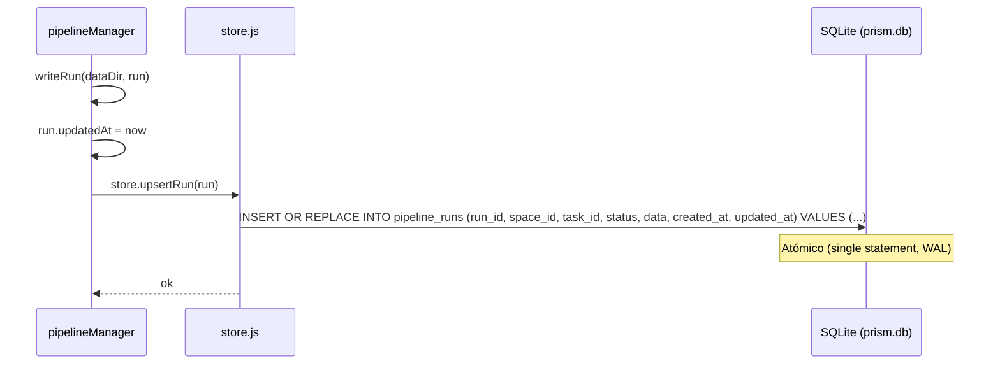
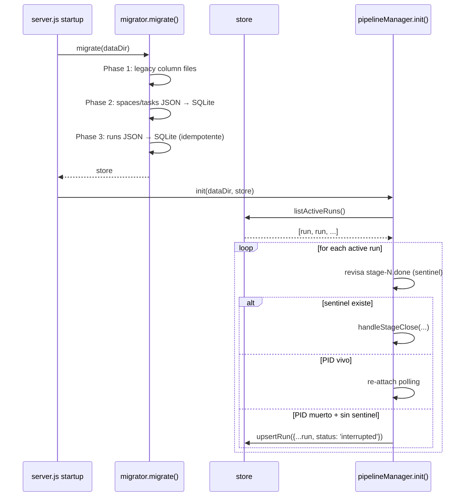
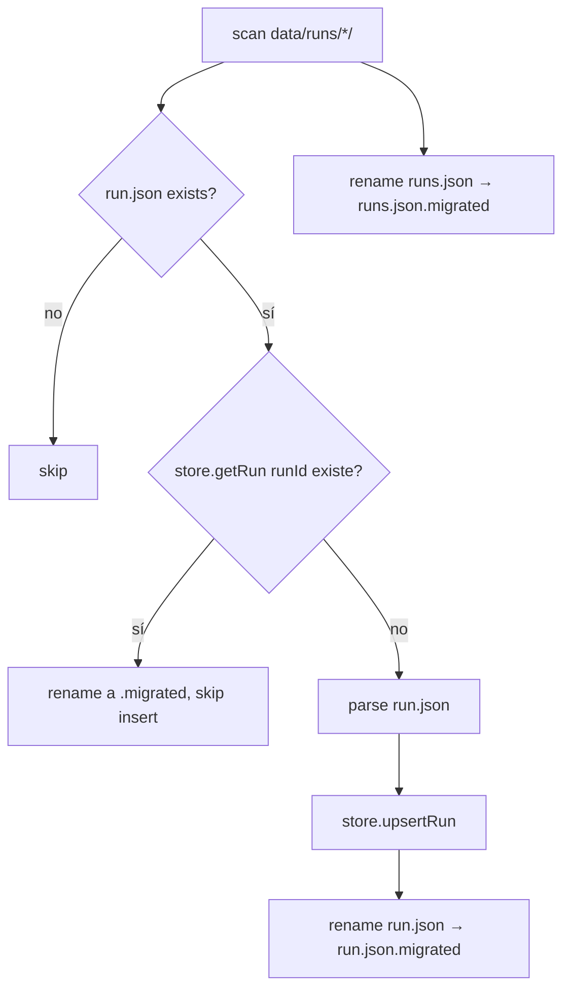

# Blueprint — Migrar pipeline runs de JSON/filesystem a SQLite

> Tech-debt: unifica la persistencia de runs con la del resto de entidades (spaces, tasks) en `data/prism.db`. Elimina la doble fuente de verdad (`runs.json` + `<runId>/run.json`), arregla el bug de runs perdidos por escrituras parciales, y habilita queries indexadas por `task_id`, `space_id`, `status`, `updated_at`.

---

## 1. Requirements summary

### Functional
- F1. Crear, leer, actualizar y borrar runs de pipeline desde SQLite (reemplaza `data/runs/<runId>/run.json` y `data/runs/runs.json`).
- F2. `listRuns()` indexado y ordenable por `created_at` / `updated_at` sin tener que leer 47 ficheros.
- F3. Lookup eficiente de "run activo de una tarea" (`findActiveRunByTaskId`) — hoy hace `readdirSync` + `readJSON` por entrada.
- F4. `init()` (rehidratación al arrancar) lee desde SQLite en vez de barrer `data/runs/`.
- F5. Migración automática y idempotente al arrancar: importa cualquier `data/runs/<runId>/run.json` existente que no esté ya en SQLite. No borra ficheros — los renombra a `.migrated`.
- F6. Compatibilidad con `data/runs/<runId>/` para artefactos de stage que **no** se migran:
  - `stage-N.log` (output streaming del subproceso)
  - `stage-N-prompt.md` (prompt expandido)
  - `stage-N.done` (sentinel de exit code)
  - `stage-N.inject` (loop-injection signal)
  - `resolver-<commentId>.done`

### Non-functional
- N1. **Durabilidad:** la escritura de un run debe ser atómica (transacción SQLite). Resuelve el bug observado de runs en UI que no aparecen en `runs.json` (server muere entre `writeRun` y `upsertRegistryEntry`).
- N2. **Latencia p95:** `getRun` < 2 ms, `listRuns` (≤ 500 runs) < 10 ms.
- N3. **Sin downtime / sin migración manual:** primer arranque tras el deploy ejecuta la migración inline antes de aceptar conexiones.
- N4. **Reversibilidad:** los `run.json` originales se preservan como `.migrated` durante al menos un release ciclo, para rollback.
- N5. **Cobertura tests > 90%** para el nuevo módulo `runStore` y > 80% para los cambios en `pipelineManager`.

### Constraints
- C1. **No introducir nuevas dependencias.** `better-sqlite3` ya está en uso (síncrono — encaja con el patrón actual).
- C2. **Patrón establecido:** usar `src/services/store.js` (factory `createStore(dataDir)`) — no crear un store paralelo.
- C3. **API pública de `pipelineManager` no cambia** — los handlers (`src/handlers/pipeline.js`) y los exports (`createRun`, `listRuns`, `getRun`, `stopRun`, `deleteRun`, `resumeRun`, `block/unblockRun*`, `findActiveRunByTaskId`) deben mantener su firma.

---

## 2. Trade-offs

### TO-1. Esquema: columnas explícitas vs blob JSON
- **Opción A — Una columna por campo del run** (`current_stage`, `stages`, `stage_statuses`, `working_directory`, `worktree`, `loop_counts`, …).
  - Pros: tipo fuerte, todas las queries posibles.
  - Cons: cada nuevo campo del run requiere `ALTER TABLE`; `stageStatuses` es lista anidada con sub-objetos — empuja a desnormalización inviable.
- **Opción B — Solo `data TEXT` JSON blob** + PK + `updated_at`.
  - Pros: cero schema migration cuando evoluciona el modelo.
  - Cons: imposible indexar por `status`, `task_id`, `space_id`, `created_at` — todas las queries serían scans.
- **Opción C (elegida) — Híbrido:** columnas indexadas para los pocos campos que se filtran/ordenan (`run_id`, `space_id`, `task_id`, `status`, `created_at`, `updated_at`) + `data TEXT` con el JSON completo para todo lo demás (incluida la copia de los campos indexados, para mantener la fuente única).
  - Pros: queries indexadas baratas + zero-friction para nuevos campos del modelo de run.
  - Cons: pequeña duplicación (`status` está en columna y en blob). Mitigación: el writer es un único punto (`upsertRun`) que rellena ambos sitios desde el mismo objeto `run`.

### TO-2. Migración: una sola pasada al startup vs lazy on-read
- **Opción A — Lazy:** migra el `run.json` la primera vez que alguien llama `getRun(runId)`.
  - Pros: arranque más rápido en repos con miles de runs.
  - Cons: comportamiento no determinista; `listRuns` antes de tocar runs individuales devolvería incompleto. Complica la lógica de `init()` que necesita el universo completo de runs activos.
- **Opción B (elegida) — Eager al startup**, dentro de `migrate()` (Phase 3, después de spaces/tasks).
  - Pros: invariante "después de `migrate()`, SQLite es la única fuente de verdad". Simplifica `init()`. Idempotente: salta runs ya presentes en la tabla.
  - Cons: ~1-3 ms por run a importar. En el repo actual (47 runs) es despreciable.

### TO-3. Bridge a logs/prompts/sentinels en disco
- **Opción A — Mover todo a SQLite** (incluso los logs de stage en una tabla `pipeline_run_logs`).
  - Pros: persistencia 100 % SQL.
  - Cons: los logs son streaming append-only de subprocesos — pasarlos por una tabla rompería el modelo de `child_process.spawn().stdout.pipe(fs.createWriteStream(...))` y `fs.createReadStream` para el endpoint de preview. Volumen alto (MB por run).
- **Opción B (elegida) — Solo `run.json` y `runs.json` van a SQLite.** Los ficheros `stage-N.log`, `stage-N-prompt.md`, `stage-N.done`, `stage-N.inject`, `resolver-*.done` siguen viviendo en `data/runs/<runId>/` y se gestionan con `fs` como hasta ahora.
  - Pros: cambio quirúrgico, preserva el patrón de streaming. `deleteRun` borra el directorio + el row SQLite — ambos pasos atómicos a nivel lógico.
  - Cons: la tabla `pipeline_runs` y el directorio `data/runs/<runId>/` pueden divergir si alguien borra el directorio a mano. Mitigación: `getRun` tolera ausencia del directorio (devuelve el run sin logs); `listRuns` no necesita tocar disco en absoluto.

---

## 3. Architectural design

### 3.1 Componentes afectados

| Componente | Responsabilidad | Cambio |
|------------|-----------------|--------|
| `src/services/store.js` | DDL + CRUD SQLite | **Añadir** tabla `pipeline_runs` y métodos: `getRun`, `upsertRun`, `listRuns`, `listActiveRuns`, `findActiveRunByTaskId`, `deleteRun`. |
| `src/services/migrator.js` | Migración JSON → SQLite | **Añadir Phase 3:** importar `data/runs/<runId>/run.json` → tabla `pipeline_runs`, renombrar fichero a `.migrated`. Importar `runs.json` no es necesario (se reconstruye desde los `run.json`); renombrar a `.migrated` igualmente. |
| `src/services/pipelineManager.js` | Lifecycle de runs | **Refactor:** `readRun`/`writeRun`/`readRegistry`/`upsertRegistryEntry`/`removeRegistryEntry` delegan en `_store`. `init()` itera `_store.listActiveRuns()` en vez de `readdirSync(runsDir)`. **Mantener** uso de `fs` para sentinels, prompts, logs, inject signals. |
| `src/handlers/pipeline.js` | HTTP endpoints | **Sin cambios en firma** — `pipelineManager.listRuns(dataDir)` sigue devolviendo el mismo shape. |
| `tests/` | | **Añadir** `tests/runStore.test.js` (unit) y `tests/pipeline-sqlite-restart.test.js` (integration). |

### 3.2 Esquema SQLite (tabla nueva)

```sql
CREATE TABLE IF NOT EXISTS pipeline_runs (
  run_id      TEXT PRIMARY KEY,
  space_id    TEXT NOT NULL,
  task_id     TEXT NOT NULL,
  status      TEXT NOT NULL,
  data        TEXT NOT NULL,          -- JSON blob: el objeto run completo
  created_at  TEXT NOT NULL,
  updated_at  TEXT NOT NULL
);

CREATE INDEX IF NOT EXISTS idx_runs_status     ON pipeline_runs(status);
CREATE INDEX IF NOT EXISTS idx_runs_task       ON pipeline_runs(task_id);
CREATE INDEX IF NOT EXISTS idx_runs_space      ON pipeline_runs(space_id);
CREATE INDEX IF NOT EXISTS idx_runs_updated    ON pipeline_runs(updated_at DESC);
CREATE INDEX IF NOT EXISTS idx_runs_task_status ON pipeline_runs(task_id, status);
```

**Notas:**
- No `FOREIGN KEY` a `tasks(id)`: un run puede sobrevivir al borrado de su tarea (auditoría histórica). Esto es coherente con el comportamiento actual.
- El blob `data` contiene el objeto completo (incluyendo `status`, `createdAt`, `updatedAt` — duplicados intencionados; ver TO-1).

### 3.3 Métodos del Store (firmas)

```js
// Lectura
store.getRun(runId)                          // → run | null
store.listRuns({ limit, offset, orderBy } = {}) // → run[] (default: ORDER BY updated_at DESC, sin límite)
store.listActiveRuns()                       // → run[] WHERE status IN ('pending','running','blocked','paused')
store.findActiveRunByTaskId(taskId)          // → run | null (más reciente activo de esa task)

// Escritura (idempotente — INSERT OR REPLACE)
store.upsertRun(run)                         // run debe tener {runId, spaceId, taskId, status, createdAt, updatedAt}

// Borrado
store.deleteRun(runId)                       // → boolean (true si existía)
```

Cada método es síncrono (mismo patrón que el resto del store).

### 3.4 Flujo: write run



Observa que **un solo statement** sustituye a las dos escrituras anteriores (`run.json` + `runs.json`). Esto cierra el bug de runs perdidos.

### 3.5 Flujo: server restart



### 3.6 Flujo: migración Phase 3 (idempotente)



### 3.7 APIs / contratos

**No cambian las firmas externas.** Las signatures de `pipelineManager`:

| Función | Firma | Cambio |
|---------|-------|--------|
| `init(dataDir, store)` | igual | implementación: `store.listActiveRuns()` en lugar de `readdirSync` |
| `createRun({...})` | igual | `writeRun` ahora habla con SQLite |
| `getRun(runId, dataDir)` | igual | delega en `store.getRun(runId)` |
| `listRuns(dataDir)` | `→ Promise<RunSummary[]>` | delega en `store.listRuns()`; mismo shape de salida (array de objetos con `runId, spaceId, taskId, status, createdAt, updatedAt`) |
| `stopRun / deleteRun / resumeRun / blockRun / unblockRun*` | iguales | leen y escriben vía store |
| `findActiveRunByTaskId(dataDir, taskId)` | igual | delega en `store.findActiveRunByTaskId(taskId)` |

**`RunSummary` shape (sin cambios):**
```json
{
  "runId":     "uuid",
  "spaceId":   "uuid",
  "taskId":    "uuid",
  "status":    "pending|running|blocked|paused|completed|failed|interrupted|aborted",
  "createdAt": "ISO-8601",
  "updatedAt": "ISO-8601"
}
```

**`Run` (full) shape:** sin cambios — exactamente el mismo objeto que hoy se serializa a `run.json` (campos: `runId, spaceId, taskId, stages, currentStage, status, stageStatuses, createdAt, updatedAt, dangerouslySkipPermissions, checkpoints, workingDirectory?, worktree?, loopCounts?, blockedReason?, resolverActive?`).

### 3.8 Observabilidad

- **Métricas (logs estructurados ya existentes vía `pipelineLog`):**
  - `run.persisted` — cada `upsertRun` (nuevo evento) — fields: `runId, status, latencyMs`.
  - `run.migration_imported` — Phase 3 — fields: `count, durationMs`.
- **Logs:** `[migrator] Phase 3 — N runs imported in Xms`. `[runStore]` para errores de schema/SQL.
- **Trazas:** no aplica (sin spans distribuidos en este proceso).
- **Health-check:** opcional — añadir `SELECT COUNT(*) FROM pipeline_runs WHERE status='running'` al endpoint de status si existe.

### 3.9 Deploy

- **Sin migration step manual** — Phase 3 corre inline al primer arranque.
- **Rollback plan:** si la migración corrompe runs:
  1. `pkill -f "node server.js"`
  2. Restaurar los `*.migrated` con `for f in data/runs/*/run.json.migrated; do mv "$f" "${f%.migrated}"; done && mv data/runs/runs.json.migrated data/runs/runs.json`
  3. Hacer rollback del binario al commit anterior.
  4. Borrar la tabla: `sqlite3 data/prism.db "DROP TABLE pipeline_runs;"` (no borra spaces/tasks).
- **Observabilidad post-deploy:** comprobar que `[migrator] Phase 3` aparece en stderr y que `SELECT COUNT(*) FROM pipeline_runs` ≈ número de directorios en `data/runs/`.

---

## 4. Open questions / risks

| Risk | Mitigation |
|------|-----------|
| Concurrencia: `writeRun` puede ser llamado simultáneamente desde el polling loop y desde un handler HTTP. | better-sqlite3 + WAL ya serializa escrituras a nivel de DB. `upsertRun` es un único statement. |
| `runs.json` y `<runId>/run.json` pueden contener un `run` ya en estado terminal pero aún no marcado como migrado. | `INSERT OR IGNORE` en Phase 3: si la fila ya existe en SQLite, gana SQLite y el JSON se marca `.migrated`. |
| Re-importación tras un rollback parcial (alguien restauró un `.migrated` sin borrar la fila SQL). | Phase 3 detecta colisión por PK (`runId`) → respeta SQLite, renombra el JSON. No hay sobreescritura. |
| Tests existentes que usan `tmpDir/runs/<runId>/run.json` directamente. | Auditarlos; los tests deben usar `_store` o helpers. Marcarlos para ajuste en `tasks.json` si los hay. |
