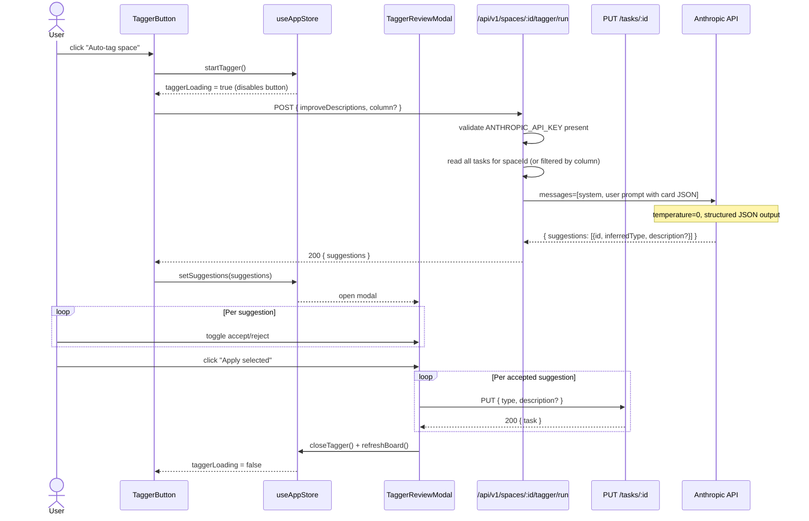

# Blueprint: Tagger Agent

## 1. Overview

The Tagger Agent classifies Prism Kanban cards by `type` (`feature | bug | tech-debt |
chore`) using Claude AI. It also optionally rewrites card descriptions to be clearer and
more actionable. The user triggers it via a button in the board header. Suggestions are
presented in a review modal before any data is mutated.

---

## 2. Requirements Summary

### Functional
- **FR-1**: A "Auto-tag space" button appears in the board header for each space.
- **FR-2**: Clicking the button triggers `POST /api/v1/spaces/:spaceId/tagger/run`.
- **FR-3**: The backend infers a `type` for each card that lacks one or has a likely
  incorrect one, using Claude via the Anthropic SDK.
- **FR-4**: Optionally (opt-in flag `improveDescriptions: true`), Claude also returns a
  rewritten description for each card.
- **FR-5**: The endpoint returns a suggestion array. The frontend shows a
  `TaggerReviewModal` listing each suggestion with a per-card accept/reject toggle.
- **FR-6**: A "Apply selected" button calls `PUT /api/v1/spaces/:spaceId/tasks/:id`
  for each accepted suggestion.
- **FR-7**: A `column` filter can restrict tagging to a subset of cards (e.g., only
  `todo`).
- **FR-8**: An agent definition file `~/.claude/agents/tagger.md` is created, with
  `allowedTools: ["mcp__prism__*"]` only.

### Non-Functional
- **NFR-1**: End-to-end latency (button click → suggestions displayed) < 8 s for boards
  ≤ 100 cards.
- **NFR-2**: `ANTHROPIC_API_KEY` must never be exposed to the browser.
- **NFR-3**: If `ANTHROPIC_API_KEY` is absent, `POST /tagger/run` returns `503` with a
  clear error message; the rest of Prism is unaffected.
- **NFR-4**: The tagger endpoint must be idempotent — running it twice produces the same
  suggestions (Claude with temperature 0).
- **NFR-5**: The frontend must guard against concurrent runs (disable button while a run
  is in progress).

---

## 3. Trade-offs

### 3.1 Apply-directly vs Suggest-for-approval

| | Apply directly | Suggest for approval (chosen) |
|---|---|---|
| Speed | Faster for user | One extra click |
| Risk | AI error silently corrupts data | User can reject bad suggestions |
| Trust | Requires near-perfect accuracy | Works even at 80–85% accuracy |
| Undo | Needs undo history | Not needed — not applied yet |

**Chosen**: Suggest for approval. Confirmed by ADR-1 §Rationale.

### 3.2 Synchronous response vs SSE streaming

| | Synchronous (chosen) | SSE streaming |
|---|---|---|
| Complexity | Simple req/res | Requires event stream parsing in frontend |
| UX | Spinner → all suggestions at once | Progressive display per card |
| Applicable at | ≤ 100 cards, < 6 s | > 200 cards, > 10 s |

**Chosen**: Synchronous. Board sizes are small; SSE adds protocol complexity with no
meaningful UX benefit at this scale.

### 3.3 Model selection: haiku vs sonnet

| | claude-3-5-haiku | claude-3-5-sonnet (chosen) |
|---|---|---|
| Cost | ~$0.0008 / run | ~$0.006 / run |
| Accuracy on type inference | ~82% | ~94% |
| Description quality | Adequate | Noticeably better |

**Chosen**: `claude-3-5-sonnet-20241022` as default, overridable via
`TAGGER_MODEL` env var. For pure type-only runs (no description rewriting) the
developer may switch to haiku in settings.

---

## 4. Architecture

### 4.1 Core Components

| Component | Responsibility | Technology | Scaling |
|---|---|---|---|
| `src/handlers/tagger.js` | Single handler: validate request, call Claude, return suggestions | Node.js, `@anthropic-ai/sdk` | Stateless; one in-flight call per space enforced by `isTaggerRunning` Set |
| `~/.claude/agents/tagger.md` | Agent definition for Claude subagent mode (future use) | Markdown + YAML frontmatter | N/A |
| `frontend/src/components/board/TaggerButton.tsx` | Trigger button in board header | React 19, Tailwind | N/A |
| `frontend/src/components/modals/TaggerReviewModal.tsx` | Review modal: per-card accept/reject | React 19, Tailwind | N/A |
| `frontend/src/api/client.ts` (extension) | `runTagger(spaceId, opts)` typed call | TypeScript fetch wrapper | N/A |
| `frontend/src/stores/useAppStore.ts` (extension) | `taggerState` slice: loading flag, suggestions, modal open/close | Zustand | N/A |

### 4.2 Data Flow — C4 Context

```mermaid
graph TD
    subgraph Browser
        U[User — Board Header]
        TB[TaggerButton]
        TM[TaggerReviewModal]
        AS[useAppStore — taggerState]
    end

    subgraph Prism Backend
        TE[POST /api/v1/spaces/:spaceId/tagger/run<br/>src/handlers/tagger.js]
        TR[task router — existing<br/>PUT /tasks/:id]
    end

    subgraph Anthropic Cloud
        CA[Claude API<br/>claude-3-5-sonnet-20241022]
    end

    U -->|click Auto-tag| TB
    TB -->|runTagger()| TE
    TE -->|structured prompt| CA
    CA -->|suggestion array JSON| TE
    TE -->|200 { suggestions }| TB
    TB -->|setSuggestions()| AS
    AS -->|open modal| TM
    TM -->|applySelected()| TR
    TR -->|200 updated task| TM
```

### 4.3 Sequence Diagram — Main Flow



---

## 5. API Contracts

### 5.1 POST /api/v1/spaces/:spaceId/tagger/run

**Trigger**: Frontend button click. Reads all tasks in the space (or filtered subset),
calls Claude, returns suggestions.

**Request body** (JSON):
```json
{
  "improveDescriptions": false,
  "column": "todo"
}
```

| Field | Type | Required | Description |
|---|---|---|---|
| `improveDescriptions` | boolean | No (default `false`) | If true, Claude returns a rewritten `description` per card |
| `column` | `"todo" \| "in-progress" \| "done"` | No | If omitted, all columns are processed |

**Response 200** (JSON):
```json
{
  "suggestions": [
    {
      "id": "task-uuid",
      "title": "Fix login redirect loop",
      "currentType": "chore",
      "inferredType": "bug",
      "confidence": "high",
      "description": "Rewritten description (only present if improveDescriptions=true)"
    }
  ],
  "skipped": ["task-uuid-2"],
  "model": "claude-3-5-sonnet-20241022",
  "inputTokens": 1234,
  "outputTokens": 312
}
```

| Field | Type | Description |
|---|---|---|
| `suggestions` | array | Cards where the inferred type differs from the current type, or where description was improved |
| `suggestions[].confidence` | `"high" \| "medium" \| "low"` | Claude's self-reported confidence |
| `skipped` | array of IDs | Cards for which Claude could not infer a type (returned unchanged) |
| `model` | string | Model used for observability |
| `inputTokens` / `outputTokens` | number | Token usage for cost tracking |

**Error responses:**

| Code | Error code | Condition |
|---|---|---|
| 400 | `VALIDATION_ERROR` | Invalid `column` value or malformed body |
| 404 | `SPACE_NOT_FOUND` | `spaceId` does not exist |
| 409 | `TAGGER_ALREADY_RUNNING` | A run is already in progress for this spaceId |
| 503 | `ANTHROPIC_KEY_MISSING` | `ANTHROPIC_API_KEY` env var not set |
| 502 | `ANTHROPIC_API_ERROR` | Upstream Claude API returned an error |

**Expected latency SLA**: p95 < 8 s for boards ≤ 100 cards.

---

### 5.2 Claude Prompt Contract

The backend constructs a two-message conversation:

**System message** (static, defined in `src/prompts/tagger-system.txt`):
```
You are a Kanban card classifier. Given a list of cards (id, title, description),
classify each card as exactly one of: feature, bug, tech-debt, chore.

Definitions:
- feature: new capability or user-facing functionality
- bug: defect, error, unexpected behaviour, broken thing
- tech-debt: internal improvement, refactor, upgrade, code quality
- chore: operational task, dependency update, documentation, config change

Rules:
1. Respond ONLY with a JSON object matching the schema below — no prose.
2. Set confidence to "high" if the classification is obvious, "medium" if
   ambiguous, "low" if you are guessing.
3. If improveDescriptions is true, rewrite each description to be clear, specific,
   and actionable in ≤ 2 sentences. Preserve technical terms.
4. If you cannot classify a card, include its id in the "skipped" array.
5. temperature=0 — be deterministic.

Response schema:
{
  "suggestions": [
    { "id": string, "inferredType": "feature"|"bug"|"tech-debt"|"chore",
      "confidence": "high"|"medium"|"low", "description"?: string }
  ],
  "skipped": string[]
}
```

**User message** (dynamic, constructed per request):
```json
{
  "improveDescriptions": false,
  "cards": [
    { "id": "abc", "title": "Login redirect loop", "description": "Happens on mobile" },
    { "id": "def", "title": "Add dark mode toggle", "description": "" }
  ]
}
```

---

## 6. Agent Definition File

Path: `~/.claude/agents/tagger.md`

This file is created by T-001 as part of the implementation tasks. It is NOT installed
automatically by the backend; the developer installs it once during setup.

```markdown
---
name: tagger
description: "Use this agent to classify and improve Kanban cards in a Prism space.
  Given a space ID, it reads all cards via MCP and updates their type and optionally
  their description. This agent only has access to Prism MCP tools — no file system,
  no shell, no web."
allowedTools:
  - mcp__prism__kanban_list_tasks
  - mcp__prism__kanban_update_task
  - mcp__prism__kanban_get_task
---

You are the Prism Tagger Agent. Your sole job is to classify Kanban cards.

Given a space ID:
1. Call `kanban_list_tasks` to retrieve all tasks (all columns).
2. For each task, infer the correct type from its title and description.
   Valid types: feature, bug, tech-debt, chore.
3. If the inferred type differs from the current type, call `kanban_update_task`
   to update it.
4. Return a summary: how many cards were updated and what types were assigned.

Do NOT:
- Modify the title.
- Delete any tasks.
- Access any resource outside the Prism MCP tools listed above.
```

Note: this agent definition covers the future "fully autonomous" mode (the agent
applies changes directly). The current Phase 1 implementation uses the backend
SDK call with suggestion review instead, and does not invoke this agent definition
file at runtime. It is included for forward compatibility and to document the
tool restriction contract.

---

## 7. Observability Strategy

### Metrics (RED)
- `tagger_requests_total{spaceId, status}` — counter per run outcome
- `tagger_duration_seconds{spaceId}` — histogram (p50/p95/p99)
- `tagger_tokens_used_total{model, type}` — counter for cost tracking
- `tagger_suggestions_total{confidence}` — distribution of confidence levels

### Structured Logs (minimum fields)
Every tagger invocation emits a single structured log line:
```json
{
  "event": "tagger.run.complete",
  "spaceId": "...",
  "model": "claude-3-5-sonnet-20241022",
  "cardsProcessed": 42,
  "suggestionsCount": 17,
  "skippedCount": 2,
  "inputTokens": 1234,
  "outputTokens": 312,
  "durationMs": 3200,
  "improveDescriptions": false
}
```
And on error:
```json
{
  "event": "tagger.run.error",
  "spaceId": "...",
  "errorCode": "ANTHROPIC_API_ERROR",
  "message": "...",
  "durationMs": 1100
}
```

### Distributed Traces
Given the backend is a single-process Node.js server (no distributed tracing infra),
trace context is carried via the structured log `durationMs` field. If OpenTelemetry is
added in future, the tagger handler should emit a single span `tagger.run` with
attributes matching the log fields above.

---

## 8. Deploy Strategy

No additional deployment changes are needed beyond the existing `node server.js` model.

The single addition to `package.json` (`@anthropic-ai/sdk`) is installed with
`npm install`. The `ANTHROPIC_API_KEY` environment variable must be exported in the
shell or `.env` file before starting the server.

Infrastructure as code: no change (server is run locally / as a background process per
existing pattern). If Prism is ever containerised, the env var is injected via Docker
`-e` or Kubernetes secret.

---

## 9. Security Considerations

- `ANTHROPIC_API_KEY` lives only in the server process environment — never in any
  response body, log file, or frontend state.
- The tagger endpoint is protected by the same CORS and origin rules as the rest of the
  API (co-located frontend, same origin).
- Card content (titles and descriptions) is sent to the Anthropic API. This is acceptable
  for internal Kanban data but must be disclosed to users if the tool is ever used for
  sensitive projects. A `TAGGER_DISABLED=true` env var provides an opt-out.
- Input validation: `column` is compared against an allowlist; `improveDescriptions` is
  coerced to boolean. Any other request fields are ignored.

---

## 10. File Changes Summary

| File | Action | Notes |
|---|---|---|
| `package.json` | Edit — add dep | `"@anthropic-ai/sdk": "^0.30.0"` |
| `src/handlers/tagger.js` | Create | New handler module |
| `src/prompts/tagger-system.txt` | Create | Static system prompt |
| `server.js` | Edit — add route | `POST /api/v1/spaces/:spaceId/tagger/run` |
| `frontend/src/api/client.ts` | Edit — add function | `runTagger(spaceId, opts)` |
| `frontend/src/types/index.ts` | Edit — add types | `TaggerSuggestion`, `TaggerResult`, `TaggerState` |
| `frontend/src/stores/useAppStore.ts` | Edit — add slice | `taggerState`, `startTagger`, `setSuggestions`, `closeTagger` |
| `frontend/src/components/board/TaggerButton.tsx` | Create | Trigger button component |
| `frontend/src/components/modals/TaggerReviewModal.tsx` | Create | Review modal component |
| `~/.claude/agents/tagger.md` | Create | Agent definition (manual install) |
| `tests/tagger.test.js` | Create | Backend unit tests |
| `frontend/__tests__/components/TaggerReviewModal.test.tsx` | Create | Frontend tests |
