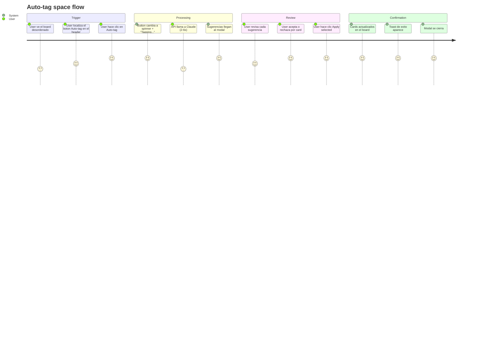

# Wireframes: Tagger Agent
**Feature:** Agente tagger — clasificacion automatica de cards por tipo
**Stage:** UX/API Design
**Date:** 2026-04-01
**Design tokens source:** `frontend/tailwind.config.js` + `frontend/src/index.css`

---

## Screen Summary

| ID | Screen | Component | Priority |
|----|--------|-----------|----------|
| S-01 | Board header — TaggerButton idle | TaggerButton | Must |
| S-02 | Board header — TaggerButton loading | TaggerButton | Must |
| S-03 | TaggerReviewModal — estado por defecto | TaggerReviewModal | Must |
| S-04 | TaggerReviewModal — improveDescriptions activo | TaggerReviewModal | Should |
| S-05 | TaggerReviewModal — applying (progreso) | TaggerReviewModal | Must |
| S-06 | TaggerReviewModal — empty (sin sugerencias) | TaggerReviewModal | Should |

---

## Journey Map



### Pain points identificados

| Pain point | Impacto | Mitigacion |
|------------|---------|------------|
| Latencia de 2-6s sin feedback | Alto | Spinner en boton + texto "Tagging..." durante la espera |
| Claude infiere tipo incorrecto | Alto | Modal de revision con toggle accept/reject por card |
| Sugerencias de baja confianza aceptadas por error | Medio | Indicador visual amber en filas con confianza baja |
| Usuario no sabe cuantas cards seran afectadas | Medio | Contador "Apply selected (N)" actualizado en tiempo real |
| Error de API de Anthropic | Medio | Toast de error con mensaje amigable + boton para reintentar |
| Doble clic accidental en Apply | Bajo | Boton Apply deshabilitado durante la peticion PUT |

---

## Wireframe S-01: Board header — TaggerButton idle

**Breakpoint:** Desktop 900px+. Mobile ver S-01-mobile.

```
┌──────────────────────────────────────────────────────────────────────────────────┐
│ PRISM HEADER (h=64px, bg-surface, border-bottom border-border)                   │
│                                                                                  │
│  [≡] My Space                       [+ New Task]  [⊞ Filter]  [✦ Auto-tag]     │
│       text-primary 20px semibold    ghost btn      ghost btn   ghost btn        │
│                                     h=36px         h=36px      h=36px          │
│                                     px-3           px-2        px-3            │
└──────────────────────────────────────────────────────────────────────────────────┘

 Leyenda TaggerButton (idle):
 ┌──────────────────┐
 │  ✦  Auto-tag     │  bg: transparent
 │                  │  border: 1px solid border-color (#3A3A3C dark / #D1D1D6 light)
 └──────────────────┘  text: text-secondary (#6E6E73)
                       icon: Material Symbol "auto_fix_high" 16px
                       gap: 6px entre icon y label
                       hover: bg-surface-variant, text-text-primary
                       cursor: pointer
                       border-radius: 8px
                       min-width: 96px
```

**Estados del TaggerButton:**

| Estado | Icon | Label | bg | cursor | disabled |
|--------|------|-------|----|--------|---------|
| Idle | ✦ auto_fix_high | "Auto-tag" | transparent | pointer | false |
| Loading | spinner 14px | "Tagging..." | transparent | not-allowed | true |
| Error (1s) | ✦ | "Auto-tag" | error-container | pointer | false |

**Notas de accesibilidad S-01:**
- `aria-label="Auto-tag this space with AI"` en el boton
- `aria-busy="true"` durante el estado loading
- Icono decorativo: `aria-hidden="true"`
- Contraste idle: text-secondary #6E6E73 sobre surface #2C2C2E = ratio 4.6:1 (WCAG AA)
- Contraste hover: text-primary #F5F5F7 sobre surface-variant = ratio 14:1 (WCAG AAA)
- Minimo touch target: 36px height x 96px width (supera los 44px en anchura; en mobile ajustar height a 44px)

**Notas mobile-first S-01:**
- En xs (320-599px): label "Auto-tag" se oculta; solo icono ✦ con 44x44px touch target
- `aria-label` permanece visible para lectores de pantalla aunque el label visual desaparezca
- Breakpoint md+ (900px): label visible completo

---

## Wireframe S-02: Board header — TaggerButton loading

```
┌──────────────────────────────────────────────────────────────────────────────────┐
│ PRISM HEADER (h=64px)                                                            │
│                                                                                  │
│  [≡] My Space                       [+ New Task]  [⊞ Filter]  [⟳ Tagging...]  │
│                                     (disabled,     (disabled,  ghost btn       │
│                                      opacity 0.5)  opacity 0.5) opacity 0.5   │
│                                                                  cursor:       │
│                                                                  not-allowed   │
└──────────────────────────────────────────────────────────────────────────────────┘

 TaggerButton loading:
 ┌────────────────────────┐
 │  ⟳  Tagging...         │  spinner: animated ring 14px, primary color #0A84FF
 │                        │  label: "Tagging..." text-secondary
 └────────────────────────┘  disabled: true (pointer-events: none)
                             opacity: 0.6
                             animation: spin 1s linear infinite

 Comportamiento:
 - Los otros botones del header (New Task, Filter) tambien se deshabilitan
   mientras tagger esta en curso (NFR-5)
 - La columna no muestra ningun overlay — el usuario puede seguir leyendo el board
 - No hay timeout visible; si la respuesta no llega en 30s, el frontend muestra
   un toast de error y restaura el boton
```

---

## Wireframe S-03: TaggerReviewModal — estado por defecto

```
┌─────────────────────────────────────────────────────────────────────────────┐
│  BACKDROP: rgba(0,0,0,0.6), blur(4px)                                       │
│                                                                             │
│  ┌─────────────────────────────────────────────────────────────────────┐    │
│  │ MODAL (bg-surface, border border-border, radius-modal=20px,         │    │
│  │        shadow-modal, max-w-[640px], w-full, max-h-[80vh])           │    │
│  │                                                                     │    │
│  │ HEADER (px-6 pt-5 pb-4, border-bottom border-border)               │    │
│  │ ┌─────────────────────────────────────────────────────────────┐    │    │
│  │ │  ✦  Auto-tag suggestions          [modelo] claude-3-5-sonnet │    │    │
│  │ │     text-primary 18px semibold    badge text-secondary 11px  │    │    │
│  │ │                                                              │    │    │
│  │ │  4 suggestions · 1 skipped                          [✕ Close]│    │    │
│  │ │  text-secondary 13px                                icon btn  │    │    │
│  │ └─────────────────────────────────────────────────────────────┘    │    │
│  │                                                                     │    │
│  │ SUBHEADER (px-6 py-2, bg-surface-variant)                          │    │
│  │  [ ] Improve descriptions (opt-in checkbox, unchecked by default)  │    │
│  │      text-secondary 13px                                           │    │
│  │                                                                     │    │
│  │ BODY (px-6 py-3, overflow-y-auto, flex-col gap-2)                  │    │
│  │                                                                     │    │
│  │  ROW 1 — confidence: HIGH                                          │    │
│  │  ┌─────────────────────────────────────────────────────────────┐   │    │
│  │  │ [●] ACCEPT  │ Fix login redirect loop                       │   │    │
│  │  │ toggle=on   │ [chore]  →  [bug]       ●●● HIGH             │   │    │
│  │  │ (checked)   │  badge      badge       confidence            │   │    │
│  │  └─────────────────────────────────────────────────────────────┘   │    │
│  │                                                                     │    │
│  │  ROW 2 — confidence: HIGH                                          │    │
│  │  ┌─────────────────────────────────────────────────────────────┐   │    │
│  │  │ [●] ACCEPT  │ Add dark mode toggle                          │   │    │
│  │  │ toggle=on   │ [chore]  →  [feature]   ●●● HIGH             │   │    │
│  │  └─────────────────────────────────────────────────────────────┘   │    │
│  │                                                                     │    │
│  │  ROW 3 — confidence: MEDIUM                                        │    │
│  │  ┌─────────────────────────────────────────────────────────────┐   │    │
│  │  │ [●] ACCEPT  │ Upgrade dependencies                          │   │    │
│  │  │ toggle=on   │ [chore]  →  [tech-debt]  ●●○ MED             │   │    │
│  │  └─────────────────────────────────────────────────────────────┘   │    │
│  │                                                                     │    │
│  │  ROW 4 — confidence: LOW  (amber highlight)                        │    │
│  │  ┌─────────────────────────────────────────────────────────────┐   │    │
│  │  │ [○] REJECT  │ Update README                                 │   │    │
│  │  │ toggle=off  │ [chore]  →  [feature]   ●○○ LOW   ⚠          │   │    │
│  │  │ (default    │  badge      badge        amber    warning tip │   │    │
│  │  │  LOW=reject)│                                               │   │    │
│  │  └─────────────────────────────────────────────────────────────┘   │    │
│  │                                                                     │    │
│  │ FOOTER (px-6 py-4, border-top border-border, flex justify-between) │    │
│  │  [Cancel]                    [✦ Apply selected (3)]                 │    │
│  │  ghost btn, h=40px           primary btn, h=40px, min-w=180px      │    │
│  │  text-secondary              bg-primary, text-on-primary            │    │
│  └─────────────────────────────────────────────────────────────────────┘    │
│                                                                             │
└─────────────────────────────────────────────────────────────────────────────┘
```

### Especificacion de filas (SuggestionRow)

**Layout de cada fila:**
```
[toggle 44px] | [title + badges + confidence] 
               flex-col gap-1
               title: text-primary 14px medium, line-clamp-2
               badges row: [currentType badge] [→ icon] [inferredType badge]
               confidence row: dots + label
```

**Colores de confianza:**
- HIGH: 3 dots text-success (#28CD41), label "HIGH" text-success 11px
- MEDIUM: 2 dots filled text-warning (#FF9500), 1 dot outline, label "MED" text-warning
- LOW: 1 dot filled text-error (#FF3B30), 2 dots outline, label "LOW" text-error, fila con bg-error-container/20 y borde izquierdo 2px error

**Toggle accept/reject:**
- Componente: switch nativo HTML + label sr-only "Accept suggestion for [title]"
- ON (accept): thumb color primary #0A84FF, track bg-primary/30
- OFF (reject): thumb color text-secondary, track bg-surface-variant
- DEFAULT: HIGH y MEDIUM = ON; LOW = OFF (pre-rechazadas para proteger al usuario)
- Transicion: 150ms ease-apple

**Badges de tipo:**
- feature: bg-[#6C39C0]/10 text-badge-feature-text rounded-full px-2 py-0.5 11px
- bug: bg-[#FF3B30]/10 text-badge-bug-text
- tech-debt: bg-[#E65100]/10 text-badge-tech-debt-text
- chore: bg-surface-variant text-badge-chore-text

### Animacion de entrada del modal:
- scale-in: 0% opacity:0 scale(0.95) → 100% opacity:1 scale(1)
- duration: 280ms cubic-bezier(0.34, 1.56, 0.64, 1) (spring, ya definido en tailwind.config.js)
- Exit: modal-out 180ms ease-apple (ya definido)

---

## Wireframe S-04: TaggerReviewModal — improveDescriptions activo

Identico a S-03, excepto:

```
│  SUBHEADER:
│  [✓] Improve descriptions   ← checkbox marcado
│
│  ROW expandido con diff de descripcion:
│  ┌─────────────────────────────────────────────────────────────┐
│  │ [●] ACCEPT  │ Fix login redirect loop                       │
│  │ toggle=on   │ [chore]  →  [bug]       ●●● HIGH             │
│  │             │                                               │
│  │             │ DESCRIPCION:                                  │
│  │             │  ─ "Happens on mobile"       (texto eliminado)│
│  │             │  + "The login redirect loop  (texto nuevo)    │
│  │             │    triggers on mobile Safari │               │
│  │             │    when session expires.     │               │
│  │             │    Reproducible in v1.2.0."  │               │
│  └─────────────────────────────────────────────────────────────┘
```

**Formato del diff inline:**
- Lineas eliminadas: bg-error-container/20, text-error, prefijo "─ "
- Lineas nuevas: bg-success-container/20, text-success, prefijo "+ "
- Font: mono 12px (JetBrains Mono)
- El diff se muestra colapsado por defecto; expandir con chevron si la descripcion tiene >2 lineas

---

## Wireframe S-05: TaggerReviewModal — applying (progreso)

```
│  FOOTER durante Apply:
│  [Cancel] (disabled, opacity 0.4)   [⟳ Applying 2 of 3...]
│                                      primary btn, disabled
│                                      spinner + texto actualizado
│
│  En el body: cada fila aceptada muestra un estado de aplicacion:
│  - Pendiente: toggle visible, normal
│  - En progreso: spinner 14px junto al titulo
│  - Exito: checkmark verde ✓ junto al titulo, fila con bg-success-container/10
│  - Error: icono ✕ rojo, fila con bg-error-container/10,
│           mensaje de error inline debajo del titulo 12px text-error
```

---

## Wireframe S-06: TaggerReviewModal — empty state

```
│  BODY (cuando suggestions = []):
│  ┌─────────────────────────────────────────────────────────────┐
│  │                                                             │
│  │              ✦  (sparkles icon, 48px, text-secondary)      │
│  │                                                             │
│  │         All cards are already correctly typed.             │
│  │                 text-secondary, 15px, center               │
│  │                                                             │
│  │   No suggestions were generated — your board looks great!  │
│  │                text-text-disabled, 13px, center            │
│  │                                                             │
│  └─────────────────────────────────────────────────────────────┘
│  FOOTER:
│  [Close]  (ghost, centrado)
```

---

## Validacion de Usabilidad (Heuristicas de Nielsen)

| Heuristica | Verificacion | Estado |
|------------|-------------|--------|
| 1. Visibilidad del estado | Spinner + "Tagging..." + progreso en Apply | OK |
| 2. Control del usuario | Toggle accept/reject + Cancel siempre accesible | OK |
| 3. Consistencia | Ghost buttons = patron existente del board | OK |
| 4. Prevencion de errores | LOW confidence pre-rechazadas por defecto | OK |
| 5. Reconocimiento > Recuerdo | Badges con color + texto (nunca solo color) | OK |
| 6. Flexibilidad | column filter en API, improveDescriptions opt-in | OK |
| 7. Estetica minimalista | Solo cambios relevantes mostrados en el modal | OK |
| 8. Recuperacion de errores | Toast error + boton reintentar, errores inline por card | OK |

---

## Validacion de Accesibilidad WCAG 2.1 AA

- [ ] Contraste texto principal: #F5F5F7 sobre #2C2C2E = 15.8:1 (AAA)
- [ ] Contraste texto-secondary en dark: #6E6E73 sobre #2C2C2E = 4.6:1 (AA)
- [ ] Badge feature: #6C39C0 sobre #6C39C0/10 bg — contraste verificado en implementacion
- [ ] Los estados de confianza usan color + icono + texto (no solo color)
- [ ] Toggle: aria-label por fila, aria-checked, keyboard-focusable
- [ ] Modal: focus trap activo (shared Modal component lo implementa)
- [ ] Escape key cierra el modal (shared Modal component)
- [ ] aria-live="polite" en el contador "Apply selected (N)"
- [ ] Botones deshabilitados: aria-disabled="true" + visual opacity 0.4-0.6
- [ ] Animaciones: respetan prefers-reduced-motion (omitir scale-in si activado)

---

## Validacion Mobile-First

| Breakpoint | Adaptacion |
|------------|------------|
| xs 320-599px | Modal full-screen (inset: 0, border-radius: 0 en mobile). TaggerButton: solo icono 44x44px. Filas del modal en columna (toggle arriba, badges abajo). |
| sm 600-899px | Modal max-w-lg, sticky footer. Label "Auto-tag" visible. |
| md+ 900px | Layout completo descrito en wireframes. |

---

## Stitch Fallback

Stitch `generate_screen_from_text` retorno timeout persistente en todas las llamadas
(bug conocido a marzo 2026). Se han generado wireframes ASCII completos como fallback.
Ver `wireframes-stitch.md` para el estado de los reintentos y las URLs de descarga
cuando el servicio recupere disponibilidad.

---

## Preguntas para Stakeholders

1. El boton "Auto-tag" debe taggear TODAS las columnas por defecto, o solo "todo"?
   (El blueprint establece "todas las columnas si column es omitido" — confirmar UX.)
2. Las sugerencias de confianza LOW deben aparecer en el modal o ser filtradas antes?
   (Actualmente aparecen pero pre-rechazadas.)
3. Cuando improveDescriptions=false, el boton "Improve descriptions" del modal
   debe estar visible o completamente oculto?
4. El contador "Apply selected (N)" debe contar tarjetas o cambios de tipo?
   (Si una card tiene type change + description change, cuenta como 1 o 2?)
5. Que ocurre si el usuario cierra el modal durante el Apply en progreso?
   (Propuesta: deshabilitar el cierre durante Apply; confirmar.)
