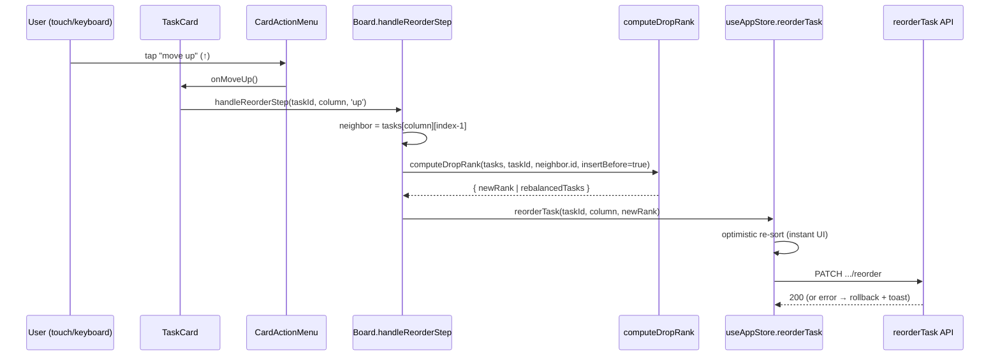

# Blueprint — Touch-accessible in-column reorder

**Feature slug:** `touch-reorder`
**Type:** Bug fix (accessibility / mobile interaction)
**Task:** 6e4ad4cf — "In-column drag-to-reorder does not work on touch devices"
**Complexity:** Medium/Low — single domain (frontend board), additive, reversible.

---

# REQUIREMENTS SUMMARY

## Problem (as observed in code)
- `Board.tsx` + `TaskCard.tsx` implement **all** reordering through the HTML5
  drag-and-drop API: `draggable` attribute + `onDragStart/onDragOver/onDrop`,
  with rank recomputation in `computeDropRank()` and persistence via
  `reorderTask(taskId, column, newRank)`.
- Touch browsers (iOS Safari, most Android Chrome gestures) do **not** synthesize
  HTML5 DnD events from a `touchstart`. The drag therefore never begins on touch.
- `TaskCard.tsx` line 158 renders a `drag_indicator` handle at
  `[@media(pointer:coarse)]:opacity-30` — a **visible affordance that does
  nothing** on touch. This is the concrete defect: users see a grab handle,
  press it, and reordering silently no-ops.
- MB-1/MB-2 already ship a dedicated single-column mobile layout
  (`ColumnTabBar`, active-column-only rendering, FAB).

## Scope clarification (important — narrows the fix)
- **Cross-column moves already work on touch.** `CardActionMenu` renders
  `arrow_back` / `arrow_forward` buttons wired to `moveTask(...)`, and the
  overlay containing them is forced visible on coarse pointers
  (`[@media(pointer:coarse)]:opacity-100`, TaskCard line 247). So moving a card
  between `todo → in-progress → done` is already tap-accessible.
- On mobile only **one column is visible at a time** (MB-1), so cross-column
  *drag* is not even a meaningful gesture there.
- ⟹ The **only** reorder interaction that is broken on touch is
  **in-column (vertical) reordering** — changing a card's rank within its
  current column.

## Functional requirements
1. A user on a touch device MUST be able to change a card's position within its
   column (move it up / down relative to its siblings).
2. The misleading, non-functional drag handle MUST NOT be shown where it does
   not work (coarse pointers).
3. Existing HTML5 drag reorder on fine-pointer (mouse/trackpad) devices MUST be
   preserved unchanged — including the perf-optimized `useDragStore` path.
4. Reorder MUST persist through the same backend contract already in use
   (`reorderTask` → `PATCH /api/v1/spaces/:spaceId/tasks/:id/reorder`, or the
   existing `api.reorderTask`), reusing `computeDropRank()` incl. its rebalance
   branch. **No new API endpoints.**

## Non-functional requirements
- **Accessibility (decisive):** the fix MUST satisfy **WCAG 2.2 SC 2.5.7
  Dragging Movements (Level AA)** — provide a single-pointer, non-drag
  alternative to the drag operation. It SHOULD also close the current gap that
  there is **no keyboard reorder at all**.
- **No new dependencies.** Prism's culture is native-first / minimal-deps; do
  not introduce a DnD library (dnd-kit, react-dnd, SortableJS).
- **Design system compliance:** Tailwind tokens only, reuse
  `material-symbols-outlined`, no `style={{}}` (arbitrary values only), reuse
  the existing `CardActionMenu` toolbar pattern and 28×28 icon-button spec.
- **Performance:** must not regress the `useDragStore` O(1)-re-render design;
  the reorder-step handler runs only on tap, not on a hot drag path.

## Constraints / assumptions flagged
- **Assumption:** in-column reorder is the whole ask; cross-column via the arrow
  buttons is already sufficient on touch (documented above). Posted as a Kanban
  note.
- **Assumption:** we DO NOT reimplement drag with Pointer Events (see ADR
  trade-off) — a UX call the ADR makes explicitly and hands to the UX stage to
  refine visuals only, not to re-litigate the interaction model.

---

# TRADE-OFFS

### 1. Reorder mechanism — Pointer-Events drag vs. explicit step controls
- **Option A — Pointer-Events drag reimplementation.** Rewrite dragging on top
  of `pointerdown/move/up` + `touch-action` so a real drag works on touch.
  - Pros: preserves the "direct manipulation" feel; one interaction model
    across pointer types.
  - Cons: **large, risky rewrite** — long-press-to-lift (to not fight page
    scroll), custom hit-testing (no `dragover` events), auto-scroll near edges,
    a drag ghost, and careful `touch-action` handling. Touches the perf-tuned
    `useDragStore`. **Still a dragging movement → does NOT satisfy WCAG 2.5.7**,
    so we'd *also* need step controls anyway. Contradicts minimal-deps if we
    reach for a library to de-risk it.
- **Option B — Explicit up/down reorder controls.** Add "move up / move down"
  icon buttons to the card action toolbar; each computes the target rank against
  the adjacent sibling and calls the existing `reorderTask`.
  - Pros: **satisfies WCAG 2.5.7** (single-pointer, non-drag); **also gives
    keyboard + screen-reader users reordering for the first time**; reuses
    `reorderTask` + `computeDropRank`; small, testable, reversible; fits the
    existing `CardActionMenu` pattern and coarse-pointer overlay that already
    exists; zero new deps.
  - Cons: less "fun" than dragging; moving a card a long distance takes multiple
    taps (acceptable — columns are short; drag remains available on pointer
    devices).
- **✅ Recommendation: Option B.** It is the only option that actually clears the
  AA bar the design system targets, it is the smallest reversible change, and it
  reuses the existing rank/persistence machinery. Direct-manipulation drag stays
  for mouse users; touch/keyboard users get deterministic step controls.

### 2. Where the controls live — new component vs. extend `CardActionMenu`
- **Option A — New `ReorderControls` component** rendered separately on the card.
  - Pros: isolates vertical-reorder from horizontal column-move.
  - Cons: a second floating cluster competes with the existing overlay for the
    same corner/edge real estate; more layout work; duplicates the 28×28
    icon-button styling.
- **Option B — Extend `CardActionMenu`** with `onMoveUp` / `onMoveDown` buttons
  next to the existing `arrow_back` / `arrow_forward`.
  - Pros: one toolbar for *all* card movement (↑ ↓ ← →), already forced-visible
    on coarse pointers, already styled, already the ARIA `role="toolbar"`.
  - Cons: toolbar grows from up-to-4 to up-to-6 buttons; must guard width on the
    narrowest card.
- **✅ Recommendation: Option B**, with the UX stage owning final icon choice,
  order, and whether ↑↓ render as a distinct visual group. Adds up/down using
  `keyboard_arrow_up` / `keyboard_arrow_down` (or `arrow_upward` /
  `arrow_downward`).

### 3. Visibility of the reorder controls — coarse-only vs. all pointers
- **Option A — Coarse pointers only.** Show ↑↓ only under
  `[@media(pointer:coarse)]`.
  - Pros: keeps the mouse card visually minimal (drag handle already covers it).
  - Cons: leaves keyboard users on desktop with **no** reorder path — WCAG 2.5.7
    is not touch-scoped; the criterion applies to all single-pointer users.
- **Option B — Available to all pointers** via the existing hover/focus-within +
  coarse-visible overlay (drag stays the primary path on fine pointers; ↑↓ are
  the accessible alternative surfaced on hover/focus and always on touch).
  - Pros: fixes desktop keyboard reorder too; one code path; satisfies 2.5.7 for
    everyone.
  - Cons: one more control visible on hover for mouse users (minor).
- **✅ Recommendation: Option B.** The ↑↓ buttons live in the same overlay that
  already appears on hover/focus-within (fine pointers) and is forced visible on
  coarse pointers — so mouse users still lead with drag, touch users get taps,
  and keyboard users get focusable buttons. Also **remove the coarse-pointer drag
  handle affordance** so nothing on touch implies a drag that can't happen.

---

# ARCHITECTURAL BLUEPRINT

## 3.1 Core components (all existing — no new files required)

| Component | Responsibility | Change |
|-----------|----------------|--------|
| `Board.tsx` | Owns rank math (`computeDropRank`) + `reorderTask`/`moveTask` wiring | **Add** `handleReorderStep(taskId, column, direction)` and pass it down. |
| `Column.tsx` | Renders the ordered card list; knows each card's index | **Pass** `isFirst`/`isLast` (or index+count) + `onReorderStep` to each `TaskCard`. |
| `TaskCard.tsx` | Renders one card + its action overlay | **Remove** coarse-pointer drag-handle affordance; **forward** reorder props into `CardActionMenu`; expose `onMoveUp/onMoveDown` with disabled edges. |
| `CardActionMenu.tsx` | Toolbar of per-card movement/actions | **Add** `onMoveUp` / `onMoveDown` icon buttons (28×28, guarded by `isMutating`, disabled at column edges). |
| `useDragStore.ts` | Fine-pointer drag state | **Unchanged.** |
| `useAppStore.reorderTask` | Optimistic rank update + persist + rollback | **Unchanged** — reused verbatim. |

## 3.2 Reorder-step logic (reuse, do not reinvent)

`handleReorderStep` reuses the already-tested `computeDropRank` by expressing a
one-step move as an insert relative to the adjacent neighbor in the
**rank-sorted column array** (`useAppStore.getState().tasks[column]`):

```
move UP   → neighbor = card at (index-1); target = { overTaskId: neighbor.id, insertBefore: true }
move DOWN → neighbor = card at (index+1); target = { overTaskId: neighbor.id, insertBefore: false }
```

Then:
```
const { newRank, needsRebalance, rebalancedTasks } =
    computeDropRank(columnTasks, taskId, neighbor.id, insertBefore);
needsRebalance
    ? rebalancedTasks.forEach(t => reorderTask(t.id, column, t.rank))
    : reorderTask(taskId, column, newRank);
```

- Guard: no-op if already first (`up`) or last (`down`).
- Guard: no-op while `isMutating`.
- The rebalance branch (rank gap collapse) is inherited for free.
- **Edge — arc grouping on:** rank is global to the column, so a step still
  swaps the card with its immediate rank-neighbor even across an arc-group
  boundary. That is correct behaviour (rank order is the source of truth); the
  UX stage should confirm copy, but no special-casing is required. Flag as a
  documented behaviour, not a bug.

## 3.3 Flow (Mermaid)



## 3.4 Interaction / accessibility contract

- **Buttons:** `role="button"` (native `<button type="button">`), 28×28,
  design-system icon-button classes copied from existing toolbar buttons.
- **Labels:** `aria-label="Move up"` / `"Move down"`; `title` mirrors label.
- **Disabled state:** `disabled` (opacity-40, cursor-not-allowed) when at the
  respective column edge or while `isMutating`.
- **Keyboard:** buttons are focusable in the overlay revealed by
  `group-focus-within`; Enter/Space activate them (native). This is the first
  keyboard reorder path in the app.
- **Live region (recommended, UX to confirm):** on a successful step, the
  existing `showToast('Moved up' / 'Moved down')` gives an SR-audible
  confirmation — reuse `showToast`, do not build a new mechanism.
- **Drag handle:** the `drag_indicator` affordance is **hidden on coarse
  pointers** (drop the `[@media(pointer:coarse)]:opacity-30`); it remains a
  hover-only hint on fine pointers where drag actually works.

## 3.5 Observability
Frontend-only interaction change; no server metrics/traces. Manual + automated
verification is the observability surface — see Testing.

## 3.6 Testing strategy (for QA + dev unit tests)
- **Unit (Vitest + RTL):**
  - `handleReorderStep` up/down moves a card and calls `reorderTask` with the
    expected rank; no-op at edges; no-op while `isMutating`; rebalance branch
    invoked when ranks collide.
  - `CardActionMenu` renders ↑↓, disables ↑ on first card / ↓ on last card,
    fires callbacks.
  - `TaskCard` no longer renders the coarse-pointer drag handle affordance
    (assert the handle is not shown / not interactive under coarse emulation).
- **E2E (Playwright, coarse-pointer / mobile emulation):**
  - Tap ↑ on the 2nd card → it becomes the 1st (assert DOM order + persisted).
  - Tap ↓ on the 1st card → becomes 2nd.
  - ↑ disabled on first card, ↓ disabled on last.
  - Cross-column arrows still work on touch (regression).
  - Fine-pointer HTML5 drag reorder still works (regression).

## 3.7 Out of scope
- Pointer-Events drag reimplementation, any DnD library, cross-column drag on
  touch (covered by existing arrows), multi-select reorder, drag auto-scroll.
