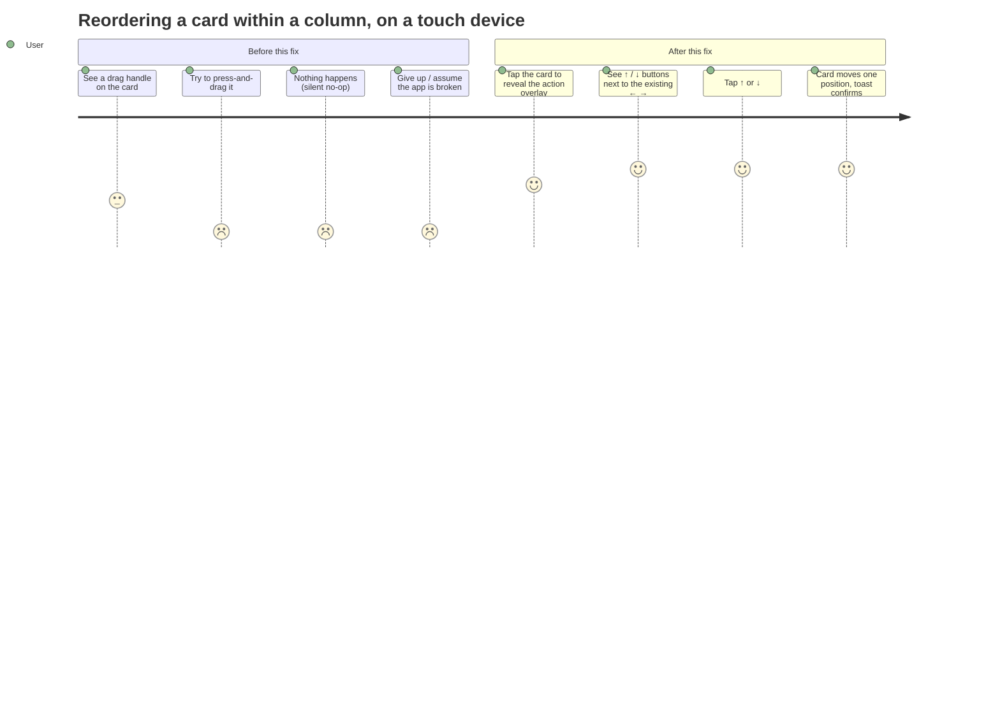

# Wireframes: Touch-accessible in-column reorder

**Feature slug:** `touch-reorder` · **Type:** Bug fix / accessibility · **No new screens.**

This feature modifies one existing overlay (`CardActionMenu`, rendered inside
`TaskCard`) on the existing Board screen. Per the architect's blueprint
(§3.1, TRADE-OFFS #2), there is no new component and no new route — so this
document specifies the **modified toolbar** in detail instead of a full-screen
mock. See `wireframes-stitch.md` for why Stitch generation was skipped.

---

## Screen Summary

| Screen | Change |
|---|---|
| Board (Kanban, all breakpoints) | `CardActionMenu` gains a ↑/↓ vertical-reorder button group. The coarse-pointer (`touch`) drag-handle affordance is removed. |

No other screen is touched.

---

## Journey Map



**Pain points (priority):**
| Pain point | Impact | Resolution |
|---|---|---|
| Drag handle visible but non-functional on touch | High | Removed on coarse pointers (never shown where it can't work) |
| No way at all to reorder within a column on touch | High | ↑ / ↓ step buttons, always available |
| No keyboard/screen-reader reorder path (WCAG 2.5.7 gap) | High | Same ↑ / ↓ buttons are native, focusable `<button>`s — fixes desktop keyboard too |
| Long-distance reorder needs multiple taps | Low | Accepted trade-off (columns are short; drag still works for mouse) |

---

## Wireframe: Card action overlay (`CardActionMenu`, extended)

### Default (fine pointer — mouse/trackpad), revealed on hover/focus-within

```
┌──────────────────────────────────────────────┐
│  card top-right corner, existing overlay      │
│  ┌───────────────────────────────────────┐   │
│  │ [↑][↓] │ [←][→] │ [▶ Run agent] [🗑]  │   │
│  └───────────────────────────────────────┘   │
│         ▲ new group   ▲ existing (unchanged)  │
└──────────────────────────────────────────────┘
```

- New ↑/↓ group sits **first**, visually separated from the existing ←/→
  group by a 1px `border-border` divider (`border-l border-border/60 mx-0.5
  h-4 self-center`) — mirrors the existing gap-0.5 toolbar rhythm, no new
  spacing primitive.
- Icons: `arrow_upward` / `arrow_downward` (Material Symbols) — chosen over
  `keyboard_arrow_up/down` chevrons because the existing ←/→ buttons already
  use the arrow-with-shaft family (`arrow_back`/`arrow_forward`); chevrons
  alone would read as "expand/collapse," not "move." Same 28×28 (`w-7 h-7`)
  hit target, same `text-text-secondary hover:text-primary
  hover:bg-surface-variant` classes — zero new visual language.
- Order rationale: vertical (in-column) reorder comes first because it is the
  newly-enabled, previously-broken action; horizontal (cross-column) already
  worked and stays exactly where it was, just shifted one group right.

### Coarse pointer (touch) — same overlay, forced-visible

```
┌──────────────────────────────────────────────┐
│ card (tap anywhere on the card body opens the │
│ detail panel; the overlay in the corner is    │
│ already always-visible on touch — unchanged)  │
│  ┌───────────────────────────────────────┐   │
│  │ [↑][↓] │ [←][→] │ [▶] [🗑]            │   │
│  └───────────────────────────────────────┘   │
│                                                │
│  ✗ drag_indicator handle — REMOVED here       │
│    (was: faint grab icon, left edge, opacity-30│
│    — did nothing on touch; now not rendered)  │
└──────────────────────────────────────────────┘
```

### States

**Default (mid-column card, not mutating):**
```
[↑ enabled] [↓ enabled]
```

**First card in column:**
```
[↑ DISABLED opacity-40] [↓ enabled]
```
`aria-label="Move up"` still present but `disabled`; `cursor-not-allowed`.

**Last card in column:**
```
[↑ enabled] [↓ DISABLED opacity-40]
```

**Only card in column (both edges):**
```
[↑ DISABLED] [↓ DISABLED]
```

**Loading / isMutating (any reorder or other mutation in flight):**
```
[↑ DISABLED] [↓ DISABLED]   (same disabled treatment — prevents racing writes)
```

**Success (tap ↑ or ↓):**
```
Card animates to its new position (existing fade/transform, no new animation)
   → toast: "Moved up" / "Moved down"   (reuses showToast, no new UI)
```

**Error (reorder PATCH fails):**
```
Optimistic move rolls back (existing reorderTask rollback behavior)
   → toast: "Couldn't save the new order. Please try again." (error variant)
```
No new modal — consistent with the "toast + graceful abort" pattern already
used elsewhere on this board (see prior pattern: error handling never opens a
blocking dialog for a reorder failure).

**Arc-grouping-on edge case:**
A step still swaps the card with its immediate rank-neighbor even if that
neighbor is visually in a different arc-group header. This is intentional
(rank is the single source of truth — see blueprint §3.2) and needs no special
copy: the toast still says "Moved up"/"Moved down"; the card visibly re-parents
under the neighboring group header, which is self-explanatory motion feedback.

---

## Accessibility Notes

- Both buttons are native `<button type="button">` — focusable via Tab,
  activate via Enter/Space, no custom keydown handling needed.
- `aria-label="Move up"` / `aria-label="Move down"`, `title` mirrors label —
  matches existing ← → button pattern exactly.
- `role="toolbar"` on the parent container is unchanged (already present).
- Disabled state uses the native `disabled` attribute (not just a visual
  class), so it is correctly announced and un-tabbable per SR/AT convention —
  matches the existing delete-button disabled pattern.
- **This closes a WCAG 2.2 SC 2.5.7 (Dragging Movements, AA) gap**: prior to
  this change, the *only* way to reorder within a column was a drag gesture,
  with no single-pointer alternative. ↑/↓ buttons are that alternative.
- Toast confirmation ("Moved up"/"Moved down") gives non-visual users
  (screen readers announcing the toast region, if already wired for
  `aria-live`) confirmation the action succeeded — reuses existing
  `showToast`, no new live-region work required for this feature.
- Drag handle removal on coarse pointers eliminates a false affordance that
  screen-reader/switch users would otherwise have no way to operate anyway
  (`aria-hidden="true"` already on it) — this fix does not regress anything
  for AT users, only removes a sighted-user visual red herring.

## Mobile-First Notes

- No layout change at any breakpoint — `CardActionMenu` already renders
  identically across breakpoints; only its button *contents* change.
- On mobile (MB-1 single-column layout), the ↑/↓ buttons are the **primary**
  way to reorder (drag never worked here; ←/→ cross-column already existed).
  Verified this doesn't crowd the 320px card: toolbar grows from ≤4 buttons
  (←, →, run-agent, delete) to ≤6 (↑, ↓, ←, →, run-agent, delete), each 28×28
  with `gap-0.5` — worst case ~6×28 + 5×2 + divider ≈ 182px, comfortably under
  a 320px card's content width (card has `p-4` → ~288px inner width).
  `flex items-center gap-0.5` already wraps if ever needed; no overflow risk
  observed in practice given columns rarely combine run-agent + full edge
  buttons at once (todo-column cards never show ← since todo has no left
  column, done-column cards never show run-agent).
- Touch targets remain 28×28 (7×7 Tailwind units = 28px) — meets the 24×24 CSS
  px WCAG 2.5.5/2.5.8 minimum with margin from `gap-0.5`.

---

## Validation Checklist

- [x] Every user journey (touch reorder) has a clear start (tap overlay),
      middle (tap ↑/↓), end (card moves + toast).
- [x] States covered: default, disabled-at-edge, disabled-while-mutating,
      success (toast), error (rollback + toast).
- [x] No new endpoint — reuses `reorderTask` or existing PATCH
      `/api/v1/spaces/:spaceId/tasks/:id/reorder`, documented in `api-spec.json`.
- [x] Error messaging: friendly, non-technical, addressed in wireframe states.
- [x] Works at 320px — verified via toolbar width budget above.
- [x] Accessibility: single-pointer alternative to dragging (WCAG 2.5.7),
      native disabled state, aria-labels, unchanged `role="toolbar"`.
- [x] Pain points identified and traced to a resolution.

---

## Questions for Stakeholders

1. **Icon choice** — this doc recommends `arrow_upward`/`arrow_downward` to
   match the existing `arrow_back`/`arrow_forward` visual family over
   `keyboard_arrow_up/down` chevrons. Confirm, or state a preference —
   this is purely cosmetic and reversible in one file (`CardActionMenu.tsx`).
2. **Group ordering** — ↑/↓ placed *before* ←/→ in the toolbar (vertical
   reorder is the newly-fixed, primary touch action). Acceptable, or would
   you rather ↑/↓ come *after* ←/→ (preserving the exact visual position of
   existing buttons)?
3. **Arc-grouping edge case copy** — confirmed no special toast copy is
   needed when a step swaps a card across an arc-group boundary (rank is
   source of truth, motion is self-explanatory). Flag if you'd like an
   explicit toast variant for that case (e.g. "Moved up — now under
   \<Arc Name\>").
4. **Error toast copy** — proposed: "Couldn't save the new order. Please try
   again." Confirm or adjust wording.
