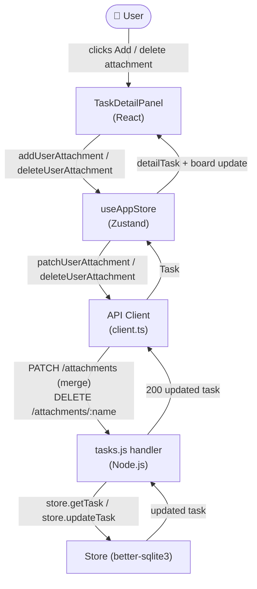
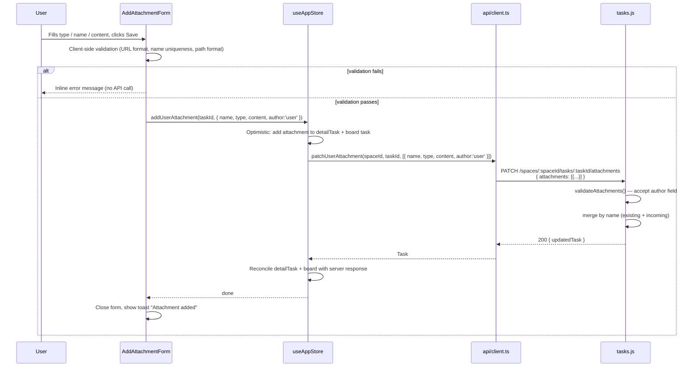
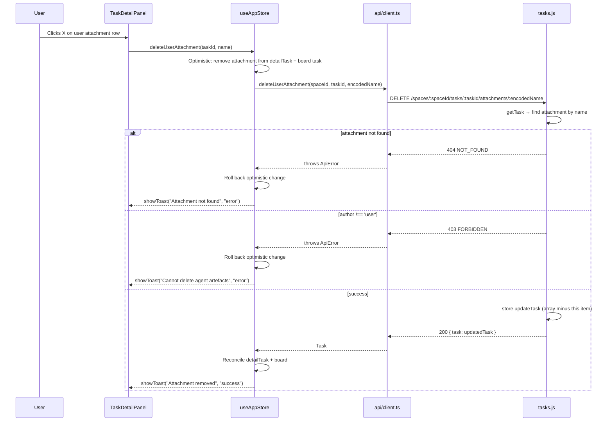

# Blueprint: User-Managed Attachments (QOL-7)

## 1. Requirements Summary

### Functional
- FR-1: User can add attachments of type `link` (https URL), `text` (inline note),
  and `file` (absolute local path) from the TaskDetailPanel.
- FR-2: User can delete their own attachments from the panel.
- FR-3: User attachments persist across reloads (stored in the existing task record).
- FR-4: The UI visually distinguishes user-added attachments from agent-produced artefacts.
- FR-5: Adding an attachment with the same name as an existing one is blocked with a
  clear error message (name-conflict validation).
- FR-6: Agent artefacts (author ≠ 'user') cannot be deleted through the user-facing UI.
- FR-7: Binary file upload is explicitly out of scope for this phase.

### Non-Functional
- NF-1: The attachments section always renders in the detail panel (empty state when 0).
- NF-2: No new modal layers — inline expand/collapse form in the right sidebar.
- NF-3: No new persistence mechanism — `PATCH /attachments` (merge) + new DELETE endpoint.
- NF-4: Backward compatible — existing attachments without `author` field behave as 'agent'.
- NF-5: Backend guard on DELETE prevents accidental deletion of agent artefacts via API.

---

## 2. Key Trade-offs

### T1 — Inline form vs. Modal dialog

| | Inline form | Modal dialog |
|---|---|---|
| z-index complexity | None (sidebar already handles inputs) | Requires additional z-layer above panel |
| Discoverability | Button in context; form appears below | Separate overlay — harder to dismiss |
| UX pattern consistency | Matches pipeline editor in same sidebar | Inconsistent with other add flows |
| Screen space | Uses sidebar width (~340px) | More width available |
| **Recommendation** | **Inline form** — 3 fields fit comfortably in 340px sidebar |

### T2 — Delete by name vs. Delete by numeric index

| | By name | By numeric index |
|---|---|---|
| Stability | Stable across concurrent writes | Fragile — index shifts on parallel updates |
| Semantic match | Matches PATCH merge-by-name semantics | Does not match |
| New endpoint needed | Yes (`DELETE /attachments/:name`) | No (reuse `GET /attachments/:index` pattern) |
| **Recommendation** | **By name** — stable, semantically consistent |

### T3 — Backend author guard vs. UI-only protection

| | Backend guard (403) | UI-only (no delete button) |
|---|---|---|
| Defense-in-depth | Prevents API misuse too | Only protects the browser UI |
| Implementation cost | One `if` check in DELETE handler | Zero backend change |
| Safety for agent artefacts | Guaranteed by the contract | Bypassable via direct API call |
| **Recommendation** | **Backend guard** — agent artefacts are system-generated; deletion must be safe |

---

## 3. Architectural Blueprint

### 3.1 Core Components

| Component | Responsibility | Location | Note |
|---|---|---|---|
| `validateAttachments` | Add optional `author` field to schema validation | `src/handlers/tasks.js` | Extend existing function |
| `stripAttachmentContent` | Pass `author` through in list/GET responses | `src/handlers/tasks.js` | One-line change |
| `handleDeleteAttachment` | Delete attachment by URL-encoded name, user-only guard | `src/handlers/tasks.js` | New function |
| Router dispatch | Add `TASK_ATTACHMENT_BY_NAME_ROUTE` regex + DELETE branch | `src/handlers/tasks.js` | New route constant |
| `Attachment` type | Add `author?: 'user' \| 'agent'` | `frontend/src/types/index.ts` | Additive |
| `deleteUserAttachment` | `DELETE /attachments/:name` client call | `frontend/src/api/client.ts` | New export |
| `patchUserAttachment` | `PATCH /attachments` with single item (merge) | `frontend/src/api/client.ts` | Thin wrapper |
| `addUserAttachment` store action | Calls `patchUserAttachment`, updates board + detailTask | `frontend/src/stores/useAppStore.ts` | New action |
| `deleteUserAttachment` store action | Calls `deleteUserAttachment`, updates board + detailTask | `frontend/src/stores/useAppStore.ts` | New action |
| `AddAttachmentForm` | Inline 3-field form (type, name, content) with validation | `frontend/src/components/board/AddAttachmentForm.tsx` | New component |
| `TaskDetailPanel` (attachments section) | Always render section; user/agent visual split; integrate form | `frontend/src/components/board/TaskDetailPanel.tsx` | Modify existing section |

---

### 3.2 Data Flow & Sequences

#### C4 Context — affected subsystems



#### Sequence: Add user attachment



#### Sequence: Delete user attachment



---

### 3.3 API Contracts

#### Existing PATCH endpoint (extended — no breaking change)

```
PATCH /api/v1/spaces/:spaceId/tasks/:taskId/attachments

Request body:
{
  "attachments": [
    {
      "name":    string,           // required, ≤100 chars
      "type":    "link" | "text" | "file",
      "content": string,           // required
      "author":  "user" | "agent"  // NEW — optional, passed through as-is
    }
  ]
}

Response 200:
  { same as GET /tasks/:taskId — task object with attachments (content stripped) }

Response 400 VALIDATION_ERROR:
  { error: { code: "VALIDATION_ERROR", message: "attachments[0].author must be 'user' or 'agent'" } }
```

#### New DELETE endpoint

```
DELETE /api/v1/spaces/:spaceId/tasks/:taskId/attachments/:encodedName

Path:
  encodedName — URL-encoded attachment name (e.g. "My%20Link")

Response 200:
  { task: <full task object, attachments stripped> }

Response 403 FORBIDDEN:
  { error: { code: "FORBIDDEN", message: "Cannot delete agent-owned attachments" } }

Response 404 TASK_NOT_FOUND:
  { error: { code: "TASK_NOT_FOUND", message: "..." } }

Response 404 NOT_FOUND:
  { error: { code: "NOT_FOUND", message: "Attachment '...' not found" } }
```

#### Frontend API client additions (`api/client.ts`)

```typescript
// New: PATCH single user attachment (merge mode)
export const patchUserAttachment = (
  spaceId: string,
  taskId: string,
  attachment: { name: string; type: 'link' | 'text' | 'file'; content: string; author: 'user' }
): Promise<Task> =>
  apiFetch<Task>(`/spaces/${spaceId}/tasks/${taskId}/attachments`, {
    method: 'PATCH',
    body: JSON.stringify({ attachments: [attachment] }),
  });

// New: DELETE attachment by name (user-owned only)
export const deleteUserAttachment = (
  spaceId: string,
  taskId: string,
  name: string
): Promise<Task> =>
  apiFetch<Task>(
    `/spaces/${spaceId}/tasks/${taskId}/attachments/${encodeURIComponent(name)}`,
    { method: 'DELETE' }
  );
```

---

### 3.4 Schema Change: Attachment Type

```typescript
// types/index.ts — BEFORE
export interface Attachment {
  name: string;
  type: 'text' | 'file' | 'link';
  content?: string;  // only for link type
}

// types/index.ts — AFTER
export interface Attachment {
  name: string;
  type: 'text' | 'file' | 'link';
  content?: string;     // only for link type (in list response)
  author?: 'user' | 'agent';  // NEW: absent = treat as 'agent' (backward compat)
}
```

---

### 3.5 AddAttachmentForm Component

```
Props:
  spaceId:       string
  taskId:        string
  existingNames: string[]           // used for name-conflict validation
  disabled:      boolean            // mirrors isReadOnly from parent
  onSuccess:     () => void         // close form, show toast
  onCancel:      () => void         // close form without save

State:
  type:     'link' | 'text' | 'file'   (default: 'link')
  name:     string                      (auto-filled for links from hostname)
  content:  string
  error:    string | null
  saving:   boolean

Client-side validation rules:
  - type='link': content must be https:// URL (new URL() check)
  - type='file': content must start with '/' (absolute path)
  - type='text': content must be non-empty
  - name: non-empty, ≤100 chars, not in existingNames (case-sensitive)
  - For type='link', auto-populate name from URL hostname on content blur
    (if name is still empty)

Layout (within 340px sidebar column):
  ┌────────────────────────────────┐
  │ [Link] [Note] [File Path]      │  ← segmented type selector
  │ Name:  ____________________    │
  │ URL/Content/Path: __________   │  ← label changes per type
  │ [error message if any]         │
  │                  [Cancel] [Add]│
  └────────────────────────────────┘
```

---

### 3.6 TaskDetailPanel — Attachments Section (Updated)

```
Current behaviour:
  - Only renders when attachments.length > 0
  - All attachments look the same
  - No add/delete UI

New behaviour:
  - Always renders (with empty state: "No attachments yet")
  - Header row: "Attachments" label  +  "add" icon button (opens AddAttachmentForm)
  - Agent attachment row  (author is undefined or 'agent'):
      [icon]  name.md  [↗ or download]
      — no delete button
  - User attachment row   (author === 'user'):
      [person icon]  name  [open/copy icon]  [× delete button]
      — slightly elevated background to signal user origin
      — delete button: visible on hover, prompts no confirmation (undo = re-add)

Visual distinction:
  Agent:  icon = type-based (description/folder/link), bg = bg-surface/50, no badge
  User:   icon = 'person'  (always), bg = bg-primary/[0.04], small "you" chip in
          text-primary/50 color — multi-channel (color + icon + chip text label)
```

---

### 3.7 Store Actions (useAppStore.ts additions)

```typescript
// Interface additions:
addUserAttachment: (taskId: string, attachment: NewUserAttachment) => Promise<void>;
deleteUserAttachment: (taskId: string, name: string) => Promise<void>;

// NewUserAttachment shape:
interface NewUserAttachment {
  name: string;
  type: 'link' | 'text' | 'file';
  content: string;
}
// author: 'user' is always injected by the store action, not passed by callers.

// Optimistic update pattern (same as updateTask):
// 1. Apply optimistic change to tasks + detailTask
// 2. Call API
// 3. Reconcile on success
// 4. Roll back on error + showToast
```

---

### 3.8 Observability

- Backend emits structured log event on successful user-attachment operations:
  ```json
  { "event": "attachments.user_add",   "spaceId": "...", "taskId": "...", "name": "...", "type": "link" }
  { "event": "attachments.user_delete", "spaceId": "...", "taskId": "...", "name": "..." }
  ```
  Written to `process.stderr` (same pattern as `attachments.merge` / `attachments.replace`).

---

### 3.9 Deploy Strategy

This is a purely additive server-side change (new route) + frontend change. No
database migration is required (the `author` field is stored as part of the existing
`attachments` JSON blob in SQLite).

- Branch: `feature/user-attachments`
- Backend and frontend changes can ship in the same PR
- CI pipeline: backend `npm test` + frontend `npm test`
- No environment variable changes

---

## 4. Out of Scope (Phase 2)

- Binary file upload (multipart/form-data, server-side storage)
- Renaming existing user attachments (edit flow deferred)
- Attachment count badge on TaskCard
- Attachment search / filter

---

## 5. File Change Summary

| File | Change type |
|---|---|
| `src/handlers/tasks.js` | Modify: `validateAttachments`, `stripAttachmentContent`, router; Add: `handleDeleteAttachment`, `TASK_ATTACHMENT_BY_NAME_ROUTE` |
| `frontend/src/types/index.ts` | Modify: `Attachment` (add `author?`) |
| `frontend/src/api/client.ts` | Add: `patchUserAttachment`, `deleteUserAttachment` |
| `frontend/src/stores/useAppStore.ts` | Add: `addUserAttachment`, `deleteUserAttachment` actions |
| `frontend/src/components/board/AddAttachmentForm.tsx` | New file |
| `frontend/src/components/board/TaskDetailPanel.tsx` | Modify: attachments section |
| `tests/attachments.test.js` | Add: `author` field tests + DELETE-by-name tests |
| `frontend/src/components/board/__tests__/AddAttachmentForm.test.tsx` | New file |
