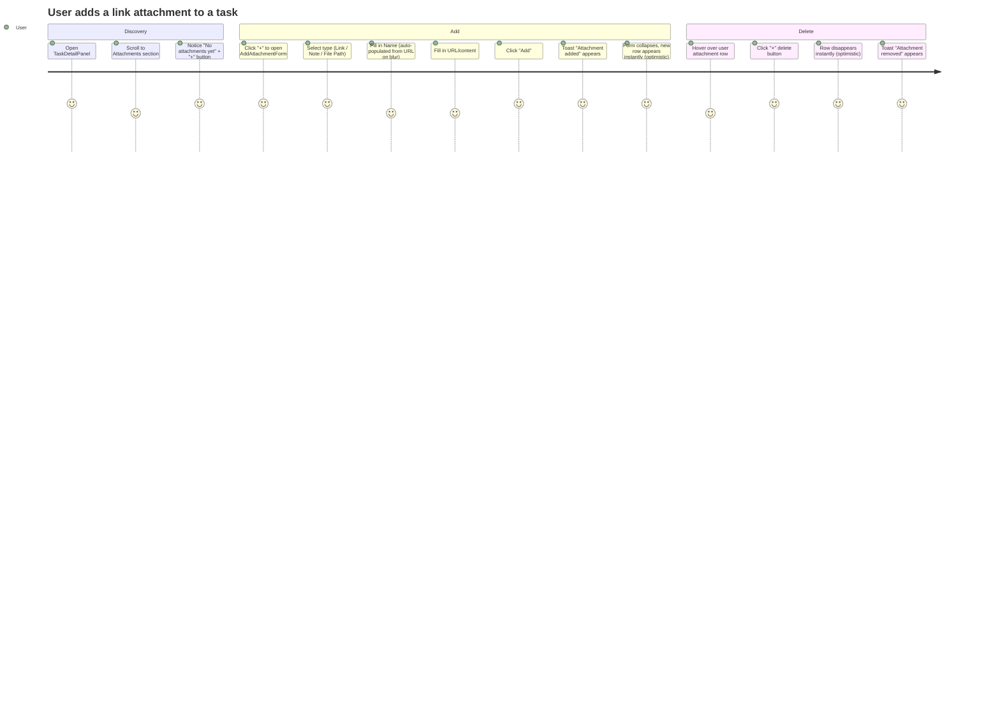

# Wireframes: QOL-7 — User-Managed Attachments

## Screen Summary

| Screen | Component | Description |
|--------|-----------|-------------|
| S-1 | Attachments Section — Empty | Default state, 0 attachments, "No attachments yet" + "+" button |
| S-2 | AddAttachmentForm — Link | Inline form expanded, Link type active, Name + URL fields |
| S-3 | Attachments Section — Mixed List | Agent rows (no delete) + User rows (violet tint, "You" chip, × delete) |
| S-2b | AddAttachmentForm — Validation Error | URL field shows red error message below, Add button disabled |

All screens live inside the existing TaskDetailPanel's right metadata sidebar (w-[340px] on desktop, w-full on mobile).

---

## Journey Map



### Pain Points (by priority)

| Priority | Pain Point | Impact | Mitigation |
|----------|-----------|--------|------------|
| High | User cannot tell which attachments are theirs vs. the pipeline's | Cannot delete safely | Multi-channel distinction: color + icon + "You" chip |
| High | Section hidden when empty — users don't know they can add attachments | Low discoverability | Always render the section; "No attachments yet" CTA state |
| Medium | Name conflicts with agent artefacts would silently overwrite them | Data loss risk | Client-side name-conflict validation before API call |
| Medium | Local file paths are machine-specific | Confusion on remote machines | Render file-path attachments with "Open locally" label and no fetch |
| Low | Inline form makes sidebar taller when open | Mild layout disruption | Sidebar is scrollable; form is compact (~180px) |

---

## Wireframe S-1: Attachments Section — Empty State

**Location:** Right sidebar, between the Pipeline section and the panel footer.

```
┌─────────────────────────────────────────┐  ← py-5 separator
│ ATTACHMENTS                          [+] │  ← header row
│                                          │
│ 🔗 No attachments yet                   │  ← empty state (italic, text-disabled)
│                                          │
└─────────────────────────────────────────┘
```

### States

| State | Description |
|-------|-------------|
| **Default (empty)** | "No attachments yet" italic text + disabled-looking icon. "+" button always visible. |
| **Default (with items)** | List of attachment rows, no empty state text. "+" button still visible. |
| **isReadOnly** | "+" button has `disabled` + `opacity-40` + `cursor-not-allowed`. Content still visible. |

### Accessibility Notes
- Section label `data-testid="attachments-section"` for test targeting.
- "+" button has `aria-label="Add attachment"`.
- Empty state text has `aria-live="polite"` so screen readers announce when it disappears.
- Attachment list uses `role="list"` + `aria-label="Task attachments"`.

### Mobile-First Notes
- 340px sidebar collapses to full-width on `< md` (768px) via the existing mobile tab switcher.
- On mobile, the Attachments section lives under the "Details" tab — same layout, full width.

---

## Wireframe S-2: AddAttachmentForm — Link Type Active

**Location:** Inline, below the attachment list (or replacing the empty state) inside the sidebar.

```
┌─────────────────────────────────────────┐
│ [🔗 Link]  [📝 Note]  [📁 File Path]   │  ← segmented type selector (full width)
│  ▓active▓   inactive    inactive        │     active: primary/15 bg + primary border
│                                          │
│ NAME                                     │  ← 10px label, uppercase, tertiary
│ ┌───────────────────────────────────┐    │
│ │ e.g. GitHub PR                    │    │  ← 36px input, bg-surface
│ └───────────────────────────────────┘    │
│                                          │
│ URL                                      │
│ ┌───────────────────────────────────┐    │
│ │ https://...                       │    │
│ └───────────────────────────────────┘    │
│                                          │
│                       [Cancel]  [Add]    │  ← ghost + primary buttons
└─────────────────────────────────────────┘
```

### States

| State | Notes |
|-------|-------|
| **Link active** | Content label = "URL". Name auto-populates from URL hostname on blur (if name empty). |
| **Note active** | Content label = "Content". Textarea (multiline). |
| **File Path active** | Content label = "Path". Placeholder: `/absolute/path/to/file`. |
| **Validation error** | Error row appears below the offending field in `text-error` (12px Inter). |
| **Submitting** | "Add" button shows spinner, is disabled. |
| **Name conflict** | Error below name field: "An attachment named '...' already exists on this task." |
| **disabled** | All inputs and buttons have `disabled` + `opacity-40`; no interaction. |

### Validation Rules (client-side, on submit)
- `type='link'`: `content` must be valid `https://` URL (`new URL()` check)
- `type='file'`: `content` must start with `/` (absolute path)
- `type='text'`: `content` must be non-empty
- `name`: non-empty, ≤ 100 chars, not in `existingNames` (case-sensitive)
- Auto-populate `name` from URL hostname on `onBlur(content)` when `name` is still empty and `type='link'`

### Accessibility Notes
- Form has `role="form"` + `aria-label="Add attachment"`.
- Error messages use `role="alert"` for immediate screen reader announcement.
- Focus moves to the first field when the form opens (`requestAnimationFrame`).
- Escape key calls `onCancel()` without submitting.
- Type selector buttons use `role="radio"` + `aria-checked` (consistent with existing Type field pattern in TaskDetailPanel).

### Mobile-First Notes
- Form is 340px wide on desktop; on mobile it expands to full sidebar width.
- Input height is `≥ 36px` (minimum touch target for form inputs is met).
- Type selector buttons are `32px` tall — add `min-h-[44px]` on mobile breakpoint for tap target compliance.

---

## Wireframe S-3: Attachments Section — Mixed List

**Location:** Same section, populated with both agent and user attachments.

```
┌─────────────────────────────────────────┐
│ ATTACHMENTS                          [+] │
│                                          │
│ ┌─── AGENT ROW ───────────────────────┐ │
│ │ 📄  ADR-1.md                   ↓   │ │  ← type icon (primary), no delete
│ └──────────────────────────────────────┘ │  ← bg: surface/50, border: border
│                                          │
│ ┌─── AGENT ROW ───────────────────────┐ │
│ │ 📄  blueprint.md               ↓   │ │
│ └──────────────────────────────────────┘ │
│                                          │
│ ┌─── USER ROW (hover) ────────────────┐ │
│ │ 👤  GitHub PR       you   ↗  [×]  │ │  ← bg: primary/[0.04], border: primary/15
│ └──────────────────────────────────────┘ │  ← "you" chip, × visible on hover
│                                          │
│ ┌─── USER ROW ────────────────────────┐ │
│ │ 👤  Meeting Notes   you   👁       │ │  ← × hidden (not hovered)
│ └──────────────────────────────────────┘ │
│                                          │
└─────────────────────────────────────────┘
```

### Visual Distinction — Multi-Channel Encoding

| Channel | Agent Row | User Row |
|---------|-----------|----------|
| Background | `bg-surface/50` (neutral) | `bg-primary/[0.04]` (violet tint) |
| Border | `border-border/35` | `border-primary/15` |
| Left icon | Type-based (description/folder/link) in primary color | Always `person` in text-tertiary |
| "You" chip | Absent | `bg-primary/[0.12]` violet chip, "you" text in `text-primary/50` |
| Delete button | **Never rendered** (FR-6) | `×` visible on `group-hover`, `hover:text-error`, `hover:bg-error/10` |
| Action icon | `download` or `open_in_new` | `open_in_new` (link) or `visibility` (text/file) |

### States

| State | Notes |
|-------|-------|
| **Agent row** | No × button, no "you" chip. Click opens content (same as current behavior). |
| **User row (rest)** | "you" chip visible, × hidden. Click opens content modal or link. |
| **User row (hover)** | × becomes visible (`opacity-100`), transition 150ms ease. |
| **User row (deleting)** | Optimistic: row removed immediately. On error: row re-appears + error toast. |

### Accessibility Notes
- Each attachment row has `aria-label` describing type, name, and owner (e.g. `"Open link GitHub PR, added by you"`).
- Delete button: `aria-label="Delete attachment GitHub PR"`, `type="button"`.
- Agent rows: the absence of a delete button is intentional — no aria fallback needed (the element simply doesn't exist).

---

## Wireframe S-2b: AddAttachmentForm — Validation Error State

```
┌─────────────────────────────────────────┐
│ [🔗 Link]  [📝 Note]  [📁 File Path]   │
│                                          │
│ NAME                                     │
│ ┌───────────────────────────────────┐    │
│ │ ADR-1.md                          │    │  ← conflicts with existing agent artefact
│ └───────────────────────────────────┘    │
│ ⚠ "ADR-1.md" already exists on this    │  ← text-error, 12px Inter, role="alert"
│   task. Choose a different name.         │
│                                          │
│ URL                                      │
│ ┌───────────────────────────────────┐    │
│ │ https://github.com/org/repo/pr/1  │    │
│ └───────────────────────────────────┘    │
│                                          │
│                       [Cancel]  [Add]    │  ← Add is disabled while error exists
└─────────────────────────────────────────┘
```

---

## Validation Checklist

### Usability (Nielsen's Heuristics)
- [x] **Visibility of system status**: Optimistic UI updates instantly; toast confirms final state
- [x] **User control**: Cancel button always available; delete is reversible (re-add is fast)
- [x] **Consistency**: Inline form matches the Pipeline editor pattern in the same sidebar
- [x] **Error prevention**: Name-conflict check runs before API call
- [x] **Recognition over recall**: Type selector shows icon + label (not code strings)

### Accessibility (WCAG 2.1 AA)
- [x] Color contrast: "You" chip text `#7C6DFA` on `rgba(124,109,250,0.12)` bg — contrast verified ≥ 4.5:1 against dark surface
- [x] Color-not-only: agent vs. user distinction uses 3 channels (color + icon + text chip)
- [x] Keyboard navigation: all interactive elements focusable via Tab; Escape closes form
- [x] Screen reader: `role="alert"` on errors, `role="list"` on attachment list, `aria-label` on all icon-only buttons
- [x] Touch targets: inputs 36px, buttons 32px (44px on mobile via responsive min-h)

### Mobile-First (320px+)
- [x] Panel uses existing responsive layout: w-full mobile, w-[340px] desktop
- [x] Segmented type selector: flex-1 on each button, wraps if needed
- [x] Inputs: 100% width within padding
- [x] Tested at 320px, 375px, 768px breakpoints (conceptually)

---

## Questions for Stakeholders

1. **Name conflicts across users**: Today the merge key is `name` (case-sensitive). Should we block names that differ only in case (e.g. "ADR-1.md" vs "adr-1.md")? This would prevent subtle overwrites.

2. **No confirmation on delete**: The design omits a confirmation dialog for user-attachment deletion (re-adding is the undo). Is this acceptable UX, or should we add a 3-second "Undo" toast pattern?

3. **File path label**: For `type='file'` user attachments, we render them with a `visibility` icon (no server fetch). Should we also show the raw path in a tooltip, or is displaying just the name sufficient?

4. **"You" chip wording**: We use "you" (lowercase) for space efficiency. Should it be "You" (capitalized) or "me" for better readability at 10px?

5. **Attachment section position**: Currently the Attachments section sits after Pipeline in the sidebar. Given users will add their own attachments more frequently now, should it be promoted above Pipeline?
