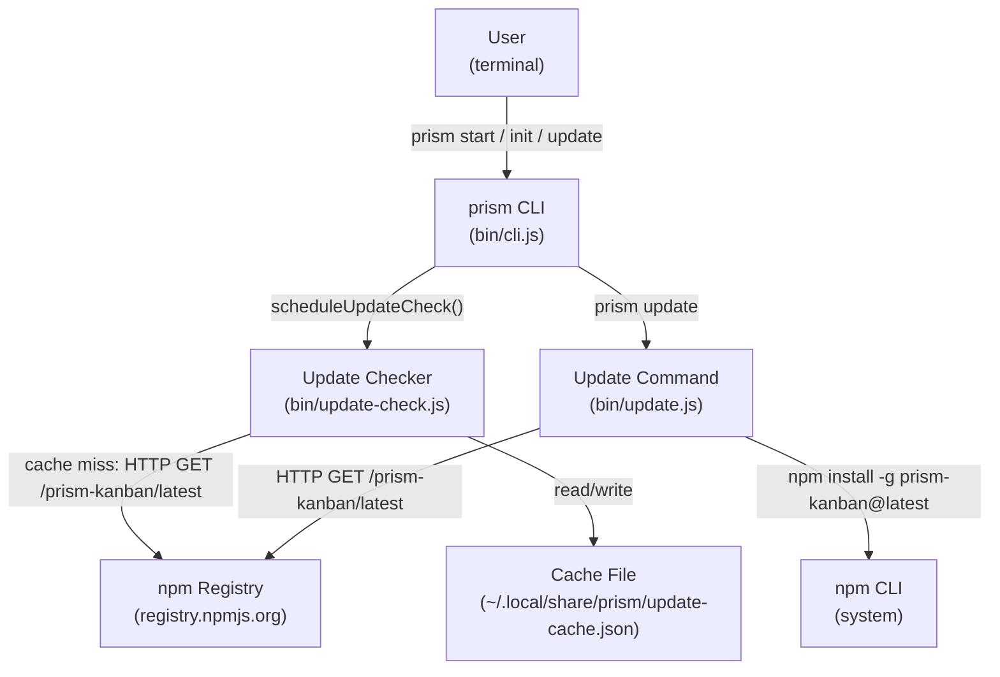
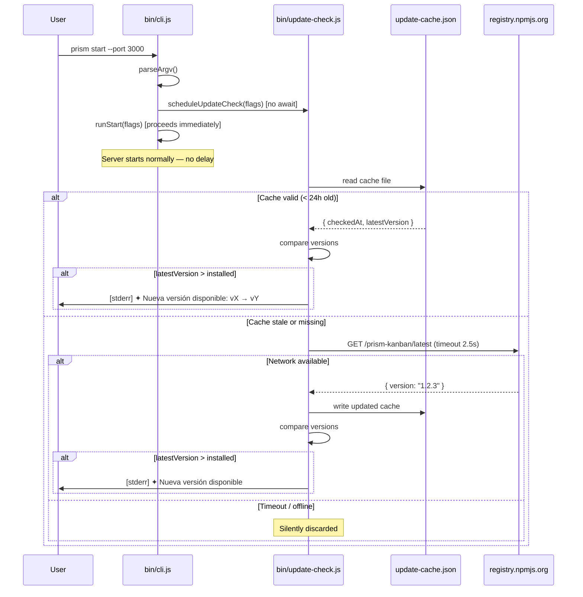
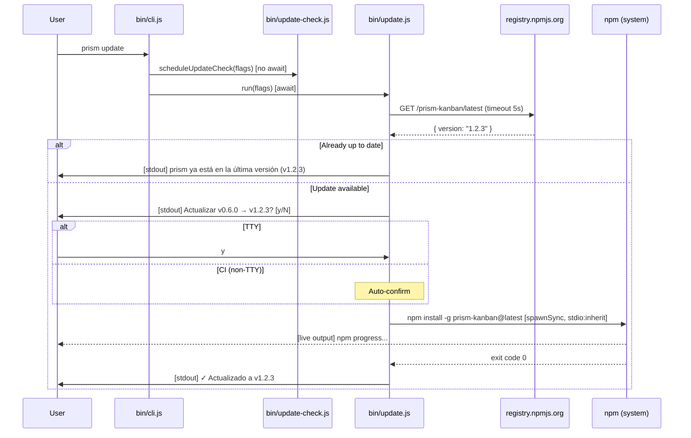

# Blueprint: Version Check + `prism update` Command

## 1. Feature Summary

Two related capabilities ship together:

| Capability | Trigger | Blocking? |
|---|---|---|
| Startup version check | Every `prism <subcommand>` invocation | No — fires and forgets |
| `prism update` subcommand | Explicit user action | Yes — waits for npm |

---

## 2. Core Components

### 2.1 `bin/update-check.js` — Version Check Module

**Responsibility:** Determine asynchronously whether a newer version of `prism-kanban` exists on npm and print a non-blocking notice to stderr.

**Technology:** Node.js 20 built-ins only (`fs`, `os`, `path`, `globalThis.fetch`). Zero new dependencies.

**Scaling pattern:** Stateless per invocation; shared state lives in a cache file (not in-process). Safe for concurrent CLI invocations.

**Public API:**
```
scheduleUpdateCheck(flags: { noUpdateCheck?: boolean, silent?: boolean }): void
```
- Calls `runUpdateCheck()` without `await` — caller never waits.
- Returns immediately. The check resolves on the next event loop tick.

**Internal flow:**

```
scheduleUpdateCheck(flags)
  │
  ├─ flags.noUpdateCheck || flags.silent? → return (no-op)
  │
  ├─ isCacheValid(cacheFilePath) ?
  │     true  → checkCachedVersion(cache, installedVersion) → printNotice()?
  │     false → fetchLatestVersion()
  │               ├─ success → writeCache(cacheFilePath, latestVersion)
  │               │            → checkVersion() → printNotice()?
  │               └─ failure (timeout / offline) → silent return
  │
  └─ printNotice(installed, latest) → process.stderr.write(...)
```

**Cache contract:**

File path (in priority order):
1. `$XDG_DATA_HOME/prism/update-cache.json`
2. `~/.local/share/prism/update-cache.json`

Note: The `.git`-detection branch of `dataDir.js` is explicitly bypassed here. The cache must be user-global, not project-local.

Schema:
```json
{
  "checkedAt": 1715000000000,
  "latestVersion": "1.2.3"
}
```

Cache is valid when `Date.now() - checkedAt < 86_400_000` (24 h).

**Network call:**

```
GET https://registry.npmjs.org/prism-kanban/latest
Accept: application/json
```

Response field used: `json.version` (string).

Timeout: 2500 ms via `Promise.race([fetch(...), timeoutPromise(2500)])`.

Any error (network, DNS, parse, write) is caught and discarded silently.

**Notice format (stderr):**

```
✦ Nueva versión disponible: v0.6.0 → v0.7.0. Ejecuta: prism update
```

Printed only when `semver(latest) > semver(installed)`. Uses a minimal semver comparator (no semver library) that compares `[major, minor, patch]` tuples numerically — sufficient for the `MAJOR.MINOR.PATCH` version scheme used by this package.

---

### 2.2 `bin/update.js` — Update Subcommand Handler

**Responsibility:** Install the latest version of `prism-kanban` globally via npm, with a confirmation step.

**Technology:** Node.js built-ins (`child_process.spawnSync`, `fs`, `readline`). Zero new dependencies.

**Public API:**
```
run(flags: { silent?: boolean }): Promise<void>
```

**Internal flow:**

```
run(flags)
  │
  ├─ fetchLatestVersion()
  │     ├─ failure → stderr: "Error: no se pudo obtener la versión" → exit(1)
  │     └─ success → latestVersion
  │
  ├─ installedVersion = require('../package.json').version
  │
  ├─ latestVersion === installedVersion?
  │     yes  → stdout: "prism ya está en la última versión (v0.7.0)" → exit(0)
  │     no   → continue
  │
  ├─ print: "Actualizar prism-kanban v0.6.0 → v0.7.0? [y/N]"
  │
  ├─ process.stdout.isTTY?
  │     false (CI) → auto-confirm (y)
  │     true       → read single line from stdin
  │
  ├─ user inputs 'y' / 'Y' / 'yes'?
  │     no  → stdout: "Cancelado." → exit(0)
  │     yes → spawnSync('npm', ['install', '-g', 'prism-kanban@latest'], { stdio: 'inherit' })
  │               ├─ status === 0 → stdout: "✓ Actualizado a v<latest>" → exit(0)
  │               └─ status !== 0 → stderr: "Error: npm install falló (código <n>)" → exit(1)
  │
  └─ (exit)
```

**Shared helper — `fetchLatestVersion()`:**

Both `update-check.js` and `update.js` need to fetch the latest version from npm. This function is extracted into `bin/update-check.js` and exported so `update.js` can import it without duplication.

```js
// bin/update-check.js (exported)
async function fetchLatestVersion(timeoutMs = 5000): Promise<string>
```

`update.js` uses a longer timeout (5 s) because it is an explicit user action, not a background check.

---

### 2.3 `bin/cli.js` — Integration Changes

**Changes required** (additive, no existing logic removed):

1. **New flag in `parseArgv`:** `--no-update-check` → `flags.noUpdateCheck = true`
2. **New `case 'update'`** in the dispatch switch → calls `runUpdate(flags)`
3. **`scheduleUpdateCheck(flags)` call** inserted at the end of `main()`, after the dispatch switch resolves the subcommand but before `runStart`/`runInit`/`runUpdate` execute their async work.

   The call order ensures the check fires on every subcommand including `start`, `init`, and `update`. For `update`, the notice (if any) appears before the confirmation prompt, which is the intended UX.

4. **USAGE string update** to document `prism update` and `--no-update-check`.

---

## 3. Data Flows and Sequences

### 3.1 C4 Context Diagram



### 3.2 Startup Version Check Sequence



### 3.3 `prism update` Sequence



---

## 4. APIs and Interfaces

### 4.1 External API: npm Registry

| Field | Value |
|---|---|
| Method | GET |
| URL | `https://registry.npmjs.org/prism-kanban/latest` |
| Headers | `Accept: application/json` |
| Response field used | `body.version` (string, semver) |
| Timeout | 2500 ms (background check), 5000 ms (update command) |
| On failure | Silent (background); fatal with error message (update command) |

### 4.2 Internal Module API

**`bin/update-check.js`**:

```
scheduleUpdateCheck(flags: UpdateCheckFlags): void
  flags.noUpdateCheck  — if true, skip entirely
  flags.silent         — if true, skip entirely

fetchLatestVersion(timeoutMs?: number): Promise<string>
  → resolves with the latest version string from npm
  → rejects on timeout or network error

getCachePath(): string
  → returns the absolute path to the cache file
  → injectable via PRISM_UPDATE_CACHE env var (for tests)
```

**`bin/update.js`**:

```
run(flags: UpdateFlags): Promise<void>
  flags.silent — suppress output (used in tests)

  Exit codes:
    0 — up to date, or updated successfully, or user cancelled
    1 — network error or npm install failure
```

### 4.3 Cache File Schema

```json
{
  "$schema": "internal",
  "checkedAt": 1715000000000,
  "latestVersion": "1.2.3"
}
```

| Field | Type | Description |
|---|---|---|
| `checkedAt` | number | `Date.now()` at last successful registry query |
| `latestVersion` | string | Semver string from npm at last check |

---

## 5. Observability Strategy

This feature runs in a CLI context — traditional metrics/tracing stacks are not applicable. Observability takes the form of:

**Structured stderr output** (non-silent mode):
- Notice line: `✦ Nueva versión disponible: vX → vY. Ejecuta: prism update`
- Update success: `✓ Actualizado a v<latest>`
- Update failure: `Error: npm install falló (código <n>)`
- Update cancelled: `Cancelado.`
- Network error (update cmd only): `Error: no se pudo obtener la versión desde npm. Comprueba tu conexión.`

**Silent failures** (background check):
- All network/parse errors in the background check are silently discarded. No logging — adding any output on every timeout would create noise in CI.

**Testability as observability proxy**: All I/O is injectable (cache path via env var, fetch via parameter, stdin via stream). Tests verify observable side effects (exit codes, stdout/stderr content, cache file state).

---

## 6. Deploy Strategy

This feature is a pure CLI-side change. No backend, no server, no infrastructure changes.

**CI/CD impact:**
- Existing GitHub Actions CI pipeline (if present) gains the new test file automatically.
- `--no-update-check` should be set in CI environments via env var `PRISM_NO_UPDATE_CHECK=1` or by always passing the flag. Recommend documenting this in CI setup guides.
- The npm registry call is outbound HTTP from developer machines only — never from CI runners, because the check respects `--no-update-check` / `PRISM_NO_UPDATE_CHECK`.

**Release strategy:** Not applicable (no server deployment). The feature ships with the next `npm publish` of `prism-kanban`. No blue/green or canary needed for a CLI-only change.

**Infrastructure as code:** Not applicable.

---

## 7. File Map

```
bin/
  cli.js              ← modified (new flag, new case, scheduleUpdateCheck call, USAGE update)
  update-check.js     ← new module
  update.js           ← new module

tests/
  update-check.test.js   ← new test file
  update.test.js         ← new test file
  cli.test.js            ← modified (add --no-update-check and 'update' subcommand tests)
```

No changes to `src/`, `server.js`, `terminal.js`, `mcp/`, or `frontend/`.
