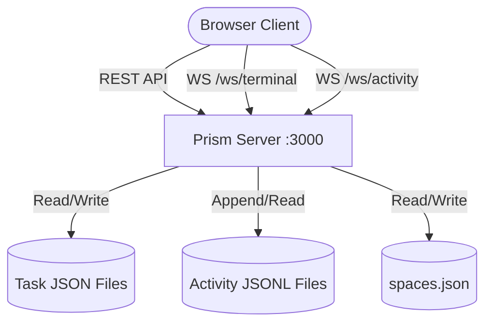
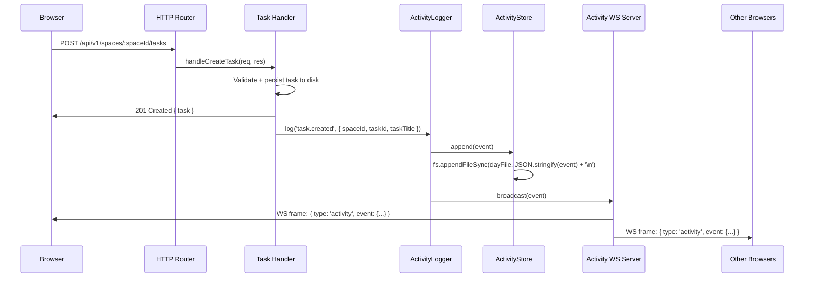
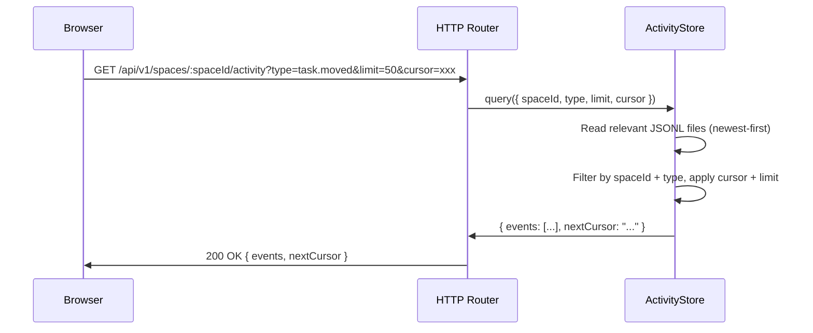

# Activity Feed -- Architectural Blueprint

**Feature:** Real-time Activity Feed for Prism Kanban
**Date:** 2026-03-23
**Author:** senior-architect

---

## 1. Requirements Summary

### 1.1 Functional Requirements

| ID   | Requirement | Priority |
|------|-------------|----------|
| FR-1 | Record all kanban mutation events (task created, moved, updated, deleted) | High |
| FR-2 | Record all space mutation events (space created, renamed, deleted) | High |
| FR-3 | Push new events to all connected browser clients in real time (sub-second) | High |
| FR-4 | Display events in a dedicated sidebar panel (ActivityFeedPanel) | High |
| FR-5 | Filter events by space ID | High |
| FR-6 | Filter events by event type (task.created, task.moved, etc.) | Medium |
| FR-7 | Filter events by date range (from/to ISO timestamps) | Medium |
| FR-8 | Persist event history for at least 30 days | High |
| FR-9 | Paginate historical events via REST (newest-first, cursor-based) | Medium |
| FR-10 | Show human-readable event descriptions with contextual metadata | Medium |

### 1.2 Non-Functional Requirements

| ID    | Constraint | Target | Justification |
|-------|-----------|--------|---------------|
| NFR-1 | Latency (event capture to client render) | < 200 ms p95 | Feels instant to the user |
| NFR-2 | Event log retention | 30 days minimum | Matches feature request |
| NFR-3 | Max concurrent WS connections | 10 (activity) + 5 (terminal) | Local dev tool, single user |
| NFR-4 | Persistence overhead per event | < 1 KB avg | JSON flat-file; keep file sizes manageable |
| NFR-5 | No new runtime dependencies | -- | KISS principle: reuse `ws` npm package already installed |
| NFR-6 | Backward compatibility | All existing APIs unchanged | No breaking changes |
| NFR-7 | Disk usage (30-day window) | < 50 MB | Reasonable for a local dev tool |
| NFR-8 | Startup migration | < 500 ms | Old data dirs (no activity log) must work without migration |

---

## 2. Architectural Design

### 2.1 Core Components

| Component | Responsibility | Technology | Scaling Pattern |
|-----------|---------------|------------|-----------------|
| **ActivityLogger** (`src/activityLogger.js`) | Capture mutation events, write to disk, broadcast to WS clients | Node.js module | Single-process; stateless broadcast |
| **ActivityStore** (`src/activityStore.js`) | Read/write/query the activity log files; handle retention | Node.js module (fs) | File-per-day partitioning |
| **Activity WS Server** (`activity-ws.js`) | WebSocket endpoint at `/ws/activity`; fan-out new events | `ws` npm (noServer) | Connection-capped (10) |
| **Activity REST Routes** (in `server.js`) | `GET /api/v1/spaces/:spaceId/activity` with filters + pagination | Native HTTP router | Stateless |
| **ActivityFeedPanel** (`frontend/src/components/activity/ActivityFeedPanel.tsx`) | Sidebar UI showing live event stream with filters | React + Zustand | Client-side filtering |
| **useActivityFeed** (`frontend/src/hooks/useActivityFeed.ts`) | Hook managing WS connection, reconnect, and local event buffer | React hook | Auto-reconnect with backoff |
| **Activity Zustand slice** (in `useAppStore.ts`) | Store activity events, filter state, panel open/close | Zustand | Selector-based re-renders |

### 2.2 Data Model

#### 2.2.1 Activity Event Schema

```json
{
  "id": "uuid-v4",
  "type": "task.created | task.moved | task.updated | task.deleted | space.created | space.renamed | space.deleted | board.cleared",
  "spaceId": "uuid | 'default'",
  "timestamp": "ISO-8601",
  "actor": "system",
  "payload": {
    "taskId": "uuid (when applicable)",
    "taskTitle": "string (snapshot at event time)",
    "from": "column-name (for task.moved)",
    "to": "column-name (for task.moved)",
    "spaceName": "string (for space events)",
    "fields": ["title", "description"]
  }
}
```

#### 2.2.2 Storage Layout

```
data/
  activity/
    2026-03-23.jsonl      <-- one file per day, newline-delimited JSON
    2026-03-22.jsonl
    ...
```

- **Format:** JSONL (one JSON object per line) -- append-only, no need to parse the entire file to add an event.
- **Partitioning:** One file per calendar day (UTC). Simplifies retention (delete files older than 30 days) and date-range queries (only read relevant files).
- **Write pattern:** `fs.appendFileSync` with a trailing `\n`. No .tmp+rename needed because append is atomic for small writes (< PIPE_BUF = 4096 bytes on macOS/Linux) and we never overwrite.

### 2.3 Data Flows

#### 2.3.1 C4 Context Diagram



#### 2.3.2 Event Capture Sequence (Main Critical Flow)



Key design decision: the HTTP response is sent **before** the event is logged and broadcast. This ensures mutation latency is not impacted by activity logging. If the append or broadcast fails, the mutation is still successful (fire-and-forget logging).

#### 2.3.3 Historical Query Flow



### 2.4 WebSocket Protocol (Activity)

**Endpoint:** `ws://localhost:3000/ws/activity`

**Server -> Client messages:**

| Type | Payload | When |
|------|---------|------|
| `activity` | `{ type: "activity", event: <ActivityEvent> }` | On every mutation |
| `connected` | `{ type: "connected", timestamp: ISO }` | After upgrade completes |
| `pong` | `{ type: "pong" }` | Response to client ping |

**Client -> Server messages:**

| Type | Payload | Purpose |
|------|---------|---------|
| `ping` | `{ type: "ping" }` | Keep-alive |

No client-side filtering over WS -- all events are broadcast. Filtering is done client-side in the React component. This keeps the server stateless (no per-connection filter state).

### 2.5 REST API

#### GET /api/v1/spaces/:spaceId/activity

Query historical activity events for a space.

**Query parameters:**

| Param | Type | Default | Description |
|-------|------|---------|-------------|
| `type` | string | (all) | Filter by event type (e.g. `task.moved`) |
| `from` | ISO-8601 | 30 days ago | Start of date range (inclusive) |
| `to` | ISO-8601 | now | End of date range (inclusive) |
| `limit` | integer | 50 | Max events to return (1-200) |
| `cursor` | string | (none) | Opaque cursor for pagination (base64-encoded `{date}:{offset}`) |

**Response (200):**

```json
{
  "events": [
    {
      "id": "uuid",
      "type": "task.created",
      "spaceId": "uuid",
      "timestamp": "ISO-8601",
      "actor": "system",
      "payload": { "taskId": "uuid", "taskTitle": "Fix bug" }
    }
  ],
  "nextCursor": "base64-string | null"
}
```

**Response codes:**

| Code | Condition |
|------|-----------|
| 200 | Success |
| 400 | Invalid query parameters |
| 404 | Space not found |
| 500 | Internal error |

**Expected latency SLA:** < 100 ms p95 for limit <= 50 (local disk reads).

#### GET /api/v1/activity (global, no space filter)

Same contract as above but without the `spaceId` path parameter. Returns events across all spaces. All other query parameters remain the same.

### 2.6 Integration Points (Server Changes)

#### 2.6.1 terminal.js Upgrade Handler Fix

The current `terminal.js` line 480 destroys sockets for **any** non-`/ws/terminal` upgrade path:

```js
if (url !== '/ws/terminal') {
  socket.destroy();
  return;
}
```

This must change to a **pass-through** pattern so that other upgrade handlers (activity WS) can register on the same HTTP server. The fix: replace `socket.destroy()` with `return;` (do nothing, let the next upgrade handler process it).

The activity WS server registers its own upgrade handler using the same `noServer` + `httpServer.on('upgrade')` pattern as the terminal. The order of handler registration does not matter because each checks a unique URL path.

#### 2.6.2 Mutation Hook Points

Each handler in the `createApp()` router that mutates state must call `ActivityLogger.log()` after the response is sent. The logger is injected into `createApp()` as a parameter (dependency injection, not a global):

| Handler | Event Type | Payload |
|---------|-----------|---------|
| `handleCreateTask` | `task.created` | taskId, taskTitle |
| `handleMoveTask` | `task.moved` | taskId, taskTitle, from, to |
| `handleUpdateTask` | `task.updated` | taskId, fields changed |
| `handleDeleteTask` | `task.deleted` | taskId, taskTitle |
| `handleClearBoard` | `board.cleared` | deletedCount |
| `handleUpdateAttachments` | `task.updated` | taskId, fields: ["attachments"] |
| Space create (spaceManager) | `space.created` | spaceName, spaceId |
| Space rename (spaceManager) | `space.renamed` | spaceName, spaceId |
| Space delete (spaceManager) | `space.deleted` | spaceName, spaceId |

### 2.7 Frontend Architecture

#### 2.7.1 Component Tree

```
App
  +-- Header
  |     +-- ActivityFeedToggle (icon button, badge with unread count)
  +-- div.flex
  |     +-- Board
  |     +-- TerminalPanel (conditional)
  |     +-- ConfigPanel (conditional)
  |     +-- AgentSettingsPanel (conditional)
  |     +-- ActivityFeedPanel (conditional)  <-- NEW
  |           +-- ActivityFeedHeader (title, close button, filter controls)
  |           +-- ActivityFeedFilters (type dropdown, date range)
  |           +-- ActivityFeedList (virtualized list of event cards)
  |           +-- ActivityFeedEmpty (empty state)
```

#### 2.7.2 Zustand Store Additions

```typescript
// New state fields in AppState interface
activityPanelOpen: boolean;
activityEvents: ActivityEvent[];
activityFilter: ActivityFilter;
activityUnreadCount: number;
activityLoading: boolean;

// New actions
toggleActivityPanel: () => void;
setActivityPanelOpen: (open: boolean) => void;
addActivityEvent: (event: ActivityEvent) => void;
setActivityFilter: (filter: Partial<ActivityFilter>) => void;
loadActivityHistory: (cursor?: string) => Promise<void>;
clearActivityUnread: () => void;
```

#### 2.7.3 useActivityFeed Hook

Manages the WebSocket connection lifecycle:
- Connect to `ws://localhost:3000/ws/activity` when the app mounts (not just when panel is open -- events should accumulate for unread badge).
- Auto-reconnect with exponential backoff (1s, 2s, 4s, 8s, max 30s).
- Parse incoming `activity` messages and push to Zustand store via `addActivityEvent`.
- Increment `activityUnreadCount` when panel is closed.
- Reset `activityUnreadCount` when panel opens.
- Ping/pong keep-alive every 30 seconds.

### 2.8 Observability Strategy

#### 2.8.1 Metrics (RED)

| Metric | Type | Labels |
|--------|------|--------|
| `activity_events_total` | Counter | `type` (event type) |
| `activity_ws_connections` | Gauge | -- |
| `activity_ws_broadcasts_total` | Counter | -- |
| `activity_query_duration_ms` | Histogram | `space` |
| `activity_retention_files_deleted` | Counter | -- |

Given Prism is a local dev tool, these are implemented as `console.log` structured JSON (the existing pattern), not Prometheus endpoints. Sufficient for debugging.

#### 2.8.2 Structured Logs

All activity module logs use the existing `console.log(JSON.stringify({...}))` pattern with fields:

```json
{
  "timestamp": "ISO-8601",
  "level": "info | warn | error",
  "component": "activity-logger | activity-store | activity-ws",
  "event": "event_logged | broadcast_sent | retention_cleanup | ws_connected | ws_disconnected",
  "...contextual fields"
}
```

#### 2.8.3 Traces

Not applicable -- single-process local application. Structured logs with correlation via `event.id` serve the same purpose.

### 2.9 Retention Strategy

A daily cleanup runs at server startup and then every 24 hours via `setInterval`:

1. List all `.jsonl` files in `data/activity/`.
2. Parse the date from the filename (e.g., `2026-03-23.jsonl` -> `2026-03-23`).
3. Delete files older than 30 days.
4. Log the number of files deleted.

This is simple, predictable, and avoids the complexity of in-file pruning.

### 2.10 Deploy Strategy

Prism is a local dev tool with no CI/CD pipeline or cloud deployment. The deploy strategy is:

1. **Build:** `cd frontend && npm run build` (Vite outputs to `dist/`).
2. **Run:** `node server.js` serves both API and built frontend.
3. **Dev:** `node server.js & cd frontend && npm run dev` for HMR.

No blue/green, canary, or IaC needed. The feature is additive and backward-compatible -- existing data directories without `data/activity/` will simply have no history until events start being logged.

---

## 3. Security Considerations

- **Origin check:** Activity WS reuses the same localhost-only origin validation as the terminal WS (`LOCALHOST_ORIGINS` set).
- **Connection cap:** Max 10 concurrent activity WS connections (prevents resource exhaustion).
- **No auth:** Consistent with the existing security model (localhost dev tool, no authn/authz).
- **Path traversal:** Activity log directory is hardcoded (`data/activity/`); filenames are derived from dates only (YYYY-MM-DD pattern), never from user input.
- **maxPayload:** Activity WS messages are small (< 2 KB). Set `maxPayload: 8192` (8 KB) to prevent abuse.

---

## 4. Error Handling

| Failure Mode | Behavior | Recovery |
|-------------|----------|----------|
| Activity log write fails | Log error, continue serving -- mutation already succeeded | Manual inspection; events resume on next write |
| Activity WS broadcast fails (one client) | Catch per-client, log warning, continue broadcasting to others | Client auto-reconnects |
| JSONL file corrupted (bad line) | Skip malformed lines during query, log warning | Delete the file to reset that day |
| Disk full | appendFileSync throws, caught and logged | User frees disk space; no data loss for tasks |
| Activity dir missing at startup | Created automatically (`mkdirSync recursive`) | Transparent |
