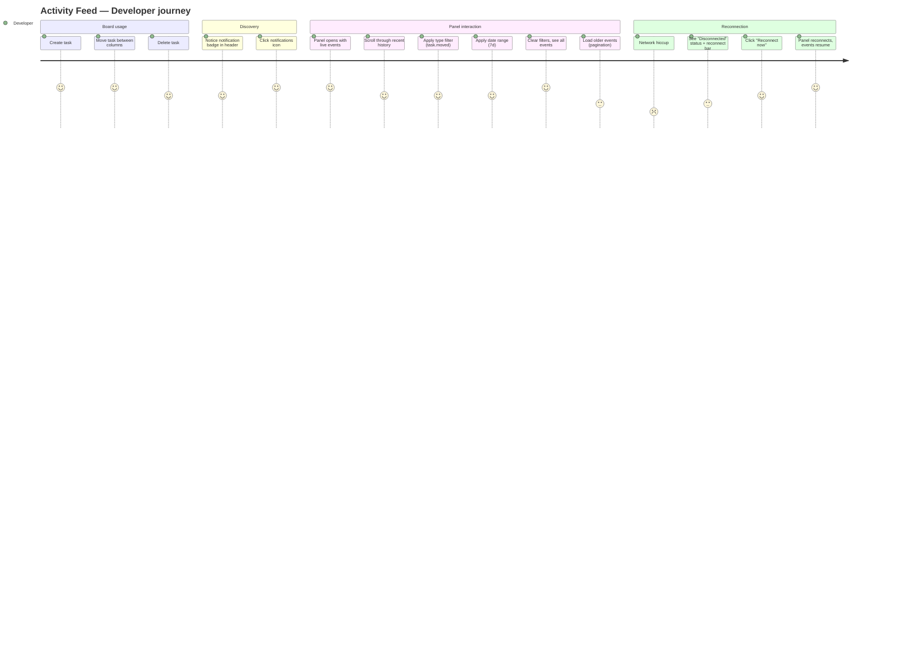

# Wireframes: Activity Feed Real-Time — Prism Kanban

## Screen Summary

| ID   | Screen                        | Stitch Status | Description                                        |
|------|-------------------------------|---------------|----------------------------------------------------|
| S-01 | Panel — Default (Live Events) | Generated     | Panel open, 6 live events, all states populated    |
| S-02 | Panel — Empty State           | Generated     | Panel open, no events match current filters        |
| S-03 | Panel — Loading State         | Generated     | Initial history fetch, skeleton cards, connecting  |
| S-04 | App Layout — Badge + Panel    | ASCII below   | Full app showing unread badge + open panel         |
| S-05 | Panel — Active Filter         | ASCII below   | Type + date filters applied, banner, 2 results     |
| S-06 | Panel — Disconnected          | ASCII below   | WS reconnecting, stale data warning, reconnect bar |

Stitch project: `projects/3163940427384051777`
Live design URL: https://stitch.withgoogle.com/projects/3163940427384051777

---

## Journey Map



### Pain Points

| Priority | Pain Point | Mitigation in Design |
|----------|-----------|----------------------|
| High | "I moved a task but I'm not sure it registered" | Real-time event card appears in <200ms confirming the action |
| High | "I can't see what changed since I last looked" | Unread badge counts events accumulated while panel was closed |
| Medium | "There are too many events, I need to find a specific type" | Type dropdown + date chips allow fast scoped filtering |
| Medium | "I lost the WS connection and I don't know if events are stale" | Red status dot + "Reconnecting in Ns..." banner + stale overlay |
| Low | "The panel takes up space I need for the board" | Drag-resize handle, minimum width 240px |

---

## Wireframe: S-01 — Panel Default State (Live Events)

Stitch screen ID: `636dd646200f46a9bafdf798b2b2edcd`
HTML: `stitch-screens/activity-feed/s-01-default.html`

```
┌────────────────────────────────────────┐
│ [drag│  Activity   ● Live          [X] │  ← header, border-bottom
│ handle  ─────────────────────────────  │
│      │ [All types ▼]  [Today][7d][30d] │  ← filter bar, border-bottom
│      │ ─────────────────────────────── │
│      │ ⇄  "Fix auth bug"              │  ← unread (blue left strip)
│      │     moved todo → in-progress   │
│      │     default · 2m ago           │
│      │ ─────────────────────────────── │
│      │ ✚  "Write unit tests"          │  ← unread
│      │     created in todo             │
│      │     default · 5m ago           │
│      │ ─────────────────────────────── │
│      │ ✎  "Refactor DB layer"         │  ← read (no strip)
│      │     updated                     │
│      │     default · 12m ago          │
│      │ ─────────────────────────────── │
│      │ ▣  Space "Backend Team"        │
│      │     created                     │
│      │     default · 1h ago           │
│      │ ─────────────────────────────── │
│      │ 🗑  "Old migration script"      │
│      │     deleted                     │
│      │     default · 2h ago           │
│      │ ─────────────────────────────── │
│      │ ⊗  Board cleared (3 tasks)     │
│      │     default · 4h ago           │
│      │ ─────────────────────────────── │
│      │         [Load more]             │  ← footer, border-top
└────────────────────────────────────────┘
  4px
  drag
```

### Event Card Anatomy

```
┌─── px-3 py-2.5 ────────────────────────────┐
│[strip] [icon 20px]  [description text-sm]  │
│                     [space · relative-time] │
│                     text-xs muted           │
└─────────────────────────────────────────────┘
```

Unread strip: 3px left border `#3b82f6` on event cards not yet seen when panel opens.
Read strip: none (no border).

### Icon + Color mapping

| Event type      | Material Symbol  | Color      |
|-----------------|-----------------|------------|
| task.created    | add_circle      | #4ae176    |
| task.moved      | swap_horiz      | #3b82f6    |
| task.updated    | edit            | #f59e0b    |
| task.deleted    | delete          | #ef4444    |
| space.created   | folder_open     | #a855f7    |
| space.renamed   | drive_file_rename_outline | #a855f7 |
| space.deleted   | folder_delete   | #ef4444    |
| board.cleared   | clear_all       | #f97316    |

### States

**Default (populated):** Event list rendered, green dot, "Live" label, "Load more" footer visible.
**Auto-scroll:** When user is scrolled to bottom, new events animate in from top (prepend + scroll). When scrolled up: new events arrive silently; a floating "N new events" chip appears at the top of the list.
**New event animation:** Event card slides in with a 200ms ease-out translate-y.

### Accessibility Notes

- `<aside aria-label="Activity feed">` — landmark role
- Header `<h2>Activity</h2>` for heading hierarchy
- Status dot + label use both color AND text (never color alone)
- Event list items: `<li>` with `aria-label` constructed from description text
- Live region: `<div aria-live="polite" aria-atomic="false">` wrapping the event list so screen readers announce new events
- "Load more" button: `aria-busy="true"` while loading, `aria-label="Load more activity events"`
- Close button: `aria-label="Close activity feed panel"`
- Drag handle: `role="separator" aria-orientation="vertical" aria-valuenow={width} aria-valuemin={240} aria-valuemax={800}`

### Mobile-First Notes

- At xs (320-599px): panel becomes a bottom drawer (full width, 60vh, slides up), overlays board
- At sm (600-899px): panel renders as right sidebar at 280px min
- At md+ (900px): full sidebar with drag resize (240–800px)
- Touch target minimum: 44×44px for all interactive elements (icon buttons, filter chips, close button)

---

## Wireframe: S-02 — Empty State

Stitch screen ID: `7933ea9887ea4693b97ec400ff3b7e4e`
HTML: `stitch-screens/activity-feed/s-02-empty.html`

```
┌────────────────────────────────────────┐
│ [drag│  Activity   ● Live          [X] │
│ handle  ─────────────────────────────  │
│      │ [task.moved ▼] [Today][7d][30d] │
│      │ ─────────────────────────────── │
│      │                                 │
│      │                                 │
│      │         notifications_off       │
│      │              48px               │
│      │           #6b7280               │
│      │                                 │
│      │        No events yet            │  ← text-sm, font-medium, white
│      │                                 │
│      │  Activity will appear here as   │  ← text-xs, muted, text-center
│      │  you create, move, and update   │
│      │  tasks.                         │
│      │                                 │
│      │                                 │
└────────────────────────────────────────┘
```

### States

**No-filter empty:** "No events yet" — shown when `activityEvents.length === 0` globally.
**Filter empty:** "No events match your filters" with a "Clear filters" link — shown when filters are active but 0 results.

### Accessibility Notes

- Empty state icon is `aria-hidden="true"`
- Container has `role="status"` so screen readers announce it on transition

---

## Wireframe: S-03 — Loading State

Stitch screen ID: `0ec8917bd68f4b4aa2f6a097e049a077`
HTML: `stitch-screens/activity-feed/s-03-loading.html`

```
┌────────────────────────────────────────┐
│ [drag│  Activity   ◎ Connecting...  [X]│  ← amber dot
│ handle  ─────────────────────────────  │
│      │ [All types ▼]  [Today][7d][30d] │  ← opacity 60%
│      │ ─────────────────────────────── │
│      │ ░░  ████████████████            │  ← skeleton card 1
│      │     ██████████                  │
│      │ ─────────────────────────────── │
│      │ ░░  █████████████               │  ← skeleton card 2
│      │     ████████                    │
│      │ ─────────────────────────────── │
│      │ ░░  ██████████████████          │  ← skeleton card 3
│      │     ██████                      │
│      │ ─────────────────────────────── │
│      │ ░░  ████████████               │  ← skeleton card 4
│      │     ██████████                  │
└────────────────────────────────────────┘
```

Skeleton shimmer: CSS `@keyframes shimmer` animation, base `#2a2a2a`, highlight `#3a3a3a`, 1.5s infinite.

### Accessibility Notes

- `aria-busy="true"` on the event list container during loading
- `aria-label="Loading activity events"` on the skeleton container

---

## Wireframe: S-04 — App Layout with Notification Badge (ASCII)

```
┌─────────────────────────────────────────────────────────────────┐
│ Prism           [default ×]                  [>_] [⚙] [🔔 ③]   │  ← header
├────────────────────────────────────────────────┬────────────────┤
│                                                │ [drag│         │
│  ┌─────────────┐ ┌─────────────┐ ┌──────────┐ │ handle         │
│  │   Todo      │ │ In Progress │ │   Done   │ │    Activity    │
│  │ ─────────── │ │ ──────────  │ │ ──────── │ │    ● Live  [X] │
│  │ [task card] │ │ [task card] │ │[task card│ │ ─────────────  │
│  │ [task card] │ │ [task card] │ │[task card│ │ [All types ▼]  │
│  │             │ │             │ │          │ │ [Today][7d][30]│
│  │             │ │             │ │          │ │ ─────────────  │
│  │             │ │             │ │          │ │ │⇄ Fix auth..  │ ← unread
│  │             │ │             │ │          │ │ │  default 2m  │
│  │             │ │             │ │          │ │ ─────────────  │
│  │             │ │             │ │          │ │ │✚ Write tests │ ← unread
│  │             │ │             │ │          │ │ │  default 5m  │
│  │             │ │             │ │          │ │ ─────────────  │
│  └─────────────┘ └─────────────┘ └──────────┘ │ │✎ Refactor.. │ ← unread
│                                                │ │  default 12m │
│                                                │ ─────────────  │
│                                                │ [Load more]    │
└────────────────────────────────────────────────┴────────────────┘
```

Badge anatomy: `[🔔]` button, red circle badge top-right, `font-size: 10px`, `min-width: 14px`, `height: 14px`.
Badge hidden when: `activityUnreadCount === 0` OR `activityPanelOpen === true`.
Opening panel calls `clearActivityUnread()`.

---

## Wireframe: S-05 — Active Filter State (ASCII)

```
┌────────────────────────────────────────┐
│ [drag│  Activity   ● Live          [X] │
│ handle  ─────────────────────────────  │
│      │ Type: [task.moved ▼] [×]        │  ← blue ring on select = active
│      │       [Today][ 7d ●][30d]       │  ← 7d chip active (blue fill)
│      │ ─────────────────────────────── │
│      │ ⚠ 2 of 47 — filters active     │  ← amber banner
│      │ ─────────────────────────────── │
│      │ ⇄  "Fix auth bug"              │
│      │     moved todo → in-progress   │
│      │     default · 3m ago           │
│      │ ─────────────────────────────── │
│      │ ⇄  "Setup CI pipeline"         │
│      │     moved in-progress → done   │
│      │     default · 1h ago           │
│      │ ─────────────────────────────── │
│      │      [Load more (no more)]      │
└────────────────────────────────────────┘
```

Filter active signals:
- Select input has `ring-1 ring-primary` (blue outline)
- Clear `[×]` button appears next to the select when a type is selected
- Active date chip: solid blue bg + white text (vs ghost/outlined for inactive)
- Filter banner: amber tint, non-dismissible, disappears when filters cleared

---

## Wireframe: S-06 — Disconnected / Reconnecting State (ASCII)

```
┌────────────────────────────────────────┐
│ [drag│  Activity   ● Disconnected  [X] │  ← red dot
│ handle  ─────────────────────────────  │
│      │ 📶✗ Connection lost.            │  ← reconnect bar, dark red bg
│      │     Reconnecting in 4s...       │
│      │     [Reconnect now]             │  ← blue text link
│      │ ─────────────────────────────── │
│      │ [All types ▼]  [Today][7d][30d] │  ← opacity 50%, disabled
│      │ ─────────────────────────────── │
│      │    Events may be outdated       │  ← amber warning strip
│      │ ─────────────────────────────── │
│      │ ⇄  "Fix auth bug"              │  ← all cards at opacity 60%
│      │     moved todo → in-progress   │
│      │     default · 2m ago           │
│      │ ─────────────────────────────── │
│      │ ✚  "Write unit tests" created  │
│      │ ─────────────────────────────── │
│      │ ✎  "Refactor DB layer" updated │
│      │ ─────────────────────────────── │
│      │ 🗑  "Old migration" deleted     │
│      │ ─────────────────────────────── │
│      │    [Load more] (disabled)       │
└────────────────────────────────────────┘
```

Reconnect behavior:
- Countdown text counts down from max-backoff-secs to 0, then re-attempts
- "Reconnect now" cancels countdown and attempts immediately
- On success: reconnect bar disappears, dot turns green, amber warning strip disappears, card opacity returns to 100%
- Backoff sequence: 1s → 2s → 4s → 8s → 16s → 30s (cap)

---

## ActivityFeedToggle Button (Header)

```
┌──────────────────────┐
│  [>_]  [⚙]  [🔔]    │
│              ┌──┐    │
│              │ 3│    │  ← badge: red circle, white "3", 14px
│              └──┘    │
└──────────────────────┘
```

- Material symbol: `notifications` (outlined when panel closed, filled when open)
- Badge: `activityUnreadCount > 0 && !activityPanelOpen` → show
- Badge caps at "99+" for overflow
- `aria-label="Activity feed, 3 unread events"` (dynamic)

---

## Validation Checklist

### Usability (Nielsen's Heuristics)
- [x] Visibility of system status: WS status shown via dot + text label at all times
- [x] User control: close button always visible, filters can be cleared independently
- [x] Consistency: panel header pattern matches TerminalPanel exactly (same tokens, same close button)
- [x] Error prevention: filters show active state clearly to avoid user confusion about filtered results
- [x] Recognition over recall: type filter uses dropdown with all options visible, not free text
- [x] Flexibility: drag-resize for different board/panel width preferences
- [x] Aesthetic minimalism: event cards show only what's needed (icon + description + space + time)

### Accessibility WCAG 2.1 AA
- [x] Status dot + text label (never color alone — WCAG 1.4.1)
- [x] `aria-live="polite"` on event list for screen reader announcements
- [x] All icon buttons have `aria-label`
- [x] Color contrast: `#e2e0fc` on `#0c0c1f` = ~13:1 (AAA)
- [x] Color contrast muted: `#6b7280` on `#0c0c1f` = ~5.2:1 (AA)
- [x] Focus trap on modal (N/A — panel is a sidebar, not a modal)
- [x] Keyboard navigation: Tab through filter controls, event cards are navigable
- [x] Drag handle: ARIA separator with valuenow/min/max

### Mobile-First
- [x] xs (320px): bottom drawer pattern, full width
- [x] All touch targets ≥ 44×44px
- [x] Overflow-y-auto on event list (no fixed height that would break on small screens)
- [x] Filter bar wraps to 2 rows on narrow widths if needed

---

## Questions for Stakeholders

1. **Unread persistence:** Should the unread count survive a page reload? (Current design: count resets on refresh, accumulates in-session only.) If persistence is required, it implies localStorage or a server-side "last-seen" cursor.

2. **Global vs. space-scoped feed:** The panel currently shows all events across all spaces. Should it default to the currently active space tab, or always show global? (Design assumption A-13: global feed by default, no per-space scoping in the panel UI.)

3. **Notification badge cap:** Badge shows "99+" at overflow. Is there a preference for a different cap (e.g., 9+) to reduce visual noise?

4. **Event card click:** Currently clicking an event card does nothing. Should it navigate to the affected task (which may require a "focus task" action in the board)? (Design assumption A-14: cards are read-only in Phase 1.)

5. **Filter state persistence:** Should active filters persist across page reloads via localStorage? (Current design: filters reset on refresh, consistent with TerminalPanel filter behavior.)
