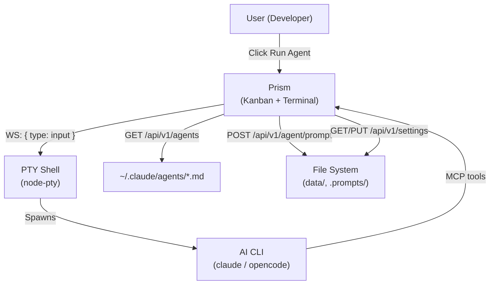
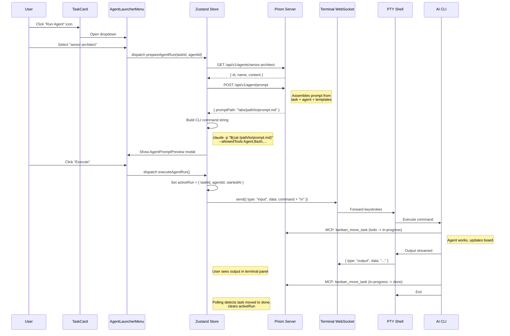
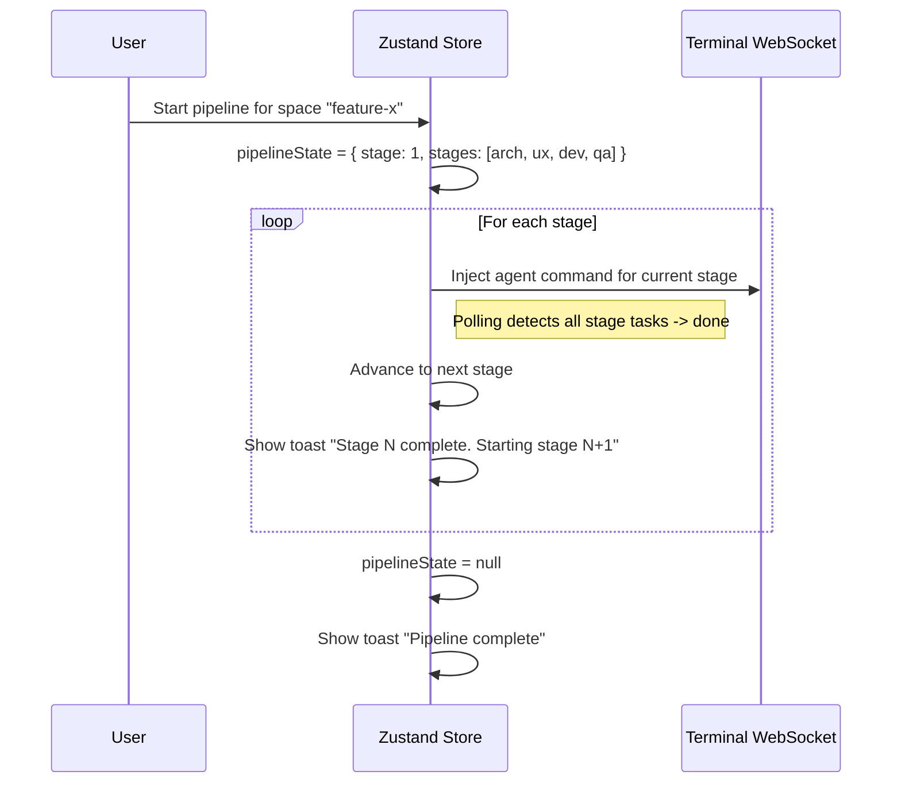

# Agent Launcher Blueprint

**Feature:** Launch AI Agents from Prism Task Cards
**Date:** 2026-03-18
**Author:** senior-architect

---

# REQUIREMENTS SUMMARY

## Functional Requirements

| ID | Requirement | Priority |
|----|-------------|----------|
| FR-01 | "Run Agent" action on task cards with agent selection dropdown | High |
| FR-02 | Prompt generation from task data (title, description, attachments, space context) | High |
| FR-03 | Terminal injection via existing PTY WebSocket (`{ type: "input", data: "..." }`) | High |
| FR-04 | CLI abstraction: configurable CLI binary (`claude` / `opencode` / custom) | High |
| FR-05 | Pipeline mode: sequential 4-stage execution (architect -> ux -> dev -> qa) | Medium |
| FR-06 | Board auto-refresh when agents modify tasks (already exists via 3s polling) | Low (exists) |
| FR-07 | Active run indicator on card/header during agent execution | Medium |
| FR-08 | AI CLI settings panel (binary, flags, defaults) | High |
| FR-09 | Agent list auto-discovered from `~/.claude/agents/*.md` | High |
| FR-10 | Prompt preview/edit before execution | Medium |

## Non-Functional Requirements

| ID | Constraint | Value | Justification |
|----|-----------|-------|---------------|
| NFR-01 | No new major dependencies | 0 new npm packages | Leverage existing xterm.js, WebSocket, Zustand |
| NFR-02 | No server-side process spawning | Commands injected into existing PTY | Security: user's shell context, not server-spawned |
| NFR-03 | Settings persistence | JSON flat-file in `data/` | Follows existing Prism persistence pattern |
| NFR-04 | Agent discovery latency | <200ms p99 | Reuses `buildConfigRegistry()` scan |
| NFR-05 | Terminal WebSocket message size | <128KB per message | Existing `maxPayload` constraint |
| NFR-06 | Prompt size | <64KB | CLI argument length limits; large prompts use temp file |

---

# TRADE-OFFS

## Trade-off 1: Terminal Injection vs. Server-Side Spawning

**Name:** Command Execution Strategy

**Option A: Terminal Injection (inject keystrokes into existing PTY)**
- Pros: No new process management. User sees output in real time in the same shell. Inherits user's env vars, PATH, shell config. No new WebSocket endpoints needed.
- Cons: Cannot programmatically detect command completion (no exit code callback). If the user types while a command is running, keystrokes interleave. Only one command at a time per terminal.

**Option B: Server-Side Process Spawning (new child_process per agent run)**
- Pros: Clean process lifecycle (exit codes, stdout/stderr capture). Can run multiple agents in parallel. Programmatic completion detection.
- Cons: New server-side code for process management. Does not inherit user's interactive shell setup (aliases, virtualenvs). Requires new WebSocket protocol. Adds complexity.

**Recommendation:** Option A (Terminal Injection). The constraint is explicit: "No spawning new processes from server -- inject commands into the existing terminal PTY." This is simpler, matches user mental model (they see the command in their shell), and leverages 100% of existing infrastructure. The limitation of no exit-code detection is mitigated by the "active run indicator" using a heuristic (detect shell prompt return).

## Trade-off 2: Prompt Delivery -- CLI Argument vs. Temp File

**Name:** Prompt Delivery Strategy

**Option A: Inline CLI argument (`claude -p "..."` with escaped prompt)**
- Pros: Single command, no file cleanup. Simple to implement. Visible in terminal scrollback.
- Cons: Shell argument length limits (varies: ~256KB on macOS, but practical limit is lower). Escaping is fragile for prompts containing quotes, backticks, `$`.

**Option B: Temp file + stdin redirect (`claude -p "$(cat /tmp/prism-prompt-xxx.md)"` or `claude -p --file`)**
- Pros: No escaping issues. No length limits. Prompt preserved on disk for debugging.
- Cons: Requires server-side temp file creation. File cleanup responsibility. Slight indirection.

**Recommendation:** Option B (Temp File). Agent prompts are complex multi-section documents (task context + Kanban instructions + Git instructions). They will routinely exceed safe inline lengths and contain characters that are painful to escape. The server writes a temp file to `data/.prompts/`, the CLI command references it, and cleanup happens after a TTL. A new endpoint `POST /api/v1/agent/prompt` handles temp file creation.

## Trade-off 3: Pipeline Orchestration -- Client-Side vs. Server-Side

**Name:** Pipeline Orchestration Strategy

**Option A: Client-side orchestration (frontend watches board state, triggers next stage)**
- Pros: No server-side state machine. Transparent: user sees each command. Leverages existing polling. Can pause/cancel between stages.
- Cons: Relies on polling to detect stage completion. Browser tab must stay open. Detecting "stage done" is heuristic (task moved to done column).

**Option B: Server-side orchestration (server manages pipeline state machine)**
- Pros: Robust: server detects completion via file system watches or process exit. Works even if browser closes.
- Cons: Significant new server complexity (state machine, process management). Contradicts "no spawning new processes" constraint.

**Recommendation:** Option A (Client-Side Orchestration). The pipeline is inherently interactive -- the user wants to see each stage, review output, and optionally intervene. Client-side orchestration with polling (already at 3s) is sufficient. The `agentLauncherSlice` in Zustand tracks pipeline state. When the active stage's tasks move to "done", the next stage is triggered automatically (with a confirmation toast).

---

# ARCHITECTURAL BLUEPRINT

## 3.1 Core Components

### Frontend Components

| Component | Responsibility | Technology | Scaling Pattern |
|-----------|---------------|------------|-----------------|
| `AgentLauncherMenu` | Dropdown on TaskCard: select agent or pipeline | React + Zustand | Stateless, rendered per card |
| `AgentPromptPreview` | Modal: shows generated prompt, allows edit before execution | React Modal | Lazy-mounted portal |
| `AgentSettingsPanel` | Settings panel: CLI binary, flags, prompt template overrides | React + Zustand | Persisted via settings API |
| `AgentRunIndicator` | Badge/animation on Header + TaskCard during active run | React | Reads from Zustand `activeRun` |
| `PipelineProgressBar` | Shows current pipeline stage (1/4, 2/4, etc.) | React | Reads from Zustand `pipelineState` |

### Zustand Store Slices

| Slice | Responsibility | Key State |
|-------|---------------|-----------|
| `agentLauncherSlice` | Agent run state, pipeline state, prompt generation | `activeRun`, `pipelineState`, `availableAgents` |
| `agentSettingsSlice` | CLI configuration, persisted settings | `cliTool`, `cliFlags`, `promptTemplate` |

### Terminal Bridge (Critical Implementation Detail)

The `useTerminal` hook owns `wsRef` privately (line 70 of `useTerminal.ts`). The Zustand store needs to send commands to the terminal for agent injection. The bridge pattern:

1. **`useTerminal` returns a `sendInput(data: string): boolean` function** alongside the existing `containerRef` and `reconnectNow`. This function wraps `send({ type: 'input', data })`.
2. **`TerminalPanel` registers the sender in the store** via a new `setTerminalSender(fn)` action when the terminal connects, and clears it on disconnect.
3. **`executeAgentRun()` in the store** calls `terminalSender(command + '\n')` instead of directly accessing the WebSocket.
4. **Guard:** If `terminalSender` is null (terminal not open/connected), `executeAgentRun` opens the terminal panel first (via `setTerminalOpen(true)`) and retries after a short delay (500ms) to allow WebSocket connection.

This keeps the WebSocket lifecycle inside `useTerminal` while giving the store a clean injection point. The `terminalSender` is a `((data: string) => boolean) | null` stored in the Zustand state.

### Backend Components

| Component | Responsibility | Technology |
|-----------|---------------|------------|
| `GET /api/v1/agents` | List available agents from `~/.claude/agents/*.md` | Node.js, `fs.readdirSync` |
| `GET /api/v1/agents/:agentId` | Read agent file content (for prompt context) | Node.js, `fs.readFileSync` |
| `POST /api/v1/agent/prompt` | Generate prompt, write temp file, return file path | Node.js, atomic write |
| `GET /api/v1/settings` | Read settings.json | Node.js, JSON read |
| `PUT /api/v1/settings` | Write settings.json (atomic) | Node.js, atomic write |

### Prompt Template Engine

The prompt is assembled from composable sections:

```
[TASK CONTEXT]
- Task title, description, type, assigned
- Current column (todo/in-progress/done)
- Space name and ID
- Attachment summaries (names + types)

[AGENT INSTRUCTIONS]
- Content of the agent .md file (e.g., senior-architect.md)

[KANBAN INSTRUCTIONS]
- Standard Kanban block (server URL, space ID, MCP tool usage)

[GIT INSTRUCTIONS]
- Standard Git block (branch name, commit format)

[PROJECT CONTEXT]
- Current working directory
- Feature name (derived from space name or task title)
```

## 3.2 Data Flows and Sequences

### C4 Context Diagram



### Main Flow: Launch Single Agent



### Pipeline Flow



## 3.3 APIs and Interfaces

### New REST Endpoints

#### `GET /api/v1/agents`

List available agent definitions.

**Response:** `200 OK`
```json
[
  {
    "id": "senior-architect",
    "name": "senior-architect.md",
    "displayName": "Senior Architect",
    "path": "~/.claude/agents/senior-architect.md",
    "sizeBytes": 11400
  }
]
```

**Latency SLA:** <100ms p99

---

#### `GET /api/v1/agents/:agentId`

Read full content of an agent definition file.

**Path params:** `agentId` -- kebab-case stem (e.g. `senior-architect`)

**Response:** `200 OK`
```json
{
  "id": "senior-architect",
  "name": "senior-architect.md",
  "displayName": "Senior Architect",
  "content": "# Senior Architect Agent\n\nYou are the Senior Architect..."
}
```

**Error:** `404` if agent file not found.

**Latency SLA:** <100ms p99

---

#### `POST /api/v1/agent/prompt`

Generate a full prompt for an agent run and persist it as a temp file.

**Request body:**
```json
{
  "agentId": "senior-architect",
  "taskId": "abc-123",
  "spaceId": "4391dcb8-...",
  "customInstructions": "Focus on scalability concerns.",
  "workingDirectory": "/Users/oscar/project"
}
```

**Response:** `201 Created`
```json
{
  "promptPath": "/absolute/path/to/data/.prompts/prompt-1710795000000-abc123.md",
  "promptPreview": "First 500 characters of the assembled prompt...",
  "cliCommand": "claude -p \"$(cat /absolute/path/to/data/.prompts/prompt-1710795000000-abc123.md)\"",
  "estimatedTokens": 2400
}
```

**Latency SLA:** <200ms p99

---

#### `GET /api/v1/settings`

Read the application settings.

**Response:** `200 OK`
```json
{
  "cli": {
    "tool": "claude",
    "binary": "claude",
    "flags": ["-p"],
    "promptFlag": "-p",
    "fileInputMethod": "cat-subshell"
  },
  "pipeline": {
    "autoAdvance": true,
    "confirmBetweenStages": true,
    "stages": ["senior-architect", "ux-api-designer", "developer-agent", "qa-engineer-e2e"]
  },
  "prompts": {
    "includeKanbanBlock": true,
    "includeGitBlock": true,
    "workingDirectory": ""
  }
}
```

---

#### `PUT /api/v1/settings`

Update settings (merge semantics: only provided fields are updated).

**Request body:** Partial settings object (same schema as GET response).

**Response:** `200 OK` with full updated settings.

---

### WebSocket Protocol (Existing -- No Changes)

Terminal injection uses the existing protocol:

```json
{ "type": "input", "data": "claude -p \"$(cat /tmp/prompt.md)\"\n" }
```

The `\n` at the end simulates pressing Enter.

### Event Contracts (Zustand Store Actions)

| Action | Payload | Side Effects |
|--------|---------|-------------|
| `setTerminalSender(fn)` | `((data: string) => boolean) \| null` | Stores the terminal input bridge function |
| `loadAgents()` | none | Fetches `GET /api/v1/agents`, sets `availableAgents` |
| `prepareAgentRun(taskId, agentId)` | task ID + agent ID | Calls `POST /api/v1/agent/prompt`, opens preview modal |
| `executeAgentRun()` | none (reads from prepared state) | Ensures terminal open, calls `terminalSender(cmd + '\n')`, sets `activeRun` |
| `cancelAgentRun()` | none | Sends `Ctrl+C` (`\x03`) via `terminalSender`, clears `activeRun` |
| `startPipeline(spaceId)` | space ID | Sets `pipelineState`, triggers first stage |
| `advancePipeline()` | none | Moves to next stage or completes |
| `loadSettings()` | none | Fetches `GET /api/v1/settings` |
| `saveSettings(partial)` | partial settings | Calls `PUT /api/v1/settings` |

## 3.4 Observability Strategy

### Metrics (RED Pattern)

| Metric | Type | Labels | Source |
|--------|------|--------|--------|
| `agent_run_total` | Counter | `agent_id`, `status` (started/completed/cancelled) | Zustand store |
| `agent_run_duration_seconds` | Histogram | `agent_id` | Zustand store (startedAt -> completedAt) |
| `pipeline_run_total` | Counter | `status` (started/completed/aborted) | Zustand store |
| `prompt_generation_duration_ms` | Histogram | `agent_id` | Server-side timing |

Since Prism is a local app, metrics are lightweight: console.log structured JSON.

### Structured Logs (Minimum Fields)

```json
{
  "timestamp": "2026-03-18T21:30:00.000Z",
  "level": "info",
  "component": "agent-launcher",
  "event": "agent_run_started",
  "agentId": "senior-architect",
  "taskId": "abc-123",
  "spaceId": "4391dcb8-...",
  "cliTool": "claude",
  "promptPath": "/abs/path/to/prompt.md"
}
```

### Traces

For a local app, full distributed tracing is overkill. Instead:
- Console timestamps on key events (prompt generated, command injected, run detected complete)
- The terminal scrollback itself serves as a trace of agent execution

## 3.5 Deploy Strategy

Prism is a local development tool, not a cloud-deployed service. The "deploy strategy" maps to the development and build workflow.

### Build Pipeline

```
lint (ESLint + tsc --noEmit)
  -> test (Vitest + RTL, >90% coverage)
  -> build (vite build -> dist/)
  -> integration test (backend + frontend smoke)
```

### Release Strategy

- Feature branch: `feature/agent-launcher`
- PR to `main` after QA passes (zero Critical/High bugs)
- No CI/CD pipeline (local tool) -- `npm run build` produces `dist/`

### Infrastructure

- Single `node server.js` process serving both API and static files
- No Terraform/Pulumi needed (local app)
- Settings stored in `data/settings.json` (atomic write pattern)

---

## Component File Structure

```
frontend/src/
  types/index.ts                          # Add AgentRun, PipelineState, AgentInfo, Settings types
  api/client.ts                           # Add agent + settings API functions
  stores/useAppStore.ts                   # Add agentLauncher + agentSettings slices + terminalSender
  hooks/useTerminal.ts                    # MODIFY: return sendInput() function
  hooks/useAgentCompletion.ts             # Poll board to detect agent completion
  components/
    agent/
      AgentLauncherMenu.tsx               # Dropdown on TaskCard
      AgentPromptPreview.tsx              # Modal: preview/edit prompt before execution
      AgentRunIndicator.tsx               # Badge on Header during active run
      AgentSettingsPanel.tsx              # Settings panel component
      PipelineProgressBar.tsx             # Pipeline stage progress indicator
    board/TaskCard.tsx                    # Add "Run Agent" button
    terminal/TerminalPanel.tsx            # MODIFY: register sendInput in store
    layout/Header.tsx                     # Add AgentRunIndicator

server.js                                # Add /api/v1/agents, /api/v1/agent/prompt,
                                         #     /api/v1/settings endpoints
data/
  settings.json                          # Persisted CLI + pipeline settings
  .prompts/                              # Temp directory for generated prompt files
```

## CLI Command Templates

The CLI command varies by tool. The settings store holds the active tool and its command template.

### Claude Code
```bash
claude -p "$(cat /path/to/prompt.md)" --allowedTools "Agent,Bash,Read,Write,Edit,Glob,Grep"
```

### OpenCode
```bash
opencode run "$(cat /path/to/prompt.md)"
```

### OpenCode with Server Mode (Advanced)
```bash
# Server started once, agent runs attach to it:
opencode serve  # (background, managed by user)
opencode run --attach "$(cat /path/to/prompt.md)"
```

The `fileInputMethod` setting controls how the prompt file is referenced:
- `cat-subshell` (default): `"$(cat /path/to/prompt.md)"` -- works in bash/zsh
- `stdin-redirect`: `< /path/to/prompt.md` -- alternative for tools that read stdin
- `flag-file`: `--file /path/to/prompt.md` -- if the CLI supports a file flag directly
