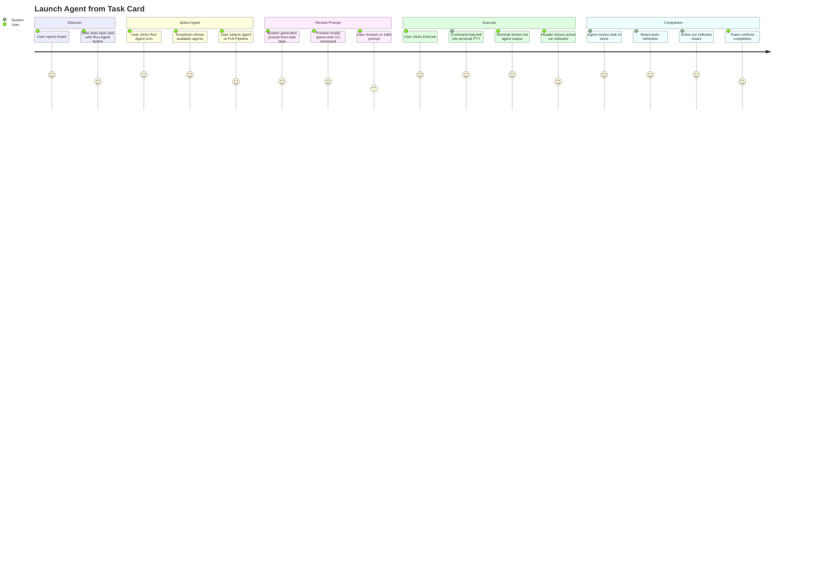

# Wireframes: Agent Launcher

**Project:** Prism — Agent Launcher from Task Cards
**Date:** 2026-03-19
**Author:** ux-api-designer
**Branch:** feature/agent-launcher

---

## Screen Summary

| Screen ID | Name | Trigger |
|-----------|------|---------|
| S-01 | Task Card — Run Agent Button | Default board view |
| S-02 | Agent Selector Dropdown | Click "Run Agent" on card |
| S-03 | Agent Prompt Preview Modal | Select agent from dropdown |
| S-04 | Terminal Injection Flow | Click "Execute" in preview |
| S-05 | Settings Panel — CLI Config | Click gear icon in header |
| S-06 | Active Run Indicator — Header | Agent running |
| S-07 | Pipeline Mode Selector | Click "Run Full Pipeline" in dropdown |
| S-08 | Pipeline Progress Bar — Header | Pipeline running |

---

## Journey Map



### Pain Points (by impact)

| Priority | Pain Point | Mitigation |
|----------|-----------|------------|
| High | Terminal not open when user clicks Execute | Auto-open terminal panel, retry injection after 500ms |
| High | Only one agent can run at a time — user may not know | "Run Agent" button disabled with tooltip "Agent already running" when activeRun is set |
| High | Prompt is complex — user can't predict what will be sent | Prompt preview modal with full CLI command and first 500 chars before execution |
| Medium | Long agent list is hard to scan | Agents listed alphabetically; "Run Full Pipeline" separated by divider at bottom |
| Medium | No feedback on whether command was actually received by PTY | Active run indicator appears immediately on Execute; terminal scrollback is the ground truth |
| Low | Temp prompt files accumulate on disk | Server cleans up files >24h old on startup and every 6 hours |

---

## S-01: Task Card — Run Agent Button

### Default state (todo column)

```
┌────────────────────────────────────────────┐
│ [research]  Define TypeScript types        │
│ T-001                                      │
├────────────────────────────────────────────┤
│ Add AgentInfo, AgentRun, PipelineState...  │
│                                            │
│ Assigned: senior-architect                 │
│ Mar 18, 2026 - 09:30                       │
├────────────────────────────────────────────┤
│ [←][→]  [▶ smart_toy]  [✕]               │
│  move     Run Agent    delete              │
└────────────────────────────────────────────┘
```

**Icon:** `smart_toy` (Material Symbols Outlined). Button variant: `icon`.
**Position:** In card footer, between move arrows and delete button.
**Tooltip:** "Run Agent" on hover.
**Visibility rule:** Button only rendered for tasks in the `todo` column.

### Disabled state (activeRun set or card in-progress/done)

```
┌────────────────────────────────────────────┐
│ [research]  Define TypeScript types        │
│ T-001                                      │
├────────────────────────────────────────────┤
│ Add AgentInfo, AgentRun, PipelineState...  │
├────────────────────────────────────────────┤
│ [←][→]  [▶ smart_toy]  [✕]               │
│          (disabled, tooltip: "Agent        │
│           already running")               │
└────────────────────────────────────────────┘
```

### Accessibility Notes
- Button has `aria-label="Run Agent"` and `title="Run Agent"`.
- Disabled state: `aria-disabled="true"`, `aria-describedby="active-run-tooltip"`.
- Keyboard: Tab reaches button; Enter/Space opens dropdown.
- Icon is decorative (`aria-hidden="true"`); label is on the button element.

### Mobile-First Notes
- Min touch target: 44x44px for the icon button.
- At 320px width, card footer wraps to two rows if needed; Run Agent button always visible.

---

## S-02: Agent Selector Dropdown

### Default state (agents loaded)

```
┌────────────────────────────────────────────┐
│ Task Card (above)                          │
│              [▶ smart_toy] ← trigger      │
│ ┌──────────────────────────────────────┐  │
│ │ smart_toy  Run Agent                 │  │
│ ├──────────────────────────────────────┤  │
│ │ ○  Senior Architect                  │  │
│ │ ○  UX API Designer                   │  │
│ │ ○  Developer Agent                   │  │
│ │ ○  QA Engineer E2E                   │  │
│ ├──────────────────────────────────────┤  │
│ │ pipeline  Run Full Pipeline          │  │
│ └──────────────────────────────────────┘  │
└────────────────────────────────────────────┘
```

**Positioning:** Dropdown opens below the trigger button, left-aligned to card.
**Width:** min 240px, max content width.
**Tokens:** `bg-surface-elevated`, `border border-border`, `text-text-primary`, shadow-md.
**Separator:** `border-t border-border` between agent list and pipeline option.
**Dismiss:** Click outside or Escape closes dropdown.

### Loading state (first open, agents not yet fetched)

```
│ ┌──────────────────────────────────────┐  │
│ │ smart_toy  Run Agent                 │  │
│ ├──────────────────────────────────────┤  │
│ │   [spinner] Loading agents...        │  │
│ └──────────────────────────────────────┘  │
```

### Empty state (no agent files found)

```
│ ┌──────────────────────────────────────┐  │
│ │ smart_toy  Run Agent                 │  │
│ ├──────────────────────────────────────┤  │
│ │  No agents found in                  │  │
│ │  ~/.claude/agents/                   │  │
│ │  [Open Settings]                     │  │
│ ├──────────────────────────────────────┤  │
│ │ pipeline  Run Full Pipeline          │  │
│ └──────────────────────────────────────┘  │
```

### Error state

```
│ ┌──────────────────────────────────────┐  │
│ │ smart_toy  Run Agent                 │  │
│ ├──────────────────────────────────────┤  │
│ │  Could not load agents.              │  │
│ │  [Retry]                             │  │
│ └──────────────────────────────────────┘  │
```

### Accessibility Notes
- Dropdown uses `role="menu"`, trigger uses `aria-haspopup="menu"` `aria-expanded`.
- Each agent option: `role="menuitem"`, keyboard navigable with arrow keys.
- Escape closes menu and returns focus to trigger.

### Mobile-First Notes
- At 320px: dropdown is full width, items are 48px tall (comfortable tap target).
- Dropdown opens upward if near bottom of viewport.

---

## S-03: Agent Prompt Preview Modal

### Default state

```
┌─────────────────────────────────────────────────────┐
│ [✕]                  Run Agent                      │
├─────────────────────────────────────────────────────┤
│ Agent: Senior Architect              [~2,400 tokens] │
│ Task:  T-001 — Define TypeScript types               │
├─────────────────────────────────────────────────────┤
│ CLI Command                                          │
│ ┌──────────────────────────────────────────────────┐│
│ │ claude -p "$(cat /abs/path/prompt-xxx.md)"       ││
│ │   --allowedTools "Agent,Bash,Read,Write,Edit,    ││
│ │    Glob,Grep"                                    ││
│ └──────────────────────────────────────────────────┘│
│                                          [Copy ✓]   │
├─────────────────────────────────────────────────────┤
│ Prompt Preview                          [Edit]       │
│ ┌──────────────────────────────────────────────────┐│
│ │ ## TASK CONTEXT                                  ││
│ │ Title: Define TypeScript types for agent...      ││
│ │ Type: research                                   ││
│ │ Column: todo                                     ││
│ │ Space: agent-launcher                            ││
│ │ Assigned: senior-architect                       ││
│ │                                                  ││
│ │ ## AGENT INSTRUCTIONS                            ││
│ │ # Senior Architect Agent                         ││
│ │ You are the Senior Architect...                  ││
│ │ [scroll for more]                                ││
│ └──────────────────────────────────────────────────┘│
├─────────────────────────────────────────────────────┤
│              [Cancel]      [play_arrow Execute]      │
└─────────────────────────────────────────────────────┘
```

**Font:** JetBrains Mono for CLI command block and prompt preview.
**Token badge:** `<Badge>` component, `bg-surface-elevated text-text-secondary`, positioned top-right.
**CLI command block:** read-only, `bg-surface text-text-primary`, rounded, padding.
**Prompt preview:** scrollable textarea, max-height 240px. Read-only by default; click Edit makes it editable.
**Execute button:** `variant="primary"`, icon `play_arrow` (left). Disabled while generating.
**Cancel:** `variant="ghost"`.

### Loading state (prompt being generated)

```
├─────────────────────────────────────────────────────┤
│ CLI Command                                          │
│ ┌──────────────────────────────────────────────────┐│
│ │  [spinner] Generating prompt...                  ││
│ └──────────────────────────────────────────────────┘│
├─────────────────────────────────────────────────────┤
│              [Cancel]     [Execute] (disabled)       │
```

### Error state (prompt generation failed)

```
├─────────────────────────────────────────────────────┤
│ ┌──────────────────────────────────────────────────┐│
│ │  Could not generate prompt.                      ││
│ │  Task T-001 or agent "senior-architect"          ││
│ │  could not be found. Check your agent files.    ││
│ │  [Retry]                                         ││
│ └──────────────────────────────────────────────────┘│
```

### Accessibility Notes
- Modal uses shared `<Modal>` (portal + backdrop + Escape + focus trap).
- Focus moves to "Cancel" button on open (safer default — avoids accidental Execute).
- `aria-labelledby` points to "Run Agent" heading.
- Token count badge: `aria-label="Estimated 2400 tokens"`.
- CLI block: `role="region"`, `aria-label="CLI command"`.

### Mobile-First Notes
- At 320px: modal is `position:fixed; inset:0` (full screen).
- Prompt preview max-height reduced to 160px on xs to leave room for action buttons.
- Execute button full-width on xs.

---

## S-04: Terminal Injection Flow

This is not a separate modal — it describes the state transition visible in the existing terminal panel after Execute is clicked.

```
BEFORE EXECUTE
┌────────────────── Terminal Panel ────────────────────┐
│ [●] Connected    Shell: zsh                [✕ close] │
├──────────────────────────────────────────────────────┤
│ ~/projects/prism $  _                                │
└──────────────────────────────────────────────────────┘

IMMEDIATELY AFTER EXECUTE (command injected)
┌────────────────── Terminal Panel ────────────────────┐
│ [●] Connected    Shell: zsh                [✕ close] │
├──────────────────────────────────────────────────────┤
│ ~/projects/prism $ claude -p "$(cat /abs/.../        │
│   prompt-1710795000000-abc123.md)"                   │
│   --allowedTools "Agent,Bash,Read,Write,Edit,        │
│    Glob,Grep"                                        │
│ > Initializing Senior Architect agent...             │
│ > Reading task context...                            │
│ > _                                                  │
└──────────────────────────────────────────────────────┘

GUARD: Terminal panel closed when Execute clicked
┌─────────────────────────────────────────────────────┐
│  [i] Opening terminal...                            │
│      Agent will launch in 500ms.                    │
└─────────────────────────────────────────────────────┘
```

**Guard behavior:** If terminal WebSocket is disconnected, the store calls `setTerminalOpen(true)` and retries injection after 500ms. A transient info toast informs the user.

---

## S-05: Settings Panel — CLI Config

**Trigger:** Gear icon (`settings`) in header. Opens as a side panel (right side, `w-[480px]`), consistent with existing ConfigPanel pattern.

```
┌──────────────────────────── Agent Settings ──────────────────────────────┐
│ [✕]                        Agent Settings                                │
├──────────────────────────────────────────────────────────────────────────┤
│                                                                          │
│  CLI Tool                                                                │
│  ┌────────────────────────────────────────────────────────────────────┐  │
│  │  ● Claude Code    ○ OpenCode    ○ Custom                           │  │
│  └────────────────────────────────────────────────────────────────────┘  │
│                                                                          │
│  Binary Path                                                             │
│  ┌────────────────────────────────────────────────────────────────────┐  │
│  │  claude                                                            │  │
│  └────────────────────────────────────────────────────────────────────┘  │
│  (visible and editable only when "Custom" is selected)                   │
│                                                                          │
│  Prompt Delivery Method                                                  │
│  ┌────────────────────────────────────────────────────────────────────┐  │
│  │  ● $(cat /path/to/prompt.md)    — shell subshell (default)         │  │
│  │  ○ < /path/to/prompt.md         — stdin redirect                   │  │
│  │  ○ --file /path/to/prompt.md    — file flag                        │  │
│  └────────────────────────────────────────────────────────────────────┘  │
│                                                                          │
│  Additional Flags                                                        │
│  ┌────────────────────────────────────────────────────────────────────┐  │
│  │  --allowedTools "Agent,Bash,Read,Write,Edit,Glob,Grep"             │  │
│  └────────────────────────────────────────────────────────────────────┘  │
│                                                                          │
│  ─── Pipeline ────────────────────────────────────────────────────────   │
│                                                                          │
│  Auto-advance stages              [ON  ●────]                           │
│  Confirm between stages           [ON  ●────]                           │
│                                                                          │
│  Stage order (read-only):                                               │
│  1. Senior Architect                                                     │
│  2. UX API Designer                                                      │
│  3. Developer Agent                                                      │
│  4. QA Engineer E2E                                                      │
│                                                                          │
│  ─── Prompt Content ──────────────────────────────────────────────────   │
│                                                                          │
│  Include Kanban instructions      [ON  ●────]                           │
│  Include Git instructions         [ON  ●────]                           │
│                                                                          │
│  Working Directory                                                       │
│  ┌────────────────────────────────────────────────────────────────────┐  │
│  │  (empty = auto-detect from cwd)                                    │  │
│  └────────────────────────────────────────────────────────────────────┘  │
│                                                                          │
├──────────────────────────────────────────────────────────────────────────┤
│                              [Cancel]   [settings Save Settings]         │
└──────────────────────────────────────────────────────────────────────────┘
```

### Loading state

The panel renders with a skeleton shimmer over each field while `GET /api/v1/settings` is in flight.

### Save — success state

A green toast appears: "Settings saved." Panel remains open.

### Save — error state

A red toast appears: "Could not save settings. Try again." Panel remains open. Form values are not reset.

### Accessibility Notes
- Panel is a `role="dialog"` with `aria-labelledby` pointing to "Agent Settings" heading.
- Radio groups use `<fieldset>` + `<legend>`.
- Toggle switches: `role="switch"` with `aria-checked`.
- Save button: `aria-busy="true"` during save request.

### Mobile-First Notes
- At 320px: panel is full-screen (`position:fixed; inset:0`).
- At 600px+: panel slides in from right at `w-[480px]`.
- Toggle switches are 44px tall minimum.

---

## S-06: Active Run Indicator — Header

### Running state

```
┌─────────────────────────────────────────────────────────────────────────┐
│ [Prism logo]  Kanban Board                                              │
│                          [● smart_toy] Senior Architect  0:42  [Cancel]│
│                          (pulsing dot animation)                        │
└─────────────────────────────────────────────────────────────────────────┘
```

**Pulse:** `animate-pulse` on the dot (`bg-primary` color).
**Elapsed time:** updates every second via `setInterval`.
**Cancel button:** `variant="danger"` (small), calls `cancelAgentRun()` which sends `\x03` to PTY.
**Icon:** `smart_toy` Material Symbol.

### Hidden state (no activeRun)

The indicator renders `null` — no reserved space in the header (no layout shift).

### Accessibility Notes
- Indicator region: `role="status"` `aria-live="polite"` so screen readers announce when run starts/ends.
- Elapsed time: `aria-label="Agent running for 42 seconds"` (updated every second).
- Cancel: `aria-label="Cancel agent run"`.

---

## S-07: Pipeline Mode Selector

### Triggered by "Run Full Pipeline" in the agent dropdown

```
┌─────────────────────────────────────────────────────┐
│ [✕]               Run Full Pipeline                 │
├─────────────────────────────────────────────────────┤
│ Space: agent-launcher                               │
│                                                     │
│ Pipeline stages to run:                             │
│  ┌──────────────────────────────────────────────┐  │
│  │ [1] Senior Architect     (architect tasks)   │  │
│  │ [2] UX API Designer      (ux tasks)          │  │
│  │ [3] Developer Agent      (dev tasks)         │  │
│  │ [4] QA Engineer E2E      (qa tasks)          │  │
│  └──────────────────────────────────────────────┘  │
│                                                     │
│  Auto-advance stages:  [ON  ●────]                 │
│  Confirm between stages: [ON  ●────]               │
│                                                     │
│  The terminal must be open. Each stage will inject  │
│  a command and wait for tasks to reach "done".      │
│                                                     │
├─────────────────────────────────────────────────────┤
│           [Cancel]    [pipeline Start Pipeline]     │
└─────────────────────────────────────────────────────┘
```

**Start Pipeline:** calls `startPipeline(spaceId)`.
**Toggles:** override the global settings for this run only (synced on open from `agentSettings`).

### Accessibility Notes
- Numbered list: `<ol>` with `role="list"`.
- Modal uses shared `<Modal>` (portal + focus trap + Escape).

---

## S-08: Pipeline Progress Bar — Header

### Active pipeline (stage 2 of 4)

```
┌─────────────────────────────────────────────────────────────────────────┐
│ [Prism]  Kanban                                                         │
│  [✓ Architect] ──► [● UX API Designer] ──── [Dev] ──── [QA]  12:34    │
│                     (active, pulsing)        (dim)     (dim)           │
│                                                     [Abort Pipeline]   │
└─────────────────────────────────────────────────────────────────────────┘
```

**Completed stages:** checkmark icon, `text-text-secondary` (dimmed but readable).
**Active stage:** `bg-primary` pill, pulsing indicator, `text-primary` label.
**Pending stages:** `text-text-secondary` dimmed text, no pill background.
**Elapsed time:** since pipeline start, updates every second.
**Abort:** `variant="ghost"` small button, calls `abortPipeline()`.

### Completed pipeline

The bar disappears and a toast shows: "Pipeline complete. All 4 stages finished in 48:12."

### Accessibility Notes
- Progress bar region: `role="status"` `aria-live="polite"`.
- Each stage pill: `aria-label="Stage 2: UX API Designer, active"`.

---

## Validation Checklist

### Usability (Nielsen Heuristics)
- [x] Visibility of system status: active run indicator + pulsing dot + elapsed time
- [x] Match between system and real world: "Run Agent", "Full Pipeline", agent display names
- [x] User control: Cancel button on active run, Abort on pipeline
- [x] Consistency: uses existing Modal, Button, Badge, ContextMenu patterns
- [x] Error prevention: prompt preview before execution; disabled button when run active
- [x] Error recovery: friendly error messages with Retry on all error states
- [x] Recognition over recall: agent list shown — user does not type agent names
- [x] Flexibility: supports claude / opencode / custom CLI; custom flags; prompt editing

### Accessibility WCAG 2.1 AA
- [x] All interactive elements keyboard-navigable (Tab, Enter/Space, Escape, arrow keys)
- [x] ARIA roles: menu/menuitem for dropdown, dialog for modals, status for live regions
- [x] Focus trap in modals; focus returns to trigger on close
- [x] Color never the only differentiator (pulsing animation + text for active run)
- [x] Minimum contrast 4.5:1 for all text (inherits verified Prism design system)
- [x] Touch targets minimum 44x44px
- [x] screen-reader text via aria-label on icon-only buttons

### Mobile-First
- [x] Breakpoints: xs 320-599px (1-col, full-screen modals/panels), sm 600-899px, md+ 900px
- [x] Dropdown opens upward near bottom of viewport
- [x] Execute button full-width on xs
- [x] Pipeline progress bar scrolls horizontally on xs (stages become scrollable row)
- [x] Settings panel full-screen on xs, slide-in on sm+

---

## Questions for Stakeholders

1. Should "Run Agent" button appear only in the `todo` column, or also in `in-progress`? The current design hides it in done/in-progress to avoid re-running completed work — is this correct?
2. For the pipeline mode, should Prism attempt to assign tasks to the correct agent automatically, or does the user pre-assign tasks before starting the pipeline?
3. Should the prompt preview be editable by default, or read-only with an explicit "Edit" action? The current design uses read-only + Edit toggle to discourage casual edits.
4. Should "Cancel" during an active agent run send only `Ctrl+C` (`\x03`), or should it also send an additional interrupt after a timeout if the process does not stop?
5. Is the settings gear icon the right entry point, or should there be a dedicated "Agent" section in the header navigation?

---

## Assumptions

| ID | Assumption | Impact if Wrong |
|----|-----------|-----------------|
| A-1 | User has claude or opencode installed and on PATH | Execute would fail silently in terminal; add PATH validation hint in settings |
| A-2 | `~/.claude/agents/` exists and contains at least one .md file | Empty-state design handles this, points to settings |
| A-3 | Terminal panel is already open or can be auto-opened | Guard logic + info toast handles this |
| A-4 | Board polling at 3s is sufficient to detect agent completion | If not, completion indicator may lag up to 3s — acceptable |
| A-5 | Pipeline stages always run in fixed order (architect→ux→dev→qa) | Stage order is configurable in settings; design supports reorder read-only display |
