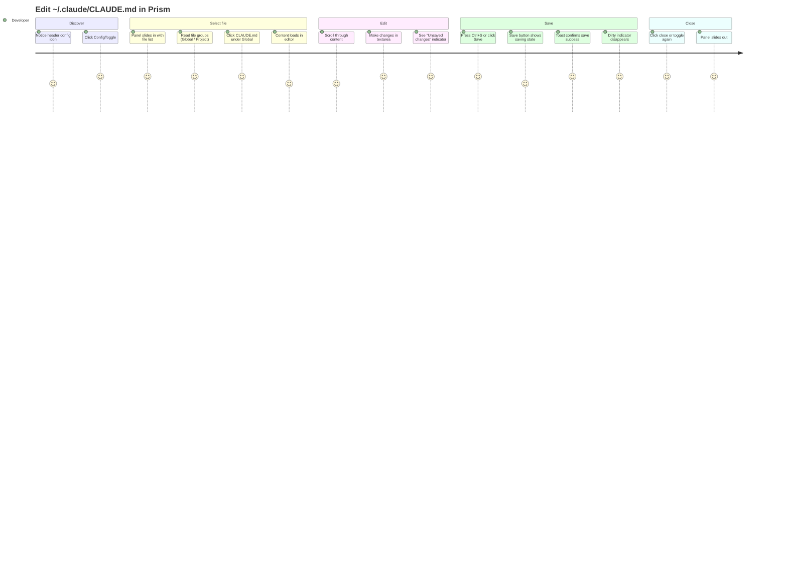

# Wireframes: Config Editor Panel

**Feature:** Configuration Editor Panel for Prism
**Date:** 2026-03-18
**Author:** ux-api-designer
**ADR reference:** ADR-1 (Accepted)

---

## Screen Summary

| Screen | Description |
|--------|-------------|
| S-01 | Header bar — ConfigToggle button added |
| S-02 | Config panel — default state (no file selected) |
| S-03 | Config panel — file selected, editor clean |
| S-04 | Config panel — editor dirty (unsaved changes) |
| S-05 | Config panel — file loading state |
| S-06 | Config panel — save error state |
| S-07 | Discard changes dialog |
| S-08 | Both panels open simultaneously (terminal + config) |
| S-09 | File sidebar — item states detail |

---

## Journey Map

### Persona

**Developer (single user, local app).** Technical user who understands Markdown and Claude Code configuration. Comfortable with terminal tools. Wants to edit config without context switching to a file editor.

### User Journey: Edit a Global Config File



### Pain Points

| Priority | Pain Point | Mitigation |
|----------|-----------|------------|
| High | Switching files with unsaved changes causes data loss | Discard confirmation dialog before switching |
| High | No visual feedback that content has changed | Persistent "Unsaved changes" indicator + Save button enabled state |
| Medium | Accidentally closing the panel discards edits | Discard confirmation dialog on close when dirty |
| Medium | Not knowing which CLAUDE.md is global vs. project | File grouped by scope label; directory shown as subtitle |
| Low | Long lines wrapping in 480px panel | `overflow-x: auto` + `white-space: pre` on textarea |

---

## S-01: Header Bar — ConfigToggle Added

The ConfigToggle button is inserted between ThemeToggle and TerminalToggle.

```
┌────────────────────────────────────────────────────────────────────────────────────┐
│ Prism                                    [theme] [config] [terminal]  [+ New Task] │
└────────────────────────────────────────────────────────────────────────────────────┘
```

### ConfigToggle Detail

```
Inactive state (panel closed):
┌──────┐
│  ⚙   │   icon: "settings" (Material Symbols Outlined)
│      │   bg-white/5  text-text-secondary  hover:bg-white/10
└──────┘

Active state (panel open):
┌──────┐
│  ⚙   │   icon: "settings"
│      │   bg-primary/[0.15]  text-primary
└──────┘
```

Button size: 32×32px, border-radius: rounded-lg. Tooltip on hover: "Configuration".

### Accessibility Notes (S-01)
- `aria-label="Toggle configuration panel"`
- `aria-pressed="true|false"` reflecting panel open state
- Keyboard: focusable via Tab, activates on Enter/Space
- Tooltip implemented as `title` attribute (supplemented by aria-label — do not rely on title alone)

---

## S-02: Config Panel — Default State (No File Selected)

Panel slides in from the right. File list has loaded. No file is selected yet.

```
┌──────────────────────────────────────────────────────────────────────────────┐
│  Board (flex-1, shrinks)                          │  Config Panel (w-[480px]) │
│                                                   │                           │
│  ┌────── todo ──────┐  ┌── in-progress ──┐        │ ┌───────────────────────┐ │
│  │                  │  │                 │        │ │ Configuration      [✕] │ │
│  │  [task card]     │  │  [task card]    │        │ ├────────────────────────┤ │
│  │                  │  │                 │        │ │┌────────┐┌────────────┐│ │
│  │                  │  │                 │        │ ││Sidebar ││            ││ │
│  │                  │  │                 │        │ │├────────┤│  Select a  ││ │
│  │                  │  │                 │        │ ││Global  ││  file from ││ │
│  └──────────────────┘  └─────────────────┘        │ ││CLAUDE.md│  the sidebar││ │
│                                                   │ ││RTK.md  ││  to begin  ││ │
│                                                   │ │├────────┤│  editing.  ││ │
│                                                   │ ││Project ││            ││ │
│                                                   │ ││CLAUDE.md│           ││ │
│                                                   │ │└────────┘└────────────┘│ │
│                                                   │ ├────────────────────────┤ │
│                                                   │ │                [Save ↑]│ │
│                                                   │ └───────────────────────┘ │
└──────────────────────────────────────────────────────────────────────────────┘
```

### Panel Layout (detailed)

```
┌─────────────────────────────────────────┐  ← w-[480px], h-full, flex flex-col
│ Configuration                       [✕] │  ← header: h-12, flex items-center px-4
│                                         │    bg-surface-elevated border-b border-border
├─────────┬───────────────────────────────┤
│ Global  │                               │
│─────────│                               │
│ CLAUDE.md│                              │  ← sidebar: w-[140px] shrink-0
│ RTK.md  │    Select a file from the     │    border-r border-border overflow-y-auto
│         │    sidebar to begin editing.   │
│─────────│                               │  ← editor area: flex-1, flex items-center
│ Project │                               │    justify-center text-text-secondary
│─────────│                               │
│ CLAUDE.md│                              │
│         │                               │
├─────────┴───────────────────────────────┤
│                               [  Save  ]│  ← footer: h-12, flex items-center
│                                         │    justify-end px-4 border-t border-border
└─────────────────────────────────────────┘
```

**Save button:** disabled when no file is selected or editor is clean. `variant="primary"`.

### States: S-02

| Element | Value |
|---------|-------|
| Active file | none |
| Editor area | Empty state message: "Select a file from the sidebar to begin editing." |
| Save button | disabled |
| Dirty indicator | hidden |

### Accessibility Notes (S-02)
- Panel has `role="complementary"` and `aria-label="Configuration editor"`
- Close button: `aria-label="Close configuration panel"`
- Sidebar list: `role="listbox"` with `aria-label="Config files"`
- Empty state: `aria-live="polite"` so screen reader announces when file list loads

---

## S-03: Config Panel — File Selected, Editor Clean

User has clicked "CLAUDE.md" under Global. Content is loaded, no changes made.

```
┌─────────────────────────────────────────┐
│ Configuration                       [✕] │
├─────────┬───────────────────────────────┤
│ Global  │ # Agent Team Workflow          │
│─────────│                               │
│[CLAUDE.md]│ This project uses four       │
│ RTK.md  │ specialized agents in a       │
│         │ sequential pipeline. Follow   │
│─────────│ these rules...                │
│ Project │                               │
│─────────│ ## Pipeline                   │
│ CLAUDE.md│                              │
│         │ ```                           │
│         │ senior-architect → ux-api...  │
│         │ ```                           │
│         │                               │
├─────────┴───────────────────────────────┤
│                               [  Save  ]│
└─────────────────────────────────────────┘
```

**Active file item:**
```
[CLAUDE.md]   ← bg-primary/[0.15] text-primary border-l-2 border-primary font-medium
```

**Inactive file item:**
```
 CLAUDE.md    ← text-text-secondary hover:bg-white/5 hover:text-text-primary
```

**Textarea:** `w-full h-full p-3 font-mono text-sm text-text-primary bg-transparent resize-none outline-none overflow-auto`

**Save button:** still disabled (content unchanged).

### Accessibility Notes (S-03)
- Active sidebar item: `aria-selected="true"` on the `role="option"` element
- Textarea: `aria-label="File editor for CLAUDE.md"`, `spellcheck="false"`, `autocorrect="off"`, `autocapitalize="off"`
- Tab order: sidebar items → textarea → Save button

---

## S-04: Config Panel — Editor Dirty (Unsaved Changes)

User has edited the textarea. Dirty state is active.

```
┌─────────────────────────────────────────┐
│ Configuration                       [✕] │
├─────────┬───────────────────────────────┤
│ Global  │ # Agent Team Workflow (v2)     │
│─────────│                               │
│[CLAUDE.md]│ This project uses four       │
│ RTK.md  │ specialized agents in a       │
│         │ sequential pipeline...         │
│─────────│                               │
│ Project │ ## Pipeline (updated)          │
│─────────│                               │
│ CLAUDE.md│ ...                          │
│         │                               │
├─────────┴───────────────────────────────┤
│ ● Unsaved changes          [  Save  ↑] │
└─────────────────────────────────────────┘
```

**Footer — dirty state:**
```
┌──────────────────────────────────────────┐
│ ●  Unsaved changes          [  Save ↑ ] │
│                                          │
│ ↑ text-amber-400, 12px, font-medium      │
│    ● dot: bg-amber-400 rounded-full 8px  │
│    Save button: enabled, variant=primary │
└──────────────────────────────────────────┘
```

**Keyboard shortcut:** Ctrl+S (Windows/Linux) / Cmd+S (Mac) triggers save when panel is open and file is dirty.

### Accessibility Notes (S-04)
- Dirty indicator: `role="status"` `aria-live="polite"` announces "Unsaved changes" when state transitions
- Save button: `aria-label="Save CLAUDE.md"` (interpolates filename)
- Save shortcut: documented in tooltip on Save button (`title="Save (Ctrl+S)"`)

---

## S-05: Config Panel — File Loading State

User clicked a file in the sidebar. Content is being fetched.

```
┌─────────────────────────────────────────┐
│ Configuration                       [✕] │
├─────────┬───────────────────────────────┤
│ Global  │                               │
│─────────│                               │
│ CLAUDE.md│     [  spinner  ]            │
│[RTK.md ]│                               │
│         │    Loading RTK.md...          │
│─────────│                               │
│ Project │                               │
│─────────│                               │
│ CLAUDE.md│                              │
│         │                               │
├─────────┴───────────────────────────────┤
│                               [  Save  ]│
└─────────────────────────────────────────┘
```

**Loading spinner:** CSS `animate-spin` border-based spinner, 24px, centered in editor area.

**Sidebar during loading:** selected item shows loading indicator inline:
```
[RTK.md ⟳]   ← text-text-secondary with animate-spin inline icon
```

**Textarea:** hidden or `opacity-0` while loading to avoid flash of empty content.

### Accessibility Notes (S-05)
- Editor area: `aria-busy="true"` while loading
- Loading message: `aria-live="polite"` announces "Loading RTK.md"
- Save button remains disabled during loading

---

## S-06: Config Panel — Save Error State

Save failed (network error, permission denied, etc.).

```
┌─────────────────────────────────────────┐
│ Configuration                       [✕] │
├─────────┬───────────────────────────────┤
│ Global  │ # RTK - Rust Token Killer      │
│─────────│                               │
│ CLAUDE.md│ **Usage**: Token-optimized   │
│[RTK.md ]│ CLI proxy (60-90% savings)    │
│         │                               │
│─────────│ ...                           │
│ Project │                               │
│─────────│                               │
│ CLAUDE.md│                              │
│         │                               │
├─────────┴───────────────────────────────┤
│ ● Unsaved changes          [  Save  ↑] │
└─────────────────────────────────────────┘

  ┌─────────── Toast (top-right, 5s) ────────────┐
  │ [✕]  Could not save RTK.md. Please try again. │
  └───────────────────────────────────────────────┘
```

**Behavior after error:**
- Toast appears for 5 seconds (red, error variant).
- Editor remains dirty — content is NOT lost.
- Save button remains enabled so user can retry.
- No content is overwritten in the textarea.

### Accessibility Notes (S-06)
- Toast: `role="alert"` `aria-live="assertive"` for immediate announcement
- Error message is non-technical: "Could not save RTK.md. Please try again."
- Focus does NOT move to the toast — user's cursor position in textarea is preserved

---

## S-07: Discard Changes Dialog

Shown when the user clicks a different file in the sidebar OR clicks the close button while the editor is dirty.

```
┌─────────────────────────────────────────────────────────┐
│                   (board blurred behind)                │
│                                                         │
│           ┌──────────────────────────────────┐          │
│           │                                  │          │
│           │  Discard unsaved changes?        │          │
│           │                                  │          │
│           │  You have unsaved changes to     │          │
│           │  CLAUDE.md. Switching files will  │          │
│           │  discard them.                   │          │
│           │                                  │          │
│           │          [Cancel]  [Discard]     │          │
│           │                                  │          │
│           └──────────────────────────────────┘          │
│                                                         │
└─────────────────────────────────────────────────────────┘
```

**Dialog layout:**
```
┌──────────────────────────────────┐
│  Discard unsaved changes?        │  ← text-text-primary font-semibold text-base
│                                  │
│  You have unsaved changes to     │  ← text-text-secondary text-sm
│  {filename}. {context-message}   │
│                                  │
│             [Cancel]  [Discard]  │  ← flex justify-end gap-2
└──────────────────────────────────┘
```

**Context messages:**
- When switching files: "Switching files will discard them."
- When closing panel: "Closing the panel will discard them."

**Buttons:**
- `[Cancel]` — `variant="secondary"`, initial focus (prevents accidental discard)
- `[Discard]` — `variant="danger"`, confirms discard

**Component:** Uses existing `<Modal role="alertdialog" aria-labelledby="discard-dialog-title">`.

### Accessibility Notes (S-07)
- `role="alertdialog"` (interrupts user because data loss is possible)
- `aria-labelledby` references the dialog title
- `aria-describedby` references the description paragraph
- Focus trap inside the modal (handled by existing `<Modal>` component)
- Initial focus on "Cancel" button
- Escape key closes the dialog and selects Cancel (no discard)
- Tab cycles: Cancel → Discard → Cancel

---

## S-08: Both Panels Open (Terminal + Config)

When both TerminalPanel and ConfigPanel are open simultaneously.

```
┌─────────────────────────────────────────────────────────────────────────────────────┐
│ Prism                                               [theme] [config*] [terminal*]  [+ New Task] │
├─────────────────────────────────────────────────────────────────────────────────────┤
│ SpaceTabs                                                                           │
├─────────────────────┬──────────────────────────────┬───────────────────────────────┤
│                     │  Terminal Panel (w-[480px])   │  Config Panel (w-[480px])     │
│  Board (flex-1)     │ ┌──────────────────────────┐  │ ┌─────────────────────────┐  │
│  ┌── todo ──┐       │ │ Terminal             [✕]  │  │ │ Configuration      [✕]  │  │
│  │          │       │ ├──────────────────────────┤  │ ├─────────────────────────┤  │
│  │ [card]   │       │ │ $ node server.js         │  │ │┌──────┐┌──────────────┐ │  │
│  │          │       │ │ Server running on :3000   │  │ ││Sidebar││ # Agent...  │ │  │
│  └──────────┘       │ │ >_                       │  │ │├──────┤│              │ │  │
│                     │ └──────────────────────────┘  │ ││Global││ This project │ │  │
│  ← board shrinks    │                               │ ││CLAUDE││ uses four    │ │  │
│    proportionally   │                               │ ││RTK.md││ specialized  │ │  │
│    with overflow    │                               │ │├──────┤│ agents...    │ │  │
│    hidden           │                               │ ││Project││             │ │  │
│                     │                               │ ││CLAUDE│└──────────────┘ │  │
│                     │                               │ │└──────┘                 │  │
│                     │                               │ ├─────────────────────────┤  │
│                     │                               │ │ ● Unsaved   [  Save  ]  │  │
└─────────────────────┴──────────────────────────────┴───────────────────────────────┘
```

**Board behavior when both panels open:**
- Board uses `flex-1 min-w-0 overflow-hidden` — shrinks as panels appear.
- Columns use horizontal scroll when board becomes too narrow.
- No minimum board width enforced — both panels can coexist even on 1440px screens.

**Header active states:** Both ConfigToggle (`[config*]`) and TerminalToggle (`[terminal*]`) show active styling simultaneously.

---

## S-09: File Sidebar — Item States Detail

```
Sidebar section header:
┌────────────────────┐
│ Global             │   ← text-text-secondary text-xs font-semibold uppercase tracking-wider
│                    │     px-3 pt-3 pb-1 (not clickable)
└────────────────────┘

File item — inactive:
┌────────────────────┐
│  CLAUDE.md         │   ← px-3 py-2 text-sm text-text-secondary
│  ~/.claude/        │     hover:bg-white/5 hover:text-text-primary cursor-pointer
└────────────────────┘
   ↑ filename (text-text-secondary text-sm)
   ↑ directory (text-text-secondary/60 text-xs truncate)

File item — active:
┌────────────────────┐
│▌ CLAUDE.md         │   ← border-l-2 border-primary bg-primary/[0.10]
│  ~/.claude/        │     text-primary font-medium px-3 py-2 text-sm
└────────────────────┘

File item — hover (not active):
┌────────────────────┐
│  CLAUDE.md         │   ← bg-white/5 text-text-primary (transition-colors duration-150)
│  ~/.claude/        │
└────────────────────┘

File item — loading (content being fetched):
┌────────────────────┐
│  CLAUDE.md  [⟳]   │   ← same as active + inline spinner (animate-spin text-xs)
│  ~/.claude/        │
└────────────────────┘

Sidebar separator between sections:
────────────────────    ← border-t border-border my-2 mx-3

Project section:
┌────────────────────┐
│ Project            │   ← same header style
└────────────────────┘
┌────────────────────┐
│  CLAUDE.md         │
│  ./                │
└────────────────────┘
```

**File items are `role="option"` inside `role="listbox"`.** The listbox supports keyboard navigation: Up/Down arrows move selection; Enter loads the selected file.

---

## Validation Checklist

### Usability (Nielsen's Heuristics)

| Heuristic | Check | Status |
|-----------|-------|--------|
| 1. Visibility of system status | Loading spinner, saving indicator, dirty indicator, toast for save result | Pass |
| 2. Match between system and real world | "Unsaved changes" not "dirty state", "Configuration" not "Config API" | Pass |
| 3. User control and freedom | Cancel in discard dialog, independent close button, Escape on dialog | Pass |
| 4. Consistency and standards | ConfigToggle mirrors TerminalToggle pattern exactly | Pass |
| 5. Error prevention | Discard confirmation before data loss (switch or close while dirty) | Pass |
| 6. Recognition over recall | Files listed by name in sidebar; active file visually highlighted | Pass |
| 7. Flexibility and efficiency | Ctrl+S / Cmd+S shortcut for power users | Pass |
| 8. Aesthetic and minimalist design | No decorative elements; header/footer/sidebar/editor clear sections | Pass |
| 9. Help users recognize and recover from errors | Toast with non-technical message + retry available (button stays enabled) | Pass |
| 10. Help and documentation | Tooltip on ConfigToggle; placeholder in empty editor state | Pass |

### Accessibility (WCAG 2.1 AA)

| Criterion | Check | Status |
|-----------|-------|--------|
| 1.1.1 Non-text content | All icon buttons have aria-label | Pass |
| 1.4.3 Contrast (text) | text-text-primary on bg-surface-elevated (verified existing token) | Pass |
| 1.4.3 Contrast (dirty indicator) | amber-400 on dark surface — check: #F59E0B on #1e2030 ≈ 5.5:1 | Pass (AA) |
| 1.4.4 Resize text | Font-size in rem/Tailwind defaults, textarea grows with content | Pass |
| 2.1.1 Keyboard | All interactive elements reachable via Tab; listbox via arrow keys | Pass |
| 2.1.2 No keyboard trap | Focus trap only inside alertdialog (correct) | Pass |
| 2.4.3 Focus order | Header → Sidebar → Editor → Footer (logical DOM order) | Pass |
| 2.4.7 Focus visible | Tailwind `focus:ring-2 focus:ring-primary` on all interactive elements | Pass |
| 3.2.2 On input | No automatic navigation on file selection — user must press Enter or click | Pass |
| 4.1.3 Status messages | Dirty indicator and loading states use aria-live | Pass |

### Mobile-First

This panel is a desktop-first feature (slide-over alongside the board). The following breakpoints apply:

| Breakpoint | Behavior |
|-----------|---------|
| xs 320–599px | Config panel overlays the board fullscreen (`position: fixed; inset: 0; z-index: 50`). Board is hidden behind the panel. |
| sm 600–899px | Config panel overlays the board fullscreen (same as xs). |
| md 900–1199px | Config panel renders beside board. Board shrinks. Terminal cannot coexist (TerminalPanel auto-closes or is toggled manually). |
| lg 1200px+ | Both panels can coexist beside the board (as shown in S-08). |

**Mobile panel close:** On xs/sm, the close button is the only way to dismiss. No swipe gesture (out of scope for v1).

**Touch targets:** Close button, sidebar items, Save button — all minimum 44×44px touch target.

---

## Questions for Stakeholders

1. **Dirty state on panel close:** When the user closes the panel with unsaved changes, should the panel "remember" its dirty content when reopened (so work is not lost), or should the content be discarded on close regardless? Current design shows a discard confirmation but does not persist draft content across panel close/reopen cycles.

2. **File creation:** Should the panel support creating new `.md` files in `~/.claude/`? Currently it only lists existing files. Adding creation would require a new API endpoint and UI affordance (e.g., a "+" button in the sidebar).

3. **File size display:** Should the file size (`sizeBytes`) be shown in the sidebar item subtitle? Example: "CLAUDE.md · 9.7 KB". This adds context but also visual noise.

4. **Keyboard shortcut conflict:** Ctrl+S / Cmd+S is the save shortcut. Should this shortcut be active globally when the config panel is open (even if focus is not on the panel), or only when focus is inside the panel? Current design only activates when the panel has focus.

5. **Project-local CLAUDE.md absent:** If the server finds no `CLAUDE.md` at the project root, should the sidebar show the item greyed out with "Not found" or omit it entirely? Current design omits it.
