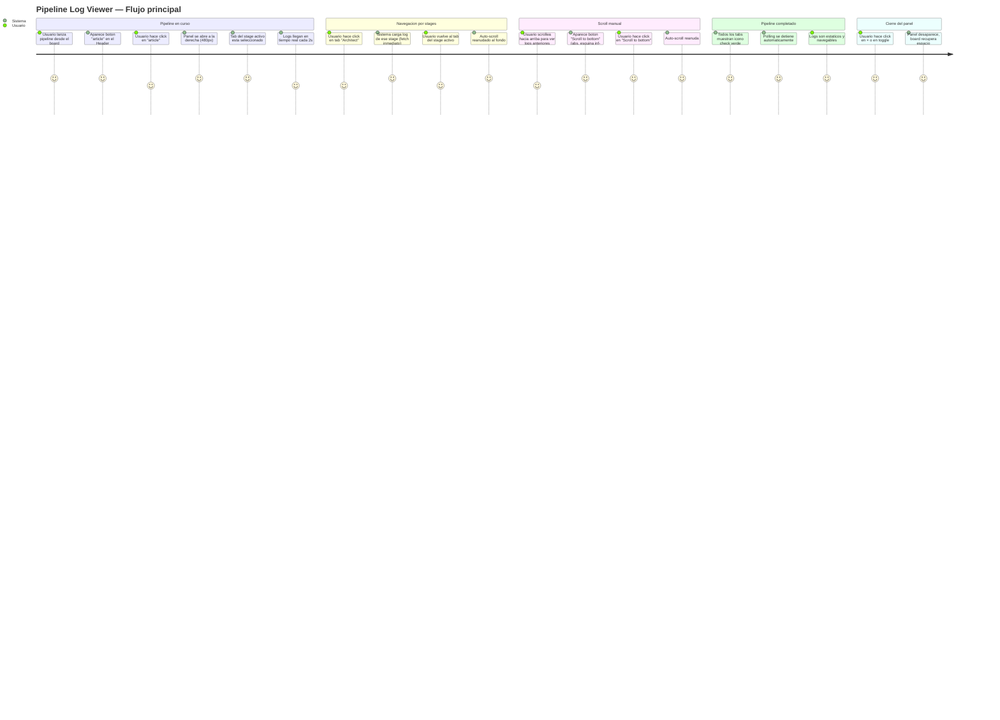

# Wireframes: Pipeline Log Viewer

## Screen Summary

| ID | Pantalla | Estado |
|----|----------|--------|
| S-01 | PipelineLogPanel — Default (logs en vivo, stage activo) | Default |
| S-02 | PipelineLogPanel — Empty Pending (stage no iniciado) | Empty |
| S-03 | PipelineLogPanel — Waiting for Output (stage running, sin contenido) | Loading |
| S-04 | PipelineLogPanel — Fetch Error | Error |
| S-05 | PipelineLogPanel — Scroll Detached (usuario scrolleo arriba) | Scroll |
| S-06 | PipelineLogPanel — Completed Run (todos los stages done) | Done |

Stitch Project: https://stitch.withgoogle.com/projects/8212977200307130138
Nota: los screens individuales se generaron en el proyecto Stitch. Usar `mcp__stitch__list_screens({ projectId: "8212977200307130138" })` para obtener los IDs una vez disponibles.

---

## Journey Map



---

## Wireframe S-01: Default — Logs en vivo

```
┌─────────────────────────────────────────────────────────────────────────────────────┐
│ HEADER (64px)                                                                       │
│  [Prism]  prism                             [terminal] [history] [article*] [theme] │
│                                                         (* = activo, bg pill azul)  │
├──────────────────────────────────────────┬──────────────────────────────────────────┤
│                                          │ PIPELINE LOG PANEL (480px)              │
│  KANBAN BOARD (flex-1)                   │  bg: surface (#1A1A1F)                  │
│                                          │  border-left: 1px border-color          │
│  ┌────────┐  ┌──────────────┐  ┌──────┐ │ ┌────────────────────────────────────┐  │
│  │  Todo  │  │  In Progress │  │ Done │ │ │ Pipeline Logs              [×]     │  │
│  │        │  │              │  │      │ │ ├────────────────────────────────────┤  │
│  │ [card] │  │   [card]     │  │[card]│ │ │[Architect✓][UX✓][Dev⟳*][QA⌛]    │  │
│  │        │  │              │  │      │ │ │ active tab: Dev (border-b primary) │  │
│  └────────┘  └──────────────┘  └──────┘ │ ├────────────────────────────────────┤  │
│                                          │ │ LOG CONTENT (bg: #0D0D0F)          │  │
│                                          │ │ font: JetBrains Mono 11px          │  │
│                                          │ │ p-3                                │  │
│                                          │ │                                    │  │
│                                          │ │ [2026-03-24 13:59:41] Stage 3 (Dev)│  │
│                                          │ │ Reading blueprint.md...            │  │
│                                          │ │ [PIPELINE] stage.started {stage:3} │  │
│                                          │ │ Invoking developer-agent...        │  │
│                                          │ │ > Task T-001: Extend PipelineState │  │
│                                          │ │   Reading frontend/src/types/...   │  │
│                                          │ │   Writing usePipelineLogStore.ts   │  │
│                                          │ │   ✓ TypeScript compiled OK         │  │
│                                          │ │ > Task T-002: Create store...      │  │
│                                          │ │   create frontend/src/stores/...   │  │
│                                          │ │ > Task T-003: Add getStageLog...   │  │
│                                          │ │   Adding to api/client.ts          │  │
│                                          │ │ > Task T-004: usePipelineLogPoll.. │  │
│                                          │ │   Writing hook...                  │  │
│                                          │ │ > Task T-005: LogViewer component. │  │
│                                          │ │   ↳ auto-scroll al fondo ──────── │  │
│                                          │ └────────────────────────────────────┘  │
└──────────────────────────────────────────┴──────────────────────────────────────────┘

Nota: el boton [article*] en el header tiene un pill/fondo azul cuando el panel está abierto.
Auto-scroll activo = no se muestra "Scroll to bottom".
```

### Estados del tab
```
[Architect ✓]  — status: completed  — icono: check     — color: success (#28CD41)
[UX       ✓]  — status: completed  — icono: check     — color: success (#28CD41)
[Dev      ⟳]  — status: running    — icono: spinning  — color: primary (#0A84FF)  ← ACTIVE
[QA       ⌛]  — status: pending   — icono: hourglass — color: text-secondary
```

Tab activo: `bg-primary/10 text-primary border-b-2 border-primary`
Tab inactivo: `text-text-secondary hover:text-text-primary`

---

## Wireframe S-02: Empty Pending — Stage no iniciado

```
┌──────────────────────────────────────────┬──────────────────────────────────────────┤
│  KANBAN BOARD                            │ ┌────────────────────────────────────┐  │
│  (igual que S-01)                        │ │ Pipeline Logs              [×]     │  │
│                                          │ ├────────────────────────────────────┤  │
│                                          │ │[Architect✓][UX✓][Dev⟳][QA⌛*]    │  │
│                                          │ │  active: QA (pending, border-b)    │  │
│                                          │ ├────────────────────────────────────┤  │
│                                          │ │ LOG CONTENT (bg: #0D0D0F)          │  │
│                                          │ │                                    │  │
│                                          │ │                                    │  │
│                                          │ │                                    │  │
│                                          │ │           ⌛                       │  │
│                                          │ │    Stage not started yet.          │  │
│                                          │ │    (text-secondary, Inter 13px)    │  │
│                                          │ │                                    │  │
│                                          │ │                                    │  │
│                                          │ └────────────────────────────────────┘  │
└──────────────────────────────────────────┴──────────────────────────────────────────┘
```

Condicion: `isPending === true && content === ""`
Sin spinner — el hourglass es estatico. Sin boton de accion.

---

## Wireframe S-03: Waiting for Output — Stage running, sin contenido

```
┌──────────────────────────────────────────┬──────────────────────────────────────────┤
│  KANBAN BOARD                            │ ┌────────────────────────────────────┐  │
│                                          │ │ Pipeline Logs              [×]     │  │
│                                          │ ├────────────────────────────────────┤  │
│                                          │ │[Architect✓][UX✓][Dev⟳*][QA⌛]    │  │
│                                          │ ├────────────────────────────────────┤  │
│                                          │ │ LOG CONTENT (bg: #0D0D0F)          │  │
│                                          │ │                                    │  │
│                                          │ │                                    │  │
│                                          │ │                                    │  │
│                                          │ │         ◌  (spinner azul, 20px)   │  │
│                                          │ │    Waiting for output...           │  │
│                                          │ │    (text-secondary, Inter 13px)    │  │
│                                          │ │                                    │  │
│                                          │ │                                    │  │
│                                          │ └────────────────────────────────────┘  │
└──────────────────────────────────────────┴──────────────────────────────────────────┘
```

Condicion: `isRunning === true && content === ""`
Spinner: `animate-spin` del tab del stage activo + spinner centrado en el area de log.

---

## Wireframe S-04: Fetch Error

```
┌──────────────────────────────────────────┬──────────────────────────────────────────┤
│  KANBAN BOARD                            │ ┌────────────────────────────────────┐  │
│                                          │ │ Pipeline Logs              [×]     │  │
│                                          │ ├────────────────────────────────────┤  │
│                                          │ │[Architect✓][UX✓][Dev⟳*][QA⌛]    │  │
│                                          │ ├────────────────────────────────────┤  │
│                                          │ │ LOG CONTENT (bg: #0D0D0F)          │  │
│                                          │ │                                    │  │
│                                          │ │                                    │  │
│                                          │ │                                    │  │
│                                          │ │      ⚠ (error_outline, rojo)      │  │
│                                          │ │  No se pudo cargar el log.         │  │
│                                          │ │  (text-primary, 13px)              │  │
│                                          │ │  El servidor no respondio.         │  │
│                                          │ │  Se reintentara automaticamente.   │  │
│                                          │ │  (text-secondary, 11px)            │  │
│                                          │ │                                    │  │
│                                          │ └────────────────────────────────────┘  │
└──────────────────────────────────────────┴──────────────────────────────────────────┘
```

Condicion: `error !== null`
Sin boton de reintento — el polling lo gestiona automaticamente cada 2s.
El icono error_outline usa color error (#FF3B30).

---

## Wireframe S-05: Scroll Detached — Usuario scrolleo arriba

```
┌──────────────────────────────────────────┬──────────────────────────────────────────┤
│  KANBAN BOARD                            │ ┌────────────────────────────────────┐  │
│                                          │ │ Pipeline Logs              [×]     │  │
│                                          │ ├────────────────────────────────────┤  │
│                                          │ │[Architect✓][UX✓][Dev⟳*][QA⌛]    │  │
│                                          │ ├────────────────────────────────────┤  │
│                                          │ │ LOG CONTENT (bg: #0D0D0F, rel)     │  │
│                                          │ │                                    │  │
│                                          │ │ [2026-03-24 13:42:10] Reading...   │  │
│                                          │ │ Processing task T-001 artifacts    │  │
│                                          │ │ ✓ ADR-1.md validated               │  │
│                                          │ │ ✓ blueprint.md validated           │  │
│                                          │ │ ✓ tasks.json validated (10 tasks)  │  │
│                                          │ │ Calling developer-agent tool...    │  │
│                                          │ │ > claude --agent developer-agent   │  │
│                                          │ │   Loading context...               │  │
│                                          │ │   Reading frontend/src/types/...   │  │
│                                          │ │   (usuario esta en linea ~100)     │  │
│                                          │ │                                    │  │
│                                          │ │                    ┌─────────────┐ │  │
│                                          │ │                    │↓ Scroll to  │ │  │
│                                          │ │                    │  bottom     │ │  │
│                                          │ │                    └─────────────┘ │  │
│                                          │ └────────────────────────────────────┘  │
└──────────────────────────────────────────┴──────────────────────────────────────────┘
```

Boton "Scroll to bottom": position absolute, bottom-3 right-3.
Estilo: `bg-surface-elevated border border-border rounded-sm text-text-secondary text-xs px-3 py-1.5`.
Icono: `keyboard_arrow_down` (Material Symbols) + texto "Scroll to bottom".
Al hacer click: scrollTop = scrollHeight + auto-scroll se reactiva.

---

## Wireframe S-06: Completed Run — Todos los stages done

```
┌──────────────────────────────────────────┬──────────────────────────────────────────┤
│  KANBAN BOARD (activo, tareas visibles)  │ ┌────────────────────────────────────┐  │
│  ┌────────┐  ┌──────────────┐  ┌──────┐ │ │ Pipeline Logs              [×]     │  │
│  │  Todo  │  │  In Progress │  │ Done │ │ ├────────────────────────────────────┤  │
│  │        │  │              │  │[card]│ │ │[Architect✓][UX✓][Dev✓][QA✓*]      │  │
│  │        │  │              │  │[card]│ │ │  active: QA (primary underline)    │  │
│  │        │  │              │  │[card]│ │ ├────────────────────────────────────┤  │
│  └────────┘  └──────────────┘  └──────┘ │ │ LOG CONTENT (bg: #0D0D0F)          │  │
│                                          │ │                                    │  │
│                                          │ │ Running test suite...              │  │
│                                          │ │ ✓ usePipelineLogStore.test.ts      │  │
│                                          │ │ ✓ usePipelineLogPolling.test.ts    │  │
│                                          │ │ ✓ LogViewer.test.tsx               │  │
│                                          │ │ ✓ StageTabBar.test.tsx             │  │
│                                          │ │ ✓ PipelineLogPanel.test.tsx        │  │
│                                          │ │                                    │  │
│                                          │ │ Test Files  5 passed | 5 total     │  │
│                                          │ │ Tests      38 passed | 38 total    │  │
│                                          │ │ Coverage   94.3% (>90% required)   │  │
│                                          │ │                                    │  │
│                                          │ │ [PIPELINE] stage.done {stage:4}    │  │
│                                          │ │ [PIPELINE] run.completed           │  │
│                                          │ └────────────────────────────────────┘  │
└──────────────────────────────────────────┴──────────────────────────────────────────┘
```

Sin spinner en ningun tab — todos tienen check verde.
No hay polling activo — logs estaticos.
El kanban board muestra el tablero completo sin dimming (pipeline terminado).

---

## Wireframe del Toggle en Header

```
HEADER — Estado con pipeline activo:
┌────────────────────────────────────────────────────────────────────────────────────┐
│  Prism  prism              [terminal_icon]  [history_icon]  [article_icon]  [theme]│
│                                                              ^                      │
│                                                 Visible solo cuando pipelineState  │
│                                                 !== null                           │
└────────────────────────────────────────────────────────────────────────────────────┘

HEADER — Estado sin pipeline:
┌────────────────────────────────────────────────────────────────────────────────────┐
│  Prism  prism              [terminal_icon]  [history_icon]                [theme]  │
│                                                                                    │
│                             article icon NO aparece                                │
└────────────────────────────────────────────────────────────────────────────────────┘

Estado activo del boton (panel abierto):
- Background pill: bg-primary/10
- Icono: color primary (#0A84FF)

Estado inactivo (panel cerrado):
- Sin background
- Icono: color text-secondary
```

---

## Panel Header

```
┌────────────────────────────────────┐
│ Pipeline Logs              [×]     │  ← 48px height
└────────────────────────────────────┘

Titulo: font-sans text-sm font-medium text-text-primary, padding-left: 12px
Boton ×: Button variant="icon", Material Symbol "close", padding-right: 8px
Borde inferior: 1px border-border (separa del StageTabBar)
```

---

## StageTabBar

```
┌──────────────┬──────────────┬──────────────┬──────────────┐
│ [✓] Architect│  [✓] UX     │ [⟳] Dev      │ [⌛] QA      │
│              │              │  (ACTIVE)    │              │
└──────────────┴──────────────┴──────┬───────┴──────────────┘
                                      │ border-b-2 border-primary

Altura: 40px
Tabs: flex-1 cada uno (ancho igual distribuido)
Font: text-xs Inter
Iconos Material Symbols: 14px

Status → icono → color:
  pending   → hourglass_empty → text-secondary
  running   → progress_activity + animate-spin → text-primary/primary
  completed → check_circle → success (#28CD41)
  failed    → close → error (#FF3B30)
  timeout   → timer_off → warning (#FF9500)
```

---

## LogViewer

```
AREA DE LOG (flex-1, overflow-y-auto):
  bg: surface-variant (#0D0D0F mas oscuro que el panel)
  font: JetBrains Mono, 11px
  color: text-text-primary
  padding: 12px
  white-space: pre-wrap
  word-break: break-words

COMPORTAMIENTO:
  - containerRef.current.scrollTop = containerRef.current.scrollHeight
    → solo si isAtBottom === true
  - onScroll: isAtBottom = scrollTop + clientHeight >= scrollHeight - 20
    (threshold de 20px para evitar falsos negativos por subpixels)
  - Al hacer click en "Scroll to bottom": scrollTop = scrollHeight + isAtBottom = true
```

---

## Accesibilidad

- Boton toggle en Header: `aria-label="Ver logs del pipeline"` / `aria-label="Ocultar logs del pipeline"` segun estado.
- Boton × en panel header: `aria-label="Cerrar panel de logs"`.
- Tabs en StageTabBar: `role="tablist"`, cada tab `role="tab"`, `aria-selected={isActive}`, `aria-label="Stage Architect, completado"`.
- LogViewer `<pre>`: `aria-live="off"` (no anunciar cada linea — demasiado ruido). El usuario puede navegar con teclado libremente.
- Boton "Scroll to bottom": `aria-label="Ir al final del log"`.
- Iconos de status: `aria-hidden="true"` + texto visible en el tab como fuente de verdad.
- Contraste panel header: text-primary (#E0E0E0) sobre surface (#1A1A1F) = 11.5:1 (AAA).
- Contraste log text (#E0E0E0) sobre log bg (#0D0D0F) = ~14:1 (AAA).
- Contraste text-secondary (#8E8E93) sobre log bg (#0D0D0F) = ~4.8:1 (AA).

---

## Mobile-First

El panel lateral NO se adapta a mobile (xs/sm). Razon: Prism es una herramienta de desarrollo local usada en desktop. En pantallas < 900px el panel colapsado es la experiencia por defecto — el toggle existe pero el panel ocupa toda la pantalla si se abre (position: fixed; inset: 0; z-index: 50), igual que el patron de TerminalPanel.

Breakpoints de comportamiento:
- `<900px`: panel en overlay (position fixed, ancho 100%), se cierra con × o backdrop tap.
- `>=900px`: panel lateral flex (480px por defecto, resizable).

---

## Validacion de Usabilidad (Nielsen)

| Heuristica | Cumplimiento |
|------------|-------------|
| Visibilidad del estado | Tab activo con icono de status en tiempo real. Spinner cuando hay polling. |
| Control del usuario | El usuario puede cerrar el panel en cualquier momento sin interrumpir el pipeline. |
| Consistencia | Mismo patron visual que TerminalPanel y RunHistoryPanel. |
| Prevencion de errores | El toggle es visible solo cuando hay un pipeline activo. |
| Reconocimiento > recuerdo | Los tabs muestran nombre + icono — no requieren memorizar el estado. |
| Flexibilidad | El panel es resizable (320px-900px). |
| Estetica minimalista | Sin decoraciones. Log area = area completa. Sin toolbars innecesarias. |
| Ayuda ante errores | El estado de error explica que ocurrio y que el sistema lo reintentara. |

---

## Validacion Checklist

- [x] Todos los estados tienen wireframe: default, empty, loading, error, scroll, completed.
- [x] El toggle es visible solo cuando hay pipeline activo.
- [x] Cada tab tiene icono de status legible (no solo color).
- [x] El auto-scroll no fuerza scroll cuando el usuario ha navegado arriba.
- [x] El error state no expone errores tecnicos internos.
- [x] El panel no bloquea la interaccion con el board.
- [x] La accesibilidad esta documentada con roles ARIA y ratios de contraste.
- [x] El comportamiento mobile esta definido.
- [x] El resize del panel esta definido (320px-900px).

---

## Preguntas para Stakeholders

1. Cuando hay un error de fetch (S-04), el sistema reintenta automaticamente. ¿Es aceptable no tener un boton de reintento manual, o el usuario necesita control explicito sobre cuando reintentar?
2. El tab activo al abrir el panel muestra siempre el stage en curso (o el ultimo stage). ¿Hay casos donde el usuario querria ver un stage anterior por defecto al abrir?
3. ¿El limite de `?tail=500` lineas es suficiente, o necesitamos un boton "Load full log" desde el primer dia?
4. ¿El panel debe persistir abierto entre recargas de pagina (localStorage), o empezar siempre cerrado?
5. En el estado completado (S-06), ¿debe el toggle permanecer visible despues de que el pipeline termine, o desaparece?

---

## Asunciones

| ID | Asuncion | Impacto si es incorrecta |
|----|----------|--------------------------|
| A-1 | El pipeline tiene exactamente 4 stages (Architect, UX, Dev, QA) | StageTabBar necesitaria ser mas flexible si el numero varia |
| A-2 | El endpoint `GET /api/v1/runs/:runId/stages/:N/log` devuelve texto plano sin formato ANSI | Si hay ANSI, se necesitaria un parser (xterm.js o strip-ansi) |
| A-3 | `?tail=500` es suficiente para la mayoria de los casos de uso | Si no, se necesita "Load full log" en v1 |
| A-4 | El panel siempre empieza cerrado (no persiste estado entre sesiones) | Si se quiere persistencia, se necesita localStorage en el store |
| A-5 | El toggle desaparece cuando `pipelineState === null` (no cuando el run termina) | Si el usuario quiere ver logs de runs anteriores, se necesita un historial de runs en el panel |
