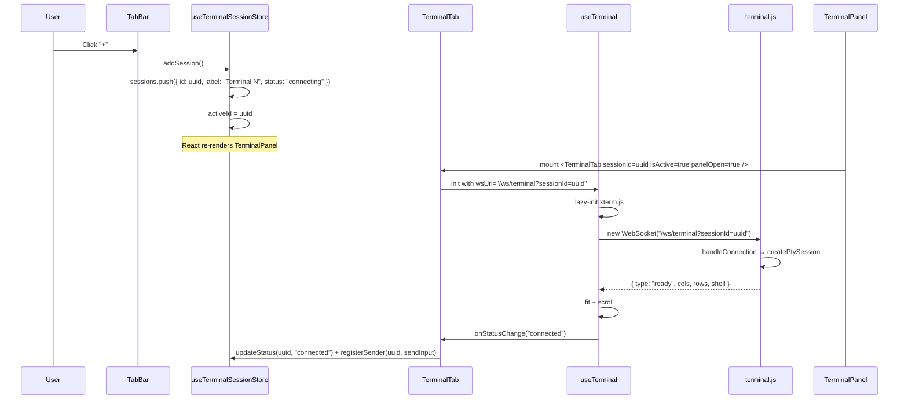
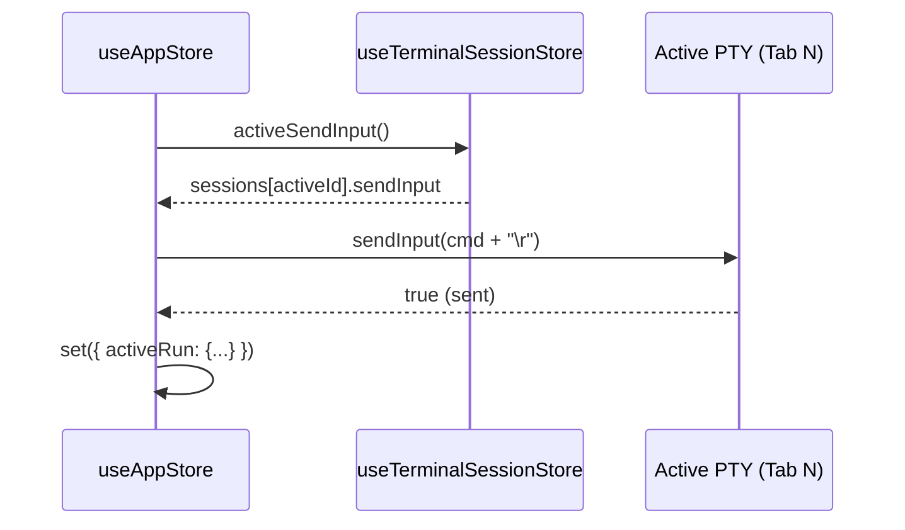
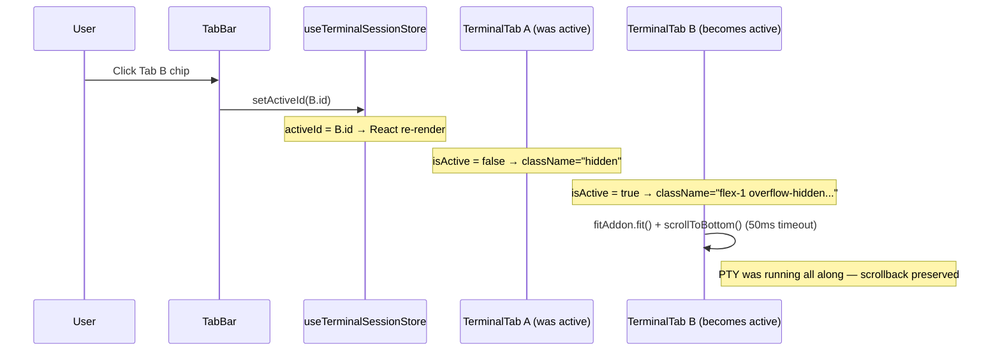

# Blueprint: Multi-Tab PTY Terminal Sessions

## 1. Requirements Summary

### Functional

| ID | Requirement |
|----|-------------|
| F-01 | User can open up to 4 independent terminal tabs inside the existing terminal panel. |
| F-02 | Each tab has its own PTY process (independent shell, env, cwd, scrollback). |
| F-03 | User can add a new tab via a "+" button in the tab bar. |
| F-04 | User can close any tab via a "×" button on the tab chip. Closing the last tab closes the panel. |
| F-05 | User can rename a tab by double-clicking its label. |
| F-06 | Switching tabs immediately shows that tab's xterm.js instance. |
| F-07 | The agent launcher injects commands into the currently active tab. |
| F-08 | Each tab displays its own connection status indicator. |
| F-09 | The active tab's connection status is surfaced in the panel header (replaces the current single status indicator). |
| F-10 | Closing the panel hides it but preserves all tab sessions (shells remain running). |

### Non-functional

| ID | Constraint | Value |
|----|-----------|-------|
| N-01 | Max concurrent PTY sessions | 4 (hard cap in frontend; server allows 5) |
| N-02 | Tab switch latency | < 50 ms (DOM visibility toggle, no xterm.js reinit) |
| N-03 | Memory per tab | ~3 MB (xterm.js scrollback 5000 lines) |
| N-04 | Backward compatibility | Existing `/ws/terminal` tests continue to pass |
| N-05 | No new backend dependencies | `terminal.js` unchanged |

---

## 2. Architecture Overview

The change is entirely frontend-side (except the query-string URL convention, which requires zero backend code changes).

```
┌─────────────────────────────────────────────────────────────┐
│  TerminalPanel (refactored)                                 │
│  ┌────────────────────────────────────────────────────────┐ │
│  │  Tab Bar: [Tab 1 ×] [Tab 2 ×] [+]                     │ │
│  └────────────────────────────────────────────────────────┘ │
│  ┌────────────────────────────────────────────────────────┐ │
│  │  TerminalTab (active, visible)                         │ │
│  │    useTerminal(wsUrl="/ws/terminal?sessionId=abc")      │ │
│  │    <div ref={containerRef} />  ← xterm.js mounted      │ │
│  └────────────────────────────────────────────────────────┘ │
│  ┌────────────────────────────────────────────────────────┐ │
│  │  TerminalTab (inactive, hidden via CSS)                │ │
│  │    useTerminal(wsUrl="/ws/terminal?sessionId=def")      │ │
│  │    <div ref={containerRef} style="display:none" />      │ │
│  └────────────────────────────────────────────────────────┘ │
└─────────────────────────────────────────────────────────────┘
          │  WebSocket per tab                │
          ▼                                  ▼
  ws://localhost:3000/ws/terminal?sessionId=abc
  ws://localhost:3000/ws/terminal?sessionId=def
          │                                  │
  ┌───────┴──────────────────────────────────┴───────┐
  │  terminal.js (unchanged)                         │
  │  One PTY process per WebSocket connection         │
  │  MAX_CONNECTIONS = 5                              │
  └──────────────────────────────────────────────────┘
```

---

## 3. Core Components

### 3.1 Backend — `terminal.js` (no changes required)

The existing server already creates one PTY per WebSocket connection. The `sessionId` query parameter is ignored by the server — it is used only by the frontend to route messages to the correct xterm.js instance. No backend changes are needed.

The upgrade handler's URL check must continue to strip the query string before comparing:

```
const url = req.url ? req.url.split('?')[0] : '';
if (url !== '/ws/terminal') return;   // already works correctly
```

This is already implemented in the current code.

### 3.2 Frontend Store — `useTerminalSessionStore` (new Zustand slice)

A dedicated Zustand store (separate from `useAppStore`) manages multi-tab session state to keep `useAppStore` from growing further.

**State shape:**

```typescript
interface TerminalSession {
  id:         string;           // UUID, used as ?sessionId=
  label:      string;           // Display name, e.g. "Terminal 1"
  status:     TerminalStatus;   // 'connecting' | 'connected' | 'disconnected'
  sendInput:  ((data: string) => boolean) | null;  // bridge from useTerminal
}

interface TerminalSessionState {
  sessions:      TerminalSession[];
  activeId:      string | null;
  panelOpen:     boolean;

  // Actions
  openPanel:       () => void;
  closePanel:      () => void;
  togglePanel:     () => void;
  addSession:      () => void;          // creates new session, switches to it
  removeSession:   (id: string) => void;  // closes panel if last tab
  setActiveId:     (id: string) => void;
  renameSession:   (id: string, label: string) => void;
  updateStatus:    (id: string, status: TerminalStatus) => void;
  registerSender:  (id: string, fn: ((data: string) => boolean) | null) => void;
  activeSendInput: () => ((data: string) => boolean) | null;  // derived
}
```

**Constants:**

```
MAX_SESSIONS = 4
STORAGE_KEY  = 'prism:terminal:panelOpen'
```

**Initial state:** One session is created on store initialisation. `panelOpen` is restored from `localStorage`.

**`addSession`:** Generates a UUID, appends a new `TerminalSession` with `status: 'connecting'` and `sendInput: null`. Switches `activeId` to the new session. Rejects if `sessions.length >= MAX_SESSIONS`.

**`removeSession`:** Removes the session from the list. If it was `activeId`, switches to the previous session (or first remaining). If the list is now empty, closes the panel.

**`activeSendInput`:** Returns `sessions.find(s => s.id === activeId)?.sendInput ?? null`. This is the replacement for `useAppStore.terminalSender`.

### 3.3 `useTerminal` hook — additive change

Add one new parameter: `wsUrl: string`. This replaces the hardcoded `WS_URL` constant.

```typescript
// Before
const WS_URL = 'ws://localhost:3000/ws/terminal';

// After
interface UseTerminalOptions {
  panelOpen:            boolean;
  wsUrl:                string;          // NEW — e.g. 'ws://localhost:3000/ws/terminal?sessionId=abc'
  onStatusChange:       (status: TerminalStatus) => void;
  onReconnectAvailable: (available: boolean) => void;
  onReconnectCountdown: (seconds: number) => void;
  onProcessExit?:       (code: number | null) => void;
}
```

All internal WebSocket construction changes from `new WebSocket(WS_URL)` to `new WebSocket(wsUrl)`. No other changes.

The `WS_URL` constant is removed; callers supply the full URL.

### 3.4 `TerminalTab` (new component)

`frontend/src/components/terminal/TerminalTab.tsx`

Responsibility: Mount one xterm.js instance for a single session and wire it to `useTerminalSessionStore`.

```
Props:
  sessionId:  string
  panelOpen:  boolean   // entire panel visibility
  isActive:   boolean   // whether this tab is the selected one
```

Renders `<div ref={containerRef} className={isActive ? 'flex-1 overflow-hidden p-2 min-h-0' : 'hidden'} />`.

Uses `useTerminal` with:
- `wsUrl = 'ws://localhost:3000/ws/terminal?sessionId=' + sessionId`
- `panelOpen = panelOpen && true` (connects immediately on mount; xterm.js is lazily initialised on first `panelOpen=true`)
- `onStatusChange`: calls `useTerminalSessionStore.getState().updateStatus(sessionId, status)` and `registerSender(sessionId, status === 'connected' ? sendInput : null)`
- `onProcessExit`: no-op (agent-run tracking is done at the active-session level in `useAppStore`)

The `sendInput` returned by `useTerminal` is registered into the store via `registerSender` inside the `onStatusChange` callback (same pattern as the existing `setTerminalSender` call in `TerminalPanel`).

### 3.5 `TerminalPanel` (refactored)

`frontend/src/components/terminal/TerminalPanel.tsx`

The panel becomes a layout shell. It no longer contains a `useTerminal` call or a `containerRef`. It renders:

1. **Left-edge drag handle** — unchanged.
2. **Tab bar** — horizontal strip showing one chip per session plus a "+" button.
3. **One `TerminalTab` per session** — all mounted simultaneously; only the active one is visible.
4. **Reconnect bar** — shown when the active session is disconnected (reads from `useTerminalSessionStore`).

Tab chip anatomy:
```
[ • Terminal 1  × ]
  ↑ status dot   ↑ close button
```

Double-click on label enters rename mode (controlled `<input>`), blur or Enter saves.

### 3.6 `useAppStore` — targeted migration

Replace the single `terminalSender` field with a forwarding getter that reads from `useTerminalSessionStore`:

```typescript
// Shim — preserves all existing call sites without modification
get terminalSender() {
  return useTerminalSessionStore.getState().activeSendInput();
},
```

Or, more practically: remove `terminalSender` and `setTerminalSender` from `useAppStore` state entirely, and update the three call sites that read/write it:

| Call site | Change |
|-----------|--------|
| `TerminalPanel` — `setTerminalSender(sendInput)` | Moved to `TerminalTab` via `registerSender` |
| `executeAgentRun` — reads `terminalSender` | Replace with `useTerminalSessionStore.getState().activeSendInput()` |
| `cancelAgentRun` — reads `terminalSender` | Same replacement |
| `setTerminalSender: fn => set(...)` | Removed |

`terminalOpen` / `toggleTerminal` / `setTerminalOpen` in `useAppStore` are deprecated in favour of `useTerminalSessionStore.panelOpen` / `togglePanel` / `openPanel`. For the migration period, `useAppStore.terminalOpen` becomes a computed getter forwarding to `useTerminalSessionStore.panelOpen`. `TerminalToggle` is updated to call the new store. All other consumers (`TerminalPanel`, `TerminalTab`) read from `useTerminalSessionStore` directly.

`clearActiveRun` (called on `onProcessExit`) must continue to work. Since `TerminalTab` calls `onProcessExit` from `useTerminal`, it must call `useAppStore.getState().clearActiveRun()` on shell exit. This is identical to the current `TerminalPanel` behaviour.

---

## 4. Data Flows and Sequences

### 4.1 C4 Context Diagram

```mermaid
graph TD
    User([User]) -->|interacts with| Frontend[Prism Frontend\nReact 19 + Zustand]
    Frontend -->|WebSocket per tab\n/ws/terminal?sessionId=N| Backend[Prism Backend\nNode.js + node-pty]
    Frontend -->|REST API| Backend
    Backend -->|spawns| PTY1[PTY Process\nTab 1]
    Backend -->|spawns| PTY2[PTY Process\nTab 2]
    AgentLauncher[Agent Launcher\nuseAppStore] -->|activeSendInput()| Frontend
```

### 4.2 New Tab Creation Sequence



### 4.3 Agent Command Injection Sequence



### 4.4 Tab Switch Sequence



---

## 5. Component File Structure

```
frontend/src/
  components/
    terminal/
      TerminalPanel.tsx          ← refactored (layout shell + tab bar)
      TerminalTab.tsx            ← new (one xterm.js instance per session)
      TerminalToggle.tsx         ← updated (reads useTerminalSessionStore)
  hooks/
    useTerminal.ts               ← additive: wsUrl param
  stores/
    useTerminalSessionStore.ts   ← new Zustand slice
    useAppStore.ts               ← targeted: remove terminalSender/setTerminalSender,
                                    forward terminal open/close to session store

frontend/__tests__/
  components/
    TerminalTab.test.tsx         ← new
    TerminalPanel.test.tsx       ← updated
  stores/
    useTerminalSessionStore.test.ts  ← new
  hooks/
    useTerminal.test.ts          ← updated (wsUrl param)
```

---

## 6. WebSocket URL Convention

| Session | WebSocket URL |
|---------|--------------|
| Tab 1   | `ws://localhost:3000/ws/terminal?sessionId=<uuid-1>` |
| Tab 2   | `ws://localhost:3000/ws/terminal?sessionId=<uuid-2>` |
| Legacy / Test | `ws://localhost:3000/ws/terminal` (no sessionId — still valid) |

The server's upgrade handler already strips the query string: `req.url.split('?')[0]`. The `sessionId` is never inspected by the server; it is a client-side routing token only.

---

## 7. Tab Persistence

Tab sessions are **not** persisted across page reloads. On reload, the store reinitialises with one default session. This matches the current single-tab behaviour (the shell is a subprocess — it dies when the page is reloaded). If persistence is desired in the future, it can be layered on top (store session labels in `localStorage`; reconnect on load).

`panelOpen` **is** persisted in `localStorage` (key: `prism:terminal:panelOpen`), matching the existing `terminal:open` behaviour.

---

## 8. Observability Strategy

| Signal | What | How |
|--------|------|-----|
| Metrics | Active PTY count | `terminal.js` already logs spawn/exit. Add a console counter. |
| Logs | Per-session connect/disconnect | Existing `[terminal] connected/disconnected` logs include `remoteAddr`; no change needed. |
| Frontend | Tab lifecycle events | `console.debug('[terminal-tabs] add/remove/switch', sessionId)` — development only. |

No additional tooling required. The feature is a local dev tool, not a production service.

---

## 9. API and Interface Contracts

### 9.1 WebSocket Protocol (unchanged)

The message protocol defined in `docs/pty-support/api-spec.json` is unchanged. No new message types are introduced.

### 9.2 `useTerminalSessionStore` public interface

```typescript
// Read
useTerminalSessionStore(s => s.sessions)      // TerminalSession[]
useTerminalSessionStore(s => s.activeId)       // string | null
useTerminalSessionStore(s => s.panelOpen)      // boolean

// Actions (called imperatively via .getState())
useTerminalSessionStore.getState().addSession()
useTerminalSessionStore.getState().removeSession(id)
useTerminalSessionStore.getState().setActiveId(id)
useTerminalSessionStore.getState().renameSession(id, label)
useTerminalSessionStore.getState().togglePanel()
useTerminalSessionStore.getState().activeSendInput()   // returns fn | null
```

### 9.3 `useTerminal` hook interface change

```typescript
// Added field in UseTerminalOptions:
wsUrl: string;   // full WebSocket URL including query string
```

Return type is unchanged: `{ containerRef, reconnectNow, sendInput }`.

---

## 10. Deploy Strategy

This feature is purely frontend + a URL convention — no infrastructure change.

CI/CD pipeline phases:
1. `npm run typecheck` — TypeScript compilation
2. `npm test` (Vitest) — unit + component tests (>90% coverage on new files)
3. `npm run build` (Vite) — production bundle
4. Deploy to staging — smoke test terminal panel with 2 tabs
5. Deploy to production (rolling — single-server app)

Release strategy: rolling (single Node.js server, no replicas). No feature flag needed — the tab bar "+" button is always visible once deployed.
