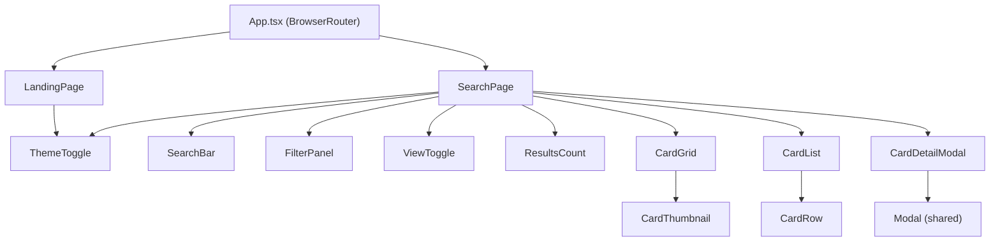
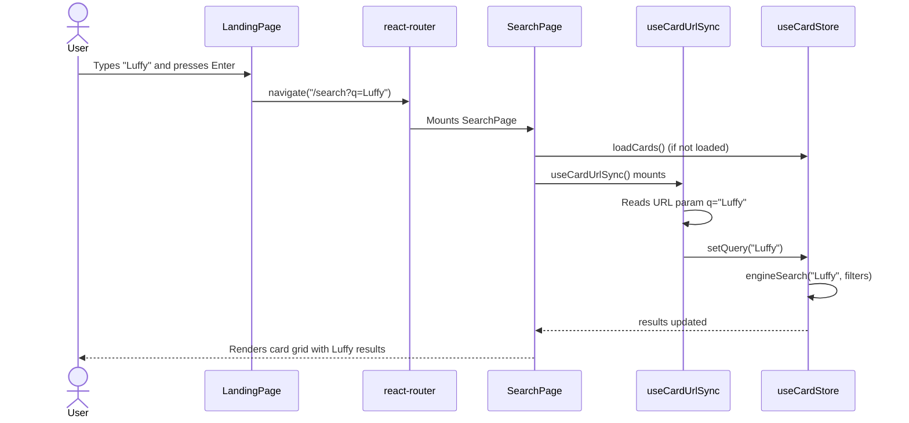
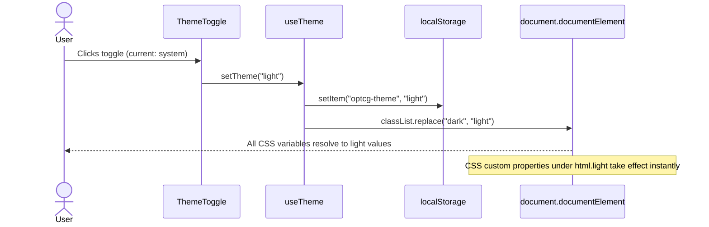

# OPTCG Card Search — Visual Redesign Blueprint

> ADR-1 reference: `/docs/optcg-redesign/ADR-1.md`
> Date: 2026-03-18

---

## 1. Route Structure

```
/                  LandingPage       Centered search + logo
/search            SearchPage        Full search results (renamed from CardSearchPage)
/cards             Redirect -> /search  (backwards compat)
*                  Redirect -> /
```

### App.tsx (after)

```
<BrowserRouter>
  <Routes>
    <Route path="/" element={<LandingPage />} />
    <Route path="/search" element={<SearchPage />} />
    <Route path="/cards" element={<Navigate to="/search" replace />} />
    <Route path="*" element={<Navigate to="/" replace />} />
  </Routes>
</BrowserRouter>
```

---

## 2. New Components

### 2.1 `LandingPage` (`src/components/LandingPage.tsx`)

**Responsibility:** Display the app logo, a centered search bar, and a call-to-action. No card results on initial load.

**Layout:**
```
+--------------------------------------------------+
|                                                  |
|              [ThemeToggle]        (top-right)     |
|                                                  |
|                                                  |
|              ONE PIECE TCG                       |
|              Card Search                         |
|                                                  |
|         [=== search input ==== ] [Search]        |
|                                                  |
|          "Search 3,000+ cards by name,           |
|           effect, or card number"                |
|                                                  |
+--------------------------------------------------+
```

**Behavior:**
- Renders a `<form>` with a text input and submit button.
- On submit (Enter key or button click), calls `navigate(`/search?q=${encodeURIComponent(value)}`)`.
- Does NOT call `setQuery()` or interact with the Zustand store directly.
- Does NOT load card data on mount (no `loadCards()` call).
- The `ThemeToggle` component is placed in the top-right corner.

**Key classes:** `bg-page`, `text-primary`, `min-h-screen`, `flex flex-col items-center justify-center`.

### 2.2 `ThemeToggle` (`src/components/ThemeToggle.tsx`)

**Responsibility:** Render a button that cycles through theme modes: system -> light -> dark -> system.

**Layout:** A single `<button>` showing a Material Symbol icon:
- `light_mode` (sun) when resolved theme is light
- `dark_mode` (moon) when resolved theme is dark

**Behavior:**
- Reads `theme` and `resolvedTheme` from `useTheme()` hook.
- On click, calls `setTheme(nextTheme)`.
- Cycle: `system` -> `light` -> `dark` -> `system`.
- Tooltip shows current mode label.

### 2.3 `useTheme` hook (`src/hooks/useTheme.ts`)

**Responsibility:** Manage theme state, localStorage persistence, and system preference detection.

**State shape:**
```ts
interface ThemeContext {
  theme: 'light' | 'dark' | 'system';      // user's explicit choice
  resolvedTheme: 'light' | 'dark';          // actual applied theme
  setTheme: (t: 'light' | 'dark' | 'system') => void;
}
```

**Algorithm:**
1. Read `localStorage.getItem('optcg-theme')` on init.
2. If `null` or `'system'`, resolve via `window.matchMedia('(prefers-color-scheme: dark)').matches`.
3. Apply class to `document.documentElement`: add `'dark'` or `'light'`, remove the other.
4. On `matchMedia` change (user changes OS preference), re-resolve if mode is `'system'`.
5. On `setTheme()`, write to `localStorage` and re-apply class.

**localStorage key:** `optcg-theme`

**Implementation note:** This is a simple React hook using `useState` + `useEffect`, NOT a context provider. Since the toggle and the `<html>` class are the only consumers, a hook is sufficient. If future components need theme info deeply nested, refactor to context then.

---

## 3. Modified Components

### 3.1 `SearchPage` (renamed from `CardSearchPage`)

**File rename:** `src/components/CardSearchPage.tsx` -> `src/components/SearchPage.tsx`

**Changes:**
- Rename export from `CardSearchPage` to `SearchPage`.
- Replace all hardcoded dark classes with semantic token classes (see token table below).
- Add `<ThemeToggle />` in the sticky header bar, right-aligned.
- No structural or behavioral changes. `useCardUrlSync` and `loadCards()` remain as-is.

### 3.2 `SearchBar`

**Changes:**
- Replace `bg-optcg-navy-light` -> `bg-input`
- Replace `border-white/10` -> `border-input-border`
- Replace `text-white` -> `text-primary`
- Replace `placeholder-white/30` -> `placeholder-text-muted`
- Replace `text-white/40` -> `text-secondary`
- Replace `focus:ring-optcg-gold/50` -> keep as-is (gold accent is theme-invariant)
- Replace `bg-optcg-navy` on kbd -> `bg-page`

### 3.3 `FilterPanel`

**Changes:**
- Replace `bg-optcg-navy-light` -> `bg-input`
- Replace `bg-optcg-navy` -> `bg-page`
- Replace `border-white/10` -> `border-border`
- Replace `text-white/80` -> `text-primary`
- Replace `text-optcg-navy` on badge -> keep (gold badge is theme-invariant)

### 3.4 `CardThumbnail`

**Changes:**
- Replace `bg-optcg-card-bg` -> `bg-card`
- Replace `border-optcg-card-border` -> `border-card-border`
- Replace `bg-optcg-navy-light/90` -> `bg-card-name`
- Replace `text-white` -> `text-primary`
- Replace `text-white/40` -> `text-muted`
- Cost pip and life pip keep gold/navy (theme-invariant accents).

### 3.5 `CardDetailModal`

**Changes:**
- Replace `bg-optcg-navy-light` -> `bg-card`
- Replace `border-optcg-card-border` -> `border-card-border`
- Replace `text-white` -> `text-primary`
- Replace `text-white/40` -> `text-secondary`
- Replace `text-white/30` -> `text-muted`
- Replace `border-white/10` -> `border-border`
- Replace `bg-white/5` -> `bg-hover`
- Replace `bg-black/20` -> keep (art panel backdrop is dark regardless of theme)

### 3.6 `CardRow`

**Changes:**
- Replace `border-white/5` -> `border-border`
- Replace `hover:bg-optcg-navy-light/60` -> `hover:bg-hover`
- Replace `text-white` -> `text-primary`
- Replace `text-white/40` -> `text-muted`
- Replace `text-white/80` -> `text-secondary`
- Replace `text-white/30` -> `text-muted`
- Replace `border-white/20` -> `border-border`

### 3.7 `CardStats`

**Changes:**
- Replace all `text-white` -> `text-primary`
- Replace `text-white/40` -> `text-secondary`
- Replace `text-white/30` -> `text-muted`
- Replace `border-white/10` -> `border-border`

### 3.8 `ResultsCount`

**Changes:**
- Replace `text-white/50` -> `text-secondary`
- Replace `text-white` -> `text-primary`

### 3.9 `ViewToggle`

**Changes:**
- Replace `bg-optcg-navy-light` -> `bg-input`
- Replace `border-white/10` -> `border-border`
- Replace `bg-optcg-navy` -> `bg-page`
- Replace `text-white/40` -> `text-secondary`
- Replace `text-white/80` -> `text-primary`

### 3.10 `CardEffectText`

**Changes:**
- Replace `text-white` -> `text-primary`
- Replace `bg-white/5` -> `bg-hover`
- Replace `text-white/70` -> `text-secondary`

### 3.11 Filter sub-components (`ColorFilter`, `TypeFilter`, `RangeFilter`, `CounterFilter`, `SetFilter`, `AttributeFilter`)

**Common changes:**
- Replace `text-white/40` -> `text-secondary`
- Replace `text-white/80` -> `text-primary`
- Replace `border-white/10` -> `border-border`
- Replace `border-white/20` -> `border-border`
- Replace `bg-optcg-navy-light` -> `bg-input` (where used as input backgrounds)

### 3.12 `CardGridSkeleton` (inside `CardSearchPage` / `SearchPage`)

**Changes:**
- Replace `bg-optcg-navy-light` -> `bg-input`

### 3.13 `Modal` (shared)

**Changes:**
- `--color-surface` already referenced. Ensure it flips per theme in the token table.
- `--color-border` already referenced. Ensure it flips per theme.
- `--color-text-primary` and `--color-text-secondary` already used. Ensure they flip.

### 3.14 `index.html`

**Changes:**
- Add inline `<script>` in `<head>` before body to prevent flash of wrong theme:
```html
<script>
  (function(){
    var t = localStorage.getItem('optcg-theme');
    var dark = t === 'dark' || (!t || t === 'system') && window.matchMedia('(prefers-color-scheme: dark)').matches;
    document.documentElement.classList.add(dark ? 'dark' : 'light');
  })();
</script>
```

---

## 4. CSS Token Table

All tokens defined in `src/index.css`. Palette constants live in `@theme`. Semantic tokens live under `html.light` and `html.dark` selectors.

### 4.1 Theme-Invariant Palette (no change between light/dark)

| Token | Value | Usage |
|-------|-------|-------|
| `--color-optcg-red` | `#E5383B` | Card color indicator, filter chips |
| `--color-optcg-blue` | `#3A86FF` | Card color indicator, filter chips |
| `--color-optcg-green` | `#2DC653` | Card color indicator, filter chips |
| `--color-optcg-yellow` | `#FFD166` | Card color indicator, filter chips |
| `--color-optcg-purple` | `#9B5DE5` | Card color indicator, filter chips |
| `--color-optcg-black` | `#2B2D42` | Card color indicator, filter chips |
| `--color-optcg-gold` | `#D4A843` | Cost pips, accents, focus rings |
| `--color-optcg-navy` | `#0B132B` | Dark mode specific (kept for art panel backdrops) |
| `--color-optcg-navy-light` | `#1C2541` | Dark mode specific (kept for art panel backdrops) |
| `--color-error` | `#e5383b` | Error states (both themes) |

### 4.2 Semantic Tokens (theme-dependent)

| Tailwind class | CSS variable | Light value | Dark value |
|----------------|-------------|-------------|------------|
| `bg-page` | `--color-page` | `#FAFAFA` | `#0B132B` |
| `bg-card` | `--color-card` | `#FFFFFF` | `rgba(28, 37, 65, 0.85)` |
| `border-card-border` | `--color-card-border` | `rgba(0, 0, 0, 0.08)` | `rgba(212, 168, 67, 0.2)` |
| `bg-card-name` | `--color-card-name` | `#F5F5F5` | `rgba(28, 37, 65, 0.9)` |
| `text-primary` | `--color-text-primary` | `#1A1A2E` | `#FFFFFF` |
| `text-secondary` | `--color-text-secondary` | `rgba(0, 0, 0, 0.55)` | `rgba(255, 255, 255, 0.6)` |
| `text-muted` | `--color-text-muted` | `rgba(0, 0, 0, 0.35)` | `rgba(255, 255, 255, 0.3)` |
| `border-border` | `--color-border` | `rgba(0, 0, 0, 0.1)` | `rgba(255, 255, 255, 0.08)` |
| `bg-input` | `--color-input` | `#F0F0F0` | `#1C2541` |
| `border-input-border` | `--color-input-border` | `rgba(0, 0, 0, 0.15)` | `rgba(255, 255, 255, 0.1)` |
| `bg-hover` | `--color-hover` | `rgba(0, 0, 0, 0.04)` | `rgba(255, 255, 255, 0.06)` |
| `bg-surface` | `--color-surface` | `#FFFFFF` | `#1a1a2e` |
| `bg-surface-elevated` | `--color-surface-elevated` | `#FFFFFF` | `#16213e` |

### 4.3 Shadow Tokens (theme-dependent)

| Name | Light value | Dark value |
|------|-------------|------------|
| `--shadow-optcg-card` | `0 1px 4px rgba(0,0,0,0.08), 0 0 0 1px rgba(0,0,0,0.04)` | `0 2px 8px rgba(0,0,0,0.4), 0 0 0 1px rgba(212,168,67,0.1)` |
| `--shadow-optcg-card-hover` | `0 4px 16px rgba(0,0,0,0.12), 0 0 0 1px rgba(212,168,67,0.15)` | `0 8px 32px rgba(212,168,67,0.15), 0 0 0 1px rgba(212,168,67,0.25)` |
| `--shadow-modal` | `0 24px 64px rgba(0,0,0,0.15)` | `0 24px 64px rgba(0,0,0,0.6)` |

---

## 5. Theme Switching Mechanism

### 5.1 CSS structure in `index.css`

```css
/* Palette constants remain in @theme block — unchanged */
@theme {
  --color-optcg-red: #E5383B;
  /* ... all palette constants ... */
}

/* Light theme (default) */
html.light {
  --color-page: #FAFAFA;
  --color-card: #FFFFFF;
  --color-text-primary: #1A1A2E;
  /* ... all semantic tokens with light values ... */
}

/* Dark theme */
html.dark {
  --color-page: #0B132B;
  --color-card: rgba(28, 37, 65, 0.85);
  --color-text-primary: #FFFFFF;
  /* ... all semantic tokens with dark values ... */
}

/* Register semantic tokens as Tailwind utilities */
@theme {
  --color-page: var(--color-page);
  --color-card: var(--color-card);
  --color-text-primary: var(--color-text-primary);
  /* ... etc ... */
}
```

### 5.2 `<html>` class application

- **Initial load:** Inline `<script>` in `index.html` `<head>` sets `html.light` or `html.dark` synchronously.
- **Runtime:** `useTheme` hook manages the class. On `setTheme()`, it calls `document.documentElement.classList.replace('light', 'dark')` or vice versa.

### 5.3 Body/root styles

```css
html, body, #root {
  height: 100%;
  background-color: var(--color-page);
  color: var(--color-text-primary);
  font-family: 'Inter', sans-serif;
}
```

---

## 6. File Structure Delta

### New files

```
src/
  components/
    LandingPage.tsx          NEW — landing page with centered search
    ThemeToggle.tsx           NEW — theme mode toggle button
    SearchPage.tsx            RENAMED from CardSearchPage.tsx
  hooks/
    useTheme.ts              NEW — theme state management hook
```

### Modified files

```
src/
  App.tsx                    MODIFIED — new route table
  index.css                  MODIFIED — theme token system
  components/
    SearchBar.tsx             MODIFIED — semantic token classes
    FilterPanel.tsx           MODIFIED — semantic token classes
    CardThumbnail.tsx         MODIFIED — semantic token classes
    CardDetailModal.tsx       MODIFIED — semantic token classes
    CardRow.tsx               MODIFIED — semantic token classes
    CardStats.tsx             MODIFIED — semantic token classes
    CardEffectText.tsx        MODIFIED — semantic token classes
    ResultsCount.tsx          MODIFIED — semantic token classes
    ViewToggle.tsx            MODIFIED — semantic token classes
    CardImage.tsx             MODIFIED — minor (loading placeholder color)
    filters/
      ColorFilter.tsx         MODIFIED — semantic token classes
      TypeFilter.tsx          MODIFIED — semantic token classes
      RangeFilter.tsx         MODIFIED — semantic token classes
      CounterFilter.tsx       MODIFIED — semantic token classes
      SetFilter.tsx           MODIFIED — semantic token classes
      AttributeFilter.tsx     MODIFIED — semantic token classes
    shared/
      Modal.tsx               MODIFIED — ensure surface/border tokens flip
index.html                   MODIFIED — inline theme script in <head>
```

### Unchanged files

```
src/
  stores/useCardStore.ts     NO CHANGE
  hooks/useCardUrlSync.ts    NO CHANGE
  hooks/useDebounce.ts       NO CHANGE
  lib/cardDataProvider.ts    NO CHANGE
  lib/cardSearchEngine.ts    NO CHANGE
  lib/imageUrl.ts            NO CHANGE
  types/optcg.ts             NO CHANGE
vite.config.ts               NO CHANGE
postcss.config.js            NO CHANGE
package.json                 NO CHANGE (no new dependencies)
```

---

## 7. Component Tree Diagram



---

## 8. Sequence Diagram — Landing Page Search Flow



---

## 9. Sequence Diagram — Theme Toggle Flow



---

## 10. Observability (minimal — static SPA)

Since this is a client-side-only static SPA with no backend:

- **Performance metric:** Measure Largest Contentful Paint (LCP) and First Input Delay (FID) via Web Vitals. The landing page should achieve LCP < 1.5s.
- **Error tracking:** Console errors on card data load failure (already handled).
- **Theme analytics (optional):** Log theme preference distribution if analytics are ever added.

---

## 11. Open Questions / Risks

1. **Tailwind v4 `@theme` variable registration** — The `@theme` block registers CSS custom properties as Tailwind utilities. If a variable name like `--color-text-primary` is registered both as a static value AND as a `var()` reference, Tailwind may emit conflicting CSS. The developer must test this and may need to use a distinct naming prefix (e.g., `--color-t-primary`) if conflicts arise.

2. **Card art panel in light mode** — The card detail modal's left panel (`bg-black/20`) is intentionally dark to showcase card art regardless of theme. The developer should verify this looks good against a light modal container.

3. **Filter chip contrast in light mode** — The OPTCG Yellow (`#FFD166`) chip may have insufficient contrast against a light background. QA should verify WCAG AA contrast ratios for all color chips in light mode and add a subtle border if needed.
