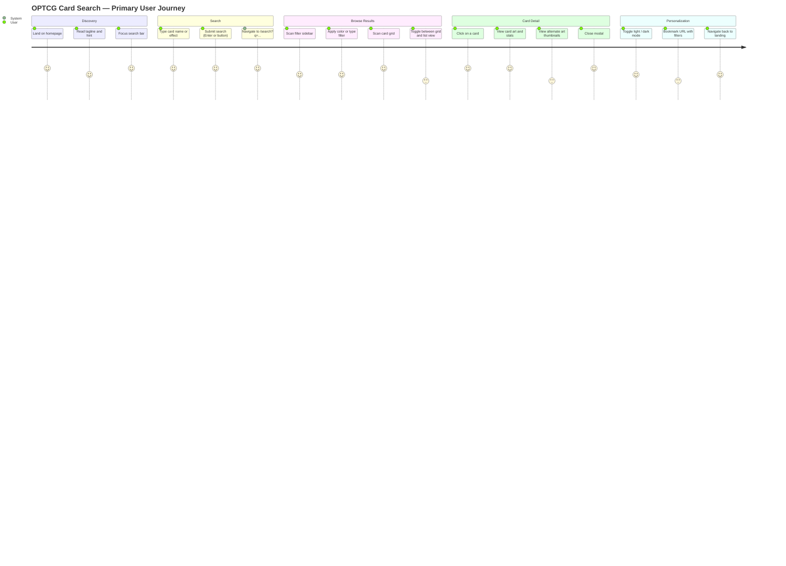

# Wireframes: OPTCG Card Search Visual Redesign

> ADR reference: `docs/optcg-redesign/ADR-1.md`
> Blueprint reference: `docs/optcg-redesign/blueprint.md`
> Stitch project: `14738469571537397769` — see `wireframes-stitch.md` for live screens
> Date: 2026-03-18

---

## Screen Summary

| Screen ID | Name | Themes | Device |
|-----------|------|--------|--------|
| S-01 | Landing Page | Light | Desktop + Mobile |
| S-02 | Landing Page | Dark | Desktop + Mobile |
| S-03 | Search Results | Light | Desktop + Mobile |
| S-04 | Search Results | Dark | Desktop |
| S-05 | Card Detail Modal | Light | Desktop |
| S-06 | Empty State (no results) | Both | Desktop |
| S-07 | Loading State (skeleton) | Both | Desktop |

---

## Journey Map



---

## Pain Points (Prioritized by Impact)

| Priority | Pain Point | Impact | Mitigation in Redesign |
|----------|-----------|--------|------------------------|
| High | Dark-only experience alienates users in bright environments | Users leave | Light mode is now the default; system preference detected automatically |
| High | No dedicated landing page — searching immediately triggers heavy data load | Slow perceived start | Landing page loads instantly with no card data; cards load only on /search |
| High | URL not shareable — filters lost on copy/paste | Users cannot share specific searches | /search?q=...&color=Red... URL sync already in place via useCardUrlSync |
| Medium | Back button from results does not return to an empty state | Disorienting navigation | / is now a distinct route; back button returns to the typed-query landing state |
| Medium | No hint about dataset size | Users unsure how much content exists | "2,400 cards across 49 sets" subtitle on landing |
| Low | Theme resets on every visit | Annoyance for returning users | localStorage persistence of theme preference |

---

## Wireframe: S-01 — Landing Page (Light Mode, Desktop)

### Default State

```
┌─────────────────────────────────────────────────────────────────┐
│ OPTCG                                              [☀ / ☾ icon] │  ← Nav bar (white, border-bottom: rgba(0,0,0,0.08))
├─────────────────────────────────────────────────────────────────┤
│                                                                 │
│                                                                 │
│                                                                 │
│                    ONE PIECE TCG                                │  ← Slab-serif, #1A1A2E, ~48px
│                    Card Search                                  │  ← Same font, lighter weight, ~28px
│                                                                 │
│          ┌───────────────────────────────────┬────────┐         │
│          │  Search cards…                    │ Search │         │  ← Input: bg #F0F0F0, rounded-full, shadow-sm
│          └───────────────────────────────────┴────────┘         │  ← Button: bg #D4A843, text #1A1A2E, rounded-r-full
│                                                                 │
│               2,400 cards across 49 sets                        │  ← text-muted (~12px)
│                                                                 │
│                                                                 │
│                                                                 │
└─────────────────────────────────────────────────────────────────┘
  Page bg: #FAFAFA   Min-height: 100vh   Flex col items-center justify-center
```

### States

**Loading (initial app mount):** The inline `<script>` in `<head>` applies `html.light` or `html.dark` synchronously — no flash. The landing page itself has no async data load, so there is no loading state for the page content.

**Error state (not applicable):** Landing page has no data dependencies.

**Focus state (search input):** Input gains `ring-2 ring-[#D4A843]/50` outline. Search button gains `opacity-90`.

---

## Wireframe: S-01M — Landing Page (Light Mode, Mobile — 320px+)

```
┌─────────────────────┐
│ OPTCG        [☀/☾]  │  ← Nav: px-4, py-3
├─────────────────────┤
│                     │
│   ONE PIECE TCG     │  ← ~32px, text-center
│   Card Search       │  ← ~20px, text-center
│                     │
│ ┌─────────────────┐ │
│ │  Search cards…  │ │  ← Full-width input, rounded-xl
│ └─────────────────┘ │
│ ┌─────────────────┐ │
│ │     Search      │ │  ← Full-width button below input on xs
│ └─────────────────┘ │
│                     │
│ 2,400 cards…        │  ← text-center, text-muted
│                     │
└─────────────────────┘
```

**Mobile layout change:** On xs (320–599px), the search input and button stack vertically (flex-col). The button spans full width. Nav is simplified to logo + toggle only.

---

## Wireframe: S-02 — Landing Page (Dark Mode, Desktop)

Same layout as S-01 with these token substitutions:

| Element | Light value | Dark value |
|---------|-------------|------------|
| Page bg | `#FAFAFA` | `#0B132B` |
| Logo text | `#1A1A2E` | `#D4A843` |
| Heading | `#1A1A2E` | `#FFFFFF` |
| Input bg | `#F0F0F0` | `#1C2541` |
| Input placeholder | `rgba(0,0,0,0.35)` | `rgba(255,255,255,0.3)` |
| Hint text | `rgba(0,0,0,0.35)` | `rgba(255,255,255,0.3)` |
| Nav bar bg | `#FFFFFF` | `#0B132B` |
| Nav border | `rgba(0,0,0,0.08)` | `rgba(255,255,255,0.08)` |

The Search button (`#D4A843`) and its dark text (`#1A1A2E`) remain unchanged across themes (gold is theme-invariant).

---

## Wireframe: S-03 — Search Results (Light Mode, Desktop)

### Default State

```
┌─────────────────────────────────────────────────────────────────────────────┐
│ [← OPTCG logo]  [══════════ search input ═══════════] [×]       [☀/☾] [≡]  │  ← Sticky header, bg white, border-bottom
├──────────────┬──────────────────────────────────────────────────────────────┤
│              │  432 results                        [⊞] [☰]                 │  ← Toolbar row
│  FILTERS     │ ─────────────────────────────────────────────────────────── │
│  ─────────── │  ┌──────┐ ┌──────┐ ┌──────┐ ┌──────┐ ┌──────┐             │
│  Color       │  │ Card │ │ Card │ │ Card │ │ Card │ │ Card │             │
│  ● ● ● ● ● ●│  │  Art │ │  Art │ │  Art │ │  Art │ │  Art │             │
│  R B G Y P K│  │      │ │      │ │      │ │      │ │      │             │
│              │  │ Name │ │ Name │ │ Name │ │ Name │ │ Name │             │
│  Type        │  └──────┘ └──────┘ └──────┘ └──────┘ └──────┘             │
│  □ Leader    │                                                             │
│  □ Character │  ┌──────┐ ┌──────┐ ┌──────┐ ┌──────┐ ┌──────┐             │
│  □ Event     │  │ Card │ │ Card │ │ Card │ │ Card │ │ Card │             │
│  □ Stage     │  │  Art │ │  Art │ │  Art │ │  Art │ │  Art │             │
│              │  │      │ │      │ │      │ │      │ │      │             │
│  Cost        │  │ Name │ │ Name │ │ Name │ │ Name │ │ Name │             │
│  [0 ──── 10] │  └──────┘ └──────┘ └──────┘ └──────┘ └──────┘             │
│              │                                                             │
│  Set         │                                                             │
│  [Dropdown ▾]│                                                             │
│              │                                                             │
└──────────────┴──────────────────────────────────────────────────────────────┘
  Sidebar: 240px fixed    Main: flex-1    Gap: 24px    Card grid: repeat(5, 1fr)
```

**Card anatomy (expanded):**
```
┌────────────────────────┐
│ ┌──────────────────┐[3]│  ← Cost pip: gold circle, top-right, 24px
│ │                  │   │
│ │    Card Art      │   │  ← Image: object-cover, aspect-[3/4]
│ │                  │   │
│ └──────────────────┘   │
│  Monkey D. Luffy        │  ← text-primary, font-semibold, 13px
│ ████████████████████   │  ← Color bar: 4px height, card color (Red/Blue/etc.)
└────────────────────────┘
  bg: #FFFFFF   shadow: 0 1px 4px rgba(0,0,0,0.08)   rounded-lg
  hover shadow: 0 4px 16px rgba(0,0,0,0.12)
```

### States

**Empty filter state:** All filter checkboxes unchecked, cost range 0–10, no set selected. Grid shows full catalog.

**Active filter state:** Selected color chips show `ring-2 ring-offset-1 ring-[color]`. Active type checkboxes show gold checkmark. Result count updates reactively.

**Loading state (S-07):** See skeleton section below.

**Error state (card data load failure):**
```
┌─────────────────────────────────────────────────────┐
│              ⚠ Could not load card data              │
│      Check your connection and try again.            │
│              [  Retry  ]                             │
└─────────────────────────────────────────────────────┘
```

---

## Wireframe: S-03M — Search Results (Mobile, 320px+)

```
┌─────────────────────┐
│ [←] [search input ] │  ← Compact sticky header, no logo text
├─────────────────────┤
│ [Filters ▾]  432 res│  ← Filter drawer toggle + result count
├─────────────────────┤
│ ┌──────┐ ┌──────┐   │
│ │ Card │ │ Card │   │  ← 2-column grid on xs
│ └──────┘ └──────┘   │
│ ┌──────┐ ┌──────┐   │
│ │ Card │ │ Card │   │
│ └──────┘ └──────┘   │
└─────────────────────┘
```

**Filter sidebar on mobile:** Hidden by default, toggled via "Filters" chip. Opens as a bottom sheet (position: fixed, bottom: 0, full-width, max-height: 70vh, scroll inside). Closes with "Apply" button or backdrop tap.

---

## Wireframe: S-04 — Search Results (Dark Mode, Desktop)

Same layout as S-03. Token substitutions:

| Element | Dark value |
|---------|------------|
| Page bg | `#0B132B` |
| Header bg | `#1C2541` |
| Sidebar bg | `#1C2541` |
| Card bg | `rgba(28,37,65,0.85)` |
| Card border | `rgba(212,168,67,0.2)` |
| Card text | `#FFFFFF` |
| Filter labels | `rgba(255,255,255,0.6)` |
| Cost pip | `#D4A843` bg, `#1A1A2E` text |
| Toolbar result count | `rgba(255,255,255,0.6)` |

Card hover: `box-shadow: 0 8px 32px rgba(212,168,67,0.15), 0 0 0 1px rgba(212,168,67,0.25)`

---

## Wireframe: S-05 — Card Detail Modal (Light Mode, Desktop)

### Default State

```
┌─────────────────────────────────────────────────────────────────────────┐
│                    [dimmed page backdrop, blur]                         │
│                                                                         │
│  ┌───────────────────────────────────────────────────────────────[×]─┐  │
│  │                                                                    │  │
│  │  ┌───────────────────────┐  │  Monkey D. Luffy                    │  │
│  │  │                       │  │  [Leader]                           │  │
│  │  │                       │  │                                     │  │
│  │  │     Card Art          │  │  Cost    Power    Counter   Life    │  │
│  │  │     (large)           │  │   3     5000       —         5     │  │
│  │  │                       │  │                                     │  │
│  │  │                       │  │  ─────────────────────────────────  │  │
│  │  │                       │  │                                     │  │
│  │  └───────────────────────┘  │  Straw Hat Crew   Supernovas       │  │
│  │                             │                                     │  │
│  │  [alt1] [alt2] [alt3]       │  Card Effect                       │  │
│  │                             │  Once per turn, you may rest this  │  │
│  │                             │  Leader...                         │  │
│  │                             │                                     │  │
│  └────────────────────────────────────────────────────────────────────┘  │
│                                                                         │
└─────────────────────────────────────────────────────────────────────────┘
  Modal: bg #FFFFFF   max-w: 860px   rounded-2xl   shadow: 0 24px 64px rgba(0,0,0,0.15)
  Backdrop: bg rgba(0,0,0,0.4)   backdrop-blur: 4px
  Left col: 40%   Right col: 60%   gap: 32px   padding: 32px
```

**Alternate art thumbnails:** 72×72px, rounded-lg, `border-2 border-transparent`. Selected: `border-[#D4A843]`.

**Close button:** Positioned `absolute top-4 right-4`, size 32×32px, `hover:bg-hover` background, `aria-label="Close"`.

**Type badge — color mapping:**

| Type | bg | text |
|------|----|------|
| Leader | `#D4A843` | `#1A1A2E` |
| Character | `#3A86FF` | `#FFFFFF` |
| Event | `#9B5DE5` | `#FFFFFF` |
| Stage | `#2DC653` | `#1A1A2E` |

### States

**Loading (modal opening):** Skeleton shows: left column is `bg-input animate-pulse` rectangle; right column shows grey bars.

**No alternate arts:** The thumbnail row is hidden entirely (not rendered).

**Dark mode:** Modal bg becomes `rgba(28,37,65,0.85)`. Left art panel keeps `bg-black/20` as backdrop regardless of theme. Card name and stats use `text-primary` (resolves to white in dark). See blueprint section 3.5.

---

## Wireframe: S-06 — Empty State (No Results)

```
┌─────────────────────────────────────────────────────────────────┐
│ [sticky header with search — same as S-03]                      │
├──────────────┬──────────────────────────────────────────────────┤
│              │                                                  │
│  [filters]   │         0 results                               │
│              │                                                  │
│              │                                                  │
│              │         No cards found for "xyzinvalid"         │  ← text-primary
│              │         Try a different name, effect, or         │  ← text-secondary
│              │         card number.                             │
│              │                                                  │
│              │         [ Clear search ]                         │  ← ghost button
│              │                                                  │
└──────────────┴──────────────────────────────────────────────────┘
```

The interpolated query string in the message uses `font-medium` and `text-primary` to distinguish it from the helper text.

---

## Wireframe: S-07 — Loading State (Skeleton Cards)

```
┌──────────────┬──────────────────────────────────────────────────┐
│  [filters]   │  Searching…             [⊞] [☰]                 │
│              │ ─────────────────────────────────────────────── │
│              │  ┌──────┐ ┌──────┐ ┌──────┐ ┌──────┐ ┌──────┐  │
│              │  │▓▓▓▓▓▓│ │▓▓▓▓▓▓│ │▓▓▓▓▓▓│ │▓▓▓▓▓▓│ │▓▓▓▓▓▓│  │
│              │  │▓▓▓▓▓▓│ │▓▓▓▓▓▓│ │▓▓▓▓▓▓│ │▓▓▓▓▓▓│ │▓▓▓▓▓▓│  │
│              │  │▒▒▒▒▒▒│ │▒▒▒▒▒▒│ │▒▒▒▒▒▒│ │▒▒▒▒▒▒│ │▒▒▒▒▒▒│  │
│              │  └──────┘ └──────┘ └──────┘ └──────┘ └──────┘  │
│              │  ┌──────┐ ┌──────┐ ...                          │
│              │  │▓▓▓▓▓▓│ │▓▓▓▓▓▓│                             │
└──────────────┴──────────────────────────────────────────────────┘
  ▓ = bg-input (light: #F0F0F0, dark: #1C2541)   animate-pulse
  ▒ = text placeholder bar, same bg, narrower height
```

---

## Accessibility Notes

### WCAG 2.1 AA Compliance

| Element | Light contrast | Dark contrast | Status |
|---------|---------------|---------------|--------|
| Body text (`#1A1A2E` on `#FAFAFA`) | 15.3:1 | N/A | AAA |
| Body text (`#FFFFFF` on `#0B132B`) | N/A | 17.1:1 | AAA |
| Secondary text (`rgba(0,0,0,0.55)` on `#FAFAFA`) | ~5.9:1 | N/A | AA |
| Secondary text (`rgba(255,255,255,0.6)` on `#0B132B`) | N/A | ~5.4:1 | AA |
| Muted text (`rgba(0,0,0,0.35)` on `#FAFAFA`) | ~3.7:1 | N/A | Fail — informational only (hint text) |
| Gold button (`#D4A843` on `#1A1A2E`) | 7.2:1 | 7.2:1 | AAA |
| OPTCG Yellow chip (`#FFD166` on `#FAFAFA`) | 1.7:1 — risk | — | See note below |

**Yellow chip risk:** The OPTCG Yellow (`#FFD166`) color indicator chip may fail WCAG 1.4.3 in light mode. Mitigation (per ADR-1 risk section 3): add a `border border-[rgba(0,0,0,0.2)]` to color chips in light mode to provide shape contrast independent of color contrast. Color chips must never rely on color alone to convey meaning — the chip label text (e.g., "Yellow") must always be present or an `aria-label` must be applied.

### Keyboard Navigation

- Landing search form: Tab to input, Enter to submit. No mouse required.
- Search results: Tab navigates through filter checkboxes, then the grid. Each card thumbnail is a `<button>` with `aria-label="View [card name]"`.
- Card detail modal: Focus trapped inside modal on open. Escape closes the modal. Tab cycles: close button → thumbnail row → stats (read-only).
- Theme toggle: Focusable button with `aria-label` describing the *next* action (e.g., "Switch to light mode").
- View toggle (grid/list): Two `<button>` elements with `aria-pressed` indicating active state.

### Screen Reader Support

- Landing: `<h1>ONE PIECE TCG</h1>`, `<h2>Card Search</h2>` or a single `<h1>` with both. Search input has `<label for="search">Search cards</label>` (visually hidden or inline).
- Card grid: Wrapped in `<ul>`, each card is a `<li>` containing a `<button>`. The button `aria-label` contains: "[card name], [type], cost [N]".
- Modal: `role="dialog"`, `aria-modal="true"`, `aria-labelledby` pointing to the card name heading. The close button is `aria-label="Close card detail"`.
- Filter panel: Each filter section is a `<fieldset>` with `<legend>`. Checkboxes use standard `<input type="checkbox"><label>` pairs.
- Skeleton loader: `aria-busy="true"` on the grid container, `aria-label="Loading cards"` on the skeleton container.

### Focus Visibility

All interactive elements must have a visible focus ring. Use `focus-visible:ring-2 focus-visible:ring-[#D4A843]` consistently. The gold ring provides sufficient contrast on both light (#FAFAFA) and dark (#0B132B) backgrounds.

---

## Mobile-First Notes

### Breakpoints

| Name | Range | Columns | Behavior |
|------|-------|---------|----------|
| xs | 320–599px | 2-col card grid | Filter sidebar hidden → bottom sheet; search + button stack vertically |
| sm | 600–899px | 3-col card grid | Filter sidebar toggleable via icon; search in single row |
| md | 900–1199px | 4-col card grid | Sidebar fixed 220px |
| lg | 1200px+ | 5-col card grid | Sidebar fixed 240px (design target) |

### Mobile-Specific Behaviors

- **Filter panel:** Collapses to a bottom sheet on xs/sm. Trigger: "Filters" chip in the toolbar row showing active filter count badge.
- **Card detail modal:** On xs, the modal becomes full-screen (`position: fixed; inset: 0; border-radius: 0`). The two-column layout stacks vertically: art first, stats second.
- **Navigation back:** On mobile, the sticky header shows a left-arrow icon linking to `/` in addition to the OPTCG logo.
- **Theme toggle:** Accessible at 44×44px minimum touch target on all breakpoints.
- **Search input on landing:** Full-width with 16px horizontal padding on xs. The submit button stacks below the input field.

### Tap Target Sizes

All interactive elements meet the 44×44px minimum: filter checkboxes use `<label>` with sufficient padding, color chips are at least 44px wide, card thumbnails are naturally larger than 44px.

---

## Validation Checklist

### Usability (Nielsen's Heuristics)

- [x] Visibility of system status: Loading skeleton shows progress; "432 results" count updates reactively; theme toggle shows current mode icon
- [x] User control and freedom: Back button returns to landing; modal closes via Escape or X; "Clear search" button on empty state
- [x] Consistency and standards: Gold accent (#D4A843) used consistently for CTAs and interactive focus; filter chips follow same pattern throughout
- [x] Error prevention: Empty search from landing navigates to /search showing all cards (no error, no confusion)
- [x] Recognition not recall: Filter labels always visible; active filters visually highlighted; URL carries state for bookmark/share
- [x] Flexibility and efficiency: Power users can type directly in URL (/search?q=Luffy&color=Red); keyboard shortcut "/" to focus search retained
- [x] Aesthetic and minimalist design: Landing page shows only what is needed; no card grid before search

### Accessibility (WCAG 2.1 AA)

- [x] All body and heading text passes 4.5:1 minimum
- [x] Gold CTA button passes 4.5:1 in both themes
- [ ] OPTCG Yellow chip in light mode fails color contrast — border mitigation required (see note above)
- [x] All interactive elements have visible focus indicators (gold ring)
- [x] No information conveyed by color alone (type badges have text; color chips have aria-labels)
- [x] Modal has focus trap and Escape close
- [x] Skeleton loader announces aria-busy state
- [x] Filter panel uses fieldset/legend semantic structure

### Mobile-First

- [x] All screens designed for 320px minimum width first
- [x] Filter sidebar adapts to bottom sheet on mobile
- [x] Card detail modal goes full-screen on xs
- [x] Tap targets meet 44×44px minimum
- [x] No horizontal overflow at any breakpoint

### Cross-Theme

- [x] All component tokens verified in both light and dark themes
- [x] Flash of wrong theme prevented via inline `<script>` in `<head>`
- [x] Card art panel in modal remains dark in both themes
- [x] OPTCG palette constants (red, blue, green, yellow, purple, black, gold) unchanged between themes

---

## Assumptions

| ID | Assumption | Impact if Wrong |
|----|-----------|-----------------|
| A-1 | Card count (2,400) and set count (49) are approximately stable | Hint text on landing would need to be dynamic |
| A-2 | Roboto Slab is available via existing font loading (blueprint references "font-slab") | May need to add Roboto Slab to `index.html` font imports |
| A-3 | Alternate art data exists in the card JSON for at least some cards | If absent for all cards, thumbnail row never renders — acceptable |
| A-4 | The existing `useCardUrlSync` hook correctly persists color/type/set filter params in the URL | If not, bookmarked filter URLs would silently drop filter state |

---

## Questions for Stakeholders

1. Should the landing page hint text ("2,400 cards across 49 sets") be a static string or dynamically computed from the card data store? Dynamic is more accurate but adds a minor coupling between LandingPage and useCardStore.

2. Should the theme toggle cycle through three states (system → light → dark) or only toggle between light and dark? The three-state cycle is more flexible but may confuse users who are not familiar with "system" as a concept.

3. Is Roboto Slab already included in the app's font loading, or does it need to be added to `index.html`? The blueprint references `font-slab` class but the current font stack in the codebase may not include it.

4. Should the card detail modal support deep-linking (e.g., `/search?q=Luffy&card=OP01-001`) so users can share a direct link to a specific card? This is currently not in the architect's scope but would significantly improve shareability.

5. For the OPTCG Yellow filter chip in light mode: is adding a subtle `border border-black/20` to color chips acceptable, or should the chip use a different approach (e.g., text label always visible)?
