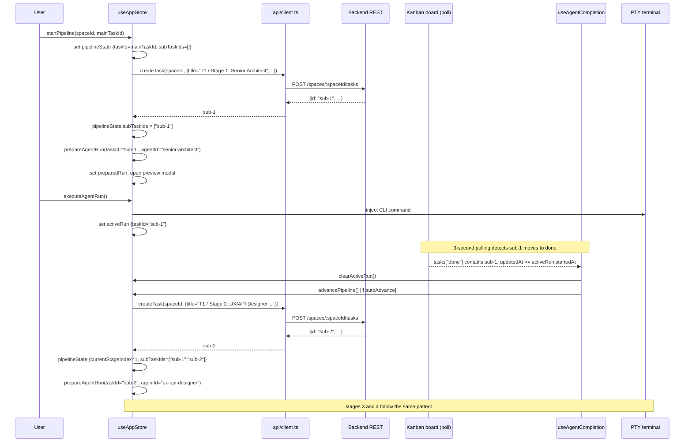

# Blueprint: Pipeline Sub-Tasks

## 1. Requirements Summary

### Functional
- FR-1: When a pipeline stage is about to start, create a Kanban sub-task in `todo` for that stage before invoking the agent.
- FR-2: The sub-task title must follow the pattern `[Main Task Title] / Stage N: [Agent Display Name]`.
- FR-3: The sub-task description must contain the parent task ID for traceability.
- FR-4: The `taskId` passed to `prepareAgentRun` for a given stage must be the sub-task ID, not the main task ID.
- FR-5: The main task must not be moved by the pipeline.
- FR-6: `useAgentCompletion` must track the sub-task ID, not the main task ID.
- FR-7: `PipelineState` must expose the list of created sub-task IDs for observability and future cleanup.

### Non-Functional
- NFR-1: Sub-task creation must complete before the agent prompt is generated (sequential, not parallel).
- NFR-2: Sub-task creation failure must abort the pipeline with an error toast — no silent degradation.
- NFR-3: The existing completion-detection polling cadence (3 s) must not change.
- NFR-4: No backend changes — use the existing `POST /spaces/:spaceId/tasks` endpoint.

### Constraints
- The `api.createTask(spaceId, payload)` function already exists in `frontend/src/api/client.ts`.
- `PipelineState` is an in-memory Zustand state slice; it does not persist across page reloads.
- `AgentRun.taskId` drives `useAgentCompletion` — it must point to the sub-task.
- `agentSettings.pipeline.stages` is the authoritative stage list; `availableAgents` provides display names.

---

## 2. Affected Components

| Component | File | Change type |
|-----------|------|-------------|
| `PipelineState` type | `frontend/src/types/index.ts` | Additive — new `subTaskIds` field |
| `startPipeline` | `frontend/src/stores/useAppStore.ts` | Modified — create sub-task before stage 1 |
| `advancePipeline` | `frontend/src/stores/useAppStore.ts` | Modified — create sub-task before each subsequent stage |
| `useAgentCompletion` | `frontend/src/hooks/useAgentCompletion.ts` | No change — already uses `activeRun.taskId` which will be the sub-task ID |
| `api.createTask` | `frontend/src/api/client.ts` | No change — already exists |
| `PipelineProgressBar` | `frontend/src/components/agent-launcher/PipelineProgressBar.tsx` | Optional — may display sub-task IDs |

---

## 3. Data Model Changes

### 3.1 PipelineState (types/index.ts)

Current:
```ts
export interface PipelineState {
  spaceId: string;
  taskId: string;             // main task — never changes
  stages: PipelineStage[];
  currentStageIndex: number;
  startedAt: string;
  status: 'running' | 'paused' | 'completed' | 'aborted';
}
```

New (additive change only):
```ts
export interface PipelineState {
  spaceId: string;
  taskId: string;             // main task anchor — never moved by pipeline
  stages: PipelineStage[];
  currentStageIndex: number;
  startedAt: string;
  status: 'running' | 'paused' | 'completed' | 'aborted';
  subTaskIds: string[];       // NEW — parallel index with stages[], populated as stages run
}
```

`subTaskIds[i]` is the Kanban ID of the sub-task created for `stages[i]`. The array grows
incrementally: only indices 0..currentStageIndex are populated at any given point.

---

## 4. Action Flows

### 4.1 startPipeline (Stage 1 only)

```
startPipeline(spaceId, taskId)
  │
  ├─ set pipelineState { spaceId, taskId, stages, currentStageIndex: 0,
  │                      startedAt, status: 'running', subTaskIds: [] }
  │
  ├─ mainTask = await api.getTask(spaceId, taskId)   // need title for sub-task naming
  │   OR derive title from tasks store (already loaded in Zustand — prefer this,
  │      find across all columns: tasks['todo'] | tasks['in-progress'] | tasks['done'])
  │
  ├─ agentDisplayName = availableAgents.find(a => a.id === stages[0])?.displayName
  │
  ├─ subTask = await api.createTask(spaceId, {
  │     title:       `${mainTask.title} / Stage 1: ${agentDisplayName}`,
  │     type:        'research',
  │     assigned:    stages[0],
  │     description: `Pipeline sub-task for stage 1. Parent task: ${taskId}`,
  │   })
  │
  ├─ set pipelineState.subTaskIds = [subTask.id]
  │
  ├─ await get().prepareAgentRun(subTask.id, stages[0])   // pass SUB-TASK id
  │
  └─ showToast(`Pipeline started — Stage 1: ${stages[0]}`)
```

### 4.2 advancePipeline (Stages 2–N)

```
advancePipeline()
  │
  ├─ nextIndex = currentStageIndex + 1
  │
  ├─ [if nextIndex >= stages.length] → mark completed, clear after 3 s, return
  │
  ├─ nextStage = stages[nextIndex]
  ├─ agentDisplayName = availableAgents.find(a => a.id === nextStage)?.displayName
  │
  ├─ mainTask title = derive from tasks store using pipelineState.taskId
  │
  ├─ subTask = await api.createTask(pipelineState.spaceId, {
  │     title:       `${mainTask.title} / Stage ${nextIndex + 1}: ${agentDisplayName}`,
  │     type:        'research',
  │     assigned:    nextStage,
  │     description: `Pipeline sub-task for stage ${nextIndex + 1}. Parent task: ${pipelineState.taskId}`,
  │   })
  │
  ├─ set pipelineState {
  │     currentStageIndex: nextIndex,
  │     subTaskIds: [...pipelineState.subTaskIds, subTask.id],
  │   }
  │
  ├─ showToast(`Stage ${nextIndex + 1}: ${nextStage}`)
  │
  └─ await get().prepareAgentRun(subTask.id, nextStage)    // pass SUB-TASK id
```

### 4.3 useAgentCompletion — no logic change

The hook already reads `activeRun.taskId` to find the task in the done column. Because
`executeAgentRun` copies `taskId` from `preparedRun.taskId`, and `prepareAgentRun` is now called
with the sub-task ID, `activeRun.taskId` will be the sub-task ID automatically. No code change
required in this hook.

The timestamp guard (`updatedAt >= startedAt`) remains valid as a defense-in-depth measure,
but ceases to be the only correctness guarantee: sub-tasks always start in `todo`, so they
cannot be in `done` before their stage begins.

### 4.4 abortPipeline — no logic change

Sends Ctrl+C to the PTY and clears `pipelineState`. Sub-tasks already created remain on the
board in whatever column the agent left them — they are not cleaned up automatically (out of
scope for this fix; a future "pipeline cleanup" feature may address it).

---

## 5. Helper: resolveMainTaskTitle

Both `startPipeline` and `advancePipeline` need the main task title. Add a private store helper:

```
resolveMainTaskTitle(spaceId: string, taskId: string): string | null
  │
  ├─ search get().tasks['todo'], get().tasks['in-progress'], get().tasks['done']
  │    for the task with id === taskId
  │
  └─ return task.title ?? null
       // if null (task not in local store yet), fall back to `Task ${taskId}`
```

This avoids an extra API round-trip since the board is already loaded when the pipeline starts.

---

## 6. Sequence Diagram — Full Four-Stage Pipeline



---

## 7. API Contracts (No Backend Changes)

### POST /api/v1/spaces/:spaceId/tasks

Already exists. Used by the pipeline to create each sub-task.

Request body:
```json
{
  "title":       "[Main Task Title] / Stage N: [Agent Display Name]",
  "type":        "research",
  "assigned":    "[agent-id]",
  "description": "Pipeline sub-task for stage N. Parent task: [mainTaskId]"
}
```

Response `201 Created`:
```json
{
  "id": "[uuid]",
  "title": "...",
  "type": "research",
  "assigned": "...",
  "description": "...",
  "createdAt": "...",
  "updatedAt": "..."
}
```

The returned `id` is stored in `pipelineState.subTaskIds[stageIndex]` and passed as `taskId`
to `prepareAgentRun`.

---

## 8. Observability

| Signal | What to log |
|--------|-------------|
| `pipeline_subtask_created` | `{ stageIndex, subTaskId, mainTaskId, agentId }` — logged to console at info level, matching the existing `agent_run_started` log pattern in `executeAgentRun` |
| `pipeline_subtask_creation_failed` | `{ stageIndex, agentId, error }` — triggers error toast and aborts pipeline |
| Existing `agent_run_started` log | Already logs `taskId` — will now log the sub-task ID, which is the correct unit |

---

## 9. Error Handling

| Error scenario | Behaviour |
|----------------|-----------|
| `createTask` API call fails (network / 5xx) | `showToast('Pipeline aborted: could not create sub-task for stage N', 'error')` + `set({ pipelineState: null, activeRun: null })` |
| `resolveMainTaskTitle` returns null | Use fallback title `Task ${mainTaskId} / Stage N: ${agentDisplayName}` — non-fatal |
| Agent moves sub-task to done then aborts | `abortPipeline` clears store state; sub-task remains in done on board — no cleanup needed |

---

## 10. Testing Surface

| Test | Type | What to verify |
|------|------|----------------|
| `startPipeline` creates a sub-task before calling `prepareAgentRun` | Unit (Zustand store) | `api.createTask` called with correct title/type/assigned/description; `prepareAgentRun` receives sub-task ID |
| `advancePipeline` creates next sub-task, updates `subTaskIds` | Unit | `subTaskIds` grows by one per advance; `prepareAgentRun` receives new sub-task ID |
| `startPipeline` aborts on `createTask` failure | Unit | `pipelineState` set to null; error toast shown |
| `useAgentCompletion` triggers on sub-task (not main task) done | Integration | Mock board state with sub-task in done; verify `clearActiveRun` and `advancePipeline` called |
| `resolveMainTaskTitle` finds task across all columns | Unit | Task in todo / in-progress / done / missing (fallback) |
