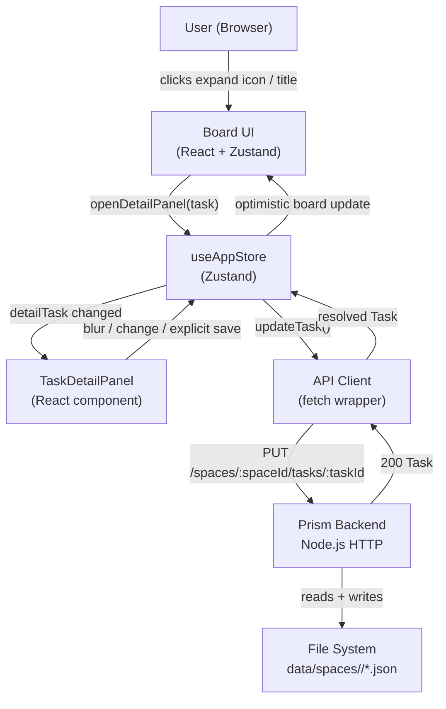
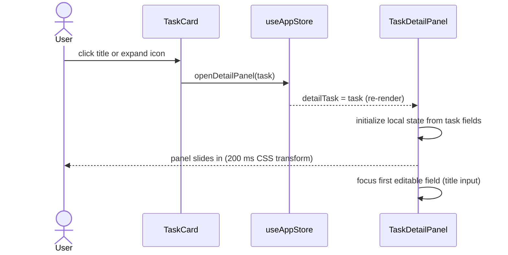
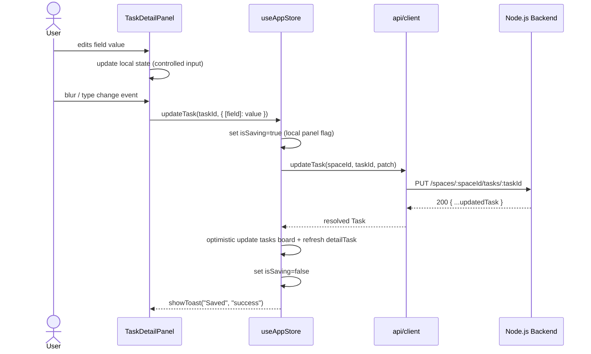
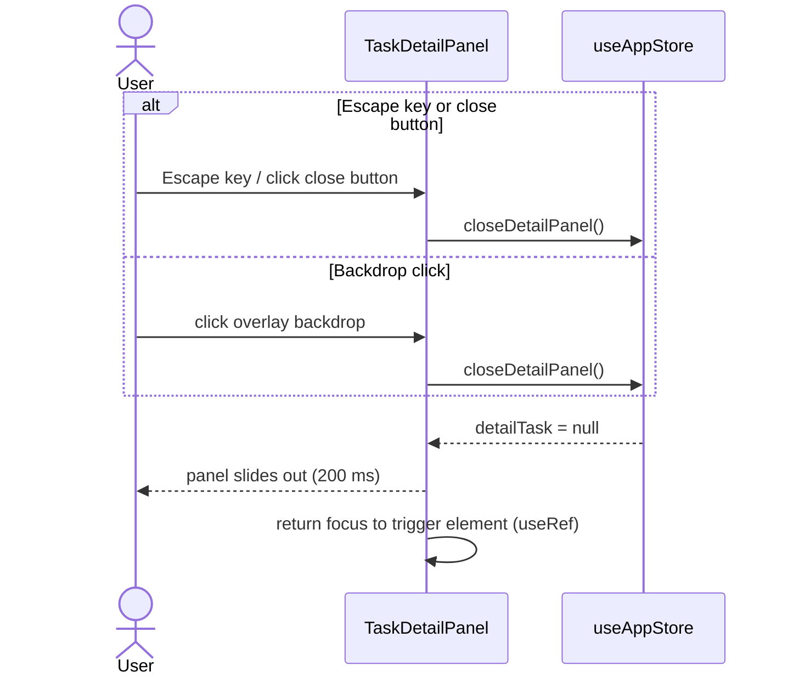

# Blueprint: Task Detail & Edit Side Panel

## 1. Overview

A right-side slide-in panel that opens when a user clicks a task card's title or expand icon.
It displays all task fields and allows inline editing of: **title**, **description**, **type**,
and **assigned**. Changes are persisted via the existing `PUT /spaces/:spaceId/tasks/:taskId`
REST endpoint. No new backend endpoints are required.

---

## 2. Requirements Summary

### Functional
- FR-1: Open panel by clicking the task title or an expand icon on any task card.
- FR-2: Display task id, column, createdAt, updatedAt (read-only).
- FR-3: Editable title (text input, auto-save on blur).
- FR-4: Editable description (textarea, explicit save via a "Save description" button).
- FR-5: Editable type (segmented control: task | research, auto-save on change).
- FR-6: Editable assigned (text input, auto-save on blur).
- FR-7: Close panel via: close button, Escape key, or clicking the backdrop overlay.
- FR-8: Show a Toast on successful save and on error.
- FR-9: Disable all editable fields while a save is in-flight (prevent concurrent saves).
- FR-10: Panel is read-only while the task's agent is actively running (activeRun guard).

### Non-Functional
- NFR-1: Panel open/close animation ≤ 200 ms (CSS transform translate).
- NFR-2: p95 save latency ≤ 500 ms (same constraint as all other task mutations).
- NFR-3: Accessible — ARIA role `dialog`, focus trap inside panel, Escape closes.
- NFR-4: Dark theme by default, consistent with board design system.
- NFR-5: No new Tailwind utility classes outside the established token vocabulary.

### Constraints
- Backend `PUT` endpoint already handles partial updates — no schema migration needed.
- `assigned` field already present in `Task` TypeScript type and in server handler.
- No new fields: out of scope per task description.

---

## 3. Core Components

### 3.1 `TaskDetailPanel` (new)
- **Responsibility:** Render the slide-in panel, manage local field state, orchestrate
  save calls and optimistic store updates.
- **Technology:** React 19 functional component, TypeScript.
- **Scaling pattern:** Stateless beyond local form state; all persistence delegated to
  `useAppStore`.
- **Location:** `frontend/src/components/board/TaskDetailPanel.tsx`

### 3.2 `useAppStore` (extended)
- **Additions:**
  - `detailTask: Task | null` — the currently open task (null = panel closed).
  - `openDetailPanel(task: Task): void` — sets `detailTask`.
  - `closeDetailPanel(): void` — clears `detailTask`.
  - `updateTask(taskId: string, patch: UpdateTaskPayload): Promise<void>` — calls the API,
    applies optimistic update to `tasks` board, and refreshes `detailTask`.
- **Responsibility:** single source of truth for panel open/close state and task mutation.
- **Location:** `frontend/src/stores/useAppStore.ts`

### 3.3 `TaskCard` (modified)
- **Change:** Add an expand icon button that calls `openDetailPanel(task)`.
  Clicking the task title also calls `openDetailPanel(task)`.
- **Scope of change:** ~10 lines added; no structural change to props interface.
- **Location:** `frontend/src/components/board/TaskCard.tsx`

### 3.4 `App` (modified)
- **Change:** Render `<TaskDetailPanel />` as a sibling of `<Board />` at the root level,
  so it stacks above the board without being inside a scrollable column container.
- **Scope of change:** one import + one JSX line.
- **Location:** `frontend/src/App.tsx`

### 3.5 API client (extended)
- **Addition:** `updateTask(spaceId, taskId, patch): Promise<Task>` — thin wrapper around
  `PUT /spaces/:spaceId/tasks/:taskId`.
- **Location:** `frontend/src/api/client.ts`

### 3.6 Types (extended)
- **Addition:** `UpdateTaskPayload` interface:
  ```ts
  interface UpdateTaskPayload {
    title?: string;
    type?: 'task' | 'research';
    description?: string;
    assigned?: string;
  }
  ```
- **Location:** `frontend/src/types/index.ts`

---

## 4. Data Flows and Sequences

### 4.1 C4 Context Diagram



### 4.2 Open Panel Sequence



### 4.3 Auto-Save Field (title, type, assigned) Sequence



### 4.4 Close Panel Sequence



---

## 5. APIs and Interfaces

### 5.1 Existing Backend Endpoint (used, not changed)

**PUT** `/api/v1/spaces/:spaceId/tasks/:taskId`

Request body (all fields optional, server applies only present keys):
```json
{
  "title": "string (1-200 chars, trimmed)",
  "type": "task | research",
  "description": "string (trimmed; empty string deletes the field)",
  "assigned": "string (trimmed; empty string deletes the field)"
}
```

Response `200`:
```json
{
  "id": "string",
  "title": "string",
  "type": "task | research",
  "description": "string | undefined",
  "assigned": "string | undefined",
  "attachments": [{ "name": "string", "type": "text | file" }],
  "createdAt": "ISO-8601",
  "updatedAt": "ISO-8601"
}
```

Response `404`: `{ "error": { "code": "TASK_NOT_FOUND", "message": "..." } }`
Response `400`: `{ "error": { "code": "VALIDATION_ERROR", "message": "..." } }`

Expected latency SLA: p95 ≤ 500 ms (local filesystem I/O).

### 5.2 New API Client Function

```ts
updateTask(spaceId: string, taskId: string, patch: UpdateTaskPayload): Promise<Task>
// PUT /api/v1/spaces/:spaceId/tasks/:taskId
// Returns the full updated Task object.
```

### 5.3 New Store Actions

```ts
// Open the detail panel for a specific task.
openDetailPanel(task: Task): void

// Close the detail panel and clear detailTask.
closeDetailPanel(): void

// Call PUT endpoint, apply optimistic update, refresh detailTask.
updateTask(taskId: string, patch: UpdateTaskPayload): Promise<void>
```

### 5.4 TaskDetailPanel Props

```ts
// No props — reads detailTask from store directly.
// Rendered unconditionally at App level; renders null when detailTask is null.
export function TaskDetailPanel(): React.ReactElement | null
```

---

## 6. Observability Strategy

### 6.1 Metrics (RED)
- `task_update_duration_ms` — histogram, tagged by `field` (title | type | description |
  assigned). Emitted client-side via `performance.measure` and logged to console in dev.
- `task_update_errors_total` — counter per field, incremented on API error.

### 6.2 Structured Logs
Existing server logs for `PUT tasks/:id` already emit on error. No new server log fields
required. Client-side errors surface via the Toast system and browser console in dev.

### 6.3 Distributed Traces
Not applicable for a purely frontend feature with a single synchronous API call. The existing
server request log covers the backend span.

### 6.4 Tools
Existing: browser DevTools Network panel for request inspection. No new infra required.

---

## 7. Deploy Strategy

### 7.1 CI/CD
No change to the existing pipeline (lint → type-check → Vitest → build → serve).
New component and store additions follow the same Vitest + React Testing Library test pattern.

### 7.2 Release Strategy
Rolling deploy — this is a purely additive frontend change with no API schema changes.
Feature is visible immediately on deploy; no feature flag required.

### 7.3 Infrastructure as Code
No infrastructure change. Feature is entirely within the existing Vite + Node.js monolith.

---

## 8. Component Layout Specification

```
App
├── SpaceTabs
├── Board
│   └── Column[]
│       └── TaskCard[] (+ expand icon, title click triggers openDetailPanel)
├── TaskDetailPanel          ← new, App-level, z-index above board
│   ├── Backdrop overlay (semi-transparent, click to close)
│   └── Panel surface (right side, 380 px, slide-in via translateX)
│       ├── Header
│       │   ├── Task ID chip (read-only)
│       │   ├── Column badge (read-only)
│       │   └── Close button (×)
│       ├── Field: Title
│       │   └── <input> text, auto-save on blur
│       ├── Field: Type
│       │   └── Segmented control (task | research), auto-save on change
│       ├── Field: Assigned
│       │   └── <input> text + avatar preview, auto-save on blur
│       ├── Field: Description
│       │   ├── <textarea> (resizable), controlled
│       │   └── "Save description" <Button variant="primary">
│       └── Footer
│           ├── Created: <timestamp> (read-only)
│           └── Updated: <timestamp> (read-only, refreshes after save)
└── [existing modals: CreateTaskModal, AttachmentModal, SpaceModal, ...]
```

---

## 9. Accessibility Requirements

- Panel has `role="dialog"`, `aria-modal="true"`, `aria-label="Task detail"`.
- Focus is trapped inside the panel while open (Tab cycles within panel).
- Escape key closes the panel from anywhere inside it.
- On close, focus returns to the element that triggered the open (stored via `useRef`).
- All interactive elements have visible focus rings (`ring-2 ring-primary`).
- Field labels use `<label htmlFor>` associations (no placeholder-only labels).

---

## 10. Out of Scope

- Adding new task fields (explicitly excluded by task description).
- Drag-to-reorder within the panel.
- Real-time collaborative editing (multi-user conflict resolution).
- Comment/activity log on task.
- Attachment management within the panel (existing AttachmentModal handles this).
