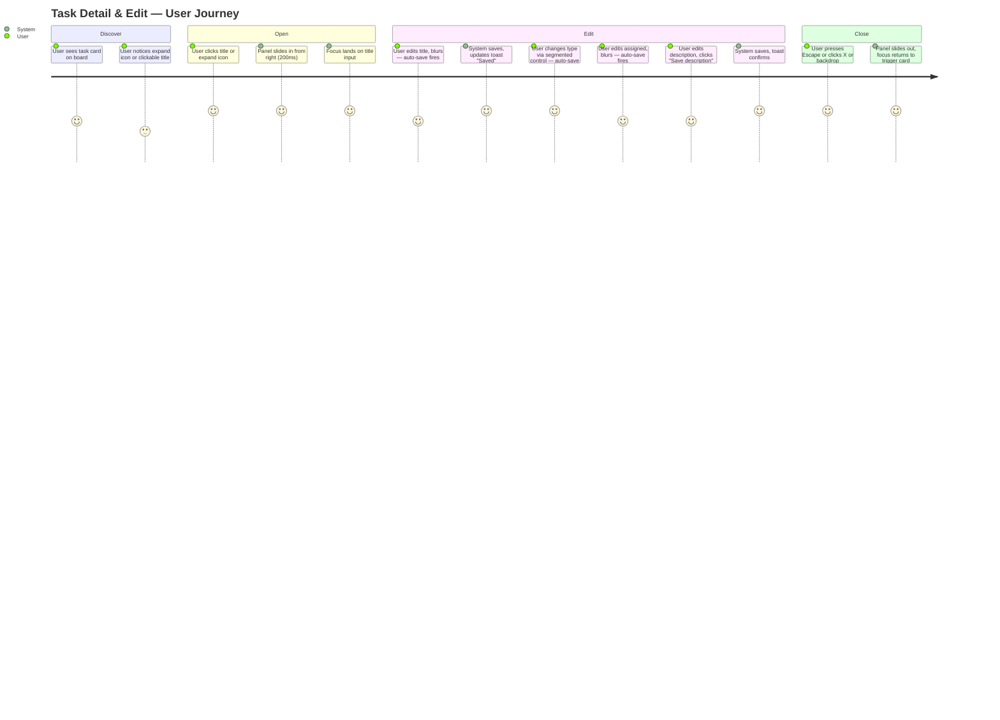

# Wireframes: Task Detail & Edit Side Panel

## Screen Summary

| Screen ID | Name | Device | Description |
|-----------|------|--------|-------------|
| S-01 | Board + Panel (default) | Desktop | Board with task detail panel open, all fields editable |
| S-02 | Panel saving state | Desktop | Panel with fields disabled during auto-save in-flight |
| S-03 | Panel read-only (activeRun) | Desktop | Panel fully disabled while an agent pipeline run is active |
| S-04 | Mobile full-screen panel | Mobile | Panel occupies full viewport width on narrow screens |

> Stitch fallback: `mcp__stitch__generate_screen_from_text` returned empty output on two attempts (2026-03-24).
> ASCII wireframes below are the authoritative design spec. Stitch screens to be added on retry.
> Project ID for retry: `15790477920468951127`

---

## Journey Map



### Pain Points (by priority)

| Priority | Pain Point | Mitigation |
|----------|-----------|------------|
| High | Unsaved description on accidental blur/navigation | Explicit save button for textarea |
| High | "Did I save?" anxiety for simple fields | Auto-save on blur + success toast |
| Medium | Board loses context when editing | Panel overlays board — board stays visible |
| Medium | Race condition if another tab updates the task | Optimistic update + board poll reconciles |
| Low | Focus lost after panel close | Store trigger element ref, return focus on close |

---

## Wireframe: S-01 — Board + Panel (Default State)

```
┌─────────────────────────────────────────────────────────────────────────────────┐
│  [Space Tabs]   Prism                                              [+ New Task]  │
├────────────────────────────────────────────────────────────┬────────────────────┤
│                                                            │                    │
│   ┌──────────────┐  ┌──────────────┐  ┌──────────────┐   │  TASK DETAIL PANEL │
│   │ Todo (2)     │  │In Progress(1)│  │ Done (3)     │   │  ─────────────────  │
│   │              │  │              │  │              │   │                    │
│   │ ┌──────────┐ │  │ ┌──────────┐ │  │ ┌──────────┐ │   │  [#a1b2c3] [In    │
│   │ │Task A    │ │  │ │Build auth│◄┼──┼─┤  open    │ │   │  Progress]      [×]│
│   │ │[task]  ⤢│ │  │ │flow  [⤢]│ │  │ │          │ │   │                    │
│   │ │desc...   │ │  │ │[task]    │ │  │ │Task C    │ │   │  TITLE             │
│   │ └──────────┘ │  │ │ring-blue │ │  │ │[research]│ │   │  ┌──────────────┐  │
│   │              │  │ └──────────┘ │  │ └──────────┘ │   │  │Build auth... │  │
│   │ ┌──────────┐ │  │              │  │              │   │  └──────────────┘  │
│   │ │Task B    │ │  │              │  │ ┌──────────┐ │   │                    │
│   │ │[research]│ │  │              │  │ │Task D    │ │   │  TYPE              │
│   │ │       ⤢ │ │  │              │  │ │[task]  ⤢│ │   │  [● task] [research]│
│   │ └──────────┘ │  │              │  │ └──────────┘ │   │                    │
│   └──────────────┘  └──────────────┘  └──────────────┘   │  ASSIGNED          │
│                                                            │  ┌──────────────┐  │
│  ░░░░░░░░░░░░ backdrop rgba(0,0,0,0.35) ░░░░░░░░░░░░░░░  │  │developer-ag..│  │
│                                                            │  └──────────────┘  │
│                                                            │                    │
│                                                            │  DESCRIPTION       │
│                                                            │  ┌──────────────┐  │
│                                                            │  │Implement JWT │  │
│                                                            │  │based auth... │  │
│                                                            │  │              │  │
│                                                            │  └──────────────┘  │
│                                                            │  [Save description]│
│                                                            │                    │
│                                                            │ ──────────────────  │
│                                                            │ Created: Mar 9,    │
│                                                            │ 2026 - 14:32       │
│                                                            │ Updated: Mar 24,   │
│                                                            │ 2026 - 12:00       │
└────────────────────────────────────────────────────────────┴────────────────────┘
```

### States

#### Default (panel open)
- All four fields are enabled and editable
- Title and Assigned show current values in inputs (bg-surface-elevated)
- Type shows current selection highlighted in the segmented control
- Description shows current value in textarea with "Save description" button visible
- Footer shows read-only createdAt and updatedAt

#### Loading (auto-save in-flight — S-02)
```
┌─────────────────────────────────────────────────────────────────────────────────┐
│                                                            │                    │
│  [board unchanged]                                         │  TASK DETAIL PANEL │
│                                                            │  ─────────────────  │
│                                                            │  [#a1b2c3] [In    │
│                                                            │  Progress]      [×]│
│                                                            │                    │
│                                                            │  TITLE             │
│                                                            │  ┌──────────────┐  │
│                                                            │  │Build auth... │  │
│                                                            │  │  [disabled]  │  │
│                                                            │  └──────────────┘  │
│                                                            │  ··· saving ···    │
│                                                            │                    │
│                                                            │  TYPE              │
│                                                            │  [disabled pills]  │
│                                                            │                    │
│                                                            │  ASSIGNED          │
│                                                            │  [disabled input]  │
│                                                            │                    │
│                                                            │  DESCRIPTION       │
│                                                            │  [disabled textarea│
│                                                            │  [Save desc] ·     │
└────────────────────────────────────────────────────────────┴────────────────────┘
```
All inputs: `opacity-50 cursor-not-allowed`. "Save description" button: `disabled` + spinner icon.

#### Error state (save failed)
- Toast appears bottom-right: "Failed to save" (red, 3s)
- All fields re-enable immediately
- Panel state is unchanged (values revert to last saved on server)
- No inline field-level error indicator (single-field edits, toast is sufficient)

#### Read-only (activeRun guard — S-03)
```
│  TASK DETAIL PANEL                                                              │
│  ─────────────────                                                              │
│  [#a1b2c3] [In Progress]                                        [×]             │
│  ┌─────────────────────────────────────────────────────────┐                   │
│  │ ⚠ Agent pipeline is running — editing disabled          │                   │
│  └─────────────────────────────────────────────────────────┘                   │
│  TITLE                                                                          │
│  ┌──────────────────────────────────────────────────────┐                      │
│  │Build auth flow                          [read-only]  │                      │
│  └──────────────────────────────────────────────────────┘                      │
│  ...all fields same: disabled, opacity-50                                       │
```
Banner: bg-warning-container text-warning-on, rounded-sm, text-xs. All inputs disabled, opacity-50.

#### Empty (no description)
- Description textarea is empty, placeholder: "Add a description..."
- "Save description" button remains visible but is only enabled once the user types

#### Panel closed (no detailTask)
- Panel renders `null` — no DOM element, no z-index consumption

---

## Wireframe: S-04 — Mobile (320px–599px)

```
┌─────────────────────────────────┐
│ [Space Tabs]          [+ Task]  │
├─────────────────────────────────┤
│                                 │
│  TASK DETAIL PANEL (full width) │
│  ─────────────────────────────  │
│  [#a1b2c3]  [In Progress]  [×]  │
│                                 │
│  TITLE                          │
│  ┌───────────────────────────┐  │
│  │ Build auth flow           │  │
│  └───────────────────────────┘  │
│                                 │
│  TYPE                           │
│  [● task ──────] [research]     │
│                                 │
│  ASSIGNED                       │
│  ┌───────────────────────────┐  │
│  │ developer-agent           │  │
│  └───────────────────────────┘  │
│                                 │
│  DESCRIPTION                    │
│  ┌───────────────────────────┐  │
│  │ Implement JWT based auth  │  │
│  │ ...                       │  │
│  └───────────────────────────┘  │
│              [Save description] │
│                                 │
│  Created: Mar 9, 2026 - 14:32   │
│  Updated: Mar 24, 2026 - 12:00  │
└─────────────────────────────────┘
```

On mobile (< 600px):
- Panel: `position: fixed; inset: 0` — full-screen overlay
- No backdrop (panel itself covers board)
- Board is hidden under the panel (user scrolls to board by closing panel)
- Close button [×] in header is the primary dismiss affordance

---

## Card Expand Trigger Detail

```
┌────────────────────────────┐
│  [task]                 ⤢ │  ← expand icon (open_in_full, 16px, text-secondary)
│                            │     positioned top-right, hover:text-primary
│  Build auth flow           │  ← title: cursor-pointer, hover:text-primary
│  Implement JWT-based...    │
│  👤 developer-agent        │
│  Mar 24, 14:32             │
└────────────────────────────┘
```

- Title click: `cursor-pointer hover:text-primary transition-colors`
- Expand icon: `aria-label="Open task detail"`, min touch target 44×44px via padding
- Both call `store.openDetailPanel(task)` — identical behavior

---

## Validation Checklist

### Usability (Nielsen)
- [x] Visibility of system status: auto-save fires toast on success/error
- [x] User control and freedom: Escape, X button, backdrop click all close panel
- [x] Consistency: same token vocabulary as board, same toast system
- [x] Error prevention: explicit save for description prevents accidental blur loss
- [x] Recognition over recall: field labels always visible (not placeholder-only)
- [x] Flexibility: both title click and expand icon open the panel

### Accessibility (WCAG 2.1 AA)
- [x] role="dialog", aria-modal="true", aria-label="Task detail"
- [x] Focus trap inside panel while open
- [x] Escape closes panel from anywhere inside it
- [x] Focus returns to trigger element on close
- [x] All inputs have `<label htmlFor>` associations
- [x] Segmented control pills labeled for screen readers (aria-pressed or role=radio)
- [x] Close button: aria-label="Close task detail"
- [x] Expand icon: aria-label="Open task detail"
- [x] Focus rings: ring-2 ring-primary on all interactive elements
- [x] Disabled state: aria-disabled="true" when isMutating or activeRun

### Mobile-First
- [x] Default: panel full-width on xs (320px+), 380px on sm (600px+)
- [x] Touch targets minimum 44×44px (inputs, buttons, close button)
- [x] No horizontal overflow at 320px
- [x] Textarea resize: `resize-none` on mobile (no manual resize handle)

---

## Assumptions

| ID | Assumption | Impact if wrong |
|----|-----------|-----------------|
| A-1 | Only one panel open at a time | If multi-panel needed, store shape changes to an array |
| A-2 | PUT endpoint handles partial updates (only present keys updated) | Already confirmed in ADR-1 |
| A-3 | Empty assigned string deletes the field on the server | If it errors, client should omit field instead of sending "" |
| A-4 | activeRun guard reads from existing store state (no new API) | If not in store, a new selector or API call is needed |
| A-5 | No rich text in description (plain text only) | If markdown preview is added later, textarea becomes a split editor |

---

## Questions for Stakeholders

1. **Save description button placement**: Currently right-aligned below the textarea. Should it be left-aligned, or inline to the right of the description label (more compact)?
2. **activeRun banner**: The warning banner reads "Agent pipeline is running — editing disabled." Is this message clear enough, or should it include the agent name currently running?
3. **Empty assigned field**: When the user clears the assigned input and blurs, the field is deleted on the server. Should the UI show a confirmation ("Remove assigned?") or silently delete?
4. **Panel persistence across card navigation**: Should the panel update in-place if the user opens a second card while one is already open, or should it close and reopen?
5. **Keyboard shortcut**: Should there be a keyboard shortcut to open the detail panel of the focused card (e.g., Enter or Space)?
