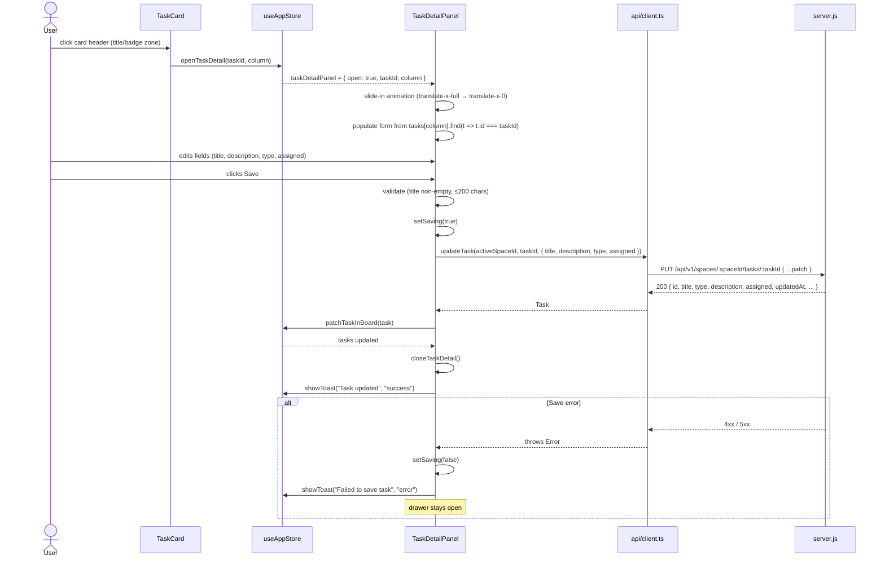
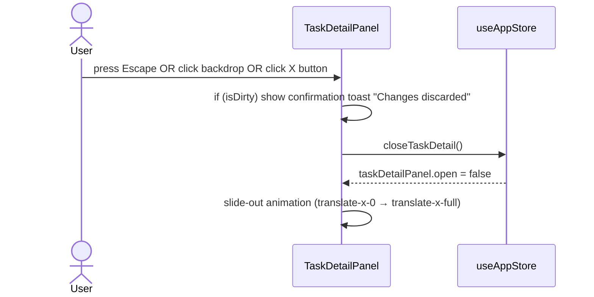
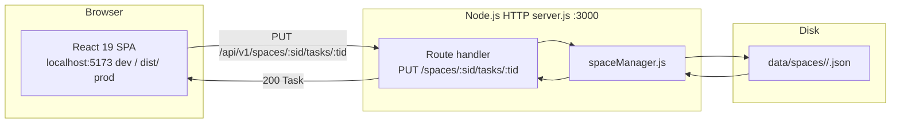

# Blueprint: Task Detail Side Panel

## 1. Overview

A right-side drawer (off-canvas panel) that slides in when the user clicks the task card
header area (title + badge zone). The drawer renders the task's full detail and exposes an
editable form for the four mutable fields: title, description, type, and assigned.
No new backend endpoints are needed.

---

## 2. Core Components

| Component | Responsibility | Technology | Scaling Pattern |
|-----------|---------------|------------|-----------------|
| `TaskDetailPanel` | Root drawer container — positions the panel, manages open/close animation, renders backdrop | React functional component | Stateless; mounted once in `App.tsx`, driven by store |
| `TaskDetailForm` | Form UI — renders labelled inputs for title, description, type, assigned; handles local form state and submit | React functional component (child of `TaskDetailPanel`) | Stateless; local state only |
| `useAppStore` (extended) | Holds `taskDetailPanel` state slice: `open`, `taskId`, `column`; exposes `openTaskDetail`, `closeTaskDetail`, `updateTask` | Zustand | Singleton store |
| `api/client.ts` (extended) | Adds `updateTask(spaceId, taskId, patch)` typed wrapper — `PUT /api/v1/spaces/:spaceId/tasks/:taskId` | TypeScript fetch wrapper | Stateless |

No new shared component is needed — `TaskDetailPanel` is a self-contained drawer that mirrors
the accessibility semantics of `<Modal>` (Escape, backdrop, focus trap) without reusing the
centred-modal layout.

---

## 3. Data Flows and Sequences

### 3.1 C4 Context Diagram

```mermaid
graph TD
    User([User]) -->|clicks card header| TC[TaskCard]
    TC -->|openTaskDetail(taskId, column)| Store[useAppStore]
    Store -->|taskDetailPanel state| TDP[TaskDetailPanel]
    TDP -->|renders form| TDF[TaskDetailForm]
    TDF -->|PUT /api/v1/spaces/:spaceId/tasks/:taskId| Server[Node.js Backend]
    Server -->|reads/writes| FS[JSON files on disk]
    Server -->|200 Task| TDF
    TDF -->|updateTask in store| Store
    Store -->|refreshes tasks| Board[Board]
```

### 3.2 Main Critical Flow — Open, Edit, Save



### 3.3 Dismiss flow



### 3.4 Deployment / Infrastructure Diagram



---

## 4. APIs and Interfaces

### 4.1 Backend — existing endpoint (no changes required)

**Method:** `PUT`
**Path:** `/api/v1/spaces/:spaceId/tasks/:taskId`
**Auth:** None (same as all other endpoints)

**Request payload** (partial update — only provided fields are patched):
```json
{
  "title":       "string (1–200 chars)",
  "description": "string (0–1000 chars) | empty string clears it",
  "type":        "\"task\" | \"research\"",
  "assigned":    "string (0–100 chars) | empty string clears it"
}
```

**Response codes:**
- `200 OK` — updated `Task` object
- `400 VALIDATION_ERROR` — invalid field values
- `404 NOT_FOUND` — task not found

**Expected p95 latency:** <50 ms (local disk I/O, JSON flat-file)

### 4.2 Frontend client — new wrapper

```typescript
// api/client.ts addition
export interface UpdateTaskPayload {
  title?:       string;
  description?: string;
  type?:        'task' | 'research';
  assigned?:    string;
}

export const updateTask = (
  spaceId: string,
  taskId: string,
  patch: UpdateTaskPayload
): Promise<Task> =>
  apiFetch<Task>(`/spaces/${spaceId}/tasks/${taskId}`, {
    method: 'PUT',
    body: JSON.stringify(patch),
  });
```

### 4.3 Store state slice — new additions

```typescript
// types/index.ts addition
export interface TaskDetailPanelState {
  open:     boolean;
  taskId:   string | null;
  column:   Column | null;
}

// useAppStore.ts additions to AppState interface
taskDetailPanel: TaskDetailPanelState;
openTaskDetail:  (taskId: string, column: Column) => void;
closeTaskDetail: () => void;
updateTask:      (taskId: string, patch: UpdateTaskPayload) => Promise<void>;
patchTaskInBoard:(task: Task) => void;   // internal — updates a single task in place
```

---

## 5. Observability Strategy

This feature is a pure frontend addition with one existing API call. Observability is
deliberately lightweight.

### Metrics (RED)
- No new server metrics needed (endpoint already exists).
- Frontend: no new metrics added at this stage. If analytics are added later, track
  `task_detail_open` and `task_detail_save_success / failure` events.

### Structured Logs
The existing server.js error-path logs `PUT tasks/${taskId} error:` — no changes needed.
All 4xx responses are already logged by the generic error handler.

### Distributed Traces
Not applicable for this feature — the interaction is a single synchronous HTTP call from
the browser to the local server. No distributed call chain exists.

### Suggested Tooling
No additional tooling required. Browser DevTools Network tab is sufficient to observe
the single PUT request during development.

---

## 6. Deploy Strategy

### CI/CD Pipeline
Follows the existing Prism pipeline:
```
lint (ESLint + TypeScript) → unit tests (Vitest) → build (vite build) → e2e smoke (QA stage)
```
No new pipeline stages or environment variables are required.

### Release Strategy
**Rolling / in-place** — the frontend is a single SPA served from `dist/`. A `vite build`
replaces the dist directory atomically. No blue/green or canary is required for a local
developer tool.

### Infrastructure as Code
Not applicable. Prism is a local development tool with no cloud infrastructure.

---

## 7. Interaction and Layout Specification

### 7.1 Click Target
- The **entire card header zone** (title text + badge row, i.e. the top `<div>` of the card)
  becomes a clickable area that opens the drawer.
- Card footer buttons (move arrows, run agent, delete) retain their own click handlers and
  do NOT open the drawer. `e.stopPropagation()` is already applied at the button level.
- The card `<article>` element is NOT made `role="button"` — only the header area gets
  `onClick` to avoid double-activation.

### 7.2 Drawer Layout
```
┌──────────────────────────────────────────────────────────────────────┐
│  Board (partially visible, dimmed)       ┌────────────────────────┐  │
│                                          │  ← [X]  Task detail   │  │
│                                          │ ─────────────────────  │  │
│                                          │  Title *               │  │
│                                          │  [input]               │  │
│                                          │                        │  │
│                                          │  Type *                │  │
│                                          │  [select: task|research│  │
│                                          │                        │  │
│                                          │  Assigned to           │  │
│                                          │  [select w/ options]   │  │
│                                          │                        │  │
│                                          │  Description           │  │
│                                          │  [textarea, 5 rows]    │  │
│                                          │                        │  │
│                                          │ ─────────────────────  │  │
│                                          │  [Cancel]    [Save]    │  │
│                                          └────────────────────────┘  │
└──────────────────────────────────────────────────────────────────────┘
```

### 7.3 Drawer Dimensions and Positioning
- `position: fixed`, anchored to the right edge: `top-0 right-0 bottom-0`
- Width: `w-96` (384 px) on md+ screens; `w-full` on sm (mobile)
- `z-index: z-40` — below terminal (`z-50`) and toasts (`z-60`)
- Backdrop: `fixed inset-0 bg-black/40 z-39` — renders behind the panel

### 7.4 Animation
- Enter: `translate-x-full → translate-x-0` with `transition-transform duration-200 ease-apple`
- Exit: `translate-x-0 → translate-x-full` with same transition
- Use a CSS class-based approach driven by the `open` boolean from store state (not `display: none`
  so the exit animation can complete before unmounting).

### 7.5 Form Fields
All fields match the `CreateTaskModal` field definitions exactly (same validation rules, same
`ASSIGNED_OPTIONS` list). The drawer pre-populates all fields from the current task data when opened.

| Field | Control | Validation | Notes |
|-------|---------|------------|-------|
| Title | `<input type="text">` | Required, 1–200 chars | Auto-focus on panel open |
| Type | `<select>` | Required, task\|research | Pre-selected from task |
| Assigned | `<select>` | Optional | Same ASSIGNED_OPTIONS as CreateTaskModal |
| Description | `<textarea rows={5}>` | Optional, ≤1000 chars | resize-none |

### 7.6 Dirty State
- "Dirty" = any field value differs from the initial snapshot taken when the panel opened.
- Dismissing a dirty panel does NOT show a blocking dialog — it silently discards and shows
  a toast "Changes discarded". This avoids unnecessary friction.

---

## 8. Accessibility

- The drawer container is `role="dialog"` with `aria-modal="true"` and `aria-labelledby` pointing
  to the panel heading "Task detail".
- Focus is trapped inside the panel while open (same technique as `<Modal>`).
- Pressing Escape closes the panel (same as `<Modal>`).
- The backdrop does not receive keyboard focus.
- On close, focus returns to the card header element that triggered the open.
